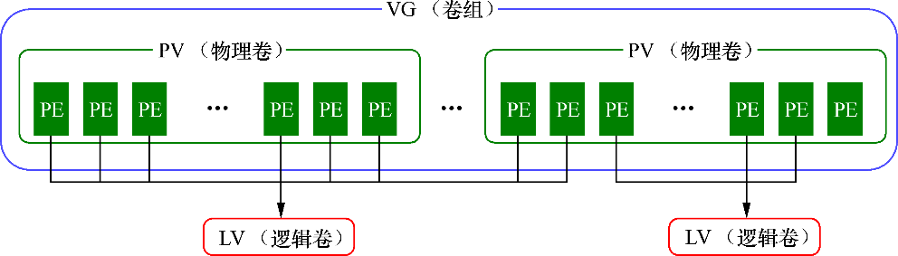

## LVM（逻辑卷管理器）

硬盘设备管理技术虽然能够有效地提高硬盘设备的读写速度以及数据的安全性，但是在硬盘分好区或者部署为 RAID 磁盘阵列之后，再想修改硬盘分区大小就不容易了。换句话说，当用户想要随着实际需求的变化调整硬盘分区的大小时，会受到硬盘“灵活性”的限制。这时就需要用到另外一项非常普及的硬盘设备资源管理技术了— LVM（逻辑卷管理器）。LVM 可以允许用户对硬盘资源进行动态调整。

逻辑卷管理器是 Linux 系统用于对硬盘分区进行管理的一种机制，理论性较强，其创建初衷是为了**解决硬盘设备在创建分区后不易修改分区大小的缺陷**。尽管对传统的硬盘分区进行强制扩容或缩容从理论上来讲是可行的，但是却可能造成数据的丢失。而 LVM 技术是在硬盘分区和文件系统之间添加了一个逻辑层，它提供了一个抽象的卷组，可以把多块硬盘进行卷组合并。这样一来，用户不必关心物理硬盘设备的底层架构和布局，就可以实现对硬盘分区的动态调整。LVM 的技术架构如图



物理卷处于 LVM 中的最底层，可以将其理解为物理硬盘、硬盘分区或者 RAID 磁盘阵列，这都可以。卷组建立在物理卷之上，一个卷组可以包含多个物理卷，而且在卷组创建之后也可以继续向其中添加新的物理卷。逻辑卷是用卷组中空闲的资源建立的，并且逻辑卷在建立后可以动态地扩展或缩小空间。

### 部署逻辑卷

部署 LVM 时，需要逐个配置物理卷、卷组和逻辑卷。常用的部署命令如表所示。

| 功能 | 物理卷管理 | 卷组管理 | 逻辑卷管理 |
| ---- | ---- | ---- | ---- |
| 扫描 | pvscan | vgscan | lvscan |
| 建立 | pvcreate | vgcreate | lvcreate |
| 显示 | pvdisplay | vgdisplay | lvdisplay |
| 删除 | pvremove | vgremove | lvremove |
| 扩展 | | vgextend | lvextend |
| 缩小 | | vgreduce | lvreduce |

0. 在虚拟机中添加两块新硬盘设备

1. 让新添加的两块硬盘设备支持 LVM 技术

```bash
$ ls /dev/sd?
/dev/sda  /dev/sdb  /dev/sdc

$ pvcreate /dev/sdb /dev/sdc
  Physical volume "/dev/sdb" successfully created
  Physical volume "/dev/sdc" successfully created
```

2. 把两块硬盘设备加入到 storage 卷组中，然后查看卷组的状态

```bash
$ vgcreate storage /dev/sdb /dev/sdc
  Volume group "storage" successfully created

$ vgdisplay
  --- Volume group ---
  VG Name               storage
  System ID             
  Format                lvm2
  Metadata Areas        2
  Metadata Sequence No  1
  VG Access             read/write
  VG Status             resizable
  MAX LV                0
  Cur LV                0
  Open LV               0
  Max PV                0
  Cur PV                2
  Act PV                2
  VG Size               39.99 GiB
  PE Size               4.00 MiB
  Total PE              10238
  Alloc PE / Size       0 / 0   
  Free  PE / Size       10238 / 39.99 GiB
  VG UUID               z6ONpA-vBmR-LzTs-8ZyA-wUZ2-hCkJ-Wqi0OX
   
  --- Volume group ---
  VG Name               rhel_redhat
  System ID             
  Format                lvm2
  Metadata Areas        1
  Metadata Sequence No  3
  VG Access             read/write
  VG Status             resizable
  MAX LV                0
  Cur LV                2
  Open LV               2
  Max PV                0
  Cur PV                1
  Act PV                1
  VG Size               19.51 GiB
  PE Size               4.00 MiB
  Total PE              4994
  Alloc PE / Size       4994 / 19.51 GiB
  Free  PE / Size       0 / 0   
  VG UUID               JRF02S-y1IR-Eba0-RhaO-zUkl-djcm-pbjexx
```

3. 切割出一个约为 148MB 的逻辑卷设备

在对逻辑卷进行切割时有两种计量单位。第一种是以容量为单位，所使用的参数为 `-L`。例如，使用 `-L 150M` 生成一个大小为 150MB 的逻辑卷。另外一种是以基本单元的个数为单位，所使用的参数为 `-l`。每个基本单元的大小默认为 4MB。例如，使用 `-l 37` 可以生成一个大小为 37×4MB=148MB 的逻辑卷。

```bash
$ lvcreate -n vo -l 37 storage
  Logical volume "vo" created

$ vgdisplay
  --- Volume group ---
  VG Name               storage
  System ID             
  Format                lvm2
  Metadata Areas        2
  Metadata Sequence No  2
  VG Access             read/write
  VG Status             resizable
  MAX LV                0
  Cur LV                1
  Open LV               0
  Max PV                0
  Cur PV                2
  Act PV                2
  VG Size               39.99 GiB
  PE Size               4.00 MiB
  Total PE              10238
  Alloc PE / Size       37 / 148.00 MiB
  Free  PE / Size       10201 / 39.85 GiB
  VG UUID               z6ONpA-vBmR-LzTs-8ZyA-wUZ2-hCkJ-Wqi0OX
   
  --- Volume group ---
  VG Name               rhel_redhat
  System ID             
  Format                lvm2
  Metadata Areas        1
  Metadata Sequence No  3
  VG Access             read/write
  VG Status             resizable
  MAX LV                0
  Cur LV                2
  Open LV               2
  Max PV                0
  Cur PV                1
  Act PV                1
  VG Size               19.51 GiB
  PE Size               4.00 MiB
  Total PE              4994
  Alloc PE / Size       4994 / 19.51 GiB
  Free  PE / Size       0 / 0   
  VG UUID               JRF02S-y1IR-Eba0-RhaO-zUkl-djcm-pbjexx
```

4. 把生成好的逻辑卷进行格式化，然后挂载使用

Linux 系统会把 LVM 中的逻辑卷设备存放在 `/dev` 设备目录中（实际上是做了一个符号链接），同时会以卷组的名称来建立一个目录，其中保存了逻辑卷的设备映射文件（即 `/dev/卷组名称/逻辑卷名称`）。

```bash
$ mkfs.ext4 /dev/storage/vo
mke2fs 1.42.9 (28-Dec-2013)
Filesystem label=
OS type: Linux
Block size=1024 (log=0)
Fragment size=1024 (log=0)
Stride=0 blocks, Stripe width=0 blocks
38000 inodes, 151552 blocks
7577 blocks (5.00%) reserved for the super user
First data block=1
Maximum filesystem blocks=33816576
19 block groups
8192 blocks per group, 8192 fragments per group
2000 inodes per group
Superblock backups stored on blocks: 
	8193, 24577, 40961, 57345, 73729

Allocating group tables: done                            
Writing inode tables: done                            
Creating journal (4096 blocks): done
Writing superblocks and filesystem accounting information: done 

$ mkdir /lvm
$ mount /dev/storage/vo /lvm
```

5. 查看挂载状态，并写入到配置文件，使其永久生效

```bash
$ df -h
lesystem                    Size  Used Avail Use% Mounted on
/dev/mapper/rhel_redhat-root   18G  2.9G   15G  17% /
devtmpfs                      985M     0  985M   0% /dev
tmpfs                         994M  148K  994M   1% /dev/shm
tmpfs                         994M  8.8M  986M   1% /run
tmpfs                         994M     0  994M   0% /sys/fs/cgroup
/dev/sda1                     497M  119M  379M  24% /boot
/dev/mapper/storage-vo        140M  1.6M  128M   2% /lvm

$ echo "/dev/storage/vo /linuxprobe ext4 defaults 0 0" >> /
etc/fstab
```

### 扩容逻辑卷

用户在使用存储设备时感知不到设备底层的架构和布局，更不用关心底层是由多少块硬盘组成的，只要卷组中有足够的资源，就可以一直为逻辑卷扩容。扩展前请一定要记得卸载设备和挂载点的关联。

0. 卸载逻辑卷

```bash
$ umount /lvm
```

1. 把上一个实验中的逻辑卷 vo 扩展至 290MB

```bash
$ lvextend -L 290M /dev/storage/vo
  Rounding size to boundary between physical extents: 292.00 MiB
  Extending logical volume vo to 292.00 MiB
  Logical volume vo successfully resized
```

2. 检查硬盘完整性，并重置硬盘容量

```bash
$ e2fsck -f /dev/storage/vo
e2fsck 1.42.9 (28-Dec-2013)
Pass 1: Checking inodes, blocks, and sizes
Pass 2: Checking directory structure
Pass 3: Checking directory connectivity
Pass 4: Checking reference counts
Pass 5: Checking group summary information
/dev/storage/vo: 11/38000 files (0.0% non-contiguous), 10453/151552 blocks

$ resize2fs /dev/storage/vo
resize2fs 1.42.9 (28-Dec-2013)
Resizing the filesystem on /dev/storage/vo to 299008 (1k) blocks.
The filesystem on /dev/storage/vo is now 299008 blocks long.
```

3. 重新挂载硬盘设备并查看挂载状态

```bash
$ mount /dev/storage/vo /lvm
$ df -h
Filesystem                    Size  Used Avail Use% Mounted on
/dev/mapper/rhel_redhat-root   18G  2.9G   15G  17% /
devtmpfs                      985M     0  985M   0% /dev
tmpfs                         994M  148K  994M   1% /dev/shm
tmpfs                         994M  8.8M  986M   1% /run
tmpfs                         994M     0  994M   0% /sys/fs/cgroup
/dev/sda1                     497M  119M  379M  24% /boot
/dev/mapper/storage-vo        279M  2.1M  259M   1% /lvm
```

### 缩小逻辑卷

相较于扩容逻辑卷，在对逻辑卷进行缩容操作时，其丢失数据的风险更大。所以在生产环境中执行相应操作时，一定要提前备份好数据。另外 Linux 系统规定，在对 LVM 逻辑卷进行缩容操作之前，要先检查文件系统的完整性（当然这也是为了保证我们的数据安全）。在执行缩容操作前记得先把文件系统卸载掉。

0. 卸载逻辑卷

```bash
$ umount /lvm
```

1. 检查文件系统的完整性

```bash
$ e2fsck -f /dev/storage/vo
e2fsck 1.42.9 (28-Dec-2013)
Pass 1: Checking inodes, blocks, and sizes
Pass 2: Checking directory structure
Pass 3: Checking directory connectivity
Pass 4: Checking reference counts
Pass 5: Checking group summary information
/dev/storage/vo: 11/74000 files (0.0% non-contiguous), 15507/299008 blocks
```

2. 把逻辑卷 vo 的容量减小到 120MB

```bash
$ resize2fs /dev/storage/vo 120M
resize2fs 1.42.9 (28-Dec-2013)
Resizing the filesystem on /dev/storage/vo to 122880 (1k) blocks.
The filesystem on /dev/storage/vo is now 122880 blocks long.

$ lvreduce -L 120M /dev/storage/vo
  WARNING: Reducing active logical volume to 120.00 MiB
  THIS MAY DESTROY YOUR DATA (filesystem etc.)
Do you really want to reduce vo? [y/n]: y
  Reducing logical volume vo to 120.00 MiB
  Logical volume vo successfully resized
```

3. 重新挂载文件系统并查看系统状态

```bash
$ mount /dev/storage/vo /lvm
$  df -h
Filesystem                    Size  Used Avail Use% Mounted on
/dev/mapper/rhel_redhat-root   18G  2.9G   15G  17% /
devtmpfs                      985M     0  985M   0% /dev
tmpfs                         994M  148K  994M   1% /dev/shm
tmpfs                         994M   17M  978M   2% /run
tmpfs                         994M     0  994M   0% /sys/fs/cgroup
/dev/sda1                     497M  119M  379M  24% /boot
/dev/mapper/storage-vo        113M  1.6M  103M   2% /lvm
```

### 逻辑卷快照

LVM 还具备有“快照卷”功能，该功能类似于虚拟机软件的还原时间点功能。例如，可以对某一个逻辑卷设备做一次快照，如果日后发现数据被改错了，就可以利用之前做好的快照卷进行覆盖还原。LVM 的快照卷功能有两个特点：

- 快照卷的容量必须等同于逻辑卷的容量；
- 快照卷仅一次有效，一旦执行还原操作后则会被立即自动删除。

0. 首先查看卷组的信息

```bash
$ vgdisplay
  --- Volume group ---
  VG Name               storage
  System ID             
  Format                lvm2
  Metadata Areas        2
  Metadata Sequence No  4
  VG Access             read/write
  VG Status             resizable
  MAX LV                0
  Cur LV                1
  Open LV               1
  Max PV                0
  Cur PV                2
  Act PV                2
  VG Size               39.99 GiB
  PE Size               4.00 MiB
  Total PE              10238
  Alloc PE / Size       30 / 120.00 MiB
  Free  PE / Size       10208 / 39.88 GiB
  VG UUID               z6ONpA-vBmR-LzTs-8ZyA-wUZ2-hCkJ-Wqi0OX
   
  --- Volume group ---
  VG Name               rhel_redhat
  System ID             
  Format                lvm2
  Metadata Areas        1
  Metadata Sequence No  3
  VG Access             read/write
  VG Status             resizable
  MAX LV                0
  Cur LV                2
  Open LV               2
  Max PV                0
  Cur PV                1
  Act PV                1
  VG Size               19.51 GiB
  PE Size               4.00 MiB
  Total PE              4994
  Alloc PE / Size       4994 / 19.51 GiB
  Free  PE / Size       0 / 0   
  VG UUID               JRF02S-y1IR-Eba0-RhaO-zUkl-djcm-pbjexx
```

```bash
$ echo 'Welcome to cxfans!'  > /lvm/read
$ ls -l /lvm
total 14
drwx------. 2 root root 12288 Jan 21 05:08 lost+found
-rw-r--r--. 1 root root    19 Jan 30 05:43 read
```

1. 使用 `-s` 参数生成一个快照卷，使用 `-L` 参数指定切割的大小

```bash
$ lvcreate -L 120M -s -n SNAP /dev/storage/vo
  Logical volume "SNAP" created

$ lvdisplay
  --- Logical volume ---
  LV Path                /dev/storage/vo
  LV Name                vo
  VG Name                storage
  LV UUID                9YuJ5a-Bxeu-mYVe-tzqv-IO2N-f3Vb-A8id3q
  LV Write Access        read/write
  LV Creation host, time redhat, 2020-01-21 05:06:12 -0500
  LV snapshot status     source of
                         SNAP [active]
  LV Status              available
  # open                 1
  LV Size                120.00 MiB
  Current LE             30
  Segments               1
  Allocation             inherit
  Read ahead sectors     auto
  - currently set to     8192
  Block device           253:2
   
  --- Logical volume ---
  LV Path                /dev/storage/SNAP
  LV Name                SNAP
  VG Name                storage
  LV UUID                VHIPiN-HUXf-9wva-qgs6-KDGP-UdwR-99m11N
  LV Write Access        read/write
  LV Creation host, time redhat, 2020-01-30 05:48:43 -0500
  LV snapshot status     active destination for vo
  LV Status              available
  # open                 0
  LV Size                120.00 MiB
  Current LE             30
  COW-table size         120.00 MiB
  COW-table LE           30
  Allocated to snapshot  0.01%
  Snapshot chunk size    4.00 KiB
  Segments               1
  Allocation             inherit
  Read ahead sectors     auto
  - currently set to     8192
  Block device           253:3
   
  --- Logical volume ---
  LV Path                /dev/rhel_redhat/swap
  LV Name                swap
  VG Name                rhel_redhat
  LV UUID                i5w4Gn-JCnV-UESB-UX7t-Wdl8-gXpN-8wnrZT
  LV Write Access        read/write
  LV Creation host, time localhost, 2019-12-07 06:38:21 -0500
  LV Status              available
  # open                 2
  LV Size                2.00 GiB
  Current LE             512
  Segments               1
  Allocation             inherit
  Read ahead sectors     auto
  - currently set to     256
  Block device           253:0
   
  --- Logical volume ---
  LV Path                /dev/rhel_redhat/root
  LV Name                root
  VG Name                rhel_redhat
  LV UUID                0wDl9N-gssI-eUbT-KAZO-XjPx-oHsn-3TQrG1
  LV Write Access        read/write
  LV Creation host, time localhost, 2019-12-07 06:38:22 -0500
  LV Status              available
  # open                 1
  LV Size                17.51 GiB
  Current LE             4482
  Segments               1
  Allocation             inherit
  Read ahead sectors     auto
  - currently set to     256
  Block device           253:1
```

2. 在逻辑卷所挂载的目录中创建一个 100MB 的垃圾文件，然后再查看快照卷的状态

```bash
$ dd if=/dev/zero of=/lvm/files count=1 bs=100M
1+0 records in
1+0 records out
104857600 bytes (105 MB) copied, 16.1277 s, 6.5 MB/s

$ lvdisplay
  --- Logical volume ---
  LV Path                /dev/storage/vo
  LV Name                vo
  VG Name                storage
  LV UUID                9YuJ5a-Bxeu-mYVe-tzqv-IO2N-f3Vb-A8id3q
  LV Write Access        read/write
  LV Creation host, time redhat, 2020-01-21 05:06:12 -0500
  LV snapshot status     source of
                         SNAP [active]
  LV Status              available
  # open                 1
  LV Size                120.00 MiB
  Current LE             30
  Segments               1
  Allocation             inherit
  Read ahead sectors     auto
  - currently set to     8192
  Block device           253:2
   
  --- Logical volume ---
  LV Path                /dev/storage/SNAP
  LV Name                SNAP
  VG Name                storage
  LV UUID                VHIPiN-HUXf-9wva-qgs6-KDGP-UdwR-99m11N
  LV Write Access        read/write
  LV Creation host, time redhat, 2020-01-30 05:48:43 -0500
  LV snapshot status     active destination for vo
  LV Status              available
  # open                 0
  LV Size                120.00 MiB
  Current LE             30
  COW-table size         120.00 MiB
  COW-table LE           30
  Allocated to snapshot  78.97%
  Snapshot chunk size    4.00 KiB
  Segments               1
  Allocation             inherit
  Read ahead sectors     auto
  - currently set to     8192
  Block device           253:3
   
  --- Logical volume ---
  LV Path                /dev/rhel_redhat/swap
  LV Name                swap
  VG Name                rhel_redhat
  LV UUID                i5w4Gn-JCnV-UESB-UX7t-Wdl8-gXpN-8wnrZT
  LV Write Access        read/write
  LV Creation host, time localhost, 2019-12-07 06:38:21 -0500
  LV Status              available
  # open                 2
  LV Size                2.00 GiB
  Current LE             512
  Segments               1
  Allocation             inherit
  Read ahead sectors     auto
  - currently set to     256
  Block device           253:0
   
  --- Logical volume ---
  LV Path                /dev/rhel_redhat/root
  LV Name                root
  VG Name                rhel_redhat
  LV UUID                0wDl9N-gssI-eUbT-KAZO-XjPx-oHsn-3TQrG1
  LV Write Access        read/write
  LV Creation host, time localhost, 2019-12-07 06:38:22 -0500
  LV Status              available
  # open                 1
  LV Size                17.51 GiB
  Current LE             4482
  Segments               1
  Allocation             inherit
  Read ahead sectors     auto
  - currently set to     256
  Block device           253:1
```

3. 卸载掉逻辑卷设备与目录的挂载，对逻辑卷进行快照还原操作

```bash
$ umount /lvm
$ lvconvert --merge /dev/storage/SNAP
  Merging of volume SNAP started.
  vo: Merged: 32.2%
  vo: Merged: 100.0%
  Merge of snapshot into logical volume vo has finished.
  Logical volume "SNAP" successfully removed
```

4. 重新挂载文件系统

```bash
$ mount /dev/storage/vo /lvm
$ ls /lvm
lost+found  read
```

### 删除逻辑卷

当生产环境中想要重新部署 LVM 或者不再需要使用 LVM 时，则需要执行 LVM 的删除操作。为此，需要提前备份好重要的数据信息，然后依次删除逻辑卷、卷组、物理卷设备，这个顺序不可颠倒。

1. 取消逻辑卷与目录的挂载关联，删除配置文件中永久生效的设备参数

```bash
$ umount /lvm
$ vim /etc/fstab
```

2. 删除逻辑卷设备

```bash
$ lvremove /dev/storage/vo
$ lvremove /dev/storage/vo
Do you really want to remove active logical volume vo? [y/n]: y
  Logical volume "vo" successfully removed
```

3. 删除卷组，此处只写卷组名称即可，不需要设备的绝对路径

```bash
$ vgremove storage
  Volume group "storage" successfully removed
```

4. 删除物理卷设备

```bash
$ pvremove /dev/sdb /dev/sdc
  Labels on physical volume "/dev/sdb" successfully wiped
  Labels on physical volume "/dev/sdc" successfully wiped
```
