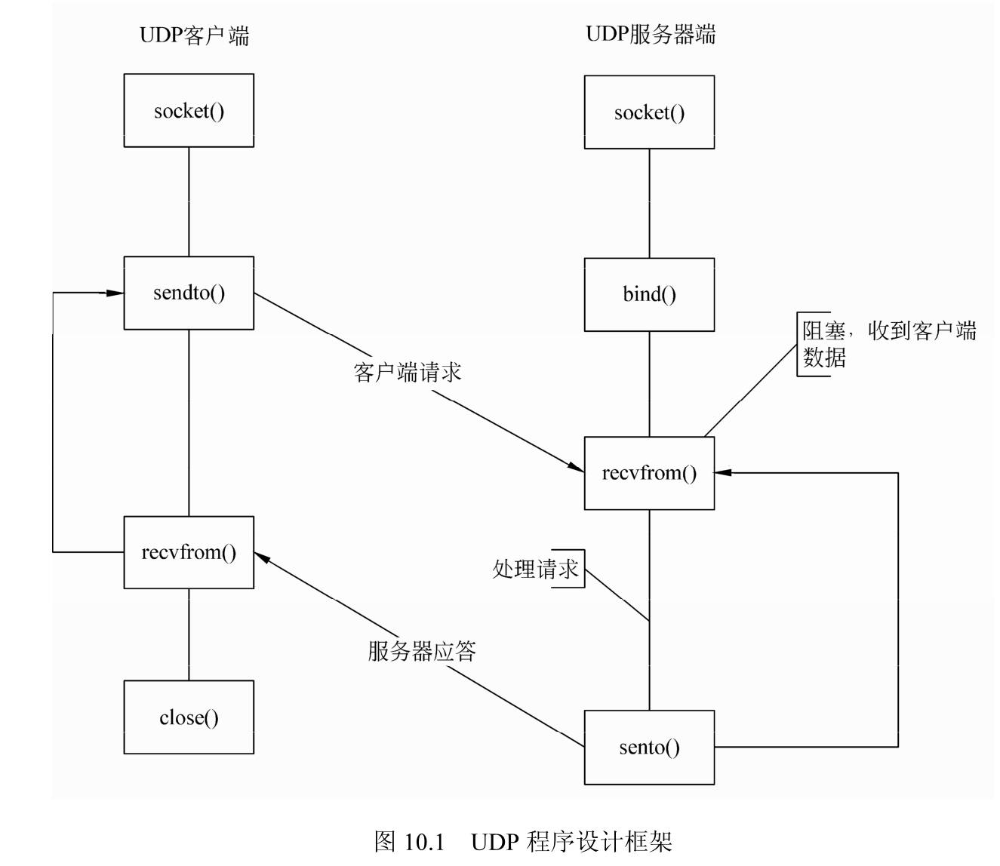
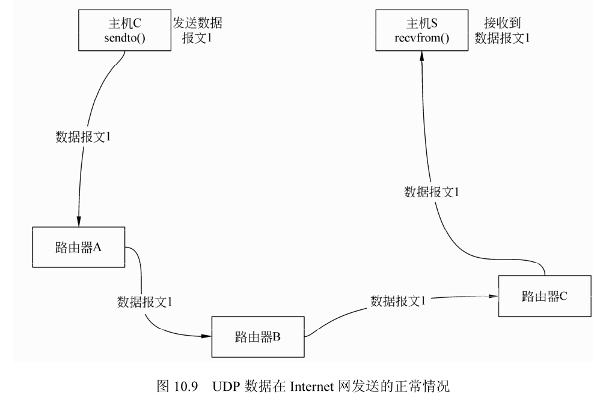
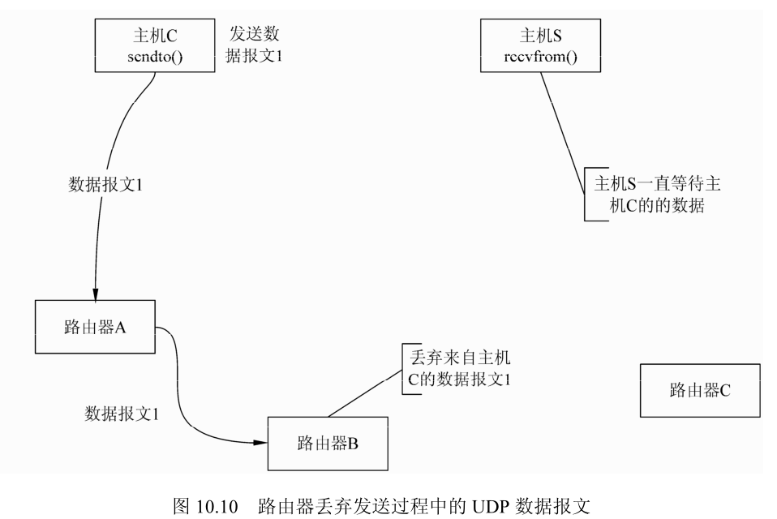
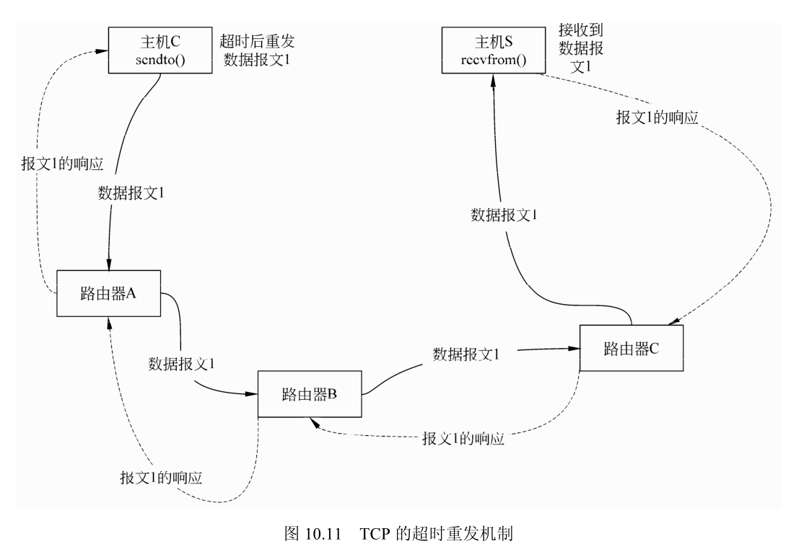
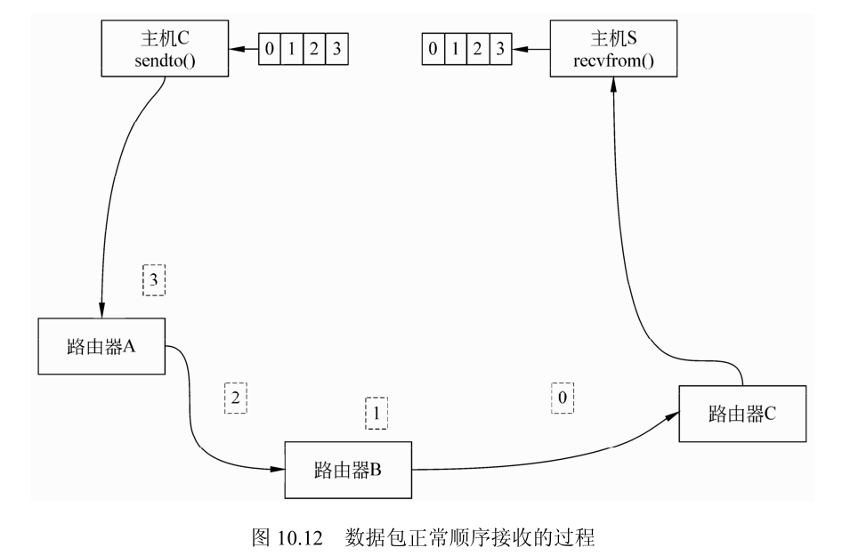
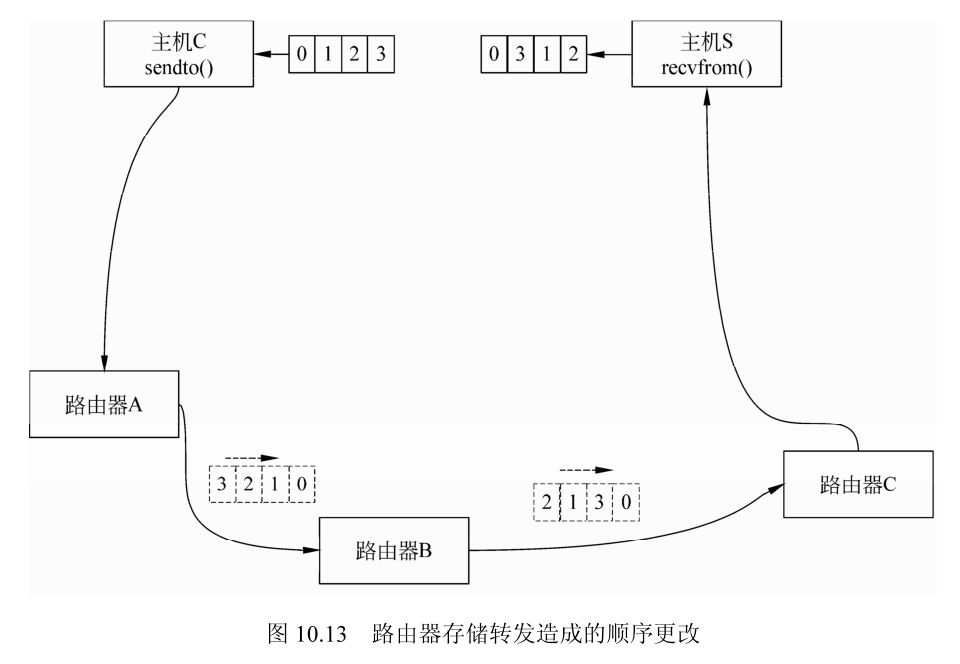
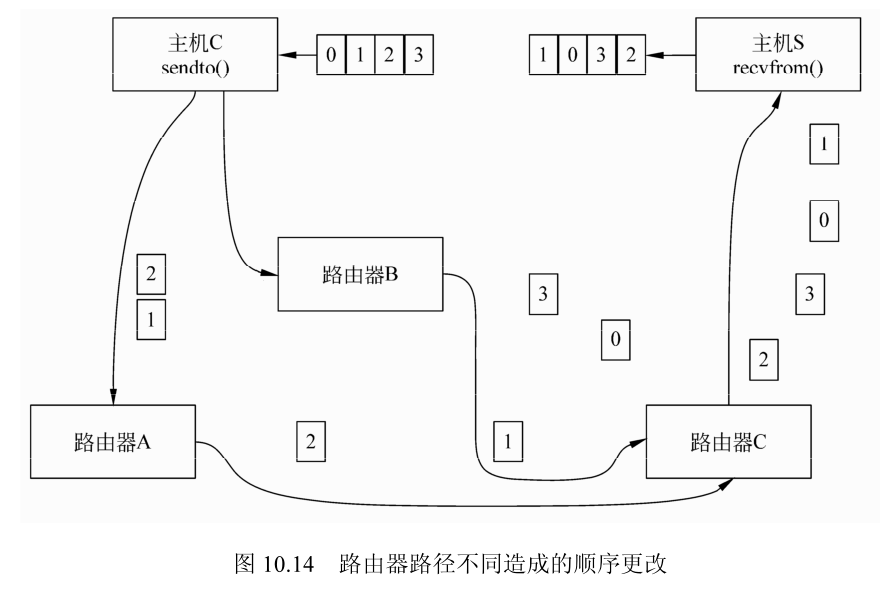
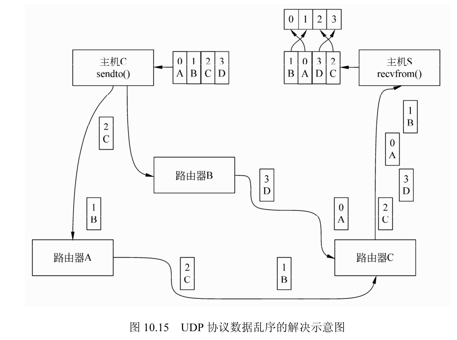

UDP 协议是 User Datagram Protocol 的简写，它是无连接的，不可靠的网络协议。

## UDP 编程框架

使用 UDP 进行程序设计可以分为客户端和服务器端两部分。服务器端主要包含建立套接字、将套接字与地址结构进行绑定、读写数据、关闭套接字几个过程。客户端包括建立套接字、读写数据、关闭套接字几个过程。服务器端和客户端两个流程之间的主要差别在于对地址的绑定 bind 函数，客户端可以不用进行地址和端口的绑定操作。

### UDP 编程框图

UDP 协议的程序设计框架如图 10.1 所示，客户端和服务器之间的差别在于服务器必须使用 bind() 函数来绑定侦听的本地 UDP 端口，而客户端则可以不进行绑定，直接发送到服务器地址的某个端口地址。

与 TCP 程序设计相比较，UDP 缺少了 connect、listen() 及 accept() 函数，这是用于 UDP 协议无连接的特性，不用维护 TCP 的连接、断开等状态。

1. UDP 协议的服务器端流程 

UDP 协议的服务器端程序设计的流程分为套接字建立、套接字与地址结构进行绑定、收发数据、关闭套接字等过程，分别对应于函数 socket、bind、sendto、recvfrom 和 close。



建立套接字过程使用 socket 函数，这个过程与 TCP 协议中的含义相同，不过建立的套接字类型为数据报套接字。地址结构与套接字文件描述符进行绑定的过程中，与 TCP 协议中的绑定过程不同的是地址结构的类型。当绑定操作成功后，可以调用 recvfrom 函数从建立的套接字接收数据或者调用 sendto() 函数向建立的套接字发送络数据。当相关的处理过程结束后，调用 close 函数关闭套接字。

2. UDP 协议的客户端流程 

UDP 协议的服务器端程序设计的流程分为套接字建立、收发数据、关闭套接字等过程，分别对应于函数 socket()、sendto()、recvfrom() 和 close()。

建立套接字过程使用 socket 函数，这个过程与 TCP 协议中的含义相同，不过建立的套接字类型为数据报套接字。建立套接字之后，可以调用函数 sendto0 向建立的套接字发送数据或者调用 recvfrom 函数从建立的套接字收网络数据。当相关的处理过程结束后，调用 close 函数关闭套接字。

3. UDP 协议服务器和客户端之间的交互 UDP 协议中服务器和客户端的交互存在于数据的收发过程中。进行网络数据的收发的时候，服务器和客户端的数据是对应的：客户端发送的数据的动作，对服务器来说是接收数据的动作；客户端接收数据的动作，对服务器来说是发送数据的动作。

UDP 协议服务器与客户端之间的交互，与 TCP 协议的交互相比较，缺少了二者之间的连接。这是由于 UDP 协议的特点决定的，因为 UDP 协议不需要流量控制、不保证数据的可靠性收发，所以不需要服务器和客户端之间建立连接的过程。

### UDP 服务器编程框架

图 10.1 中对 UDP 协议中的服务器程序框架进行了说明。服务器流程主要分为下述 6 个部分，即建立套接字、设置套接字地址参数、进行端口绑定、接收数据、发送数据、关闭套接字等。

（1）建立套接字文件描述符，使用函数 socket()，生成套接字文件描述符，例如：

```cpp
int s = socket(AF_INET, SOCK_DGRAM, 0);
```

建立一个 AF_INET 族的数据报套接字，UDP 协议的套接字使用 SOCK_DGRAM 选项。

（2）设置服务器地址和侦听端口，初始化要绑定的网络地址结构，例如：

```cpp
#include <netinet/in.h>
#include <sys/socket.h>

#define PORT_SERV 10235

int main() {
  struct sockaddr_in addr_serv;
  addr_serv.sin_family = AF_INET;
  addr_serv.sin_addr.s_addr = htonl(INADDR_ANY);
  addr_serv.sin_port = htons(PORT_SERV);
}
```

地址结构的类型为 AF_INET ； IP 地址为任意的本地地址；服务器的端口为用户定义的端口地址；注意成员 sin_addr.s_addr 和 sin_port 均为网络字节序。

（3）绑定侦听端口，使用 bind() 函数，将套接字文件描述符和一个地址类型变量进行绑定，例如：

```cpp
bind(s, (struct sockaddr *) &addr_serv, sizeof(addr_serv)); /*绑定地址*/
```

（4）接收客户端的数据，使用 recvfrom() 函数接收客户端的网络数据。

（5）向客户端发送数据，使用 sendto() 函数向服务器主机发送数据。

（6）关闭套接字，使用 close() 函数释资源。

### UDP 客户端编程框架

在图 10.1 中，同样对 UDP 协议的客户端流程进行了描述，按照图中所示，UDP 协议的客户端流程分为套接字建立、设置目的地址和端口、向服务器发送数据、从服务器接收数据、关闭套接字等 5 个部分。与服务器端的框架相比，少了 bind() 部分，客户端程序的端口和本地的地址可以由系统使用时指定，在使用 sendto() 和 recvfrom() 的时候，网络协议栈会临时指定本地的端口和地址，流程如下：

（1）建立套接字文件描述符，socket() ：

（2）设置服务器地址和端口，struct sockaddr：

（3）向服务器发送数据，sendto() ：

（4）接收服务器的数据，recvfrom() ：

（5）关闭套接字，close() 。

## UDP 协议程序设计的常用函数

UDP 协议常用的函数有 recv()/recvfrom()、send()/sendto()、socket()、bind() 等。当然这些函数同样可以用于 TCP 协议的程序设计。

略。

## UDP 协议程序设计中的几个问题

相对于 TCP 协议的程序设计，UDP 协议的程序虽然程序设计的环节要少一些，但是由于 UDP 协议缺少流量控制等机制，容易出现一些难以解决的问题。UDP 的报文丢失、报文乱序、connect() 函数、流量控制、外出网络接口的选择等是比较容易出现的问题，本节对此进行介绍并给出初步的解决建议方法。

### UDP 报文丢失数据

利用 UDP 协议进行数据收发的时候，在局域网内一般情况下数据的接收方均能接收到发送方的数据，除非连接双方的主机发生故障，否则不会发生接收不到数据的情况。

1. UDP 报文的正常发送过程而在 Internet 上，由于要经过多个路由器，正常情况下一个数据报文从主机 C 经过路由器 A、路由器 B、路由器 C 到达主机 S，数据报文的路径如图 10.9 所示。主机 C 使用函数 sendto() 发送数据，主机 S 使用 recvfrom() 函数接收数据，主机 S 在没有数据到来的时候，会一直阻塞等待。

2. UDP 报文的丢失路由器要对转发的数据进行存储、处理、合法性判定、转发等操作，容易出现错误，所以很可能在路由器转发的过程中出现数据丢失的现象，如图 10.10 所示。当 UDP 的数据报文丢失的时候，函数 recvfrom() 会一直阻塞，直到数据到来。





在 10.3 节的 UDP 服务器客户端的例子中，如果客户端发送的数据丢失，服务器会一直等待直到客户端合法数据到来；如果服务器的响应在中间被路由器丢弃，则客户端会一直阻塞，直到服务器数据的到来。在程序正常运行的过程中是不允许出现这种情况的，所以可以设置超时时间来判断是否有数据到来。对于数据丢失的原因，并不能通过一种简单的方法获得，例如，不能区分服务器发给客户端的响应数据是在发送的路径中被路由器丢弃，还是服务器没有发送此响应数据。

3. UDP 报文丢失的对策

UDP 协议中的数据报文丢失是先天性的，因为 UDP 是无连接的、不能保证发送数据的正确到达。图 10.11 为 TCP 的连接中发送数据报文的过程，主机 C 发送的数据经过路由器，到达主机 S 后，主机 S 要发送一个接收到此数据报文的响应，主机 C 要对主机 S 的响应进行记录，直到之前发送的数据报文 1 已经被主机 S 接收到。如果数据报文在经过路由器的时候，被路由器丢弃，则主机 C 和主机 S 会对超时的数据进行重发。



### UDP 数据发送中的乱序

UDP 协议数据收发过程中，会出现数据的乱序现象。所谓乱序是发送数据的顺序和接收数据的顺序不一致，例如发送数据的顺序为数据包 A、数据包 B、数据包 C，而接收数据包的顺序变成了数据包 B、数据包 A、数据包 C。

1. UDP 数据顺序收发的过程如图 10.12 所示，主机 C 向主机 S 发送数据包 0、数据包 1、数据包 2、数据包 3，各个数据包途中经过路由器 A、路由器 B、路由器 C，先后到达主机 S，在主机 S 端的循序仍然为数据包 0、数据包 1、数据包 2、数据包 3，即发送数据时的顺序和接收数据时的顺序是一致的。



2. UDP 数据的乱序

UDP 的数据包在网络上传输的时候，有可能造成数据的顺序更改，接收方的数据顺序和发送方的数据顺序发生了颠倒。这主要是由于路由的不同和路由的存储转发的顺序不同造成的。

路由器的存储转发可能造成数据顺序的更改，如图 10.13 所示。主机 C 发送的数据在经过路由器 A 和路由器 C 的时候，顺序均没有发生顺序更改。而在经过主机 B 的时候，数据的顺序由数据 0123 变为了 0312，这样主机 C 的数据 0123 顺序经过路由器到达主机 S 的时候变为了数据 0312。



UDP 协议的数据经过路由器时的路径造成了发送数据的混乱，如图 10.14 所示。从主 C 发送的数据 0123，其中数据 0 和 3 经过路由器 B、路由器 C 到达主机 S，数据 1 和数据 2 经过路由器 A、路由器 C 到达主机 S，所以数据由发送时的顺序 0123 变成了顺序 1032。



3. UDP 乱序的对策

对于乱序的解决方法可以采用发送端在数据段中加入数据报序号的方法，这样接收端对接收到数据的头端进行简单地处理就可以重新获得原始顺序的数据，如图 10.15 所示。



### UDP 协议中的 connect() 函数

UDP 协议的套接字描述符在进行了数据收发之后，才能确定套接字描述符中所表示的发送方或者接收方的地址，否则仅能确定本地的地址。例如客户端的套接字描述符在发送数据之前，只要确定建立正确就可以了，在发送的时候才确定发送目的方的地址；服务器 bind() 函数也仅仅绑定了本地进行接收的地址和端口。

connect() 函数在 TCP 协议中会发生三次握手，建立一个持续的连接，一般不用于 UDP。在 UDP 协议中使用 connect() 函数的作用仅仅表示确定了另一方的地址，并没有其他的含义。

connect() 函数在 UDP 协议中使用后会产生如下的副作用：

- 使用 connect() 函数绑定套接字后，发送操作不能再使用 sendto() 函数，要使用 write() 函数直接操作套接字文件描述符，不在指定目的地址和端口号。

- 使用 connect() 函数绑定套接字后，接收操作不能再使用 recvfrom() 函数，要使用 read() 类的函数，函数不会返回发送方的地址和端口号。

- 在使用多次 connect() 函数的时候，会改变原来套接字绑定的目的地址和端口号，用新绑定的地址和端口号代替，原有的绑定状态会失效。可以使用这种特定来断开原来的连接。

下面是一个使用 connect() 函数的例子，在发送数据之前，将套接字文件描述符与目的地址使用 connect() 函数进行了绑定，之后使用 write() 函数发送数据并使用 read() 函数接收数据。

```cpp
static void udp_client_echo(int s, struct sockaddr *to) {
  char buf[1024] = "UDP TEST";
  connect(s, to, sizeof(*to));
  int n = write(s, buf, 1024);
  read(s, buf, n);
}
```

10.4.4UDP 缺乏流量控制

UDP 协议没有 TCP 协议所具有的滑动窗口概念，接收数据的时候直接将数据放到缓冲区中。如果用户没有及时地从缓冲区中将数据复制出来，后面到来的数据会接着向缓冲区中放入。当缓冲区满的时候，后面到来的数据会覆盖之前的数据造成数据的丢失。

1. UDP 缺乏流量控制概念

如图 10.16 所示为 UDP 的接收缓冲区示意图，共有 8 个缓冲区，构成一个环状数据缓冲区。起点为 0。

当接收到数据后，会将数据顺序放入之前数据的后面，并逐步递增缓冲区的序号，如图 10.17 所示。

略。
