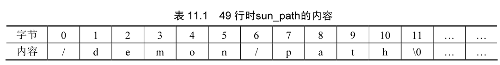
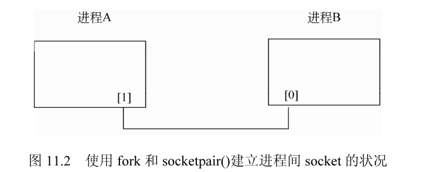
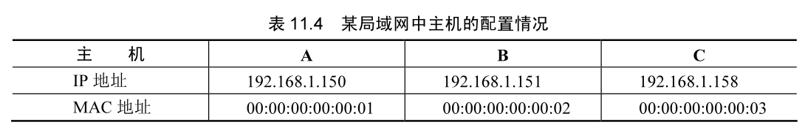
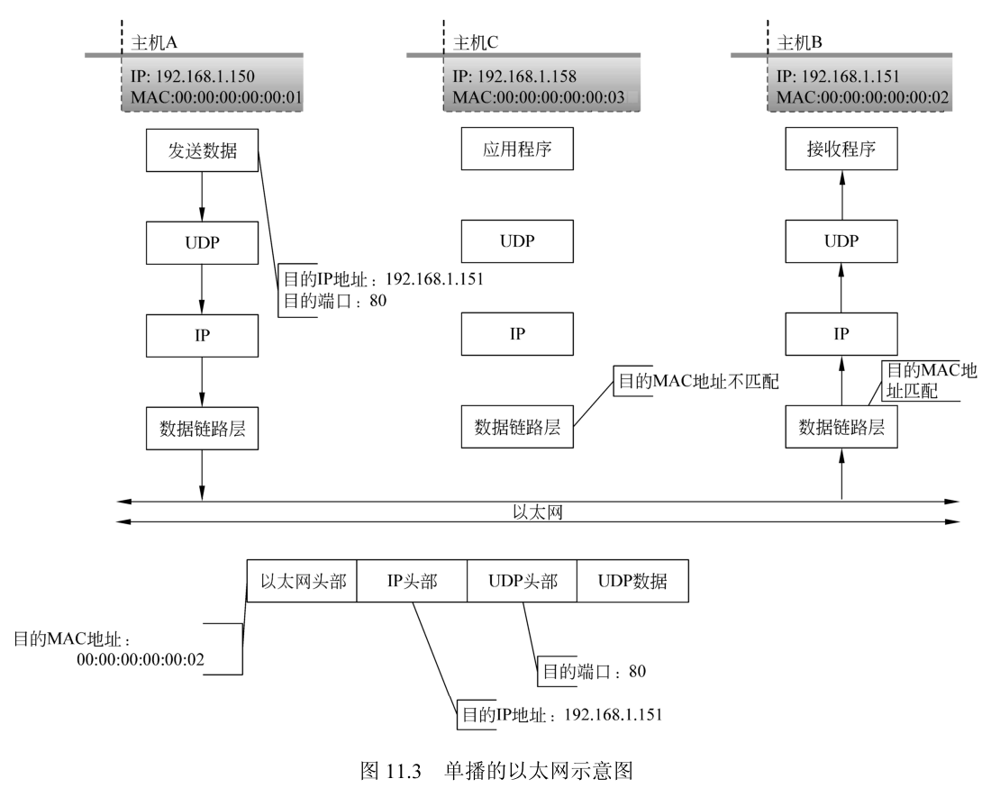
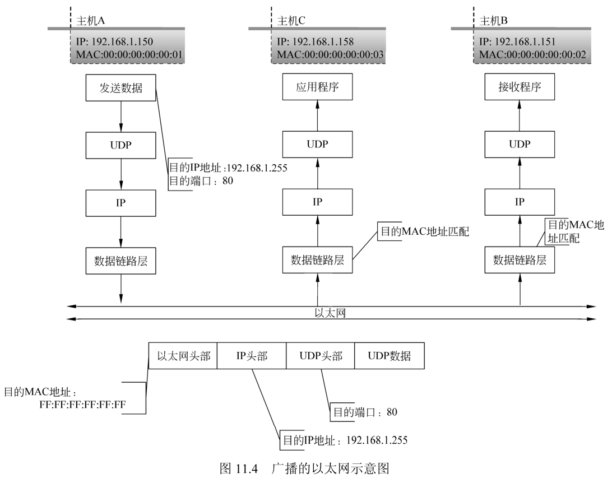
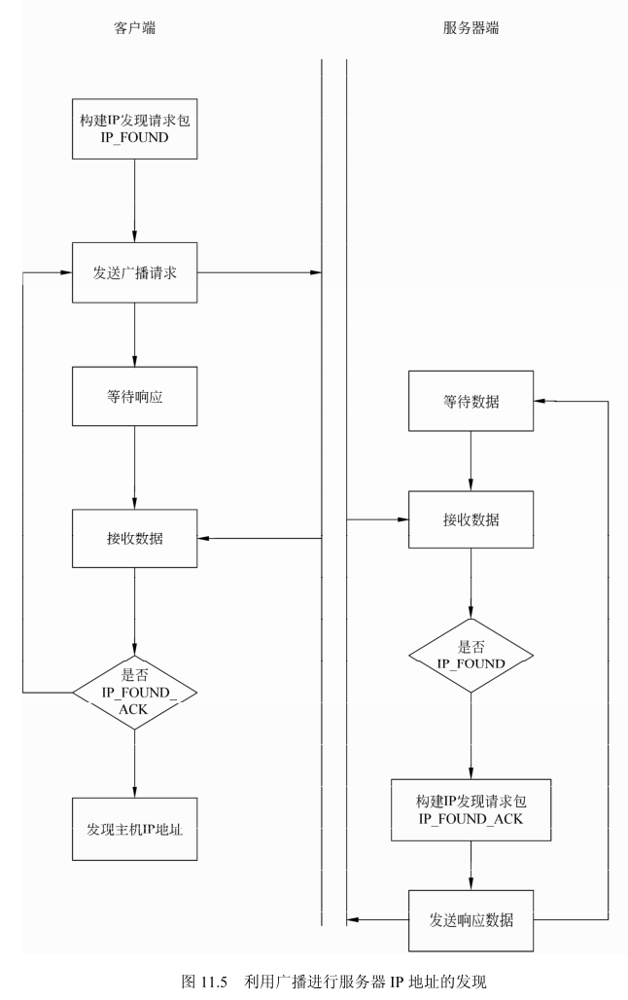

## UNIX 域函数

UNIX 域的协议族是在同一台主机上的客户 / 服务器通信时使用的一种方法。相对其他方法（例如进程间通信的管道），它在形式上与传统套接字 API 的调用方法相同。UNX 域有两种类型的套接字：**字节流**套接字和**数据报**套接字，字节流套接字类似于 TCP，数据报套接字类似于 UDP。UNIX 域的套接字有如下的特点值得注意。

- UNIX 域套接字与 TCP 套接字相比较，在同一台主机的传输速度前者是后者的两倍。
- UNIX 域套接字可以在同一台主机上各进程之间传递描述符。
- UNIX 域套接字与传统套接字的区别是**用路径名来表示协议族的描述**。

### UNIX 域函数的地址结构 

UNIX 域的地址结构在文件 `<linux/un.h>` 中定义，结构的原型如下：

```cpp
#define UNIX_PATH_MAX 108
struct sockaddr_un {
  sa_family_t sun_family;       /*AF UNIX协议族名称*/
  char sun_path[UNIX_PATH_MAX]; /*路径名*/
};
```

- UNIX 域地址结构成员变量 sun_family 的值是 AF_UNIX 或者 AF_LOCAL。
- sun_path 是一个路径名，此路径名的属性为 0777，可以进行读写等操作。

结构 sockaddr_un 的长度使用宏 SUN_LEN 定义，默认大小为 108，SUN_LEN 宏的定义如下：

```cpp
# define SUN_LEN(ptr) ((size_t) (((struct sockaddr_un *) 0) -> sun_path) + strlen((ptr)->sun_path))
```

### 套接字函数

UNIX 域的套接字函数和以太网套接字（AF_INET）的函数相同，但是当用于 UNIX 域套接字时，套接字函数有一些差别和限制，主要有如下几条。

- 使用函数 bind() 进行套接字和地址的绑定的时候，地址结构中的路径名和路径名所表示的文件的默认访问权限为 0777，即用户、用户所属的组和其他组的用户都能读、写和执行。

- 结构 sum_path 中的路径名必须是一个绝对路径，不能是相对路径。

- 函数 connect() 使用的路径名必须是一个绑定在某个已打开的 UNIX 域套接字上的路径名，而且套接字的类型也必须一致。下列情况将出错：(a) 该路径名存在但不是一个套接字； (b) 路径名存在且是一个套接口，但没有与该路径名相关联的打开的描述字； (c) 路径名存在且是一个打开的套接字，但类型不符。

- 用函数 connect() 连接 UNIX 域套接字时的权限检查和用函数 open() 以只写方式访问路径名完全相同。

- UNIX 域字节流套接字和 TCP 套接字类似：它们都为进程提供一个没有记录边界的字节流接口。

- 如果 UNIX 域字节流套接字的 connect() 函数发现监听套接字的队列已满，会立刻返回一个 ECONNREFUSED 错误。这和 TCP 有所不同：如果监听套接字的队列已满，它将忽略到来的 SYN,TCP 连接的发起方会接着发送几次 SYN 重试。

- UNX 域数据报套接字和 UDP 套接字类似：它们都提供一个保留记录边界的不可靠的数据服务。

- 与 UDP 套接字不同的是，在未绑定的 UNX 域套接字上发送数据报不会给它捆绑一个路径名。这意味着，数据报发送者除非绑定一个路径名，否则接收者无法发回应答数据报。同样，与 TCP 和 UDP 不同的是，给 UNIX 域数据报套接字调用 connect() 不会捆绑一个路径名。

### 使用 UNIX 域函数进行套接字编程

使用 UNIX 域函数进行套接字编程与 AF_INETT 的方式一致，不同的地方在于地址结构不同。下面是一个地址 UNIX 域套接字编程的简单例子。

`src/docs/Linux网络编程/CH11/unix_01.c`

```cpp
#include <linux/un.h>
#include <stdio.h>
#include <stdlib.h>
#include <string.h>
#include <sys/socket.h>
#include <unistd.h>

/*错误处理函数*/
static void display_err(const char *on_what) {
  perror(on_what);
  exit(1);
}

int main(int argc, char **argv) {
  int error;                        /* 错误值 */
  int sock_unix;                    /* socket */
  struct sockaddr_un addr_unix;     /* AF_UNIX族地址 */
  int len_unix;                     /* AF_UNIX族地址长度 */
  const char path[] = "/demon/path"; /* 路径名 */

  /*建立套接字*/
  sock_unix = socket(AF_UNIX, SOCK_STREAM, 0);
  if (sock_unix == -1) {
    display_err("socket()");
  }

  /*
  * 由于可能之前已经使用了path路径用于其他用途
  * 需要将之前的绑定取消
  */
  unlink(path);

  /*填充地址结构*/
  memset(&addr_unix, 0, sizeof(addr_unix));

  addr_unix.sun_family = AF_LOCAL;
  strcpy(addr_unix.sun_path, path);
  len_unix = sizeof(struct sockaddr_un);

  /*绑定地址到socket sock_unix*/
  error = bind(sock_unix, (struct sockaddr *) &addr_unix, len_unix);
  if (error == -1) {
    display_err("bind()");
  }

  /*关闭socket*/
  close(sock_unix);
  unlink(path);

  return 0;
}
```

上面的例子中，需要首先建立一个路径名为 "/demon/path" 的目录，如果需要建立一个临时使用的套接字，而又不方便手动建立，可以使用 Linux 中的一个特殊方法，即格式化抽象本地地址。

格式化抽象本地地址的方式需要将路径名的第一个字符设置为空字符，即“\0”。例如，对于上面的例子，可以在第 50 行插入如下的代码：

```cpp
addr_unix.sun_path[0] = 0;
```

这时在第 49 行时，结构 addr_unix 的成员 sun_path 的内容如表 11.1所示。



第 50 行对 sunpath 的内容进行了修改，进行 bind 的时候，其路径名已经发生了变化，其实是对字符串 "demon/path" 进行了绑定，在第 54 行时，sun_pah 的内容如表 11.2 所示。


计算 UNIX 域结构的长度使用 sizeof() 函数，其实可以使用 SSUNLEN 宏来结算，例如第 49 行可以修改为如下的方式：

```cpp
len_unix = SUN_LEN(addr_un);
```

### 传递文件描述符

在进程之间经常遇到需要在各进程之间传递文件描述符的情况，例如有一种设备它在加电期间只能打开一次，如果关闭后再次打开就会发生错误。这时就需要有一个调度程序，某个设备的描述符给客户端。但是，由于不同进程之间的文件描述符所表示的对象是不同的，这需要一种特殊的机制来实现上述的要求。

Liunx 系统中提供了一种特殊的方法，可以从一个进程中将一个已经打开的文件描述符传递给其他的任何进程。其基本过程如下：

（1）创建一个字节流或者数据报的 UNIX 域套接字。

- 如果目标是 fork() 一个子进程，让子进程打开描述符并将它返回给父进程，那么父进程可以用 socketpair() 创建一个流管道，用它来传递描述字。

- 如果进程之间没有亲缘关系，那么服务器必须创建一个 UNIX 域**字节流**套接字，绑定一个路径名，让客户连接到这个套接字。然后客户端可以向服务器发送一个请求以打开某个描述字，服务器将描述符通过 UNIX 域套接字传回。在客户端和服务器之间也可以使用 UNIX **数据报**套接字，但这样做没有什么好处，而且数据报存在丢失的可能性。

（2）进程可以用任何返回描述符的 UNIX 函数打开一个描述符：例如 open()、pipe()、mkfifo()、socket() 或者 accept()。可以在进程间传递任何类型的描述符。

（3）发送进程建立一个 msghdr 结构，其中包含要传递的描述符。在 POSIX 中说明该描述符作为辅助数据发送，但老的实现使用 msg_accright 成员。发送进程调用 sendmsg() 通过第一部得到的 UNIX 域套接字发出套接字。这时这个描述符是在飞行中的。即使在发送进程调用 sendmsg() 之后，但在接受进程调用 recvmsg() 之前将描述符关闭，它仍会为接收进程保持打开状态。描述符的发送导致它的访问统计数加 1。

（4）接收进程调用 recvmsg() 在 UNIX 域套接字上接收套接字。通常接收进程收到的描述符的编号和发送进程中的描述符的编号不同，但这没有问题。**传递描述符不是传递描述符的编号，而是在接收进程中建立一个新的描述符，指向内核的文件表中与发送进程发送的描述符相同的项**。

### socketpair() 函数 

socketpair() 函数**建立一对匿名的已经连接的套接字**，其特性由协议族 d、类型 type、协议 protocol 决定，建立的两个套接字描述符会放在 sv[0]和 sv[1]中。

socketpair() 函数的原型如下，第 1 个参数 d，表示协议族，只能为 AF_LOCAL 或者 AF_UNIX ；第 2 个参数 type，表示类型，只能为 0. 第 3 个参数 protocol，表示协议，可以是 SOCK_STREAM 或者 SOCK_DGRAM。用 SOCK_STREAM 建立的套接字对是管道流，与一般的管道相区别的是，套接字对建立的通道是双向的，即每一端都可以进行读写。参数 sv，用于保存建立的套接字对。

```cpp
#include <sys/socket.h>

int socketpair(int d, int type, int protocol, int sv[2]);
```

socketpair() 函数的返回值为 0 时表示调用成功，为 -1 时表示发生了错误，错误值在变量 errno 中，errno 的含义如表 11.3 所示。

函数errno的值及含义.png)

socketpair() 函数建立两个套接字文件描述符 sv[0]] 和 sv[1], 如图 11.1 所示。


socketpair() 函数建立的描述符可以使用类似管道的处理方法在两个进程之间通信。使用函数 socketpair() 建立套接字描述符后，在一个进程中关闭其中的一个，在另一个进程中关闭另一个，如图 11.2 所示。调用函数 socketpair()。后，fork 进程在进程 A 中关闭 sv[0]，在进程 B 中关闭 sv[1]，则会形成图中所示的状况。



### 传递文件描述符的例子

本节中使用一个实例来介绍进程间传递文件描述符的例子。分为两个进程，进程 A 中打开一个文件描述符，通过消息传送的方式将文件描述符传递给进程 B。

1. 进程 A 的代码

进程 A 根据用户输入的文件名打开一个文件，将文件描述符打包到消息结构中，然后发送给进程 B。

`src/docs/Linux网络编程/CH11/unix_A.c`

2. 进程 B 的代码

进程 B 获得进程 A 中发送过来的消息，并从中取得文件描述符。根据获得的文件描述符，直接从文件中读取数据，并将数据在标准输出打印出来。

`src/docs/Linux网络编程/CH11/unix_B.c`

暂时不知道怎么用。。。

### 广播的 P 地址

要使用广播，需要了解 PV4 特定的广播地址。P 地址分为左边的网络 D 部分以及右边的主机 D 部分。广播地址所用的 P 地址将表示主机 D 的位全部设置为 1. 网卡正确配置以后，可以用下面的命令来显示所选用接口的广播地址。

```shell
apt -y install net-tools
```

```shell
ifconfig eth0
```

广播地址 255.255.255.255 是一种特殊的广播地址，这种格式的广播地址是向全世界进行广播，但是却有更多的限制。一般情况下，这种广播类型不会被路由器路由，而一个更为特殊的广播地址，例如 192.168.0.255 也许会被路由，这取决于路由器的配置。

通用的广播地址在不同的环境中的含义不同。例如，IP 地址 255.255.255.255，一些 UNIX 系统将其解释为在主机的所有网络接口上进行广播，而有的 UNIX 内核只会选择其中的一个接口进行广播。当一个主机有多个网卡时，这就会成为一个问题。

如果必须向每个网络接口广播，程序在广播之前应执行下面的步骤。

（1）确定下一个或第一个接口名字。

（2）确定接口的广播地址。

（3）使用这个广播地址进行广播。

（4）对于系统中其余的活动网络接口重复执行步骤（1）一步骤（3）。

在执行完这些步骤以后，就可以认为已经对每一个接口进行广播。

### 广播与单播的比较

广播和单播的处理过程是不同的，单播的数据只是收发数据的特定主机进行处理，而广播的数据整个局域网都进行处理。

例如在一个以太网上有 3 个主机，主机的配置如表 11.4 所示。



单播的示意图如图 11.3 所示，主机 A 向主机 B 发送 UDP 数据报，发送的目的 IP 为 192.168.1.151，端口为 80，目的 MAC 地址为 00:00:00:00:00:02. 此数据经过 UDP 层、IP 层，到达数据链路层，数据在整个以太网上传播，在此层中其他主机会判断目的 MAC 地址。主机 C 的 MAC 地址为 00:00:00:00:00:03，与目的 MAC 地址 00:00:00:00:00:02 不匹配，数据链路层不会进行处理，直接丢弃此数据。



主机 B 的 MAC 地址为 00:00:00:00:00:02，与目的 MAC 地址 00:00:00:00:00:02 一致，此数据会经过 P 层、UDP 层，到达接收数据的应用程序。

广播的示意图如图 11.4 所示，主机 A 向整个网络发送广播数据，发送的目的 P 为 192.168.1.255，端口为 80，目的 MAC 地址为 FF:FF:FF:FF:FF:FF。此数据经过 UDP 层、IP 层，到达数据链路层，数据在整个以太网上传播，在此层中其他主机会判断目的 MAC 地址。由于目的 MAC 地址为 FF:FF:FF:FF:FF:FF，主机 C 和主机 B 会忽略 MAC 地址的比较（当然，如果协议栈不支持广播，则仍然比较 MAC 地址），处理接收到的数据。



主机 B 和主机 C 的处理过程一致，此数据会经过 P 层、UDP 层，到达接收数据的应用程序。

### 广播的示例

本节中是一个服务器地址发现的代码，假设服务器为 A，客户端为 B。客户端在某个局域网启动的时候，不知道本局域网内是否有适合的服务器存在，它会使用广播在本局域网内发送特定协议的请求，如果有服务器响应了这种请求，则使用响应请求的 P 地址进行连接，这是一种服务器 / 客户端自动发现的常用方法。

1. 广播例子简介如图 11.5 所示为使用广播的方法发现局域网上服务器的 P 地址。服务器在局域网上侦听，当有数据到来的时候，判断数据是否有关键字 P_FOUND，当存在此关键字的时候，发送 IP_FOUND_ACK 到客户端。客户端判断是否有服务器的响应 IP_FOUND 请求，并判断响应字符串是否包含 IP_FOUND_ACK 来确定局域网上是否存在服务器，如果有服务器的响应，则根据 recvfrom() 函数的 rom 变量可以获得服务器的 IP 地址。



2. 广播的服务器端代码

服务器的代码如下，服务器等待客户端向某个端口发送数据，如果数据的格式正确，则服务器会向客户端发送响应数据。

`src/docs/Linux网络编程/CH11/broadcast/broadcast_server.c`

3. 广播的客户端代码

广播的客户端函数代码如下，客户端向服务器端发送命令 IP_FOUND，并等待服务器端的回复，如果有服务器回复，则向服务器发送 IP_FOUND_ACK，否则发送 10 遍后退出。

`src/docs/Linux网络编程/CH11/broadcast/broadcast_client.c`

略。
