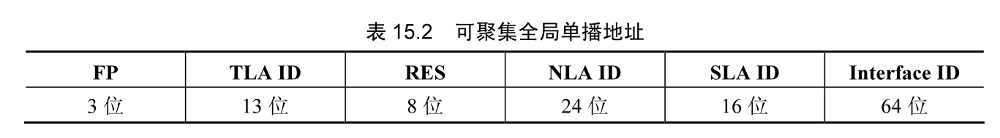
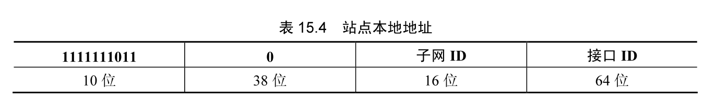
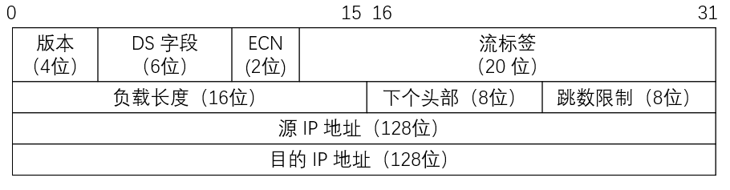
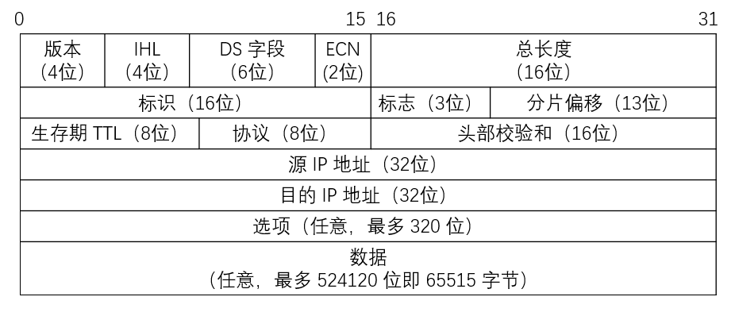
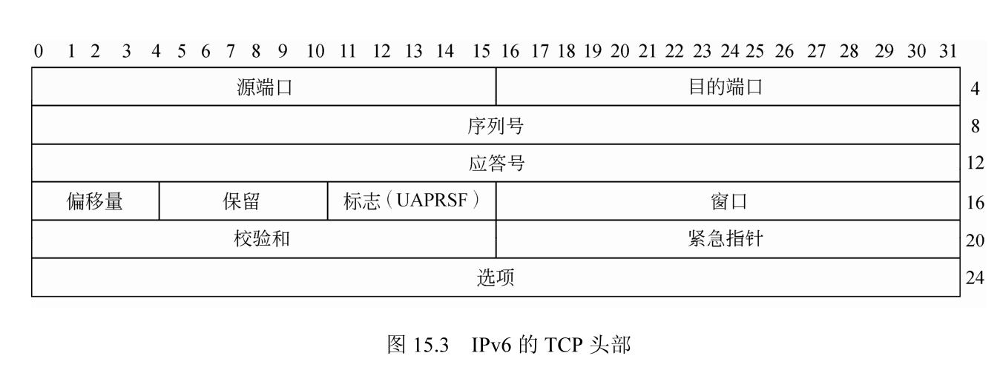
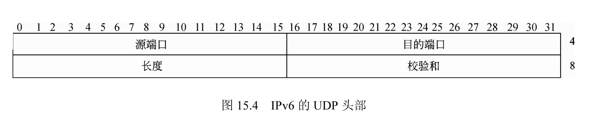
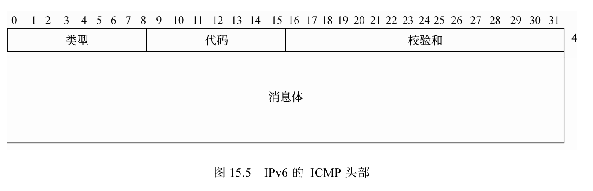

## IPv4 的缺陷

IPv4 的主要缺陷有地址问题、安全问题、性能问题和自动配置的不够人性化等。这些问题在 IPv4 的框架下不能完全有效地进行解决，仅能进行个别问题的修补，例如 IPv4 的 NAT 技术用户尝试性的解决 IP 地址空间问题只能获得局部性的成功。

1. IPv4 的地址空间危机

IPv4 的地址以 32 位数值表示，最多可达 40 多亿个地址，如果 IP 地址是以递增的方式分配，即第一个主机为 1，第二个主机的地址为 2 的方式来分配 IP 地址才能达到预定的 40 亿个数据。

目前 IP 地址的分配策略是按照树状进行划分的，即把地址分配给机构，然后由机构对 IP 地址进行再次分配，这造成了 IP 地址的分配不足，总有部分 IP 地址作为预留或者其他的用途没有分配给主机。

IP 地址分为 5 类，其中的 3 类地址用于 IP 网络，按照规划，这 3 类地址足够用于网络的构建。其中 A 类地址为 126 个，分给了最大的实体，例如政府机关、高校、及先入的企业部门，主要分配在美国。这类地址很庞大，但是由于历史原因，利用却很不足。B 类地址有 16000 个，用于一些大型的机构，如大学和大公司。C 类地址数量比较多，每个网络上的主机数量为 255 个，用于 IP 网络的其他机构。

由于 A 类地址的少数公司并不能高效率地利用 IP 地址，而获得 C 类地址的小机构只有几个主机而不能真正使用此类地址，造成 B 类地址的获得越来越难。目前在中国有多种方法来应对这种情况，例如 NAT 技术将网络分为了内网和外网，除了安全方面的考虑，主要就是因为 IP 地址不够造成的。而电信网通等运营部门的动态 IP 分配，也是为了高效地利用 IP 地址的方法，使得用户的 IP 可以多人多次使用。

2. IPv4 的性能

IPv4 设计最初是一个试验品，当时没有考虑到实现时的某些现实情况，对目前的 Internet 网络的广泛应用也没有预料到。所以在某些方面存在不足，例如最大传输单元、最大包的长度、校验和、IP 的头部设计、IP 选路等都没有考虑到其性能。

3. IPv4 的安全

由于 IPv4 将网络安全放在了应用层考虑，没有在协议栈层进行设计，存在很大的隐患。

4. IPv4 的自动配置和移动

IPv4 的自动配置主要体现在移动方面，在一个主机从一个地点移动到新的地点的时候，需要重新配置，并且由于提供服务的 ISP 不同，可能的配置千差万别，例如 IP、网管、 DNS 都要发生变化，甚至还要加上浏览器的代理出口。而原来主机的所在位置即使足够空闲也不能带到新的 IP 紧张的新地点。

### IPv6 的特点

IPv6 就是能够无限制地增加 IP 网址数量、拥有巨大网址空间和卓越网络安全性能等特点的新一代互联网协议。PV6 的技术特点：

- Pv6 提供 128 位的地址空间，全球可分配地址数为 340282366920938463463374607431768211456 个。Pv6 的地址结构采用 128 位的另一个原因是采用了层次化的地址结构设计，允许对地址进行层次化的划分，提供大量不同类型的 IP 地址。
- IPv6 将自动 IP 地址分配功能作为标准功能。具有网络功能的机器一旦连接上网络便可自动设定地址。它有两个优点：一是最终用户用不着花精力进行地址设定，二是可以大大减轻网络管理者的负担。
- IPv6 对报文数据报头结构作了简化，用来减少处理器的开销并节省网络带宽。数据报文的头部采用了流线型的设计，IPv6 的报头由一个基本报头和多个扩展报头(Extension Header) 构成，基本报头具有固定的长度（40 字节），放置所有路由器都需要处理的信息。
- IPv6 的安全性使用了鉴别和加密扩展头部数据结构的方法。作为 IPSec 的一项重要应用，Pv6 集成了虚拟专用网（VPN）的功能，使用 IPv6 可以更容易地实现更为安全可靠的虚拟专用网。
- IPv4 协议在设计之初，采用“尽最大努力”传输的服务质量保证方式。文本数据、静态图像数据等传输对 QoS 没有要求，随着 IP 网上多媒体业务的增加，如 IP 电话、VoD、电视会议等实时应用，对传输延时和延时抖动均有严格的要求。
- IPv6 数据包包含了服务质量的特性，能更好地支持多媒体和其他对服务质量有较高要求的应用。

## IPv6 的地址

IPv6 地址是独立接口的标识符，所有的 IPv6 地址都被分配到接口，而没有分配到节点。IPv6 有 3 种类型地址：

- 单播地址：这个地址是和 IPv6 的地址相对应的一个，每个主机接口有一个单播地址。
- 多播地址：这个地址是一个设备组的标示，发往这个地址的数据会被整个设备组上的设备接收到。
- 任播地址：报文发往一个组内的任意设备而不是所有的设备。

其中单播地址又分为如下 3 类：

- 全局可聚集单播地址；
- 站点本地地址；
- 链路本地地址。

### IPv6 的单播地址

一个 IPv6 单播地址与某个接口相关联。发给单播地址的包传送到由该地址标识的某个接口上。但是为了满足负载平衡系统，在 RFC2373 中允许多个接口使用同一地址。IPv6 的单点传送 P 地址包括：可聚集全球单点传送地址、链路本地地址、站点本地地址和其他些特殊的单点传送地址，格式如表 15.1 所示。


如果一个单播 IP 地址所有位均为 0，那么该地址称为未指定的地址。以文本形式表示为 “::1”。单播地址“:1” “0:0:0:0:0:0:0:1”称为环回地址。节点向自己发送数据包时采用环回地址。

### 可聚集全球单播地址

IPv6 为端对端通信设计了一种可分级的地址结构，这种地址被称为可聚集全球单播地址 (Aggregatable Global Unicast Address)。可聚集全球单播地址，是可以在全球范围内进行路由转发的地址，格式前缀为 001，与 IPv4 公共地址相似。

可聚集全球单播地址结构如表15.2 所示。字段格式前缀 FP 之后，分别是 13 位的 TLA ID、8 位的 Res、24 位的 NLA ID、16 位 SLA ID 和 64 位主机接口 ID.TLA（Top Level Aggregator，顶级聚合体）、NLA（Next Level Aggregator，下级聚合体）、SLA（Site Level Aggregator，节点级聚合体）三者构成了自顶向下排列的 3 个网络层次。



- FP（Format prefix）：格式前缀，值为 001，用于区别其他地址类型。
- TLA ID（Top-level Aggregation Identifier）：顶级聚集标识符，是与长途服务供应商和电话公司相互连接的公共骨干网络接入点，其 ID 的分配由国际 Internet 注册机构 IANA 严格管理。
- RES（Reserved for future use）：8位保留位，用来进行将来扩充。
- NLA ID（Next-Level Aggregation Identifier）：下一级聚集标识符。
- SLA ID（Site-Level Aggregation Identifier）：站点级聚集标识符，它可以是一个机构或一个小型 IP。分层结构的最底层是网络主机。
- Interface ID：接口标识符，IPv6 单播地址中的接口标识符用于在链路中标识接口。

### 本地使用单播地址

本地单播地址的传送范围限于本地，又分为链路本地地址和站点本地地址两类，分别适用于单条链路和一个站点内。

1. 链路本地地址链路本地地址，格式前缀为 1111111010，用于同一链路的相邻节点间通信。链路本地地址用于邻居发现，且总是自动配置的，包含链路本地地址的包不会被 Pv6 路由器转发，格式如表 15.3 所示。


2. 站点本地地址

站点本地地址，格式前缀为 1111111011，相当于 10.0.0.0/8、172.16.0.0/12 和 192.168.0.0/16 等 Pv4 私用地址空间。例如企业专用局域网，如果没有连接到 Pv6 Internet 上，在企业内部可以使用本地站点地址，其他站点不能访问站点本地地址，包含站点本地地址的包不会被路由器转发到企业专用局域网之外。一个站点通常是位于同一地理位置的机构网络或子网。与链路本地地址不同的是，站点本地地址不是自动配置的，而必须使用无状态或全状态地址配置服务。

IPv6 自动进行重编号，如表 15.4 所示。



### 主机的多个 1Pv6 地址

即使一个主机只有一个单接口，该主机也可以有多个 Pv6 地址。即可以同时拥有以下几种单点传送地址：

- 每个接口的链路本地地址；每个接口的单播地址（可以是一个站点本地地址和一个或多个可聚集全球地址）；
- 回环 (loopback) 接口的回环地址 `::1`。

此外，每台主机还需要时刻保持收听以下多播地址上的信息：

- 节点本地范围内所有节点组播地址 `FF01::1`；
- 链路本地范围内所有节点组播地址 `FF02::1`；
- 请求节点 (solicited-node) 组播地址（如果主机的某个接口加入请求节点组）；
- 组播组组播地址（如果主机的某个接口加入任何组播组）。

略，需要时学习。

## IPv6 的头部

IPv6 的包头共 40 个字节，其中包含了 IPv6 的主要概念。主要有版本号、业务流类别、流标签、负载长度、下一个头、跳限、原始 IP 地址和目的 IP 地址等选项。相对于 IPv4 的头部，IPv6 的头部要简单一些，这方便路由和网关等设备的大数据量计算。

### IPv6 头部格式

图 15.1 为 IPv6 包头的格式。



在 IPv4 中，所有包头以 32 位为单位，即以 4 个字节为长度单位。在 IPv6 中的头部中，长度是以 64 位为一个单位。下面是 IPv6 协议的包含字段含义：

- 版本字段：表示协议版本号，长度为 4 位，对于 IPv6，该字段必须为 6。

- 类别字段：表示报文的类别和优先级，它与 IPv4 的服务类型字段的含义类似。字段的长度为 8 位，该字段的默认值是全 0。

- 流标签字段：用于标识属于同一业务流的包，是 IPv6 的新增字段，长度为 20 位。

- 净荷长度字段：表示报文中的有效载荷的长度，它与 Pv4 头部的总长度字段不同，这个字段的值不包含头部的长度。它没有将 Pv6 的 40 位报头计算在内，只计算报头后面的扩展和数据部分的长度。字段的长度为 16 位，最多可以表示长度为 64KB 有效数据载荷。

- 下一个头字段：与 IPv4 头部的协议字段相似，但略有不同。IPv4 的 P 协议的上层协议，TCP 和 UDP 协议始终在 IP 包头后面，而 IPv6 的扩展部分可以放在包头部分。扩展部分字段可以用来表示验证、加密和分片等功能。

- 跳极限字段：与 Pv4 中的生存时间字段含义类似，它表示包经过的路由器个数。包在转发的过程中，每经过一个路由器，这个字段的值就会减去 1，如果这个字段的值为 0 后，报文就会被丢弃。这个字段的长度为 8 位。

- 源地址字段：表示发送数据报文主机的 IP 地址，字段的长度为 128 位。

- 目的地址字段：表示接受数据的目的主机的地址，这个地址可以使一个单播、组播或任意点播地址，字段的长度为 128 位。

虽然 IPv6 报头的字节长度两倍于 IPv4 报头（40 个字节与 20 个字节），但 IPv6 对报头结构进行了精简。IPv6 的报头丢弃了 Pv4 字段中的几个，从而使得数据的处理更有效率。

### 与 Pv4 头部的对比

IPv6 协议的头部与 IPv4 的头部结构不同，IPv4 的头部如图 15.2 所示。



两种协议的头部主要有如下不同：

- 版本字段在两种协议中没有变化，Pv4 中为 4，IPv6 中为 6，表示两种不同的协议类型。

- IPv6 丢弃了 IPv4 的首部长度、服务类型、标识、标志、片偏移和头部校验和字段。总长度、生存时间和协议类型字段在 Pv6 中有了新名字，功能稍微进行了重新定义。

- IPv4 中的选项字段已从报头中消失，改为扩展功能。

- IPv6加入了两个新字段：流量类别和流标记。

### IPv6 的 TCP 头部

IPv6 协议的 TCP 头部如图 15.3 所示，包含发送数据主机的源端口号、接收数据主机的目的端口号、发送数据的序列号、上一个报文的应答号、窗口大小、当前报文分片前的偏移量、校验和及紧急数据的偏移量指针等。



15.4.4IPv6 的 UDP 头部

IPv6 的 UDP 头部与 TCP 相似，包含发送端的源端口号、接收端的目的端口号、UDP 数据的长度和校验和。IPv6 协议的 UDP 头部如图 15.4 所示，它的含义与 IPv4 相同。



### IPv6 的 1CMP 头部

如图 15.5 所示，IPv6 的 ICMP 头部基本结构与 IPv4 的相同，但是其含义发生了很大的变化。



## IPv6 运行环境

在 Linux 下运行和配置 IPv6 网络协议栈十分容易，在 Linux 的 2.4 版本的内核中已经加入了对 Pv6 的支持。配置 Pv6 的运行环境主要包含内核模块和应用层的交互两个方面。

### 加载 IPv6 模块

要在 Linux 下运行 IPv6 的程序，需要先查看本系统中是否已经加载了 IPv6 的协议栈，使田 ifconfig 命令看一下网卡的设置状况。

```shell
ifconfig
```

### 查看是否支持 Pv6

1. 使用命令 ping 来检测网卡的 IPv6 地址

IPv4 地址类型的网络 ping 的使用不需要指定网络接口，系统会自动选择。在 IPv6 中，使用命令 ping6 时必须指定一个网卡接口，否则系统将不知道将数据包发送到那个网络设备(实测仍能自动选择)，I 表示 Interface、eth0 是第一个网卡、c 表示回路，3 表示 ping6 操作三次。

```shell
ping6 -I wlp3s0 -c 3 240e:390:4be:d7d1:4437:8fef:f361:e35
```

2. 使用 IP 命令

IP 命令是 iproute2 软件包里一个强大的网络配置工具，它将一些传统的命令功能包含在内。如 ifconfig、route 等。

（1）使用 IP 命令查看 IPv6 的路由表。

```shell
ip -6 route show dev wlp3s0               
```

```
240e:390:4b5:5181::/64 proto ra metric 600 pref medium
240e:390:4be:d7d1::/64 proto ra metric 600 pref medium
fe80::/64 proto kernel metric 1024 pref medium
default via fe80::828f:1dff:fef9:2e63 proto ra metric 20600 pref medium
```

略
