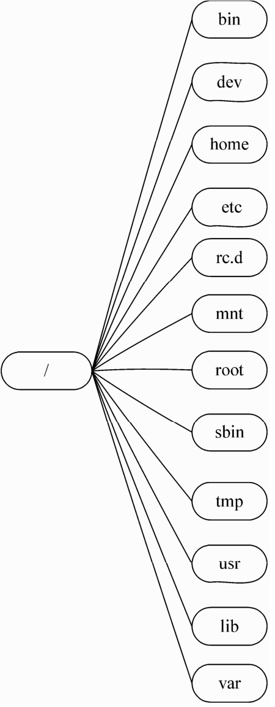

## Linux的系统架构

Linux 系统从应用角度来看，分为内核空间和用户空间两个部分。内核空间是 Linux 操作系统的主要部分，但是仅有内核的操作系统是不能完成用户任务的。

## Linux内核的主要模块

Linux 的内核主要由 5 个子系统组成：进程调度、内存管理、虚拟文件系统、网络接口、进程间通信。

### 进程调度 SCHED

进程调度指的是系统对进程的多种状态之间转换的策略。

Linux 下的进程调度有 3 种策略：SCHED OTHER、SCHED FIFO和SCHED RR。

- **SCHED OTHER** 是用于针对普通进程的时间片轮转调度策略。这种策略中，系统给所有的运行状态的进程分配时间片。在当前进程的时间片用完之后，系统从进程中优先级最高的进程中选择进程运行。
- **SCHED FIFO** 是针对运行的实时性要求比较高、运行时间短的进程调度策略。这种策略中，系统按照进入队列的先后进行进程的调度，在没有更高优先级进程到来或者当前进程没有因为等待资源而阻塞的情况下，会一直运行。
- **SCHED RR** 是针对实时性要求比较高、运行时间比较长的进程调度策略。这种策略与 SCHED OTHER 的策略类似，只不过 SCHED RR 进程的优先级要高得多。系统分配给 SCHED RR 进程时间片，然后轮循运行这些进程，将时间片用完的进程放入队列的末尾。

由于存在多种调度方式，Linux 进程调度采用的是“有条件可剥夺”的调度方式。普通进程中采用的是 SCHED OTHER 的时间片轮循方式，实时进程可以剥夺普通进程。如果普通进程在用户空间运行，则普通进程立即停止运行，将资源让给实时进程；如果普通进程运行在内核空间，需要等系统调用返回用户空间后方可剥夺资源。

### 内存管理 MMU

内存管理是多个进程间的内存共享策略。在Linux系统中，内存管理的主要概念是虚拟内存。

虚拟内存可以让进程拥有比实际物理内存更大的内存，可以是实际内存的很多倍。每个进程的虚拟内存有不同的地址空间，多个进程的虚拟内存不会冲突。

虚拟内存的分配策略是每个进程都可以公平地使用虚拟内存。虚拟内存的大小通常设置为物理内存的两倍。

### 虚拟文件系统 VFS

在 Linux 下支持多种文件系统，如 ext、ext2、minix、umsdos、msdos、vfat、ntfs、proc、smb、ncp、iso9660、sysv、hpfs、affs 等。

目前 Linux 下最常用的文件格式是 ext2 和 ext3。

ext2 文件系统用于固定文件系统和可活动文件系统，是 ext 文件系统的扩展。

ext3 文件系统是在 ext2 上增加日志功能后的扩展，它兼容 ext2。

两种文件系统之间可以互相转换，ext2 不用格式化就可以转换为 ext3 文件系统，而 ext3 文件系统转换为 ext2 文件系统也不会丢失数据。

## Linux 的文件结构

与 Windows 下的文件组织结构不同，Linux 不使用磁盘分区符号来访问文件系统，而是将整个文件系统表示成树状的结构，Linux 系统每增加一个文件系统都会将其加入到这个树中。

操作系统文件结构的开始，只有一个单独的顶级目录结构，叫做根目录。所有一切都从“根”开始，用“/”代表，并且延伸到子目录。DOS/Windows 下文件系统按照磁盘分区的概念分类，目录都存于分区上。Linux 则通过“挂接”的方式把所有分区都放置在“根”下各个目录里。一个 Linux 系统的文件结构如图 1.1 所示。

不同的 Linux 发行版本的目录结构和具体的实现功能存在一些细微的差别。但是主要的功能都是一致的。

一些常用目录的作用如下：

- /etc：包括绝大多数 Linux 系统引导所需要的配置文件，系统引导时读取配置文件，按照配置文件的选项进行不同情况的启动，例如 fstab、host.conf 等。
- /lib：包含 C 编译程序需要的函数库，是一组二进制文件，例如 glibc 等。
- /usr：包括所有其他内容，如 src、local。Linux 的内核就在 /usr/src 中。其下有子目录 /bin，存放所有安装语言的命令，如 gcc、perl 等。
- /var：包含系统定义表，以便在系统运行改变时可以只备份该目录，如 cache。
- /tmp：用于临时性的存储。
- /bin：大多数命令存放在这里。
- /home：主要存放用户账号，并且可以支持 tp 的用户管理。系统管理员增加用户时，系统在 home 目录下创建与用户同名的目录，此目录下一般默认有 Desktop 目录。
- /dev：这个目录下存放一种设备文件的特殊文件，如 fd0、had 等。
- /mnt：在Linux系统中，它是专门给外挂的文件系统使用的，里面有两个文件cdrom、floopy，登录光驱、软驱时要用到。
