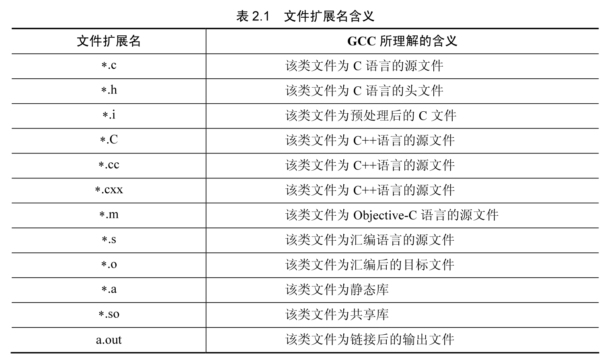

## Linux 环境下的编辑器

### vim 使用简介

1. vim 的安装

在介绍如何使用 vim 编译器之前需要先安装 vim 软件包，如果没有安装 vim，可以使用如下命令进行安装。

```shell
apt install -y vim
```

2. vim 编辑器的模式

vim 主要分为普通模式和插入模式。普通模式是命令模式，插入模式是编辑模式。在插入模式下可以进行字符的输入，输入的键值显示在编辑框中，这些文本可以用于编辑。普通界面是进行命令操作的，输入的值代表一个命令。例如在普通模式下按下 H 键，光标会向右移动一个字符的位置。
插入模式和普通模式的切换分别为按下 I 键和 Esc 键。在普通模式下按下 I 键，会转入插入模式；在插入模式下按下 Esc 键进入普通模式。在用户进入 vim 还没有进行其他操作时，操作模式是普通模式。

### 使用 vim 建立文件

```shell
vim hello.c
```

在编辑区输入如下文本：

```c
#include <stdio.h>

int main() {
  printf("Hello, World!\n");
  return 0;
}
```

按 ESC 后输入 wq 是“保存后退出”的意思：q 表示退出，w 表示保存。当不想保存所作的修改时，输入“：”键后，再输入"q!"，vi 会直接退出，不保存所作修改。q! 是强制退出的意思。

### 使用 vim 编辑文本

如何在vim下移动光标，进行删除字符、复制、查找、转跳等操作。

#### 移动光标 h、j、k、I

vim 在普通模式下移动光标需要按下特定的键，进行左、下、上、右光标移动操作的字符分别为 h、j、k、l  这 4 个字符，其含义如下：

```shell
h   左
j   下
k   上
l   右
```

按下 H 键，光标左移一个字符的位置；按下 L 键，光标右移一个字符的位置；按下 K 键；光标上移一行；按下 J 键，光标下移一行。

#### 删除字符 x、dd、u、Ctrl+R

要删除一个字符，使用 x，在普通模式下，将光标移到需要删除的字符上面然后按下 X 键。

要删除一整行，使用 dd 命令，删除一行后，它后面的一行内容会自动向上移动一行。使用这个命令的时候要注意输入 d 的个数，两个 d 才是一个命令，在实际使用过程中经常将 d 的输入个数弄混淆。

恢复删除，使用 u。当删除了不应该删除的东西后，u 命令可以取消之前的删除。例如，用 dd 命令删除一行，再按下 U 键，恢复被删除的该行字符。

Ctrl+R 是一个特殊的命令，它为取消一个命令，可以使用它对 u 命令造成的后果进行弥补。例如使用 u 命令撤销了之前的输入，重新输入字符是很麻烦的，而使用 Ctrl+R 可以十分方便地将之前使用 u 命令撤销输入的字符重新找回。

#### 复制粘贴 p、y

vim 下的粘贴命令是字符 p，它的作用是将内存中的字符复制到当前光标的后面。使用 p 时的前提是内存中有合适的字符串复制，例如要将一行复制到某个地方，可以用 dd 命令删除它，然后使用 u 命令恢复，这时候内存中是 dd 命令删除的字符串。将光标移动到需要插入的行之前，使用 p 命令可以把内存中的字符串复制后放置在选定的位置。

y 命令（即 yank）是复制命令，将指定的字符串复制到内存中，yw 命令（即 yank words）用于复制单词，可以指定复制的单词数量，y2w 复制两个单词。

命令 y 在进行字符串复制的时候包含末尾的空格。按行进行字符串的复制时，使用 dd 命令复制的方式比较麻烦，可以使用 yy 命令进行复制。

#### 查找字符串“/”

查找字符串的命令是“/xxx”，其中的 xxx 代表要查找的字符串。例如查找当前文件的 printf 字符串，可以输入以下命令进行查找：

```shell
":/printf"
```

按下 Enter 键后，如果找到匹配的字符串，光标就停在第一个合适的字符串光标上。查找其他的匹配字符串可以输入字符“n :”小写 n 会向下移到一个匹配的字符串上，大写 N 会向上移到一个匹配的字符串上。

#### 跳到某一行 g

在编写程序或者修改程序的过程中，经常需要转跳到某一行（这在编译程序出错，进行修改程序的时候是经常遇到的，因为 GCC 编译器的报错信息会提示某行出错）。命令":n"可以让光标转到某一行，其中 n 代表要转跳到的行数。例如要跳到第 5 行，可以输入":5"，然后按下 Enter 键，光标会跳到第 5 行的头部。还有一种实现方式即 nG，n 为要转跳的行数，5G 是转跳到第 5 行的命令，注意其中的 G 为大写。

### vim 的格式设置

vim 下可以进行很多方式的格式设置，这里仅对经常使用的格式进行介绍，例如设置缩进，设置 Tab 键对应空格的长度，设置行号等。

1. 设置缩进

合理的缩进会使程序更加清晰，vim 提供了多种方法来简化这项工作。要对 C 语言程序缩进，需要设定 cindent 选项；如果需要设置下一行的缩进长度可以设置 shiftwidth 选项。

例如如下命令实现 4 个空格的缩进。

:set cindent shiftwidth=4

设定了这一选项之后，当输入一行语句后，vim 会自动在下一行进行缩进。

自动缩进还能提前发现代码中的错误。例如当输入了一个“}”后，如果发现比预想中的缩进多，那可能缺少了一个“}”。用%命令可以查找与“}”相匹配的“{”。

2. 设置 Tab 键的空格数量

进行文本编辑的时候 Tab 键可以移动一块较大的距离，不同的文本编辑器对 Tab 键移动距离的解释是不同的。vim 编辑器 Tab 键的默认移动距离为 8 个空格，当需要对这个值进行更改的时候，需要设置 tabstop 选项的值。命令":set tabstop=n"可以设置 Tab 键对应空格的数量，例如“：set tabstop=2”将 Tab 键的宽度设置为 2 个空格。

3. 设置行号

在程序中设置行号使程序更加一目了然，设置行号的命令是“:set number”，按下 Enter 键后程序每行代码的头部会有一个行号的数值。

### vim 配置文件 .vimrc

vim 启动的时候会根据~ /.vimrc 文件配置 vi 的设置，可以修改文件.vimrc 来定制 vim。

配置项一般都有"打开"和"关闭"两个设置。"关闭"就是在"打开"前面加上前缀 "no"。

例如可以使用 shiftwidth 设置缩进宽度、使用 tabstop 设置 Tab 键的宽度、使用 number 设置行号等格式来定义 vim 的使用环境。例如按照如下的情况对.vimrc 文件进行修改：

```shell
set shiftwidth=2 # 设置缩进宽度为 2 个空格 
set tabstop=2 # 设置 Tab 键宽度为 2 个空格 
set number #显示行号
```

再次启动 vim，对缩进宽度、Tab 键的宽度都进行了设定，并且会自动显示行号。

### 终极配置

```shell
git clone --depth=1 https://github.com/amix/vimrc.git ~/.vim_runtime
sh ~/.vim_runtime/install_awesome_vimrc.sh
```

## Linux 下的 GCC 编译器工具集

要使编写的程序能够运行，需要进行程序的编译。

### 编译环境的搭建

```shell
which gcc
```

```shell
apt install -y gcc g++ cmake gdb
```

### GCC 简介

GCC 是 Linux 下的编译工具集，是 GNU Compiler Collection 的缩写，包含 gcc、g++ 等编译器。这个工具集不仅包含编译器，还包含其他工具集，例如 ar、nm 等。

GCC 工具集不仅能编译 C/C++ 语言，其他例如 Object-C、Pascal、Fortran、Java、Ada 等语言均能进行编译。GCC 在可以根据不同的硬件平台进行编译，即能进行交叉编译，在 A 平台上编译 B 平台的程序，支持常见的 X86、ARM、PowerPC、mips 等，及 Linux、Windows 等软件平台。

GCC 支持默认扩展名策略，表 2.1 是 GCC 下默认文件扩展名的含义。



```shell
cc/gcc 指 C 语言编译器
cpp 指预处理器编译器
g++ 指 C++ 编译器
```

进行程序编译的时候，头文件路径和库文件路径是编译器默认查找的地方：

```shell
/usr/local/include
/usr/lib/gcc/i486-Linux-gnu/4.1.2/include
/usr/include
/usr/lib/gcc/i486-Linux-gnu/4.1.2/......
/lib/i486-Linux-gnu/4.1.2/
/lib/
/usr/lib/
```

### 编译程序的基本知识

GCC 编译器对程序的编译分为 4 个阶段：**预编译、编译和优化、汇编和链接**。GCC 的编译器可以将这 4 个步骤合并成一个。

源文件、目标文件和可执行文件是编译过程中经常用到的名词。源文件通常指存放可编辑代码的文件，如存放 C、C++ 和汇编语言的文件。目标文件是指经过编译器的编译生成的 CPU 可识别的二进制代码，但是目标文件一般不能执行，因为其中的一些函数过程没有相关的指示和说明。可执行文件就是目标文件与相关的库链接后的文件，它是可以执行的。

预编译过程将程序中引用的头文件包含进源代码中，并对一些宏进行替换。

编译过程将用户可识别的语言翻译成一组处理器可识别的操作码，生成目标文件，通常翻译成汇编语言，而汇编语言通常和机器操作码之间是一种一对一的关系。GNU 中有 C/C++ 编译器 GCC 和汇编器 as。

所有的目标文件必须用某种方式组合起来才能运行，这就是链接的作用。目标文件中通常仅解析了文件内部的变量和函数，对于引用的函数和变量还没有解析，这需要将其他已经编写好的目标文件引用进来将没有解析的变量和函数进行解析，通常引用的目标是库。

链接完成后会生成可执行文件。

## 单个文件编译成执行文件

在 Linux 下使用 GCC 编译器编译单个文件十分简单，直接使用 gcc 命令后面加上要编译的 C 语言的源文件，GCC 会自动生成文件名为 a.out 的可执行文件。自动编译的过程包括头文件扩展、目标文件编译，以及链接默认的系统库生成可执行文件，最后生成系统默认的可执行程序 a.out。

```shell
gcc hello.c
```

```shell
./a.out
Hello, World!
```

```shell
gcc -o test hello.c
```

### 编译生成目标文件

目标文件是指经过编译器的编译生成的CPU可识别的二进制代码，因为其中的一些函数过程没有相关的指示和说明，目标文件不能执行。

在上一节中介绍了直接生成可执行文件的编译方法，在这种编译方法中，中间文件作为临时文件存在，在可执行文件生成后，会删除中间文件。在很多情况下需要生成中间的目标文件，用于不同的编译目标。

GCC 的 -c 选项用于生成目标文件，这一选项将源文件生成目标文件，而不是生成可执行文件。默认情况下生成的目标文件的文件名和源文件的名称一样，只是扩展名为 .o。例如，下面的命令会生成一个名字为 hello.o 的目标文件：

```shell
gcc -c hello.c
```

```shell
gcc -c -o test.o hello.c
```

可以用一条命令编译多个源文件，生成目标文件，这通常用于编写库文件或者一个项目中包含多个源文件。例如一个项目包含 filel.c、file2.c 和 file3.c，下面的命令可以将源文件生成 3 个目标文件 filel.o、file2.o 和 file3.o：

```shell
gcc -c file1.c file2.c file3.c
```

### 多文件编译

GCC 可以自动编译链接多个文件，不管是目标文件还是源文件，都可以使用同一个命令编译到一个可执行文件中。例如一个项目包含两个文件，文件 string.c 中有一个函数 StrLen 用于计算字符串的长度，而在 main.c 中调用这个函数，将计算的结果显示出来。

1. 源文件 string.c

文件 string.c 的内容如下。文件中主要包含了用于计算字符串长度的函数 StrLen()。StrLen() 函数的作用是计算字符串的长度，输入参数为字符串的指针，输出数值为计算字符串长度的计算结果。StrLen() 函数将字符串中的字符与\0’进行比较并进行字符长度计数，获得字符串的长度。

`string.c`

```c++
int StrLen(char *string) {
  int len = 0;
  while (*string++ != '\0')
    len++;
  return len;
}
```

2. 源文件 main.c

在文件 main.c 中是 main() 函数的代码。main() 函数调用 Strlen() 函数计算字符串 Hello Dymatic 的长度，并将字符串的长度打印出来。

`main.c`

```c++
#include <stdio.h>

extern int StrLen(char *string);

int main() {
  char src[] = ("Hello, World!");
  printf("StrLen(src) = %d\n", StrLen(src));
  return 0;
}
```

3. 编译运行

下面的命令将两个源文件中的程序编译成一个执行文件，文件名为 test。

```shell
gcc -o test string.c main.c
```

当然可以先将源文件编成目标文件，然后进行链接。例如，下面的过程先将 string.c 和 main.c 源文件编译成目标文件 string.o 和 main.o，然后将 string.o 和 main.o 链接生成 test：

```shell
gcc -c string.c main.c
gcc -o test string.o main.o
```

### 预处理

在 C 语言程序中，通常需要包含头文件并会定义一些宏。预处理过程将源文件中的头文件包含进源文件中，并且将文件中定义的宏进行扩展。

编译程序时选项 -E 告诉编译器进行预编译操作。例如如下命令将文件 string.c 的预处理结果显示在计算机屏幕上：

```shell
gcc -E string.c
```

```shell
# 1 "string.c"
# 1 "<built-in>"
# 1 "<command-line>"
# 31 "<command-line>"
# 1 "/usr/include/stdc-predef.h" 1 3 4
# 32 "<command-line>" 2
# 1 "string.c"

int StrLen(char *string) {
  int len = 0;
  while (*string++ != '\0')
    len++;
  return len;
}
```

如果定义了宏，那么会被展开替换。

## 编译成汇编语言

编译过程将用户可识别的语言翻译成一组处理器可识别的操作码，通常翻译成汇编语言。汇编语言通常和机器操作码之间是一种一对一的关系。

生成汇编语言的 GCC 选项是 -S，默认情况下生成的文件名和源文件一致，扩展名为.s。

例如，下面的命令将 C 语言源文件 string.c 编译成汇编语言，文件名为 string.s。

```shell
gcc -S string.c
```

### 生成和使用静态链接库

静态库是 obj 文件的一个集合，通常静态库以“.a”为后缀。静态库由程序 ar 生成，现在静态库已经不像之前那么普遍了，这主要是由于程序都在使用动态库。

静态库的优点是可以在不用重新编译程序库代码的情况下，进行程序的重新链接，这种方法节省了编译过程的时间（在编译大型程序的时候，需要花费很长的时间）。但是由于现在系统的强大，编译的时间已经不是问题。静态库的另一个优势是开发者可以提供库文件给使用的人员，不用开放源代码，这是库函数提供者经常采用的手段。当然这也是程序模块化开发的一种手段，使每个软件开发人员的精力集中在自己的部分。在理论上，静态库的执行速度比共享库和动态库要快（1%~5%）。

1. 生成静态链接库

生成静态库，或者将一个 obj 文件加到已经存在的静态库的命令为“ar 库文件 obj 文件 1obj 文件 2”。创建静态库的最基本步骤是生成目标文件，这点前面已经介绍过。然后使用工具 ar 对目标文件进行归档。工具 ar 的 -r 选项，可以创建库，并把目标文件插入到指定库中。例如将 string.o 打包为库文件 libstr.a 的命令为：

```shell
ar -rcs libstr.a string.o
```

2. 使用静态链接库

在编译程序的时候经常需要使用函数库，例如经常使用的 C 标准库等。GCC 链接时使用库函数和一般的 obj 文件的形式是一致的，例如对 main.c 进行链接的时候，需要使用之前已经编译好的静态链接库 libstr.a，命令格式如下：

```shell
gcc -o test main.c libstr.a
```

也可以使用命令“-l 库名”进行，库名是不包含函数库和扩展名的字符串。例如编译 main.c 链接静态库 libstr.a 的命令可以修改为：

```shell
gcc -o test main.c -lstr
```

上面的命令将在系统默认的路径下查找 str 函数库，并把它链接到要生成的目标程序上。可能系统会提示无法找到库文件 str，这是由于 str 库函数没有在系统默认的查找路径下，需要显示指定库函数的路径，例如库文件和当前编译文件在同一目录下：

```shell
gcc -o test main.c -L./ -lstr
```

在使用 -l 选项时，-o 选项的目的名称要在 -l 链接的库名称之前，否则 gcc 会认为 -l 是生成的目标而出错。

## 生成动态链接库

动态链接库是程序运行时加载的库，当动态链接库正确安装后，所有的程序都可以使用动态库来运行程序。动态链接库是目标文件的集合，目标文件在动态链接库中的组织方式是按照特殊方式形成的。库中函数和变量的地址是相对地址，不是绝对地址，其真实地址在调用动态库的程序加载时形成。

动态链接库的名称有别名（soname）、真名（realname）和链接名（linker name）。别名由一个前缀 lib，然后是库的名字，再加上一个后缀“.so”构成。真名是动态链接库的真实名称，一般总是在别名的基础上加上一个小版本号、发布版本等构成。除此之外，还有一个链接名，即程序链接时使用的库的名字。在动态链接库安装的时候，总是复制库文件到某个目录下，然后用一个软链接生成别名，在库文件进行更新的时候，仅仅更新软链接即可。

1. 生成动态链接库

生成动态链接库的命令很简单，使用 -fPIC 选项或者 -fpic 选项。-fPIC 和 -fpic 选项的作用是使得 gcc 生成的代码是位置无关的，例如下面的命令将 string.c 编译生成动态链接库：

```shell
gcc -shared -Wl,-soname,libstr.so -o libstr.so.1 string.c
```

其中选项 “-soname,libstr.so” 表示生成动态库时的别名是 libstr.so；“-o libstr.so.1”选项则表示是生成名字为 libstr.so.1 的实际动态链接库文件；-shared 告诉编译器生成一个动态链接库。

生成动态链接库之后一个很重要的问题就是安装，一般情况下将生成的动态链接库复制到系统默认的动态链接库的搜索路径下，通常有/lib、/usr/lib、/usr/local/lib，放到之上任何一个目录下都可以。

2. 动态链接库的配置

动态链接库并不是可以随意地使用，要在运行的程序中使用动态链接库，需要指定系统的动态链接库搜索的路径，让系统找到运行所需的动态链接库才可以。系统中的配置文件 /etc/ld.so.conf 是动态链接库的搜索路径配置文件。在这个文件内，存放着可被 Linux 共享的动态链接库所在目录的名字（系统目录/lib、/usr/lib 除外），多个目录名间以空白字符（空格、换行等）或冒号或逗号分隔。查看系统中的动态链接库配置文件的内容：

```shell
cat /etc/ld.so.conf
```

```
include /etc/ld.so.conf.d/*.conf
```

Debian的配置文件将目录 /etc/ld.so.conf.d 中的配置文件包含进来，对这个目录下的文件进行查看：

```shell
cat /etc/ld.so.conf.d/*.conf
```

```
# This file was automatically generated by WSL. To stop automatic generation of this file, add the following entry to /etc/wsl.conf:
# [automount]
# ldconfig = false
/usr/lib/wsl/lib# libc default configuration
/usr/local/lib
# Multiarch support
/usr/local/lib/x86_64-linux-gnu
/lib/x86_64-linux-gnu
/usr/lib/x86_64-linux-gnu
```

3. 动态链接库管理命令

为了让新增加的动态链接库能够被系统共享，需要运行动态链接库的管理命令 ldconfig。ldconfig 命令的作用是在系统的默认搜索路径，和动态链接库配置文件中所列出的目录里搜索动态链接库，创建动态链接装入程序需要的链接和缓存文件。搜索完毕后，将结果写入缓存文件 /etc/ld.so.cache 中，文件中保存的是已经排好序的动态链接库名字列表。ldconfig 命令行的用法如下，其中选项的含义参见表 2.4。

```
Usage: ldconfig.real [OPTION...]
Configure Dynamic Linker Run Time Bindings.

  -c, --format=FORMAT        Format to use: new (default), old, or compat  
  -C CACHE                   Use CACHE as cache file
  -f CONF                    Use CONF as configuration file
  -i, --ignore-aux-cache     Ignore auxiliary cache file
  -l                         Manually link individual libraries.
  -n                         Only process directories specified on the command
                             line.  Don't build cache.
  -N                         Don't build cache
  -p, --print-cache          Print cache
  -r ROOT                    Change to and use ROOT as root directory      
  -v, --verbose              Generate verbose messages
  -X                         Don't update symbolic links
  -?, --help                 Give this help list
      --usage                Give a short usage message
  -V, --version              Print program version

Mandatory or optional arguments to long options are also mandatory or optional
for any corresponding short options.

For bug reporting instructions, please see:
<https://bugs.launchpad.net/ubuntu/+source/glibc/+bugs>.
```

如果想知道系统中有哪些动态链接库，可以使用 ldconfig 的 -p 选项来列出缓存文件中的动态链接库列表。下面的命令中表明在系统缓存中共有 682 个动态链接库。

```shell
ldconfig -p
```

当用户的目录并不在系统动态链接库配置文件/etc/ld.so.conf中指定的时候，可以使用dconfig 命令显示指定要扫描的目录，将用户指定目录中的动态链接库放入系统中进行共享。命令格式的形式为：

```shell
ldconfig 目录
```

这个命令将 ldconfig 指定的目录名中的动态链接库放入系统的缓存 /etc/ld.so.cache 中，从而可以被系统共享使用。下面的代码将扫描当前用户的 lib 目录，将其中的动态链接库加入系统：

```shell
ldconfig ~/lib
```

如果在运行上述命令后，再次运行 ldconfig 而没有加参数，系统会将 /lib、/usr/lib 及 /etc/ld.so.conf 中指定目录中的动态库加入缓存，这时候上述代码中的动态链接库可能不被系统共享了。

4. 使用动态链接库

在编译程序时，使用动态链接库和静态链接库是一致的，使用“-l 库名”的方式，在生成可执行文件的时候会链接库文件。例如下面的命令将源文件 main.c 编译成可执行文件 test，并链接库文件 libstr.a 或者 libstr.so：

```shell
ldconfig ./
gcc -o test main.c -L./ -lstr
```

-L 指定链接动态链接库的路径，-lstr 链接库函数 str。但是运行 test 一般会出现如下的问题：

```shell
./test: error while loading shared libraries: libstr.so: cannot open shared object file: No such file or directory
```

这是由于程序运行时没有找到动态链接库造成的。程序编译时链接动态链接库和运行时使用动态链接库的概念是不同的，在运行时，程序链接的动态链接库需要在系统目录下才行。有几种办法可以解决此种问题：

- 将动态链接库的目录放到程序搜索路径中，可以将库的路径加到环境变量 LD_LIBRARY_PATH 中实现，例如：

```shell
export LD_LIBRARY_PATH=.:$LD_LIBRARY_PATH
```

如果系统的搜索路径下同时存在静态链接库和动态链接库，默认情况下会链接动态链接库。如果需要强制链接静态链接库，需要加上“-static”选项，`-ldl` 是另外一个必备的库，即上述的编译方法改为如下的方式：

```shell
gcc -o testdl main.c -static -ldl
```

### 动态加载库

> Linux

动态加载库和一般的动态链接库所不同的是，一般动态链接库在程序启动的时候就要寻找动态库，找到库函数；而动态加载库可以用程序的方法来控制什么时候加载。动态加载库主要有函数 dlopen()、dlerror()、dlsym() 和 dlclose() 来控制动态库的使用。

1. 打开动态库 dlopen()

函数 dlopen() 按照用户指定的方式打开动态链接库，其中参数 filename 为动态链接库的文件名，flag 为打开方式，一般为 RTLDLASY，函数的返回值为库的指针。其函数原型如下：

```cpp
void *dlopen(const char *filename,  int flag);
```

例如，下面的代码使用 dlopen 打开当前目录下的动态库 libstr.so。

```cpp
void *phandle = dlopen("./libstr.so", RTLD_LAZY);
```

2. 获得函数指针 dlsym()

使用动态链接库的目的是调用其中的函数，完成特定的功能。函数 dlsym() 可以获得动态链接库中指定函数的指针，然后可以使用这个函数指针进行操作。函数 dlsym() 的原型如下，其中参数 handle 为 dlopen() 打开动态库后返回的句柄，参数 symbol 为函数的名称，返回值为函数指针。

```cpp
void *dlsym(void *handle, char *symbol);
```

3. 使用动态加载库的一个例子

下面是一个动态加载库使用的例子。首先使用函数 dlopen() 来打开动态链接库，判断是否正常打开，可以使用函数 dlerror() 判断错误。如果上面的过程正常，使用函数 dlsym() 来获得动态链接库中的某个函数，可以使用这个函数来完成某些功能。其代码如下：

```cpp
//动态加载库示例
#include <dlfcn.h>//动态加载库库头
#include <stddef.h>
#include <stdio.h>

int main(void) {
  char src[] = "Hello, World!";//要计算的字符串
  int (*pStrLenFun)(char *str);//函数指针
  void *phandle = NULL;
  char *perr = NULL;//错误信息指针

  phandle = dlopen("./libstr.so", RTLD_LAZY);//打开1ibstr.so动态链接库
  //判断是否正确打开
  if (!phandle)                      //打开错误
    printf("Failed Load library!\n");//打印库不能加载信息
  perr = dlerror();
  if (perr != NULL) {
    printf("%s\n", perr);//打印错误函数获得的错误信息
    return 0;            //返回
  }

  //正常返回
  pStrLenFun = dlsym(phandle, "StrLen");//获得函数StrLen的地址
  perr = dlerror();
  if (perr != NULL) {
    printf("%s\n", perr);//打印错误函数获得的错误信息
    return 0;            //返回
  }

  //调用函数pStrLenFunc计算字符串的长度
  printf("the string length is: %d\n", pStrLenFun(src));

  dlclose(phandle);//关闭动态加载库
  return 0;
}
```

编译上述文件的时候需要链接动态库 libdl.so，使用如下的命令将上述代码编译成可执行文件 testdl。命令将 main.c 编译成可执行文件 testdl，并链接动态链接库 libdl.so。

```shell
gcc -o testdl main.c -ldl
```

使用动态加载库和动态链接库的结果是一致的。

### GCC 常用选项

除了之前介绍的基本功能外，GCC 的选项配置是编译时很重要的选择，例如头文件路径、加载库路径、警告信息及条是等。下面对常用的选项进行介绍：

1. -DMACRO 选项

定义一个宏，在多种预定义的程序中会经常使用。如下代码根据系统是否定义 Linux 宏来执行不同的代码。使用 -D 选项可以选择不同的代码段，例如 -DOS_LINUX 选项将执行代码段①。

```cpp
#ifdef OS_LINUX
#else
#endif
```

- -Idir：将头文件的搜索路径扩大，包含 dir 目录。
- -Ldir：将链接时使用的链接库搜索路径扩大，包含 dir 目录。gcc 都会优先使用共享程序库。
- -static：仅选用静态程序库进行链接，如果一个目录中静态库和动态库都存在，则仅选用静态库。
- -g：包括调试信息。
- -On：优化程序，程序优化后执行速度会更快，程序的占用空间会更小。通常 gcc 会进行很小的优化，优化的级别可以选择，即 n。最常用的优化级别是 2。
- -wall：打开所有 gcc 能够提供的、常用的警告信息。

2. GCC 的常用选项及含义

```shell
gcc --help
```

## Makefile 文件简介

使用 GCC 的命令行进行程序编译在单个文件下是比较方便的，当工程中的文件逐渐增多，甚至变得十分庞大的时候，使用 GCC 命令编译就会渐渐变得力不从心。Linux 中的 make 工具提供了一种管理工程的功能，可以方便地进行程序的编译，对更新的文件进行重新编译。

### 一个多文件的工程例子

有一个工程中的文件列表如图 2.2 所示。工程中共有 5 个文件，在 add 目录中有 add_int.c 和 add_float.c，两个文件分别计算整型和浮点型的相加；在 sub 目录下有文件 sub_int.c 和 sub_float.c，分别计算整型和浮点型的相减；顶层目录由 main.c 文件负责整个程序。

工程中的代码分别存放在 add/add int.c、add/add_float.c、add/add.h、sub/sub_int.c、sub/sub_float.c、sub/sub.h 和 main.c 中。


```cpp
/*main.C*/
#include <stdio.h>
/*需要包含的头文件*/
#include "add/add.h"
#include "sub/sub.h"

int main(void) {
  /*声明计算所用的变量*a、b为整型,x、y为浮点型*/
  int a = 10, b = 12;
  float x = 1.23456, y = 9.87654321;

  /*调用函数并将计算结果打印出来*/
  printf("int a+b = %d\n", add_int(a, b));     /*计算整型加*/
  printf("int a-b = %d\n", sub_int(a, b));     /*计算整型减*/
  printf("float x+y = %f\n", add_float(x, y)); /*计算浮点型加*/
  printf("float x-y = %f\n", sub_float(x, y)); /*计算浮点型减*/

  return 0;
}
```

```cpp
/*sub.h*/
#ifndef __SUB_H__
#define __SUB_H__
/*整型减和浮点型减的声明*/
extern float sub_float(float a, float b);
extern int sub_int(int a, int b);
#endif /*__SUB_H__*/
```

```cpp
/*sub float.c*/
/*浮点数相减函数*/
float sub_float(float a, float b) { return a - b; }
```

```cpp
/*sub int.c*/
/*整数相减函数*/
int sub_int(int a, int b) { return a - b; }
```

```cpp
/*add.h*/
#ifndef __ADD_H__
#define __ADD_H__
/*整型加和浮点型加的声明*/
extern int add_int(int a,int b);
extern float add_float(float a,float b);
#endif/*__ADD_H__*/
```

```cpp
/*add float.c*/
/*浮点数求和函数*/
float add_float(float a,float b) {return a+b;}
```

```cpp
/*add int.c*/
/*整数求和函数*/
int add_int(int a,int b) {return a+b;}

```

### 多文件工程的编译

多文件工程编译成可执行文件有两种方法，一种是命令行操作，手动输入将源文件编译为可执行文件；另一种是编写 Makefile 文件，通过 make 命令将多个文件编译为可执行文件。

#### 命令行编译程序

要将此文件编译为可执行文件 cacu，如果用 gcc 进行手动编译，是比较麻烦的。例如，下面的编译方式每行编译一个 C 文件，生成目标文件，最后将 5 个目标文件编译成可执行文件。

```shell
gcc -c add/add_int.c  -o add/add_int.o
gcc -c add/add_float.c  -o add/add_float.o
gcc -c sub/sub_int.c  -o sub/sub_int.o
gcc -c sub/sub_float.c  -o sub/sub_float.o
gcc -c main.c -o main.o
gcc -o cacu add/add_int.o add/add_float.o sub/sub_int.o sub/sub_float.o main.o
```

或者使用 gcc 的默认规则使用一条命令直接生成可执行文件 cacu：

```cpp
gcc -o cacu add/add_int.c add/add_float.c sub/sub_int.c sub/sub_float.c main.c
```

#### 多文件的 Makefile

利用上面一条命令直接产生可执行文件的方法，生成执行文件是比较容易的。但是当频繁修改源文件或者当项目中的文件比较多，关系比较复杂时，用 gcc 直接进行编译就会变得十分困难。

使用 make 进行项目管理，需要一个 Makefile 文件，make 在进行编译的时候，从 Makefile 文件中读取设置情况，进行解析后运行相关的规则。make 程序查找当前目录下的文件 Makefile 或者 makefile，按照其规则运行。例如建立一个如下规则的 Makefile 文件。

```Makefile
cacu: add_int.o add_float.o sub_int.o sub_float.o main.o
	gcc -o cacu add/add_int.o  add/add_float.o sub/sub_int.o sub/sub_float.o main.o

add_int.o: add/add_int.c add/add.h
	gcc -c -o add/add_int.o add/add_int.c

add_float.o: add/add_float.c add/add.h
	gcc -c -o add/add_float.o add/add_float.c

sub_int.o: sub/sub_int.c sub/sub.h
	gcc -c -o sub/sub_int.o sub/sub_int.c

sub_float.o: sub/sub_float.c sub/sub.h
	gcc -c -o sub/sub_float.o sub/sub_float.c

main.o: main.c add/add.h sub/sub.h
	gcc -c -o main.o main.c -Iadd -Isub

clean:
	rm -f cacu add/add_int.o  add/add_float.o sub/sub_int.o sub/sub_float.o main.o
```

在上面 Makefile 文件编写完毕后，运行 make 命令。

默认情况下会执行 Makefile 中的第一个规则。

### Makefile的规则

Makefile 的框架是由规则构成的。make 命令执行时先在 Makefile 文件中查找各种规则，对各种规则进行解析后，运行规则。规则的基本格式为：

```cpp
TARGET: DEPENDEDS
  COMMAND
  COMMAND
  COMMAND
```

- TARGET：规则所定义的目标。通常规则是最后生成的可执行文件的文件名或者为了生成可执行文件而依赖的目标文件的文件名，也可以是一个动作，称之为“伪目标”。
- DEPENDEDS：执行此规则所必须的依赖条件，例如生成可执行文件的目标文件。DEPENDEDS 也可以是某个 TARGET，这样就形成了 TARGET 之间的嵌套。
- COMMAND：规则所执行的命令，即规则的动作，例如编译文件、生成库文件、进入目录等。动作可以是多个，每个命令占一行。

1. 规则的书写

在书写规则的时候，为了使 Makefile 更加清晰，要用反斜杠 / 将较长的行分解为多行。

命令行必须以 Tab 键开始，make 程序把出现在一条规则之后的所有连续的以 Tab 键开始的行都作为命令行处理。

规则书写时要注意 COMMAND 的位置，COMMAND 前面的空白是一个 Tab 键，不是空格。Tab 告诉 make 这是一个命令行，make 执行相应的动作。

2. 目标

Makefile 的目标可以是具体的文件，也可以是某个动作。例如目标 cacu 就是生成 cacu 的规则，有很多的依赖项，及相关的命令动作。而 clean 是清除当前生成文件的一个动作，不会生成任何目标项。

3. 依赖项

依赖项是目标生成所必须满足的条件，例如生成 cacu 需要依赖 main.o，main.o 必须存在才能执行生成 cacu 的命令，即依赖项的动作在 TARGET 的命令之前执行。依赖项之间的顺序按照自左向右的顺序检查或者执行。依赖性是文件，则必须都存在才能执行。

4. 规则的嵌套

规则之间是可以嵌套的，这通常通过依赖项实现。

5. 文件的时间戳

make 命令执行的时候会根据文件的时间戳判定是否执行相关的命令，并且执行依赖于此项的规则。例如对 main.c 文件进行修改后保存，文件的生成日期就发生了改变，再次调用 make 命令编译的时候，就会只编译 main.c，并且执行规则 cacu，重新链接程序。

6. 执行的规则

在调用 make 命令编译的时候，make 程序会查找 Makefile 文件中的第 1 个规则，分析并执行相关的动作。

7. 模式匹配

在上面的 Makefile 中，main.o 规则的书写方式如下：

```Makefile
main.o: main.c add/add.h sub/sub.h
	gcc -c -o main.o main.c -Iadd -Isub
```

```Makefile
main.o: %o:%c
  gcc -c $< -o %@
```

这种方法的规则 main.o 中依赖项中的 `%o:%c` 的作用是将 TARGET 域的 .o 的扩展名替换为.c，即将 main.o 替换为 main.c。而命令行的 `$<` 表示依赖项的结果，即 main.c ； `$@`
表示 TARGET 域的名称，即 main.o。

### Makefile 中使用变量

生成 cacu 的时候，多次使用同一组.o 目标文件：在 cacu 规则的依赖项中出现一次，在生成 cacu 执行文件的时候又出现一次。直接使用文件名进行书写的方法不仅书写起来麻烦，而且进行增加或者删除文件容易遗忘。例如增加一个 mul.c 文件，需要修改依赖项和命令行两个部分。

#### Makefile 中的用户自定义变量

使用 Makefile 进行规则定义的时候，用户可以定义自己的变量，称为用户自定义变量。例如，可以用变量来表示上述的文件名，定义 OBJS 变量表示目标文件：

```Makefile
OBJS =  add_int.o add_float.o sub_int.o sub_float.o main.o
```

调用 OBJS 的时候前面加上 $，并且将变量的名称用括号括起来。例如，使用 gcc 的默认规则进行编译，cacu 规则可以采用如下的形式：

```Makefile
cacu:
  gcc -o cacu $(OBJS)
```

用 CC 变量表示 gcc，用 CFLAGS 表示编译的选项，RM 表示 rm-f，TARGET 表示最终的生成目标 cacu。

之前冗长的 Makefile 可以简化成如下方式：

```Makefile
CC = gcc	# CC 定义成 gcc
CFLAGS = -Isub -Iadd -O2	# 加入头文件搜索路径 sub 和 add
TARGET = cacu	# 最终生成目标
RM = rm -f	# 删除的命令

OBJS =  add/add_int.o add/add_float.o sub/sub_int.o sub/sub_float.o main.o

$(TARGET): $(OBJS)
	$(CC) -o $(TARGET) $(OBJS) $(CFLAGS)

$(OBJS): %.o:%.c
	$(CC) -c $(CFLAGS) $< -o $@

clean:
	$(RM) $(TARGET) $(OBJS)
```

#### Makefile 中的预定义变量

在 Makefile 中有一些已经定义的变量，用户可以直接使用这些变量，不用进行定义。

在进行编译的时候，某些条件下 Makefile 会使用这些预定义变量的值进行编译。经常采用的预定义变量有表 2.6 中所定义的几个。


再次简化：

```Makefile
TARGET = cacu	# 最终生成目标
CFLAGS = -Isub -Iadd -O2	# 加入头文件搜索路径 sub 和 add
OBJS =  add/add_int.o add/add_float.o sub/sub_int.o sub/sub_float.o main.o

$(TARGET): $(OBJS)
	$(CC) -o $(TARGET) $(OBJS) $(CFLAGS)

clean:
	$(RM) $(TARGET) $(OBJS)
```

#### Makefile 中的自动变量

Makefile 中的变量除了用户自定义变量和预定义变量外，还有一类自动变量。Makefile 中的编译语句中经常会出现目标文件和依赖文件，自动变量代表这些目标文件和依赖文件。

表 2.7 中是一些常见的自动变量。


再次简化：

```Makefile
TARGET = cacu	# 最终生成目标
CFLAGS = -Isub -Iadd -O2	# 加入头文件搜索路径 sub 和 add
OBJS =  add/add_int.o add/add_float.o sub/sub_int.o sub/sub_float.o main.o

$(TARGET): $(OBJS)
	$(CC) -o $@ $^ $(CFLAGS)

clean:
	$(RM) $(TARGET) $(OBJS)
```

### 搜索路径

在大的系统中，通常存在很多目录，手动添加目录的方法不仅十分笨拙而且容易造成错误。Make 的目录搜索功能提供了一个解决此问题的方法，指定需要搜索的目录，make 会自动找到指定文件的目录并添加到到文件上，VPATH 变量可以实现此目的。VPATH 变量的使用方法如下：

```Makefile
VPATH=path1:path2
```

VPATH 右边是冒号(:)分隔的路径名称，例如下面的指令：

```Makefile
VPATH=add:sub
```

Make 的搜索路径包含 add 和 sub 目录。add_int.o 规则自动扩展成如下代码：

```Makefile
add_int.o: add/add_int.c
  cc -c -o add_int.o add/add_int.c
```

将路径名去掉以后可以重新编译程序，但是会发现目标文件都放到了当前的目录下，这样会对文件的规范化造成危害。可以将输出的目标文件放到同一个目录下来解决此问题，重新书写上面的 Makefile 为如下的代码。

```Makefile
CFLAGS = -Isub -Iadd -O2
OBJSDIR = .objs
VPATH = add:sub:.
OBJS =  add_int.o add_float.o sub_int.o sub_float.o main.o
TARGET = cacu

$(TARGET): $(OBJSDIR) $(OBJS)
	$(CC) -o $(TARGET) $(OBJSDIR)/*.o $(CFLAGS)

$(OBJS): %.o:%.c
	$(CC) -c $(CFLAGS) $< -o $(OBJSDIR)/$@

$(OBJSDIR):
	mkdir -p ./$@

clean:
	-$(RM) $(TARGET)
	-$(RM) $(OBJSDIR)/*.o
```

测试失败！无法编译。

### 自动推导规则

使用命令 make 编译扩展名为.c 的 C 语言文件的时候，源文件的编译规则不用明确地给出。这是因为 make 进行编译的时候会使用一个默认的编译规则，按照默认规则完成对.c 文件的编译，生成对应的.o 文件。它执行命令 cc-c 来编译.c 源文件。在 Makefile 中只需要给出需要重建的目标文件名（一个.o 文件），make 会自动为这个.o 文件寻找合适的依赖文件（对应的.c 文件），并且使用默认的命令来构建这个目标文件。

对于上边的例子，默认规则是使用命令 cc-cmain.c-o main.o 来创建文件 main.o。对一个目标文件是“文件名.o”，倚赖文件是“文件名.c”的规则，可以省略其编译规则的命令行，由 make 命令决定如何使用编译命令和选项。此默认规则称为 make 的隐含规则。

这样，在书写 Makefile 时，就可以省略掉描述.c 文件和.o 依赖关系的规则，而只需要给出那些特定的规则描述（.o 目标所需要的.h 文件）。因此上面的例子可以使用更加简单的方式书写，Makefile 文件的内容如下：

```Makefile
CFLAGS = -Isub -Iadd -O2
OBJSDIR = .objs
VPATH = add:sub
OBJS =  add_int.o add_float.o sub_int.o sub_float.o main.o
TARGET = cacu

$(TARGET): $(OBJS)
	$(CC) -o $(TARGET) $(OBJS) $(CFLAGS)

clean:
	-$(RM) $(TARGET)
	-$(RM) $(OBJSDIR)/*.o
```

在此 Makefile 中，不用指定 OBJS 的规则，make 自动会按照隐含规则形成一个规则来生成目标文件。

测试失败！无法编译。

### 递归 make

当有多人在多个目录下进行程序开发，并且每个人负责一个模块，而文件在相对独立的目录中，这时由同一个 Makefile 维护代码的编译就会十分蹩脚，因为他们对自己的目录下的文件增减都要修改此 Makefile，这通常会造成项目的维护问题。

1. 递归调用的方式

Make 命令有一个递归调用的作用，它可以递归调用每个子目录中的 Makefile。例如，在当前目录下有一个 Makefile，而目录 add 和 sub 及主控文件 main.c 是由不同的人进行维护，可以用如下方式编译 add 中的文件：

```Makefile
add:
    cd add && $(MAKE)
```

它等价于：

```Makefile
add:
    $(MAKE) -C add
```

上面两个例子的意思都是先进入子目录下 add 中，然后执行 make 命令。

2. 总控 Makefile

调用“$(MAKE) -C”的 Makefile 叫做总控 Makefile。如果总控 Makeifle 中的一些变量需要传递给下层的 Makefile，可以使用 export 命令，例如需要向下层的 Makefile 传递目标文件的导出路径：

```shell
export OBJSDIR=./objs
```

例如上面的文件布局，需要在 add 和 sub 目录下分别编译，总控 Makefile 代码如下：

```Makefile
CC = gcc
CFLAGS = -O2
TARGET = cacu

export OBJSDIR = ${shell pwd}/.objs

$(TARGET): $(OBJSDIR) main.o
	$(MAKE) -C add
	$(MAKE) -C sub
	$(CC) -o $(TARGET) $(OBJSDIR)/*.o

main.o: %.o:%.c
	$(CC) -c $< -o $(OBJSDIR)/$@ $(CFLAGS) -Iadd -Isub

$(OBJSDIR):
	mkdir -p $(OBJSDIR)

clean:
	-$(RM) $(TARGET)
	-$(RM) $(OBJSDIR)/*.o
```

CC 编译器变量由总控 Makefile 统一指定，下层的 Makefile 直接调用即可。生成的目标文件都放到.objs 目录中，export 了一个变量 OBJSDIR。其中的 ${shell pwd} 是执行一个 shell 命令 pwd 获得总控 Makefile 的当前目录。

生成 cacu 的规则是先建立目标文件的存放目录，再编译当前目录下的 main.c 为 main.o 目标文件。在命令中，递归调用 add 和 sub 目录下的 Makefile 生成目标文件放到目标文件存放路径中，最后的命令将目标文件全部编译生成执行文件 cacu。

3. 子目录 Makefile 的编写

Add 目录下的 Makefile 如下：

```Makefile
OBJS = add_int.o add_float.o

all: $(OBJS)

$(OBJS): %.o:%.c
	$(CC) -c $< -o $(OBJSDIR)/$@ $(CFLAGS)

clean:
	-$(RM) $(OBJS)
```

这个 Makefile 很简单，编译 add 目录中的两个 C 文件，并将生成的目标文件按照总控 Makefile 传入的目标文件存放路径放置。

sub 目录下的 Makefile 与 add 目录下的一致，也是将生成的目标文件放到总控 Makefile 指定的路径中。

```Makefile
OBJS = sub_int.o sub_float.o

all: $(OBJS)

$(OBJS): %.o:%.c
	$(CC) -c $< -o $(OBJSDIR)/$@ $(CFLAGS)

clean:
	-$(RM) $(OBJS)
```

将之前的编译文件清空，然后编译。

### Makefile 中的函数

1. 获取匹配模式的文件名wildcard

这个函数的功能是查找当前目录下所有符合模式 PATTERN 的文件名，其返回值是以空格分割的、当前目录下的所有符合模式 PATTERN 的文件名列表。其原型如下：

```shell
$(wildcard PATTERN)
```

例如，如下模式返回当前目录下所有扩展名为.c的文件列表。

```shell
$(wildcard *.c)
```

2. 模式替换函数 patsubst

这个函数的功能是查找字符串 text 中按照空格分开的单词，将符合模式 pattern 的字符串替换成 replacement。Pattern 中的模式可以使用通配符，%代表 0 个到 n 个字符，当 pattern 和 replacement 中都有%时，符合条件的字符将被 replacement 中的替换。函数的返回值是替换后的新字符串。其原型如下：

```shell
$(patsubst pattern,replacement,text)
```

返回值：例如，需要将 C 文件替换为 .o 的目标文件可以使用如下模式：

```shell
$(patsubst%.c,%.o,add.c)
```

上面的模式将 add.c 字符串作为输入，当扩展名为.c 时符合模式%.c，其中%在这里代表 add，替换为 add.o，并作为输出字符串。

```shell
$(patsubst%.c,%.o,$(wildcard*.c))
```

输出的字符串将当前扩展名为.c 的文件替换成.o 的文件列表。

3. 循环函数 foreach

这个函数的函数原型为：

```shell
$(foreach VAR,LIST,TEXT)
```

函数的功能为 foreach 将 LIST 字符串中一个空格分隔的单词，先传给临时变量 VAR，然后执行 TEXT 表达式，TEXT 表达式处理结束后输出。其返回值是空格分割表达式 TEXT 的计算结果。

例如，对于存在 add 和 sub 的两个目录，设置 DIRS 为 “add sub./” 包含目录 add、sub 和当前目录。表达式 $(wildcardS(dir)/ *.c)，可以取出目录 add 和 sub 及当前目录中的所有扩展名为 .c 的 C 语言源文件：

```Makefile
DIRS=sub add ./
FILES=$(foreach dir,$(DIRS),$(wildcard $(dir)/*.c))
```

利用上面几个函数对原有的 Makefile 文件进行重新编写，使新的 Makefile 可以自动更新各个目录下的 C 语言源文件：

```Makefile
CC=gcc 
CFLAGS=-O2 -Iadd -Isub
TARGET=cacu 
DIRS=sub add .
FILES=$(foreach dir,$(DIRS),$(wildcard $(dir)/*.c))
0BJS=$(patsubst s.c,s.o,$(FILES))

$(TARGET):$(OBJS)
    $(CC)-o$(TARGET)$(OBJS)

clean:
    -$(RM)$(TARGET)
    -$(RM)$(OBJS)
```

Windows 下的 nmake 是和 make 类似的工程管理工具。所有平台的 Makefile 都是相似的，大概有 80 %的相似度，不同的主要是函数部分和外部命令，而最核心的规则部分则是一致的，都是基于目标、依赖项和命令的方式进行解析。

## 用 GDB 调试程序

GDB 提供了以下功能：

- 在程序中设置断点，当程序运行到断点处暂停。
- 显示变量的值，可以打印或者监视某个变量，将变量的值显示出来。
- 单步执行，GDB 允许用户单步执行程序，可以跟踪进入函数和从函数中退出。
- 运行时修改变量的值，GDB 允许在调试状态下修改变量的值，此功能在测试程序的时候是十分有用的。
- 路径跟踪，GDB 可以将代码的路径打印出来，方便用户跟踪代码。
- 线程切换，在调试多线程的时候，此种功能是必须的。

### 编译可调试程序

GDB 是一套字符界面的程序集，可以使用命令 gdb 加载要调试的程序。

```shell
GNU gdb (Ubuntu 9.2-0ubuntu1~20.04.1) 9.2
Copyright (C) 2020 Free Software Foundation, Inc.
License GPLv3+: GNU GPL version 3 or later <http://gnu.org/licenses/gpl.html>
This is free software: you are free to change and redistribute it.
There is NO WARRANTY, to the extent permitted by law.
Type "show copying" and "show warranty" for details.
This GDB was configured as "x86_64-linux-gnu".
Type "show configuration" for configuration details.
For bug reporting instructions, please see:
<http://www.gnu.org/software/gdb/bugs/>.
Find the GDB manual and other documentation resources online at:
    <http://www.gnu.org/software/gdb/documentation/>.

For help, type "help".
Type "apropos word" to search for commands related to "word".
(gdb)  
```

在此状态下输入 q，退出 GDB。

要使用 GDB 进行调试，在编译程序的时候需要加入 -g 选项。例如编译如下代码：

```cpp
/*文件名:ex02-gdb-01.c*/
#include <stdio.h> /*用于printf*/
#include <stdlib.h>/*用于malloc*/

/*声明函数sum()为static int类型*/
static int sum(int value);

/*用于控制输入输出的结构*/
struct inout {
  int value;
  int result;
};

int main(int argc,char*argv[]){
  struct inout *io = (struct inout *)malloc(sizeof(struct inout));

  /*申请内存*/
  if (NULL == io) /*判断是否成功*/
  {
    printf("申请内存失败\n"); /*打印失败信息*/
    return -1;                /*返回-1*/
  }

  if (argc != 2) /*判断输入参数是否正确*/
  {
    printf("参数输入错误!\n"); /*打印失败信息*/
    return -1;                 /*返回-1*/
  }

  io->value = *argv[1] - 10;   /*获得输入的参数*/
  io->result = sum(io->value); /*对value进行累加求和*/
  printf("你输入的值为:d,计算结果为:%d\n", io->value, io->result);
  return 0;
}

/*累加求和函数*/
static int sum(int value) {
  int result = 0;

  for (int i = 0; i < value; i++) /*循环计算累加值*/
    result += i;

  return result; /*返回结果*/
}
```

上面的代码实现了一个累加求和，例如对 sum 输入 3，其结果应该是 6 = 1+2+3。编译代码如下：

```shell
gcc -o test ex02-gdb-01.c -g
```

GDB 之所以能够调试程序在于进行编译时的 -g 选项，当设置了这个选项的时候，GCC 会向程序中加入“楔子”，GDB 能够利用这些楔子与程序交互。

### 使用GDB调试程序

利用 GDB 调试 test，查找 test 计算错误的原因。

1. 加载程序

使用 GDB 加载程序的时候，需要先将程序加载到 GDB 中。加载程序的命令格式为“gdb 要调试的文件名”。例如，下面的命令将可执行文件 test 加载到 GDB 中。

```shell
gdb test
```

2. 设置输入参数

通常可执行文件在运行的时候需要输入参数，GDB 中向可执行文件输入参数的命令格式为“set args 参数值 1 参数值 2.. …”。例如，下面的命令 `set args 3` 表示向可执行文件输入的参数设为 3，即传给 test 程序的值为 3。

```shell
set args 3
```

3. 打印代码内容

命令 list 用于列出可执行文件对应源文件的代码，命令格式为“list 开始的行号”。例如，下面的命令 list1，从第一行开始列出代码，每次按下 Enter 键后顺序向下列出代码。

4. 设置断点

b 命令在某一行设置断点，程序运行到断点的位置回中断，等待用户的下一步操作指令。

```shell
b 41
```

5. 运行程序

GDB 默认情况下是不会让可执行文件运行的，此时，程序并没有真正运行起来，只是装载进了 GDB 中。要使程序运行需要输入 run 命令。

```shell
run 3
```

6. 显示变量

在程序运行到第 4 步所设置的 41 行断点的时候，程序会中断运行等待进一步的指令。这时可以进行一系列的操作，其中，命令 display 可以显示变量的值。

```shell
display i
```

继续运行：

```shell
c
```

通过上面的跟踪，已经可以判断出问题出在 `for(i=0;i<value;i++)` 此行代码上，可以将其修改为 `for(i=1;i<=value;i++)` 或者修改 result+=i 为 result+=(i+1)。

7. 修改变量的值

要在 GDB 中修改变量的值，使用 set 命令。

```shell
set result = 6
```

8. 退出 GDB 在

调试完程序后，使用 q 命令退出 GDB。

```shell

```

### GDB 常用命令

包含信息获取、断点设置、运行控制、程序加载等常用命令，这些函数可以进行调试时的程序控制、程序的参数设置等。

| GDB 的命令 | 格式                    | 含义               | 简写 |
| ---------- | ----------------------- | ------------------ | ---- |
| list       | List[ 开始, 结束 ]      | 列出文件的代码清单 | l    |
| print      | Printf p                | 打印变量内容       | p    |
| break      | Break[ 行号\|函数名称 ] | 设置断点           | b    |
| continue   | Continue[ 开始, 结束 ]  | 继续运行           | c    |
| next       | Next                    | 下一行             | n    |
| step       | Step                    | 进入函数           | s    |
| display    | Display param           | 显示参数           |      |
| file       | File path               | 加载文件           |      |
| run        | Run args                | 运行程序           | r    |

1. 执行程序

用 GDB 执行程序可以使用 gdb program 的方式，program 是程序的程序名。当然，此程序编译的时候要使用 -g 选项。假如在启动 GDB 的时候没有选择程序名称，可以在 GDB 启动后使用 file program 的方法启动。例如：

```shell
file test
```

如果要运行准备好的程序，可以使用 run 命令，在它后面是传递给程序的参数，例如：

```shell
run 3
```

如果使用不带参数的 run 命令，GDB 就再次使用前一条 run 命令的参数。

2. 参数设置和显示

使用 set args 命令来设置发送给程序的参数；使用 show args 命令就可以查看其默认的参数。

```shell
set args 3
show args
```

如果按下 Enter 键，GDB 默认执行上一个命令。例如上面的例子中在执行命令 show args 后，按下 Enter 键会接着执行 show args 命令。

3. 列文件清单

打印文件代码的命令是 list，简写为 1。list 的命令格式为：

```shell
list line1,line2
```

打印出从 linel 到 line2 之间的代码。如果不输入参数，则从当前行开始打印。例如，打印出从第 2 行到第 5 行之间的代码：

```shell
l 2,5
```

4. 打印数据

打印变量或者表达式的值可以使用 print 命令，简写为 p。它是一个功能很强的命令，可以打印任何有效表达式的值。除了可以打印程序中的变量值之外，还可以打印其他合法的表达式。Print 的使用方式为：

```
(gdb) print var
```

print 命令可以打印常量表达式的值，例如，打印 2+3 的结果：

```
(gdb) p 2+3
```

print 命令可以计算函数调用的返回值，例如，打印调用函数 sum() 对 3 求和：

```
(gdb) p sum(3)
```

打印一个结构中各个成员的值，例如打印上面代码中的io结构中各个成员的值：

```
(gdb) p *io
```

GDB的系统中，之前打印的历史值保存在全局变量中。例如 $9 中保存了结构 io 的值，用 print 可以打印历史值，例如：

```
(gdb) p $9
```

利用 print 命令可以打印构造数组的值，给出数组的指针头并且设定要打印的结构数量，print 命令会依次打印各值。打印构造数组的格式为：

```
基地址@个数
```

例如 *io 是结构 ioout 的头，要打印从 io 开始的两个数据结构（当然最后一个是非法的，这里只是举一个例子）。

```
(gdb) p *io@2
```

5. 断点

设置断点的命令是 break，简写为 b。有如下 3 种形式，注意 GDB 的停止位置都是在执行程序之前。

- break 行号：程序停止在设定的行之前。
- break 函数名称：程序停止在设定的函数之前。
- break 行号或者函数 if 条件：这是一个条件断点设置命令，如果条件为真，则程序在到达指定行或函数时停止。

（1）设置断点。如果程序由很多的文件构成，在设置断点时要指定文件名。例如：

```shell
(gdb) b ex02-gdb-01.c:46
(gdb) b ex02-gdb-01.c:sum
```

要设置一个条件断点，可以利用 break if 命令，在调试循环代码段时这样的设置比较有用，省略了大段的手动调试。例如在 sum() 函数中，当 i 为 2 时要设置断点，如下所示。

```shell
(gdb) b 41 if i==2
```

（2）显示当前 GDB 的断点信息。使用 info break 命令显示当前断点的信息，例如，列出当前的断点信息：

```shell
(gdb) info break
```

信息分为 6 类：Num 是断点的编号，Type 是信息的类型，Disp 是描述，Enb 是断点是否有效，Address 是断点在内存中的地址，What 是对断点在源文件中位置的描述。

第 8 个断点的停止条件为当 i == 2 时，已经命中了 1 次。

（3）删除指定的某个断点。删除某个指定的断点使用命令 delete，命令格式为“delete breakpoint 断点编号”。例如，下面的命令 delete b8，会删除第 8 个断点。

```shell
(gdb) delete b 8
(gdb) info b
```

上面的命令会删除断点的编号为 8 的断点。如果不带编号参数，将删除所有的断点。

（4）禁止断点。禁止某个断点使用命令 disable，将某个断点禁止后，GDB 进行调试的时候，在断点处程序不再中断。命令的格式为“disable breakpoint 断点编号”。例如，下面的命令 `disableb 9`，将禁止使用断点 9，即程序运行到断点 9 的时候此程序不会停止，同时断点信息的使能域将变为 n。

```shell
(gdb) disable b 9
```

（5）允许断点。允许某个断点使用命令 enable，这个命令将禁止的断点重新启用，GDB 会在启用的断点处重新中断。命令的格式为“enable breakpoint 断点编号”。例如，下面的命令 enableb9，将允许使用断点 9，即程序运行到断点 9 的时候此程序会停止，同时断点信息的使能域将变为 y。

```shell
(gdb) enable b 9
```

（6）清除断点。一次性地清除某行处的所有断点使用命令 clean，这个命令将清除某行的所有断点信息。将某行的断点清除后，GDB 将不再保存这些信息，此时不能使用 enable 命令重新允许断点生效。如果想重新在某行处设置断点，则必须重新使用命令 breakpoint 进行设置。命令的格式为“clean 源代码行号”。例如，下面的命令 clean 9，将清除在源代码文件中第 32 行所设置的断点。

```shell
(gdb) chean 32
```

6. 变量类型检测

在调试过程中有需要查看变量类型的情况，此类命令有 whatis、ptype 等。

- 打印数组或者变量的类型 whatis：要查看程序中某个变量的类型，可以使用命令 wahtis。whatis 命令的格式为“whatis 变量名”，其中的变量名是要查看的变量。例如查看 io 和 argc 的变量类型，io 为 struct ioout 类型，argc 为 int 类型。

```shell
(gdb) whatis*io
type=struct inout
(gdb) whatis argc
type=int
```

- 结构的详细定义 ptype：使用 whatis 命令查看变量的类型时，只能获得变量的类型名称，不能得到类型的现象信息。如果想要查看变量的详细信息，需要使用命令 ptype。例如查看 io 的类型，最后的*表明 io 是一个指向 struct ioout 类型的指针。

```shell
(gdb)ptype io

type = struct inout{
  int value;
  int result;
} *
```

7. 单步调试

在调试程序的时候经常遇到要单步跟踪的情况，并在适当的时候进入函数体的内部继续跟踪。GDB 的 next 命令和 step 命令提供了这种功能。Next 命令是单步跟踪的命令，简写为 n ； step 是可以进入函数体的命令，简写为 s。如果已经进入和某个函数，想退出函数的运行，返回到调用的函数中，要使用命令 finish。

8. 设置监测点

命令 display 可以显示某个变量的值，在结束或者遇到断点的时候，将设置变量的值显示出来。当然是否显示还要看变量的作用域，display 只显示作用域内变量的值。

9. 调用路径

backtrace 命令可以打印函数的调用路径，提供向前跟踪功能，此命令对跟踪函数很有用处。backtrace 命令打印一个顺序列表，函数从最近到最远的调用过程，包含调用函数和其中的参数。其简写为 bt。

10. 信息 info

info 命令可以获得当前命令的信息，例如获得断点的情况，参数的设置情况等。

11. 多线程 thread

多线程是现代程序中经常采用的编程方法，而多线程由于执行过程中的调度随机性，不好调试。多线程调试主要有两点：先获得线程的 ID 号，然后转到该线程进行调试。

info thread 命令列出当前进程中的线程号，其中最前面的为调试用的 ID。

用 threadid 进入需要调试的线程。

12. 汇编 disassemble

disassamble 命令打印指定处的汇编代码：
