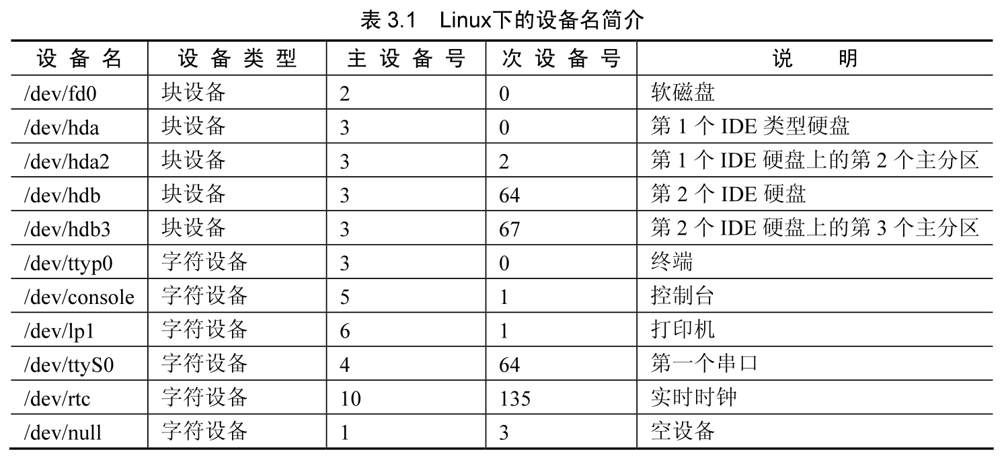
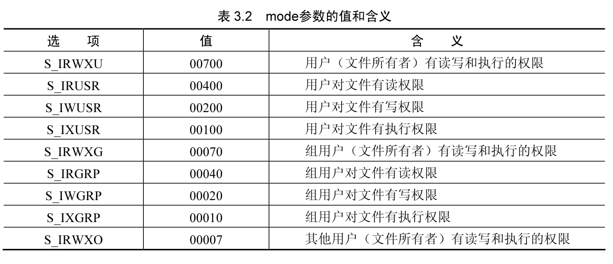
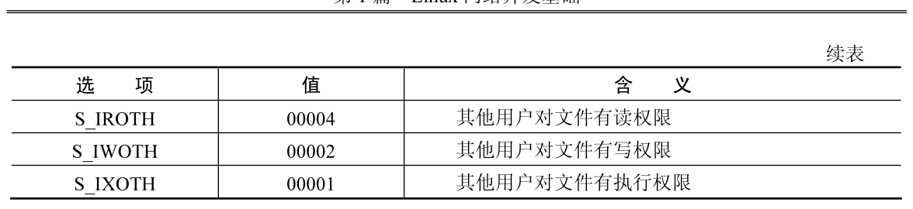
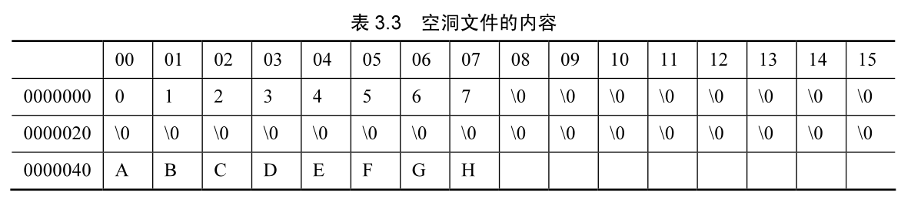
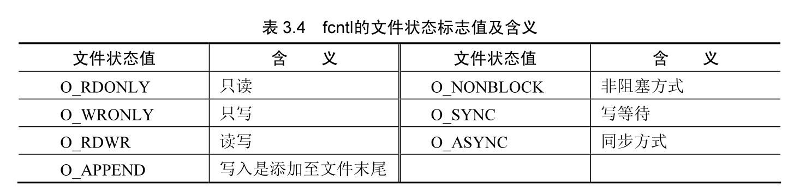

## Linux 下的文件系统

文件系统狭义的概念是一种对存储设备上的数据进行组织和控制的机制。在 Linux 下（当然包含 UNIX），文件的含义比较广泛，文件的概念不仅仅包含通常意义的保存在磁盘的各种格式的数据，还包含目录，甚至各种各样的设备，如键盘、鼠标、网卡、标准输出等，引用一句经典的话“UNIX 下一切皆文件”。

### Linux 下文件的内涵

Linux 下的文件系统是对复杂系统进行合理抽象的一个经典的例子，它通过一套统一的接- 函数对不同的文件进行操作。例如 open）函数不仅可以打开 ext2 类型的文件，还可以打开 fat32 类型的文件，并且包括如串- 设备、显卡等，只不过打开设备的名称不同而已。UNIX 下的文件主要分为如下几种：

- 普通文件：例如保存在磁盘上的 C 文件、可执行的文件以及目录等，这种文件的特性是数据在存储设备上存放，内核提供了对数据的抽象访问，此种文件为一种字节流，访问接- 完全独立于在磁盘上的存储数据。
- 字符设备文件：是一种能够像文件一样被访问的设备，例如控制台、串- 等。- 块设备文件：磁盘是此类设备文件的典型代表，与普通文件的区别是操作系统对数据的访问进行的重新的格式设计。
- socket 文件：它是 UNIX 中通过网络进行通信的方式，对网络的访问可以通过文件描述符的抽象实现，访问网络和访问普通文件相似。

在 Linux 中用户空间对各种文件的操作是类似的，因为虚拟文件系统 VFS 提供了同一套的 API。

### 文件系统的创建

在 Linux 下对磁盘进行操作的工具是 fdisk，与 Windows 下的 fdisk 功能有些类似，但是命令的格式完全不同。

1. 系统分区情况

使用 fdisk 命令查看当前磁盘的情况：

```shell
fdisk -l
```

### 索引节点 inode

在 Linux 下存储设备或存储设备的某个分区格式化为文件系统后，有两个主要的概念来描述它，一个是索引节点（inode），另一个是块（Block）。块是用来存储数据的，索引节点则是用来存储数据的信息，这些信息包括文件大小、属主、归属的用户组、读写权、限等。索引节点为每个文件进行信息索引，所以就有了索引节点的数值。

通过查询索引节点，能够快速地找到对应的文件。这就像一本书，存储设备是一本书的整体，块是书的内容，而索引节点相当于一本书的目录，如果要查询某方面的内容，可以通过查询前面的目录，快速地获得内容的信息，例如位置、大小等。

要查看索引节点的信息，可以使用命令 ls，加上参数 -i。

```shell
ls -li example.c
```

```shell
1125899907246867 -rwxrwxrwx 1 root root 24 Apr 12 20:38 example.c*
```

在 Linux 的文件系统中，索引节点值是文件的标识，并且这个值是唯一的，两个不同文件的索引节点值是不同的，索引节点值相同的文件它的内容是相同的，仅仅文件名不同。修改两个索引节点值相同的文件中的一个文件，另一个文件的内容也跟着发生改变。例如

下面的一个例子，使用命令 ln 为文件 example.c 创建一个硬链接，命名其文件名为 example2.c，并查看属性的变化情况。

```shell
ln example.c example2.c
```

```shell
ls -li example.c*
```

```shell
1125899907246867 -rwxrwxrwx 2 root root 24 Apr 12 20:38 example.c*
1125899907246867 -rwxrwxrwx 2 root root 24 Apr 12 20:38 example2.c*
```

可以看出 example.c 在没有创建硬链接文件 example2.c 的时候，其链接个数是 1（即 -rw-r--r-- 后的那个数值），创建了硬链接 example2.c 后，这个值变成了 2。也就是说，每次为 example.c 创建一个新的硬链接文件后，其硬链接个数都会增加 1。

索引节点值相同的文件，二者的关系是互为硬链接。当修改其中一个文件的内容时，互为硬链接的文件内容也会跟着变化。如果删除互为硬链接关系的某个文件时，其他的文件并不受影响。例如把 example.c 删除后，还是一样能看到 example.c 的内容，并且 example.c 仍是存在的。这是由于索引节点对于每一个文件有一个引用计数，当创建硬链接的时候，引用计数会增加 1，删除文件的时候引用计数会减 1，当引用计数为 0 的时候，系统会删除此文件。

目录不能创建硬链接，只有文件才能创建硬链接。如果目录也可以创建硬链接，很容易在系统内部形成真实的环状文件系统，对文件系统的维护造成很大的困难。目录可以使用软链接的方式创建，可使用命令“ln-s”。

### 普通文件

普通文件是指在硬盘、CD、U 盘等存储介质上的数据和文件结构。在本节中所指的文件系统是一个狭义的概念，仅仅按照普通文件在磁盘中的组织方式的不同来区分。

普通文件的概念与 Windows 下面文件的概念是相同的。可以对文件进行打开、读出数据、写入数据、关闭、删除等操作。

在 Linux 下，目录也作为一种普通文件存在。

### 设备文件

Linux 下用设备文件来表示所支持设备的，每个设备文件除了设备名，还有 3 个属性，即类型、主设备号、次设备号。例如查看 sdb1，可以获得磁盘分区 sdb1 的属性，属性的含义如下：

```shell
ls /dev/sda -l
```

```
brw-rw---- 1 root disk 8, 0 Jan 10 12:56 /dev/sda
```

- 设备类型：设备属性的第一个字符是这个设备文件的类型。第一个字符为 c，表明这个设备是一个字符设备文件。第一个字符为 b，表明这个设备是一个块设备文件。sdb1 的第 1 个字符为 b，可知它是一个块设备文件。
- 主设备号：每一个设备文件都有一个“主设备号”，使用 ls-1 命令输出的第 5 个字段即为主设备号。主设备号是表示系统存取这个设备的“内核驱动”。驱动程序是 UNIX 内核中代码的一部分，其作用是用来控制一种特殊设备的输入输出。大多数的 UNIX 操作系统都有多种设备驱动程序；每一个设备文件名中的主设备号就代表这个设备使用的是那个设备驱动程序。lsdev 命令可以列出当前内核中配置的驱动程序，和这些驱动程序对应的主设备号。
- 次设备号：每一个设备文件都有一个次设备号。“次设备号”是一个 24 位的十六进制数字，其定义了这个设备在系统中的物理位置。设备存储选项。
- 设备文件名：设备文件名用于表示设备的名称，它遵循标准的命令方式，使得设备的分辨更容易。

1. 字符设备与块设备

字符类型的设备可以在一次数据读写过程中传送任意大小的数据，多个字符的访问是通过多次读写来完成的，通常用于访问连续的字符。例如，终端、打印机、moderm 和绘图仪等设备是字符类型设备。

块设备文件可以在一次读写过程中访问固定大小的数据，通过块设备文件进行数据读写的时候，系统先从内存的缓冲区中读写数据，而不是直接与设备进行数据读写，这种访问方式可以大幅度地提高读写性能。块类型设备可以随机地访问数据，而数据的访问时间和数据位于设备中的位置无关。常用的块设备有硬盘、软盘和 CD-ROM 及 RAM 类型磁盘。

2. 设备文件的创建

设备文件是通过 mknod 命令来创建的。其命令格式为：

```shell
mknod[OPTION]...NAME TYPE[MAJOR MINOR]
```

其参数有设备文件名 NAME、操作模式 TYPE、主设备号 MAJOR 及次设备号 MINOR。

主设备号和次设备号两个参数合并成一个 16 位的无符号短整数，高 8 位表示主设备号，低 8 位表示次设备号。可以在 `include/Linux/major.h` 文件中找到所支持的主设备号。

设备文件通常位于 /dev 目录下，表 3.1 显示了目录 /dev 下的一些设备文件的属性。注意同一主设备号既可以标识字符设备，也可以标识块设备。



一个设备文件通常与一个硬件设备（如硬盘，/dev/hda）相关联，或者与硬件设备的某一物理或逻辑分区（如磁盘分区，/dev/hda2）相关联。但在某些情况下，设备文件不会和任何实际的硬件关联，而是表示一个虚拟的逻辑设备。例如，/dev/null 就是对应于一个“黑洞”的设备文件：所有写入这个文件的数据都被简单地丢弃。

3. 设备文件的简单操作

设备描述符 `/dev/console` 是控制台的文件描述符，可以对其进行操作，例如下面的命令将可能造成系统循环的运行甚至死机。

```shell
cat/dev/console 
```

上面的命令将控制台的输入打印出来。下面的命令向标准输出传入字符串 test，系统将字符串 test 发给标准输出：

```shell
echo "test" > /dev/stdout
```

嵌入式设备中常用的 Framebuffer 设备是一个字符设备，当系统打开 Framebuffer 设置的时候（通常可以在系统启动的时候，修改启动参数，例如在 kernel 一行增加 vga = 0x314 启动一个 800 × 600 分辨率的帧缓冲设备），运行如下命令，先将 Framebuffer 设备 f0 的数据写入文件 test.txt 中，然后再利用 cat 命令将数据写入帧缓存设备 f0：

```shell
cat /dev/fb0 > test.txt
cat test.txt > /dev/fb0
```

### 虚拟文件系统 VFS

Linux 的文件系统是由虚拟文件系统作为媒介搭建起来的，虚拟文件系统 VFS（virtual File Systems）是 Linux 内核层实现的一种架构，为用户空间提供统一的文件操作接- 。它在内核内部为不同的真实文件系统提供一致的抽象接- 。

如图 3.1 所示，用户应用程序通过系统调用，与内核中的虚拟文件系统交互，操作实际的文件系统和设备。


在图 3.1 中可以看出，Linux 文件系统支持多种类型的文件，对多种类型的文件系统进行了很好的抽象。通过一组相同的系统调用接- ，Linux 可以在各种设备上实现多种不同的文件系统。例如，write）函数可以向多种不同的文件系统上写入数据，调用 write）函数的应用程序不用管文件的具体存储位置和文件系统的类型，但是当写入数据的时候，函数会正常返回。

VFS 是文件系统的接- 框架。这个组件导出一组接- ，然后将它们抽象到各个文件系统，各个文件系统的具体实现方式差异很大。有两个针对文件系统对象的缓存（inode 和 dentry），它们缓存的对象是最近使用过的文件系统。

每个文件系统实现（例如 ext2、vfat 等等）导出一组通用接- ，供 VFS 使用。缓冲区用于缓存文件系统和相关块设备二者之间的请求。例如，对底层设备驱动程序的读写请求会通过缓冲区缓存来传递。这就允许在其中缓存请求，减少访问物理设备的次数，加快访问速度。以最近使用（LRU）列表的形式管理缓冲区缓存。注意，可以使用 sync 命令将缓冲区缓存中的请求发送到存储媒体（迫使所有未写的数据发送到设备驱动程序，进而发送到存储设备）。

1. 文件系统类型

Linux 的文件系统用一组通用对象来表示，这些对象是超级块（superblock）、节点索引（inode）、目录结构（dentry）和文件（file）。
超级块是每种文件系统的根，用于描述和维护文件系统的状态。文件系统中管理的每个对象（文件或目录）在 Linux 中表示为一个索引节点 inode。
inode 包含管理文件系统中的对象所需的所有元数据（包括可以在对象上执行的操作）。

另一组结构称为 dentry，它们用来实现名称和 inode 之间的映射，有一个目录缓存用来保存最近使用的 dentry。

dentry 还维护目录和文件之间的关系，支持目录和文件在文件系统中的移动。VFS 文件表示一个打开的文件（保存打开的文件的状态，像文件的读偏移量和写偏移量等）。

```c++
struct file_system_type {
  const char *name; /*文件类型名称*/
  int fs_flags;     /*标志*/
  struct super_block *(*read_super)(struct super_block *, void *, int);
  struct module *owner;
  struct file_system_type *next; /*下一个文件类型*/
  struct list_head fs_supers;    /*头结构*/
};
```

可以使用一组注册函数在 Linux 中动态地添加或删除文件系统。Linux 的内核中保存系统所支持的文件系统的列表，可以通过 /proc 文件系统在用户空间中查看这个列表。虚拟文件系统还显示当前系统中与文件系统相关联的具体设备。在 Linux 中添加新文件系统的方法是调用 register_filesystem。这个函数的参数定义一个文件系统结构（file_system type）的引用，这个结构定义文件系统的名称、一组属性和两个超级块函数。也可以注销文件系统。

在注册新的文件系统时，会把这个文件系统和它的相关信息添加到 file_systems 列表中。在命令行上输入 cat/proc/filesystems，就可以查看这个列表。例如：

```shell
cat /proc/filesystems
```

```
nodev   sysfs
nodev   tmpfs
nodev   bdev
nodev   proc
nodev   cgroup
nodev   cgroup2
nodev   cpuset
nodev   devtmpfs
nodev   configfs
nodev   debugfs
nodev   tracefs
nodev   securityfs
nodev   sockfs
nodev   bpf
nodev   pipefs
nodev   ramfs
nodev   hugetlbfs
nodev   devpts
        ext3
        ext2
        ext4
        squashfs
        vfat
nodev   ecryptfs
        fuseblk
nodev   fuse
nodev   fusectl
nodev   mqueue
nodev   pstore
        btrfs
nodev   autofs
nodev   overlay
nodev   aufs
```

2. 超级块

超级块结构用来表示一个文件系统，结构如下：

```cpp
struct super_block {
  unsigned long long s_maxbytes;   /*最大文件尺寸*/
  struct file_system_type *s_type; /*文件的类型*/
  const struct super_operations *s_op; /*超级块的操作,主要是对inode的操作*/
  char s_id[32];                        /*文件系统的名称*/
}
```

由于篇幅的关系省略了很多信息，读者可以从 linux/fs.h 文件中获得全部的代码。这个结构包含一个文件系统所需要的信息，例如文件系统名称、文件系统中最大文件的大小以及对 inode 块的操作函数等。在 Linux 系统中每种文件类型都有一个超级块，例如，如果系统中存在 ext2 和 vfat，则存在两个超级块，分别表示 ext2 文件系统和 vfat 文件系统。

```cpp
struct super_operations {
  struct inode *(*alloc_inode)(struct super_block *sb); /*申请节点*/
  void (*destroy_inode)(struct inode *);                /*销毁节点*/
  void (*dirty_inode)(struct inode *);
  int (*write_inode)(struct inode *, int); /*写节点*/
  void (*drop_inode)(struct inode *);      /*摘取节点*/
}
```

超级块中的一个重要元素是超级块操作函数的定义。这个结构定义一组用来管理这个文件系统中的节点索引 inode 的函数。

执行文件系统同步。可以在 Linux 的源代码树的文件 Linux/include/Linux/fs.h 中找到 super_operations 结构。Linux 文件系统中所支持的每个文件系统都实现一套自己的 inode 操作方法，这些方法实现超级块所定义的功能并向 VFS 层提供通用的抽象。

3. 文件操作

在文件 fs.h 中定义了文件操作的结构，通常实际的文件系统都要实现对应的操作函数，例如打开文件 open、关闭文件 close、读取数据 read 和写入数据 write 等。

## 文件的通用操作方法

本节介绍文件的通用操作方法，介绍如何建立文件、打开文件、读取和写入数据，最后介绍了一些常用的文件控制函数，包括 stat()、fctnl() 和 ioctl()。本节中的例子大多数指的是磁盘中的文件操作，但是其操作方法并不限于此，对设备文件同样有效。

### 文件描述符

在 Linux 下用文件描述符来表示设备文件和普通文件。文件描述符是一个整型的数据，所有对文件的操作都通过文件描述符实现。

文件描述符是文件系统中连接用户空间和内核空间的枢纽。当打开一个或者创建一个文件时，内核空间创建相应的结构，并生成一个整型的变量传递给用户空间的对应进程。进程用这个文件描述符来对文件进行操作。用户空间的文件操作，例如读、写一个文件时，将文件描述符作为参数传送给 read 或 write。读写函数的系统调用到达内核时，内核解析作为文件描述符的整型变量，找出对应的设备文件，运行相应的函数，并返回用户空间结果。

文件描述符的范围是 0 ~ OPEN MAX，因此是一个有限的资源，在使用完毕后要及时释放，通常是调用 close 函数关闭。文件描述符的值仅在同一个进程中有效，即不同进程的文件描述符，同一个值很可能描述的不是同一个设备或者普通文件。

在 Linux 系统中有 3 个已经分配的文件描述符，即标准输入、标注输出和标准错误，它们文件描述符的值分别为 0、1 和 2。读者可以查看 /dev/ 下的 stdin（标准输入）、stdout（标准输出）和 stderr（标准错误），会发现分别指向了 /proc/self/fd/ 目录下的 0、1、2 文件。

```shell
ll /dev/std*
```

```
lrwxrwxrwx 1 root root 15 Apr 11 09:04 /dev/stdin -> /proc/self/fd/0
lrwxrwxrwx 1 root root 15 Apr 11 09:04 /dev/stdout -> /proc/self/fd/1
lrwxrwxrwx 1 root root 15 Apr 11 09:04 /dev/stderr -> /proc/self/fd/2
```

### 打开创建文件 open()、create() 函数

在 Linux 下 open() 函数用于打开一个已经存在的文件或者创建一个新文件，create() 函数用于创建一个新文件。

1. 函数 open()、create() 介绍

这两个函数的原型如下，根据用户设置的标志 flags 和模式 mode 在路径 pathname 下建立或者打开一个文件。

```shell
int open(const char *pathname, int flags);
int open(const char *pathname,int flags, mode_t mode);
```

在使用这些函数的时候，需要包含头文件 sys/types.h、sys/stat.h 和 fcntl.h。

open() 函数打开 pathname 指定的文件，当函数成功时，返回一个整型的文件描述符。
这个函数正常情况下会返回一个文件描述符的值，在出错的时候会返回 -1。

打开文件的时候需要指定打开的文件路径，这个参数由 pathname 指定。函数会根据这个参数的值在路径中查找文件并试图打开或者建立文件。pathname 所指的为一个字符串变量，这个变量的长度在不同的系统下其最大长度有差别，通常情况下为 1024 个字节。当所给的路径长度大于这个数值的时候，系统会对字符串进行截断，仅选择最前面的字节进行操作。

文件的打开标志 flags 用于设置文件打开后允许的操作方式，可以为只读、只写或者可以进行读写。分别用 ORDONLY（只读）、OWRONLY（只写）和 ORDWR（读写）表示。在打开文件的时候必须指定上述的三种模式之一。三个参数中 O_RDONLY 通常定义为 0，OWRONLY 定义为 1，ORDWR 定义为 2。

参数 flags 除了上述三个选项之外，还有一些可选的参数。

- O_APPEND选项：使每次对文件进行写操作都追加到文件的尾端。
- O_CREAT：如果文件不存在则创建它，当使用此选择项时，第三个参数 mode 需要同时设定，用来说明新文件的权限。
- O_EXCL：查看文件是否存在。如果同时指定了 O_CREAT，而文件已经存在，会返回错误。用这种方法可以安全地打开一个文件。
- O_TRUNC：将文件长度截断为 0。如果此文件存在，并且文件成功打开，则会将其长度截短为 0。例如：

```cpp
open(pathname, O_RDWR | O_CREAT | O_TRUNC, mode)
```

通常使用 O_TRUNC 选项对需要清空的文件进行归零操作。ONONBLOCK 打开文件为非阻塞方式，如果不指定此项，默认的打开方式为阻塞方式，即对文件的读写操作需要等待操作的返回状态。其中参数 mode 用于表示打开文件的权限，mode 的使用必须结合 flags 的 O_CREAT 使用，否则是无效的。它们的值在表 3.2 中列出，这些值指定用户操作文件的权限。





2. 使用函数open()的例子

这个例子为在当前目录下打开一个文件名为 test.txt 的文件，并根据文件是否成功打开打印输出不同的结果。程序的代码如下：

```cpp
/*ex03-open-01.c 打开文件的例子*/

#include <cstdio>
#include <fcntl.h>

int main() {
  int fd;                       /*文件描述符声明*/
  char filename[] = "test.txt"; /*打开的文件名*/

  fd = open(filename, O_RDWR); /*打开文件为可读写方式*/

  if (fd == -1) { /*打开失败*/
    printf("Open file%s failure!, fd:%d\n", filename, fd);
  } else { /*打开成功*/
    printf("Open file%s success, fd:%d\n", filename, fd);
  }

  return 0;
}
```


```shell
gcc -o test ex03-open-01.c
```

```shell
Open filetest.txt failure!, fd:-1
```

因为此时当前目录下没有文件 test.txt，所以打开文件会失败。建立一个空的 test.txt 文件：

```shell
echo "" > test.txt
```

再次运行程序：

```shell
Open filetest.txt success, fd:3
```

这次打开文件成功了，返回的文件描述符的值为 3。在 Linux 下如果之前没有其他文件打开，第一个调用打开文件成功的程序，返回的描述符为最低值，即 3。因为 0、1、2 文件描述符分配给了系统，表示标准输入（描述符 0）、标准输出（描述符 1）和标准错误（描述符 2）。在 Linux 下可以直接对这 3 个描述符进行操作（例如读写），而不用打开、关闭。

open 函数不仅可以打开一般的文件，而且可以打开设备文件，例如 open 函数可以打开设备“/dev/sda1”，即磁盘的第一个分区，例如将文件 ex03-open-01.c 中打开的文件名修改为：

```cpp
char filename[] = "/dev/sda1";
```

O_CREAT 可以创建文件，与 O_EXCL 结合使用可以编写容错的程序。

创建文件的函数除了可以在打开时创建外，还可以使用 create 函数创建一个新文件，其函数的原型如下：

```cpp
int creat(const char *pathname, mode_t mode);
```

函数 creat 等于一个 open 的缩写版本，等效于如下方式的 open。

```cpp
open(pathname, O_WRONLY | O_CREAT | O_TRUNC, mode)
```

creat 的返回值与 open 一样，在成功时为创建文件的描述符。

### 关闭文件 close 函数

close 函数关闭一个打开的文件，之前打开文件所占用的资源。

#### close 函数介绍

close 函数的原型如下。

```cpp
int close(int fd);
```

close 函数关闭一个文件描述符，关闭以后此文件描述符不再指向任何文件，从而描述符可以再次使用。当函数执行成功的时候返回 0，如果有错误发生，例如文件描述符非法，返回 -1。在使用这个函数的时候，通常不检查返回值。

在打开文件之后，必须关闭文件。如果一个进程中没有正常关闭文件，在进程退出的时候系统会自动关闭打开的文件。但是打开一个文件的时候，系统分配的文件描述符为当前进程中最小的文件描述符的值，这个值一般情况下是递增的，而每个进程中的文件描述符的数量是有大小限制的。如果一个进程中频繁地打开文件而又忘记关闭文件，当系统的文件描述符达到最大限制的时候，就会因为没有文件描述符可以分配造成打开文件失败。

#### close 函数例子

下面的代码用于打开当前目录下的 test.txt 文件，每次打开后并不关闭，一直到系统出现错误为止。这个程序用于测试当前系统文件描述符的最大支持数量，代码如下：

```cpp
#include <cstdio>
#include <cstdlib>
#include <fcntl.h>

int main() {
  int i; /*计数器*/
  int fd = 0;

  for (i = 0; fd >= 0; i++) /*循环打开文件直到出错*/
  {
    fd = open("test.txt", O_RDONLY); /*只读打开文件*/
    if (fd > 0)                      /*打开文件成功*/
    {
      printf("fd: %d\n", fd);             /*打印文件描述符*/
    } else {                              /*打开文件失败*/
      printf("error, can't open file\n"); /*打印错误*/
      exit(0);                            /*退出*/
    }
  }
}
```

要测试这个文件需要在当前目录下建立一个 test.txt 的文件。

系统打开第一个文件的文件描述符的值为 3，一直到文件描述符的值为 2047 都可以正常打开。但是由于程序中一直没有关闭文件，到文件描述符为 2047 的时候，由于超过了系统的可分配最大值，发生了错误。可以修改上述的代码，加入 close 函数调用后，会发现程序可以正常地运行。

```cpp
    if (fd > 2046) {
      close(fd);
    }
```

### 读取文件 read 函数

用 read 函数从打开文件中读数据，用户可以对读入的数据进行操作。

#### read 函数介绍

使用这个函数需要将头文件unistd.h加入。read 函数的原型定义格式如下，

```cpp
ssize t read(int fd, void*buf, size_t count);
```

read 函数从文件描述符 fd 对应的文件中读取 count 字节，放到 buf 开始的缓冲区。如果 count 的值为 0，read 函数返回 0，不进行其他操作；如果 count 的值大于 SSIZEMAX，结果不可预料。在读取成功的时候，文件对应的读取位置指针，向后移动位置，大小为成功读取的字节数。

如果 read 函数执行成功，返回读取的字节数；当返回值为 -1 的时候，读取函数有错误发生。如果已经到达文件的末尾，返回 0。返回值的数据类型为 ssizet 这是一个可能不同于 int、long 类型的数据类型，它是一个符号数，具体实现时可能定义为 long 或者 int。

read 函数的参数 fd 是一个文件描述符，通常是 open 或者 creat 函数成功返回的值；参数 buf 是一个指针，它指向缓冲区地址的开始位置，读入的数据将保存在这个缓冲区中；参数 count，表示要读取的字节数量，通常用这个变量来表示缓冲区的大小，因此 count 的值不要超过缓冲区的大小，否则很容易造成缓冲区的溢出。

在使用 read 函数时，count 为请求读取的字节数量，但是 read 函数不一定能够读取这么多数据，有多种情况可使实际读到的字节数小于请求读取的字节数。

- 读取普通文件时，文件中剩余的字节数不够请求的字节数。例如在文件中剩余了 10 个字节，而 read 函数请求读取80个字节，这时read 函数会将剩余的 10 个字节数写到缓冲区 buf 中，并返回实际读到的字节数 10。
- 当从中断设备读取数据的时候，其默认的长度不够 read 函数请求读取的数据，例如终端缓冲区的大小为 256，而 read 函数请求读取 1024 个字节。
- 当从网络读取数据时，缓冲区大小可能小于读取请求的数据大小。

因此读取数据时，要判断返回实际读取数据大小来进行处理。

```cpp
/*文件ex03-read-01.c,
O_CREAT和O_EXCL的使用*/
#include <cstdio>
#include <fcntl.h>
#include <sys/types.h>

int main() {
  int fd, i;
  ssize_t size = -1;

  /*存放数据的缓冲区*/
  char buf[10];
  char filename[] = "test.txt";

  /*打开文件，如果文件不存在，则报错*/
  fd = open(filename, O_RDONLY);
  if (-1 == fd) {
    /*文件已经存在*/
    printf("Open file %s failure,fd:%d\n", filename, fd);
  } else {
    /*文件不存在，创建并打开*/
    printf("Open file %s success,fd:%d\n", filename, fd);
  }

  /*循环读取数据，直到文件末尾或者出错*/
  while (size) {
    /*每次读取10个字节数据*/
    size = read(fd, buf, 10);
    if (-1 == size) {
      /*读取数据出错*/
      close(fd); /*关闭文件*/
      printf("read file error occurs\n");
      /*返回*/
      return -1;
    } else {
      /*读取数据成功*/
      if (size > 0) {
        /*获得size个字节数据*/
        printf("read %d bytes:", size);
        /*打印引号*/
        printf("\"");
        /*将读取的数据打印出来*/
        for (i = 0; i < size; i++) {
          printf("%c", *(buf + i));
        }
        /*打印引号并换行*/
        printf("\"\n");
      } else {
        printf("reach the end of file\n");
      }
    }
  }

  return 0;
}
```

### 写文件 write 函数

write 函数向打开的文件中写入数据，将用户的数据保存到文件中。

#### write 函数介绍

write 的函数原型如下。

```cpp
ssize t write(int fd, const void*buf, size_t count);
```

与 read 函数的含义类似，write 函数向文件描述符 fd 写入数据，数据的大小由 count 指定，buf 为要写入数据的指针，write 函数返回值为成功写入数据的字节数。当操作的对象是普通文件时，写文件的位置从文件的当前开始，操作成功后，写的位置会增加写入字节数的值。如果在打开文件的时候指定了 OAPPEND 项，每次写操作之前，会将写操作的位置移到文件的结尾处。

函数操作成功会返回写入的字节数，当出错的时候返回-1。出错的原因有多种，像磁盘已满，或者文件大小超出系统的设置，例如 ext2 下的文件大小限制为 2Gbytes 等。

写操作的返回值与想写入的字节数会存在差异，与 read 函数的原因类似。

写操作函数并不能保证将数据成功地写入磁盘，这在异步操作中经常出现，write 函数通常将数据写入缓冲区，在合适的时机由系统写入实际的设备。可以调用 fsync 函数，显示将输入写入设备。

#### write 函数例子

```cpp
/*文件ex03-write-01.c,
O_CREAT和O_EXCL的使用*/
#include <cstdio>
#include <fcntl.h>
#include <sys/types.h>

int main() {
  int fd;
  ssize_t size;

  /*存放数据的缓冲区*/
  char buf[] = "quick brown fox jumps over the lazy dog";
  char filename[] = "test.txt";

  /*打开文件，如果文件不存在，则报错*/
  fd = open(filename, O_RDWR | O_TRUNC);
  if (-1 == fd) {
    /*文件已经存在*/
    printf("Open file %s failure,fd:%d\n", filename, fd);
  } else {
    /*文件不存在，创建并打开*/
    printf("Open file %s success,fd:%d\n", filename, fd);
  }

  /*将数据写入到文件test.txt中*/
  size = write(fd, buf, strlen(buf));
  printf("write %d bytes to file %s\n", size, filename);
  /*关闭文件*/
  close(fd);

  return 0;
}
```

将此代码存入 ex03-write-1.c 后编译，运行代码并查看文件大小，会发现：文件 test.txt 的大小没有改变但文件的内容发生了变化。

因为写入的 39 个字符仅仅覆盖了文件 test.txt 开头的部分。

### 文件偏移 lseek 函数

在调用 read 和 write 函数时，每次操作成功后，文件当前的操作位置进行了移动。

其中隐含了一个概念，即文件的偏移量。文件的偏移量指的是当前文件操作位置相对于文件开始位置的偏移。

每次打开和对文件进行读写操作后，文件的偏移量都进行了更新。当写入数据成功时，文件的偏移量要向后移动写入数据的大小。当从文件中读出数据的时候，文件的偏移量要向后移动读出数据的大小。

文件的偏移量是一个非负整数，表示从文件的开始到当前位置的字节数。一般情况下，对文件的读写操作都从当前的文件位移量处开始，并增加读写操作成功的字节数。当打开一个文件时，如果没有指定 OAPPEND 选择项，文件的位移量为 0。如果指定了 OAPPEND 选项，文件的偏移量与文件的长度相等，即文件的当前操作位置移到了末尾。

#### lseek 函数介绍

lseek 函数可以设置文件偏移量的位置，lseek 的函数原型如下：

```cpp
off_t lseek(int fildes, off_t offset, int whence);
```

这个函数对文件描述符 fildes 所代表的文件，按照操作模式 whence 和偏移的大小 offset，重新设定文件的偏移量。

如果 lseek 函数操作成功，则返回新的文件偏移量的值；如果失败返回 -1。由于文件的偏移量可以为负值，判断 lseek 是否操作成功时，不要使用小于 0 的判断，要使用是否等于 -1 来判断函数失败。

参数 whence 和 offset 结合使用。whence 表示操作的模式，offset 是偏移的值，offset 的值可以为负值。offset 值的含义如下：

- 如果 whence 为 SEEKSET，则 offset 为相对文件开始处的值，即将该文件偏移量设为距文件开始处 offset 个字节。
- 如果 whence 为 SEEKCUR，则 offset 为相对当前位置的值，即将该文件的偏移量设置为其当前值加 offset。
- 如果 whence 为 SEEKEND，则 ofset 为相对文件结尾的值，即将该文件的偏移量设置为文件长度加 offset。

函数 lseek 执行成功时返回文件的偏移量，可以用 SEEKCUR 模式下偏移 0 的方式获得当前的偏移量，例如：

```cpp
off_t cur_pos=lseek(fd, 0, SEEK_CUR);
```

上面的函数没有引起文件的副作用，仅仅检验了文件的偏移设置函数获得当前的文件偏移量的值，可以用这种方法测试当前的设备是否支持 lseek 函数。

#### lseek 函数例子

```cpp
/*文件ex03-lseek-01.c,
使用lseek函数测试标准输入是否可以进行seek操作*/
#include <cstdio>

int main() {
  off_t offset;

  /*将标准输入文件描述符的文件偏移量设为当前值*/
  offset = fseek(stdin, 0, SEEK_CUR);

  if (-1 == offset) {
    /*设置失败，标准输入不能进行seek操作*/
    printf("STDIN can't seek\n");
    return -1;
  } else {
    /*设置成功，标准输入可以进行seek操作*/
    printf("STDIN CAN seek\n");
  };

  return 0;
}
```

Linux 标准输入无法 seek 操作。

Windows 标准输入可以 seek 操作。

#### 空洞文件的例子

lseek 函数对文件偏移量的设置可以移出文件，即设置的位置可以超出文件的大小，但是这个位置仅仅在内核中保存，并不引起任何的 IO 操作。当下一次的读写动作时，lseek 设置的位置就是操作的当前位置。当对文件进行写操作时会延长文件，跳过的数据用 \0 填充，这在文件中造成了一个空洞。

例如建立一个文件在开始的部分写入 8 个字节“01234567”，然后到 32 的地方在写入 8 个不同的字节 ABCDEFGH，文件会形成表 3.3 所示的情况。下面的代码是造成上述情况文件空洞的一个实例。



```cpp
/*文件ex03-lseek-02.c,
使用lseek函数构建空洞文件*/
#include <cstdio>
#include <fcntl.h>
#include <sys/stat.h>
#include <sys/types.h>

int main() {
  int fd;
  ssize_t size;
  off_t offset;

  /*存放数据的缓冲区*/
  char buf1[] = "01234567";
  char buf2[] = "ABCDEFGH";

  /*文件名*/
  char filename[] = "hole.txt";
  int len = 8;

  /*创建文件hole.txt*/
  fd = open(filename, O_RDWR | O_CREAT, S_IRWXU);
  if (-1 == fd) {
    /*创建文件失败*/
    return -1;
  }

  /*将buf1中的数据写入到文件Hole.txt中*/
  size = write(fd, buf1, len);
  if (size != len) {
    /*写入数据失败*/
    return -1;
  }

  /*设置文件偏移量为绝对值的32*/
  offset = lseek(fd, 32, SEEK_SET);
  if (-1 == offset) {
    /*设置失败*/
    return -1;
  }
  /*将buf2中的数据写入到文件hole.txt中*/
  size = write(fd, buf2, len);
  if (size != len) {
    /*写入数据失败*/
    return -1;
  }

  /*关闭文件*/
  close(fd);

  return 0;
}
```

### 获得文件状态 fstat 函数

有的时候对文件操作的目的不是读写文件，而是要获得文件的状态。例如，获得目标文件的大小、权限、时间等信息。

#### fstat 函数介绍

在程序设计的时候经常要用到文件的一些特性值，例如，文件的所有者、文件的修改时间、文件的大小等。stat 函数、fstat 函数和 lstat 函数可以获得文件的状态，其函数原型如下：

```cpp
int stat(const char *path struct stat *buf);
int fstat(int filedes, struct stat *buf);
int lstat(const char *path, struct stat *buf);
```

函数的第一个参数是文件描述的参数，可以为文件的路径或者文件描述符； buf 为指向 struct stat 的指针，获得的状态从这个参数中传回。当函数执行成功时返回 0，返回值为 -1 表示有错误发生。

结构 struct stat 为一个描述文件状态的结构，定义如下：

```cpp
struct stat {
  dev_t st_dev;          /*此文件所处设备的设备ID号*/
  ino_t st_ino;          /*inode数值*/
  mode_t st_mode;       /*保护设置*/
  nlink_t st_nlink;     /*硬链接数*/
  uid_t st_uid;         /*文件所有者的ID*/
  gid_t st_gid;          /*文件所有者的组ID*/
  dev_t st_rdev;         /*设备ID*/
  off_t st_size;         /*以字节计的大小*/
  blksize_t st_blksize; /*文件系统的块大小*/
  blkcnt_t st_blocks;   /*占用的块的数量*/
  time_t st_atime;      /*最后方位时间*/
  time_t st_mtime;      /*最后修改时间*/
  time_t st_ctime;       /*最后状态改变时间*/
};
```

#### stat 函数例子

```cpp
/*文件ex03-fstat-01.c,
使用stat获得文件的状态*/
#include <cstdio>
#include <sys/stat.h>

int main() {
  struct stat st{};
  if (-1 == stat("test.txt", &st)) {
    printf("获得文件状态失败\n");
    return -1;
  }

  printf("包含此文件的设备ID：%lu\n", st.st_dev);
  printf("此文件的节点：%lu\n", st.st_ino);
  printf("此文件的保护模式：%d\n", st.st_mode);
  printf("此文件的硬链接数：%lu\n", st.st_nlink);
  printf("此文件的所有者ID：%d\n", st.st_uid);
  printf("此文件的所有者的组ID：%d\n", st.st_gid);
  printf("设备ID（如果此文件为特殊设备）：%lu\n", st.st_rdev);
  printf("此文件的大小：%ld\n", st.st_size);
  printf("此文件的所在文件系统块大小：%ld\n", st.st_blksize);
  printf("此文件的占用块数量：%ld\n", st.st_blocks);
  printf("此文件的最后访问时间：%ld\n", st.st_atime);
  printf("此文件的最后修改时间：%ld\n", st.st_mtime);
  printf("此文件的最后状态改变时间：%ld\n", st.st_ctime);

  return 0;
}
```

### 文件空间映射 mmap 函数

mmap 函数用来将文件或者设备空间映射到内存中，可以通过对映射后的内存空间存取来获得与存取文件一致的控制方式，不必再使用 read、write 函数。简单的说此函数就是将文件映射到内存中的某一段，内存比磁盘快些。映射到的内存并不占用空间，仅仅占用一段地址空间。

#### mmap 函数介绍

mmap 函数的原型如下：

```cpp
void*mmap(void*start, size_t length, int prot, int flags, int fd, off_t offset);
```

它将文件描述符 fd 对应的文件中，自 offset 开始的一段长 length 的数据空间映射到内存中。用户可以设定映射内存的地址，但是具体函数会映射到内存的位置由返回值确定。当映射成功后，返回映射到的内存地址。如果失败返回值为`(void*)-1`。通过 errno 值可以获得错误方式。

mmap 函数进行地址映射的时候，用户可以指定要映射到的地址，这个地址在参数 start 中指定，通常为 NULL，表示由系统自己决定映射到什么地址。而参数 length 表示映射数据的长度，即文件需要映射到内存中的数据大小。使用 mmap 函数有一个限制，只能对映射到内存的数据进行操作，即限制于开始为 offset、大小为 len 的区域。参数 fd，代表文件的文件描述符，表示要映射到内存中的文件，通常是 open 的返回值；如果需要对文件中需要映射地址进行偏移，则在参数 ofset 中进行指定。

mmap 函数的参数 prot，表示映射区保护方式。保护方式 prot 的值是一个组合值，可选如下的一个或者多个。这些值可以进行复合运算，其中，PROTEXEC 表示映射区域可执行，PROTREAD 表示映射区域可读取，PROTWRITE 表示映射区域可写入，PROT_NONE 表示映射区域不能存取。例如 PROT_WRITE | PROT_READ 的方式将映射区设置为可读写，当然prot的设置受文件打开时的选项限制，当打开文件时为只读，则上面的写（PROT_WRITE）失效，但是读仍然有效。

参数 flags 用于设定映射对象的类型、选项和是否可以对映射对象进行操作（读写等），这个参数和 open 函数中的含义类似。参数 flags 也是一个组合值，下面是其可选的设置。

- MAP_FIXED：如果参数 start 指定了用于需要映射到的地址，而所指的地址无法成功建立映射，则映射失败。通常不推荐使用此设置，而将 start 设为 0，由系统自动选取映射地址。
- MAPSHARED：共享的映射区域，映射区域允许其他进程共享，对映射区域写入数据将会写入到原来的文件中。
- MAP_PRIVATE：当对映射区域进行写入操作时会产生一个映射文件的复制，即写入复制（copy on write），而读操作不会影响此复制。对此映射区的修改不会写、回原来的文件，即不会影响原来文件的内容。
- MAP_ANONYMOUS：建立匿名映射。此时会忽略参数 fd，不涉及文件，而且映射区域无法和其他进程共享。
- MAP_DENYWRITE：对文件的写入操作将被禁止，只能通过对此映射区操作的方式实现对文件的操作，不允许直接对文件进行操作。
- MAP_LOCKED：将映射区锁定，此区域不会被虚拟内存重置。

参数 flags 必须为 MAP_SHAED 或者 MAP_PRIVATE 二者之一的类型。MAP_SHARED 类型表示多个进程使用的是一个内存映射的副本，任何一个进程都可对此映射进行修改，其他的进程对此修改是可见的。而 MAP_PRIVATE 则是多个进程使用的文件内存映射，在写入操作后，会复制一个副本给修改的进程，多个进程之间的副本是不一致的。

#### munmap 函数介绍

与 mmap 函数对应的函数是 munmap 函数，它的作用是取消 mmap 函数的映射关系。
其函数原型如下：

```cpp
int munmap(void *start, size_t length);
```

参数 start 为 mmap 函数成功后的返回值，即映射的内存地址；参数 length 为映射的长度。

使用 mmap 函数需要遵循一定的编程模式，其模式如下：首先使用 open函数打开一个文件，当操作成功的时候会返回一个文件描述符；使用 mmap）函数将此文件描述符所代表的文件映射到一个地址空间，如果映射成功，会返回一个映射的地址指针；对文件的操作可以通过 mmap）映射的地址来进行，包括读数据、写数据、偏移等，与一般的指针操作相同，不过要注意不要进行越界操作；当对文件的操作完毕后，需要使用 munmapO 函数将 mmap）映射的地址取消并关闭打开的文件。


```cpp
fd = open(filename, flags, mode);
if (fd<0){

}
ptr = mmap(NULL, len, PROT_READ | PROT_WRITE, MAP_SHARED, fd, 0);

munmap(ptr, len);
close(fd);
```

#### mmap 函数和 munmap 函数示例

下面的代码是一个使用 mmap 函数映射文件的实例。先打开文件 mmap.txt，并使用 mmap 函数进行地址空间影射，当映射成功后会对文件映射地址区域进行 memset 函数操作，然后返回。程序运行后会发现对内存地址的操作都显示在文件中。

```cpp
/*文件ex03-mmap-01.c,
使用mmap对文件进行操作*/
#include <cstdio>
#include <cstring> /*memset warning*/
#include <fcntl.h>
#include <sys/mman.h>/*mmap*/
#include <sys/stat.h>
#include <unistd.h>

#define FILELENGTH 80

int main() {
  int fd;
  /*将要写入文件的字符串*/
  char buf[] = "quick brown fox jumps over the lazy dog";
  char *ptr;

  /*打开文件mmap.txt，并将文件长度缩小为0，
  如果文件不存在则创建它，权限为可读写执行*/
  fd = open("mmap.txt", O_RDWR /*可读写*/ | O_CREAT /*不存在，创建*/ | O_TRUNC /*缩小为0*/, S_IRWXU);
  if (-1 == fd) {
    /*打开文件失败，退出*/
    return -1;
  }

  /*下面的代码将文件的长度扩大为80*/
  /*向后偏移文件的偏移量到79*/
  lseek(fd, FILELENGTH - 1, SEEK_SET);
  /*随意写入一个字符，此时文件的长度为80*/
  write(fd, (void *) 'a', 1);

  /*将文件mmap.txt中的数据段从开头到1M的数据映射到内存中，对文件的操作立刻显示在文件上，可读写*/
  ptr = (char *) mmap(nullptr, FILELENGTH, PROT_READ | PROT_WRITE, MAP_SHARED, fd, 0);
  if ((char *) -1 == ptr) {
    /*如果映射失败，则退出*/
    printf("mmap failure\n");
    close(fd);
    return -1;
  }

  /*将buf中的字符串拷贝到映射区域中，起始地址为偏移16*/
  strcpy(ptr + 16, buf);
//  /*取消文件映射关系*/
  munmap(ptr, FILELENGTH);
//  /*关闭文件*/
  close(fd);

  return 0;
}
```

运行失败。。。

### 文件属性 fcnt 函数

fcntl 函数用于获得和改变已经打开文件的性质。

#### fcntl 函数介绍

fcntl 函数向打开的文件 fd 发送命令，更改其属性。函数原型如下：

```cpp
#include <unistd.h>
#include<fcntl.h>

int fcntl(int fd,int cmd);
int fcntl(int fd,int cmd,long arg);
int fcntl(int fd,int cmd,struct flock*lock);
```

如果操作成功，其返回值依赖于 cmd，如果出错返回值为 -1。下面的 4 个命令有特殊的返回值：F_DUPFD，F_GETFD，F_GETFL 以及 F_GETOWN。第 1 个命令返回值为新的文件描述符，第 2 个命令返回值为获得的相应标志，第 3 个命令返回值为文件描述符的状态标志，第 4 个命令返回值如果为正数则是进程 ID 号，如果为负数则是进程组 ID 号。

在本节的各实例中，第 3 个参数总是一个整数，但是某些情况下使用记录锁时，第 3 个参数则是一个指向结构的指针。

函数 fcntl 的功能分为以下 6 类：

- 复制文件描述符（cmd=F_DUPFD）；
- 获得/设置文件描述符（cmd=F_GETFD或者F_SETFD）；
- 获得/设置文件状态值（cmd=F_GETFL或者F_SETFL）；
- 获得/设置信号发送对象（cmd=F_GETOWN、F_SETOWN、F_GETSIG或者F_SETSIG）；
- 获得/设置记录锁（cmd=F_GETLK、F_SETLK或者F_SETLKW）；
- 获取/设置文件租约（cmd=F_GETLEASE或者F_SETLEASE）。

- F_DUPFD：命令用于复制文件描述符 fd，获得的新文件描述符作为函数值返回。获得的文件描述符是尚未使用的文件描述符中大于或等于第 3 个参数值中的最小值。
- F_GETFD：获得文件描述符。
- F_SETFD：设置文件描述符。
- F_GETFL：标志获得文件描述符 fd 的文件状态标志，标志的含义在表 3.4 中列出。



由于 3 种存取方式（O_RDONLY、O_WRONLY 和 O_RDWR）并不是各占 1 位，这 3 个值分别为 0、1、2，要正确地获得它们的值，只能用 O_ACCMODE 获得存取位，然后与这 3 种方式比较。

#### F_GETFL的例子

```cpp
/*文件ex03-fcntl-01.c,
使用fcntl控制文件符*/
#include <cstdio>
#include <fcntl.h>

int main() {
  int flags = -1;
  int accmode = -1;

  /*获得标准输入的状态的状态*/
  flags = fcntl(0, F_GETFL, 0);
  if (flags < 0) {
    /*错误发生*/
    printf("failure to use fcntl\n");
    return -1;
  }

  /*获得访问模式*/
  accmode = flags & O_ACCMODE;
  if (accmode == O_RDONLY) /*只读*/
    printf("STDIN READ ONLY\n");
  else if (accmode == O_WRONLY) /*只写*/
    printf("STDIN WRITE ONLY\n");
  else if (accmode == O_RDWR) /*可读写*/
    printf("STDIN READ WRITE\n");
  else /*其他模式*/
    printf("STDIN UNKNOWN MODE");

  if (flags & O_APPEND)
    printf("STDIN APPEND\n");
  if (flags & O_NONBLOCK)
    printf("STDIN NONBLOCK\n");

  return 0;
}
```

#### F_SETFL的例子

F_SETFL 设置文件状态标志的值，此时用到了第 3 个参数。其中 O_RDONLY、O_WRONLY、O_RDWR、O_CREAT、OEXCL、O_NOCTTY 和 O_TRUNC 不受影响，可以更改的几个标志是 O_APPEND、O_ASYNC、O_SYNC、O_DIRECT、O_NOATIME 和 O_NONBLOCK。

如下代码为修改文件状态值的一个实例，在文本文件 test.txt 中的内容是“1234567890abcdefg”。打开文件 test.txt 时设置为 O_RDWR，此时文件的偏移量位于文件开头，修改状态值的时候增加 O_APPEND 项，此时文件的偏移量移到文件末尾，写入字符串 FCNTL，然后关闭文件。

```cpp
/*文件ex03-fcntl-02.c,
使用fcntl修改文件的状态值*/
#include <fcntl.h>
#include <cstdio>
#include <cstring>
#include <unistd.h>

int main() {
  int flags = -1;
  char buf[] = "FCNTL";

  int fd = open("test.txt", O_RDWR);
  /*获得文件状态*/
  flags = fcntl(fd, F_GETFL, 0);
  /*增加状态为可追加*/
  flags |= O_APPEND;
  /*将状态写入*/
  flags = fcntl(fd, F_SETFL, &flags);
  if (flags < 0) {
    /*错误发生*/
    printf("failure to use fcntl\n");
    return 1;
  }
  /*向文件中写入字符串*/
  write(fd, buf, strlen(buf));
  close(fd);

  return 0;
}
```

#### F_GETOWN的例子

F_GETOWN 获得接收信号 SIGIO 和 SIGURG 信号的进程 ID 或进程组 ID。例如如下代码得到接收信号的进程 ID 号。

```cpp
/*文件ex03-fcntl-04.c,
使用fcntl获得接收信号的进程ID*/
#include <cstdio>
#include <fcntl.h>
#include <unistd.h>

int main() {
  int uid;
  /*打开文件test.txt*/
  int fd = open("test.txt", O_RDWR);

  /*获得接收信号的进程ID*/
  uid = fcntl(fd, F_GETOWN);
  printf("the SIG recv ID is %d\n", uid);

  close(fd);

  return 0;
}
```

#### F_SETOWN的例子

F_SETOWN 用于设置接收信号 SIGIO 和 SIGURG 信号的进程 ID 或进程组 ID。参数 arg 为正时设置接收信号的进程 ID，arg 的值为负值时设置接收信号的进程组 ID 为 arg 绝对值。下面的代码将文件 test.txt 的信号接收设置给进程 10000。

```cpp
/*文件ex03-fcntl-05.c,
使用fcntl设置接收信号的进程ID*/
#include <fcntl.h>
#include <unistd.h>

int main() {
  int uid;
  /*打开文件test.txt*/
  int fd = open("test.txt", O_RDWR);

  /*获得接收信号的进程ID*/
  uid = fcntl(fd, F_SETOWN, 10000);

  close(fd);

  return 0;
}
```

### 文件输入输出控制 ioctl 函数

ioctl 是 input output control 的简写，表示输入输出控制，ioctl 函数通过对文件描述符的发送命令来控制设备。

#### ioctl 函数介绍

ioctl 函数的原型如下，

```cpp
#include<sys/ioctl.h>
int ioctl(int d,int request,..…);
```

ioctl 函数通过对文件描述符发送特定的命令来控制文件描述符所代表的设备。参数 d 是一个已经打开的设备。通常情况下 ioctl 函数出错返回 -1，成功返回 0 或者大于 1 的值，取决于对应设备的驱动程序对命令的处理。

使用 ioctl 像其他的系统调用一样：打开文件，发送命令，查询结果。ioctl 函数像一个杂货铺，对设备的控制通常都通过这个函数来实行。具体对设备的操作方式取决于设备驱动程序的编写。

#### ioctl 函数的例子

下面是一个控制 CDROM 打开的简单程序，因为 CDROM 控制程序的数据结构在头文件 `<linux/cdrom.h>` 中，所以要包含此文件。此处使用 ioctl 函数，仅仅发送特定的打开命令到 Linux 内核程序，用 CDROMEJECT 幻数本身就可以进行区分，所以没有传入配置数据。

```cpp
/*文件ex03-ioctl-01.c
*控制CDROM*/
#include <cstdio>
#include <fcntl.h>
#include <linux/cdrom.h>
#include <sys/ioctl.h>

int main() {
  /*打开CDROM设备文件*/
  int fd = open("/dev/cdrom", O_RDONLY);
  if (fd < 0) {
    printf("打开CDROM失败\n");
    return -1;
  }
  if (!ioctl(fd, CDROMEJECT, NULL)) {
    printf("成功弹出CDROM\n");
  } else {
    printf("弹出CDROM失败\n");
  }
  return 0;
}
```
