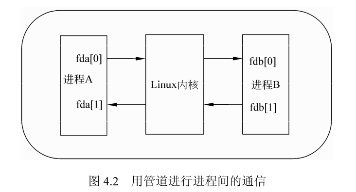
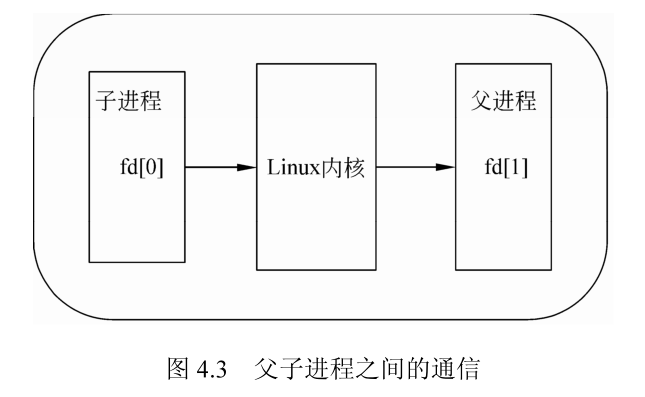
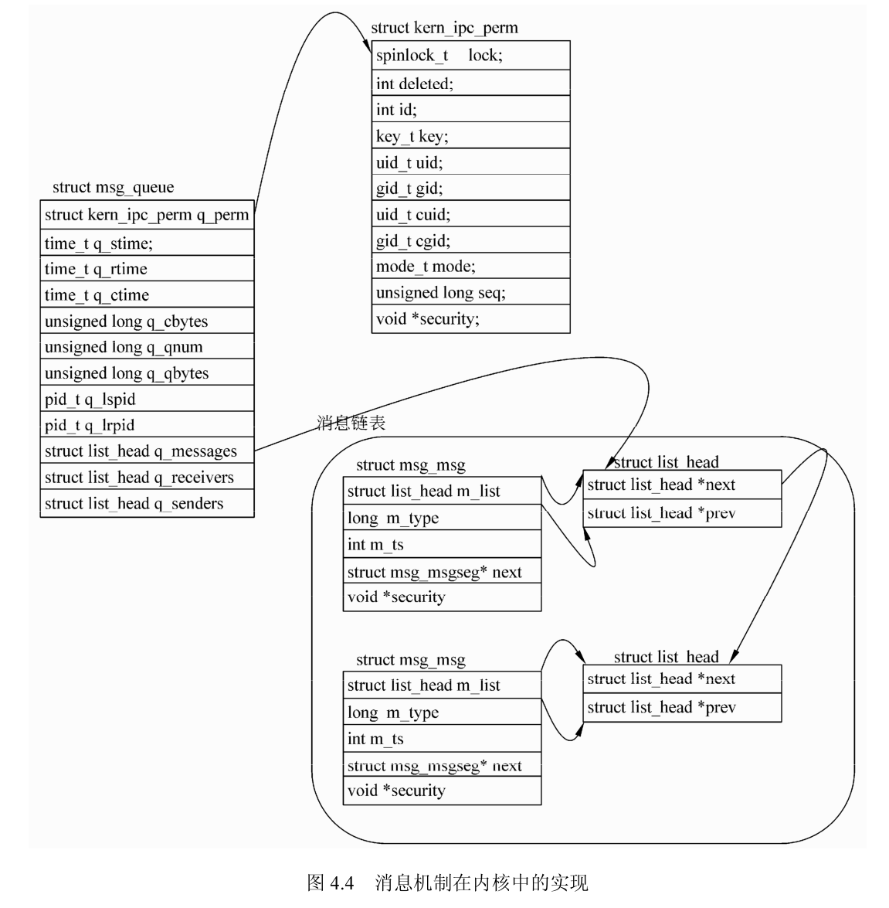

## 程序、进程和线程的概念

在计算机上运行的程序是一组指令及指令参数的组合，指令按照既定的逻辑控制计算机运行。进程则是运行着的程序，是操作系统执行的基本单位。线程则是为了节省资源而可以在同一个进程中共享资源的一个执行单位。

### 程序和进程的差别

进程的出现最初是在 UNIX 下，用于表示多用户、多任务的操作系统环境下，应用程序在内存环境中基本执行单元的概念。进程是 UNIX 操作系统环境中的基本概念、是系统资源分配的最小单位。UNIX 操作系统下的用户管理和资源分配等工作几乎都是操作系统通过对应用程序进程的控制实现的。

C、C++、Java 等语言编写的源程序经相应的编译器编译成可执行文件后，提交给计算机处理器运行。应用程序的运行状态称为进程。

进程从用户角度来看是应用程序的一个执行过程。从操作系统核心角度来看，进程代表的是操作系统分配的内存、CPU 时间片等资源的基本单位，是为正在运行的程序提供的运行环境。进程与应用程序的区别在于应用程序作为一个静态文件存储在计算机系统的硬盘等存储空间中，而进程则是处于动态条件下由操作系统维护的系统资源管理实体。

进程概念和程序概念最大的不同之处在于：

- 进程是动态的，而程序是静态的。
- 进程有一定的生命期，而程序是指令的集合，本身无“运动”的含义。没有建立进程的程序不能作为 1 个独立单位得到操作系统的认可。
- 一个进程只能对应一个程序，一个程序可以对应多个进程。进程和程序的关系就像戏剧和剧本之间的关系。

Linux 的进程操作方式主要有产生进程、终止进程，并且进程之间存在数据和控制的交互，即进程间通信和同步。

### Linux环境下的进程

#### 进程的产生过程

进程的产生有多种方式，其基本过程是一致的。

1. 首先复制其父进程的环境配置。
2. 在内核中建立进程结构。
3. 将结构插入到进程列表，便于维护。
4. 分配资源给此进程。
5. 复制父进程的内存映射信息。
6. 管理文件描述符和链接点。
7. 通知父进程

#### 进程的终止方式

有 5 种方式使进程终止：

- 从 main 返回。
- 调用 exit。
- 调用 _exit。
- 调用 abort。
- 由一个信号终止。

进程在终止的时候，系统会释放进程所拥有的资源，例如内存、文件符，内核结构等。

#### 进程之间的通信

进程之间的通信有多种方式，其中管道、共享内存和消息队列是最常用的方式。

- 管道是 UNIX 族中进程通信的最古老的方式，它利用内核在两个进程之间建立通道，它的特点是与文件的操作类似，仅仅在管道的一端只读，另一端只写。利用读写的方式在进程之间传递数据。
- 共享内存是将内存中的一段地址，在多个进程之间共享。多个进程利用获得的共享内存的地址来直接对内存进行操作。
- 消息则是在内核中建立一个链表，发送方按照一定的标识将数据发送到内核中，内核将其放入量表后，等待接收方的请求。接收方发送请求后，内核按照消息的标识，从内核中将消息从链表中摘下，传递给接收方。消息是一种完全的异步操作方式。

#### 进程之间的同步

多个进程之间需要写作完成任务时，经常发生业务之间的依赖现象，从而出现了进程的同步问题。Linux 下进程的同步方式主要有消息、信号量等。

信号量是一个共享的表示数量的值。用于多个进程之间操作或者共享资源的保护，它是进程之间同步的最主要方式。

### 进程和线程

线程和进程是另一对有意义的概念，主要区别和联系如下：

- 进程是操作系统进行资源分配的基本单位，进程拥有完整的虚拟空间。进行系统资源分配的时候，除了 CPU 资源之外，不会给线程分配独立的资源，线程所需要的资源需要共享。
- 线程是进程的一部分，如果没有进行显示的线程分配，可以认为进程是单线程的；如果进程中建立了线程，则可以认为系统是多线程的。
- 多线程和多进程是两种不同的概念，虽然二者都是并行完成功能。但是，多个线程之间像内存、变量等资源在多个线程之间可以通过简单的办法共享，多进程则不同，进程间的共享方式有限。
- 进程有进程控制表 PCB，系统通过 PCB 对进行进行调度；线程有线程控制表 TCB。
但是，TCB 所表示的状态比 PCB 要少得多。

## 进程产生的方式

进程是计算机中运行的基本单位，要产生一个进程，有多种产生方式，其本质都是对程序运行的各种条件进行设置，在系统之间建立一个可以运行的程序。

### 进程号

每个进程在初始化的时候，系统都分配了一个 ID 号，用于标识此进程。在 Linux 中进程号是唯一的，系统可以用这个值来表示一个进程，描述进程的 ID 号通常叫做 PID，即进程 ID（processid）。PID 的变量类型为 pid_t。

#### getpid() 函数介绍

getpid 函数返回当前进程的 ID 号，getppid 返回当前进程的父进程的 ID 号。类型 pid_t 其实是一个 typedef 类型，定义为 unsigned int。getpid 函数和 getppid 函数的原型如下：

```cpp
pid_t getpid(void);
pid_t getppid(void);
```

#### getpid 函数的例子

下面是一个使用 getpid 函数和 getppid 函数的例子。程序获取当前程序的 PID 和父程序的 PID。

```cpp
#include <stdio.h>
#include <sys/types.h>
#include <unistd.h>

int main() {
  pid_t pid, ppid;

  /* 获得当前进程和其父进程的ID号 */
  pid = getpid();
  ppid = getppid();

  printf("当前进程的ID号为：%d\n", pid);
  printf("当前进程的的父进程号ID号为：%d\n", ppid);

  return 0;
}
```

因为是在当前 bash 中运行的此程序，所以其父进程为 bash。

### 进程复制 fork

产生进程的方式比较多，fork 是其中的一种方式。fork 函数以父进程为蓝本复制一个进程，其 ID 号和父进程 ID 号不同。在 Linux 环境下，fork 是以写复制实现的，只有内存等与父进程不同，其他与父进程共享，只有在父进程或者子进程进行了修改后，才重新生成一份。

#### fork 函数介绍

fork 函数的原型如下，当成功时，fork 函数的返回值是进程的 ID ；失败则返回 -1。

```cpp
pid_t fork(void);
```

fork 的特点是执行一次，返回两次。在父进程和子进程中返回的是不同的值，父进程返回的是子进程的 ID 号，而子进程中则返回 0。

#### fork 函数的例子

```cpp
#include <stdio.h>
#include <sys/types.h>
#include <unistd.h>

int main(void) {
  pid_t pid;

  /* 分叉进程 */
  pid = fork();

  /* 判断是否执行成功 */
  if (-1 == pid) {
    printf("进程创建失败！\n");
    return -1;
  } else if (pid == 0) {
    /* 子进程中执行此段代码 */
    printf("子进程，fork返回值：%d, ID:%d, 父进程ID:%d\n", pid, getpid(), getppid());
  } else {
    /* 父进程中执行此段代码 */
    printf("父进程，fork返回值：%d, ID:%d, 父进程ID:%d\n", pid, getpid(), getppid());
  }

  return 0;
}
```

```
父进程，fork返回值：10603, ID:10602, 父进程ID:10600
子进程，fork返回值：0, ID:10603, 父进程ID:10602
```

Fork 出来的子进程的父进程 ID 号是为执行 fork 函数的进程的 ID 号。

### system 方式

system 函数调用 shell 的外部命令在当前进程中开始另一个进程。

#### system 函数介绍

system 函数调用“/bin/shccommand”执行特定的命令，阻塞当前进程直到 command 命令执行完毕。system 函数的原型如下：

```cpp
int system(const char *command);
```

执行 system 函数时，会调用 fork、execve、waitpid 等函数，其中任意一个调用失败将导致 system() 函数调用失败。system 函数的返回值如下：

- 失败返回 -1 ；
- 当 sh 不能执行时，返回 127 ；
- 成功返回进程状态值。

#### system() 函数的例子

例如下面的代码获得当前进程的 ID，并使用 system() 函数进行系统调用 ping 网络上的某个主机，程序中将当前系统分配的 PID 值和进行 system 函数调用的返回值都进行了打印：

```cpp
#include <stdio.h>
#include <stdlib.h>
#include <unistd.h>

int main() {
  int ret;

  printf("系统分配的进程号是：%d\n", getpid());
  ret = system("ping www.baidu.com -c 2");
  printf("返回值为：%d\n", ret);

  return 0;
}
```

### 进程执行 exec() 函数系列

在使用 fork() 函数和 system 函数的时候，系统中都会建立一个新的进程，执行调用者的操作，而原来的进程还会存在，直到用户显式地退出；而 exec 族的函数与之前的 fork() 和 system 函数不同，exec 族函数会用新进程代替原有的进程，系统会从新的进程运行，新的进程的 PID 值会与原来进程的 PID 值相同。

#### exec() 函数介绍

exec 族函数共有 6 个，其原型如下：

```cpp
extern char **environ;
int execl(const char*path,const char*arg,...);
int execlp(const char*file,const char*arg,...);
int execle(const char * path, const char * arg,..…, char* const envp[]); 
int execv(const char * path, char * const argv[]); 
int execvp(const char * file, char * const argv[]);
```

上述 6 个函数中，只有 execve 函数是真正意义上的系统调用，其他 5 个函数都是在此基础上经过包装的库函数。上述的 exec 函数族的作用是在当前系统的可执行路径中根据指定的文件名来找到合适的可执行文件名，并用它来取代调用进程的内容，即在原来的进程内部运行一个可执行文件。上述的可执行文件既可以是二进制的文件，也可以是可执行的脚本文件。

与 fork() 函数不同，exec 函数族的函数执行成功后不会返回，这是因为执行的新程序已经占用了当前进程的空间和资源，这些资源包括代码段、数据段和堆栈等，它们都已经被新的内容取代，而进程的 ID 等标识性的信息仍然是原来的东西，即 exec 函数族在原来进程的壳上运行了自己的程序，只有程序调用失败了，系统才会返回 -1。

使用 exec 比较普遍的一种方法是先使用 fork() 函数分叉进程，然后在新的进程中调用 exec() 函数，这样 exec 会占用与原来一样的系统资源来运行。

Linux 系统针对上述过程专门进行了优化。由于 fork() 的过程是对原有系统进行复制，然后建立子进程，这些过程都比较耗费时间。如果在 fork 系统调用之后进行 exec 系统调用，系统就不会进行系统复制，而是直接使用 exec 指定的参数来覆盖原有的进程。上述的方法在 Linux 系统上叫做“写时复制”，即只有在造成系统的内容发生更改的时候才进行进程的真正更新。

#### 2.ececve() 函数的例子

execve 函数的例子如下。例子程序中先打印调用进程的进程号，然后调用 execve() 函数，这个函数调用可执行文件“/bin/ls”列出当前目录下的文件。


```cpp
#include <stdio.h>
#include <unistd.h>

int main(void) {
  char *args[] = {"/bin/ls", NULL};

  printf("系统分配的进程号是：%d\n", getpid());

  if (execve("/bin/ls", args, NULL) < 0) {
    printf("创建进程出错！\n");
  }
  return 0;
}
```

### 所有用户态进程的产生进程 init

在 Linux 系统中，所有的进程都是有父子或者堂兄关系的，没有哪个进程与其他进程完全独立。除了初始进程 init，系统中每个进程都有一个父进程，新的进程不是被全新地创建，通常是从一个原有的进程进行复制或者克隆的。

Linux 操作系统下的每一个进程都有一个父进程或者兄弟进程，并且有自己的子进程。

可以在 Linux 下使用命令 pstree 来查看系统中运行的进程之间的关系，如下所示。可以看出 init 进程是所有进程的祖先，其他的进程都是由 init 进程直接或者间接 fork() 出来的。

## 进程间通信和同步

在 Linux 下的多个进程间的通信机制叫做 IPC，它是多个进程之间进行相互沟通的一种方法。在 Linux 下有多种进程间通信的方法：半双工管道、FIFO 命名管道、消息队列、信号量、共享内存等。使用这些通信机制可以为 Linux 下的网络服务器开发提供灵活而又坚固的框架。

### 半双工管道

管道是一种把两个进程之间的标准输入和标准输出连接起来的机制。管道是一种历史悠久的进程间通信的办法，自从 UNIX 操作系统诞生，管道就存在了。

#### 基本概念

由于管道仅仅是将某个进程的输出和另一个进程的输入相连接的单向通信的办法，因此称其为“半双工”。在 shell 中管道用“|”表示。

```shell
ls -l | grep *.c
```

把 `ls -l` 的输入当做“grep *.c”的输入，管道在前一个进程中建立输入通道，在后一个进程建立输入通道，将数据从管道的左边传输到管道的右边，将 `ls -l` 的输出通过管道传给 “grep *.c”。

进程创建管道，每次创建两个文件描述符来操作管道。其中一个对管道进行写操作，另一个描述符对管道进行读操作。图显示了管道如何将两个进程通过内核连接起来的状态，从图中可以看出这两个文件描述符是如何连接在一起的。如果进程通过管道 fda0 发送数据，它可以从 fdb0 获得信息。



由于进程 A 和进程 B 都能够访问管道的两个描述符，因此管道创建完毕后要设置在各个进程中的方向，希望数据向那个方向传输。这需要做好规划，两个进程都要做统一的设置，在进程 A 中设置为读的管道描述符，在进程 B 中要设置为写；反之亦然，并且要把不关心的管道端关掉。对管道的读写与一般的 IO 系统函数一致，使用 write 函数写入数据，read() 函数读出数据，某些特定的 IO 操作管道是不支持的，例如偏移函数 lseek。

#### pipe() 函数介绍

创建管道的函数原型为：

```cpp
int pipe(int filedes[2]);
```

数组中的 filedes 是一个文件描述符的数组，用于保存管道返回的两个文件描述符。数组中的第 1 个函数下标为 0 是为了读操作而创建和打开的，而第 2 个函数元素 1 是为了写操作而创建和打开的。直观地说，fd1 的输出变成了 fd0 的输入。当函数执行成功时，返回 0 ；失败时返回值为 -1。建立管道的代码如下：

```cpp
#include <stdio.h>
#include <stdlib.h>
#include <string.h>
#include <sys/types.h>
#include <unistd.h>

int main(void) {
  int fd[2], nbytes;
  pid_t childpid;
  char string[] = "Hello, World!\n";
  char readbuffer[80];

  pipe(fd);
  int w_fd = fd[1];
  int r_fd = fd[0];

  if ((childpid = fork()) == -1) {
    perror("fork");
    exit(1);
  }

  if (childpid == 0) {
    close(r_fd);
    write(w_fd, string, strlen(string));
    exit(0);
  } else {
    close(w_fd);
    nbytes = read(r_fd, readbuffer, sizeof(readbuffer));
    printf("Received string:%s\n", readbuffer);
  }

  return 0;
}
```

只建立管道看起来没有什么用处，要使管道有切实的用处，需要与进程的创建结合起来，利用两个管道在父进程和子进程之间进行通信。图4.3中，在父进程和子进程之间建立一个管道，子进程向管道中写入数据，父进程从管道中读取数据。要实现这样的模型，在父进程中需要关闭写端，在子进程中需要关闭读端。



#### pipe() 函数的例子

为了便于理解，建立两个变量 write_fd 和 read_fd，分别指向 `fd[1]` 和 `fd[0]`，代码如下：

```cpp
#include <stdio.h>
#include <sys/types.h>
#include <unistd.h>

#define K 1024
#define WRITELEN (128 * K)

int main(void) {
  printf("开始\n");

  int result;
  int fd[2], nbytes;
  pid_t pid;
  char string[WRITELEN] = "你好，管道";
  char readbuffer[10 * K];

  /* 文件描述符1用于写，文件描述符0用于读 */
  int *write_fd = &fd[1];
  int *read_fd = &fd[0];

  result = pipe(fd);
  if (-1 == result) {
    printf("建立管道失败\n");
    return -1;
  }

  printf("建立管道成功\n");

  pid = fork();
  if (-1 == pid) {
    printf("fork 进程失败\n");
    return -1;
  }

  printf("fork 进程成功\n");

  if (0 == pid) {
    printf("子进程\n");
    return 0;
  } else {
    /* 父进程 */
    printf("父进程\n");
  }

  return 0;
}
```

#### 管道阻塞和管道操作的原子性

当管道的写端没有关闭时，如果写请求的字节数目大于阈值 PIPEBUF，写操作的返回值是管道中目前的数据字节数，如果请求的字节数目不大于 PIPEBUF，则返回管道中现有数据字节数此时，管道中数据量小于请求的数据量；或者返回请求的字节数此时，管道中数据量不小于请求的数据量。

PIPE BUF 在 include/Linux/limits.h 中定义，不同的内核版本可能会有所不同。

管道进行写入操作的时候，当写入数据的数目小于 128K 时写入是非原子的，如果把父进程中的两次写入字节数都改为 128K，可以发现：写入管道的数据量大于 128K 字节时，缓冲区的数据将被连续地写入管道，直到数据全部写完为止，如果没有进程读数据，则一直阻塞。

#### 管道操作原子性的代码

例如，下面的代码为一个管道读写的例子。在成功建立管道后，子进程向管道中写入数据，父进程从管道中读出数据。子进程一次写入 128K 个字节的数据，父进程每次读取 10K 字节的数据。当父进程没有数据可读的时候退出。

```cpp
#include <stdio.h>
#include <sys/types.h>
#include <unistd.h>

#define K 1024
#define WRITELEN (128 * K)

int main(void) {
  printf("开始\n");

  int result;
  int fd[2], nbytes;
  pid_t pid;
  char string[WRITELEN] = "你好，管道";
  char readbuffer[10 * K];

  /* 文件描述符1用于写，文件描述符0用于读 */
  int *write_fd = &fd[1];
  int *read_fd = &fd[0];

  result = pipe(fd);
  if (-1 == result) {
    printf("建立管道失败\n");
    return -1;
  }

  printf("建立管道成功\n");

  pid = fork();
  if (-1 == pid) {
    printf("fork 进程失败\n");
    return -1;
  }

  printf("fork 进程成功\n");

  if (0 == pid) {
    printf("子进程\n");
    /* 子进程 */
    int write_size = WRITELEN;
    result = 0;
    close(*read_fd);
    while (write_size >= 0) {
      result = write(*write_fd, string, write_size);
      if (result <= 0) {
        printf("没有数据写入了\n");
        break;
      }

      write_size -= result;
      printf("写入%d个数据，剩余%d个数据\n", result, write_size);
    }
    return 0;
  } else {
    /* 父进程 */
    printf("父进程\n");
    close(*write_fd);
    while (1) {
      nbytes = read(*read_fd, readbuffer, sizeof(readbuffer));
      if (nbytes <= 0) {
        printf("没有数据写入了\n");
        break;
      }
      printf("接收到%d个数据，内容为:”%s“\n", nbytes, readbuffer);
    }
  }

  return 0;
}
```

可以发现，父进程每次读取 10K 字节的数据，读了 13 次将全部数据读出。最后一次读数据，由于缓冲区中只有 8K 的数据，所以仅读取了 8K 字节。

子进程一次性地写入 128K 字节的数据，当父进程将全部数据读取完毕的时候，子进程的 write 函数才返回将写入信息“写入 131072 个数据，剩余 0 个数据”打印出来。

上述操作证明管道的操作是阻塞性质的。

### 命名管道

命名管道的工作方式与普通的管道非常相似，但也有一些明显的区别。

- 在文件系统中命名管道是以设备特殊文件的形式存在的。
- 不同的进程可以通过命名管道共享数据。

#### 创建 FIFO

有许多种方法可以创建命名管道。其中可以直接用 shell 来完成。例如，在目录 /ipc 下建立一个名字为 namedfifo 的命名管道：

```shell
mkdir /ipc
```

```shell
mkfifo /ipc/namedfifo
```

```shell
ls -l /ipc/namedfifo
```

```
prw-r--r-- 1 root root 0 Apr 20 15:04 /ipc/namedfifo
```

可以看出 namedfifo 的属性中有一个 p，表示这是一个管道。为了用 C 语言创建 FIFO，用户可以使用 mkfifo() 函数。

```cpp
int mkfifo(const char *pathname, mode_t mode);
```

#### FIFO 操作

对命名管道 FIFO 来说，IO 操作与普通的管道 IO 操作基本上是一样的，二者之间存在着一个主要的区别。在 FIFO 中，必须使用一个 open 函数来显式地建立联接到管道的通道。一般来说 FIFO 总是处于阻塞状态。也就是说，如果命名管道 FIFO 打开时设置了读权限，则读进程将一直“阻塞”，一直到其他进程打开该 FIFO 并且向管道中写入数据。这个阻塞动作反过来也是成立的，如果一个进程打开一个管道写入数据，当没有进程冲管道中读取数据的时候，写管道的操作也是阻塞的，直到已经写入的数据被读出后，才能进行写入操作。如果不希望在进行命名管道操作的时候发生阻塞，可以在 open 调用中使用 O_NONBLOCK 标志，以关闭默认的阻塞动作。

### 消息队列

消息队列是内核地址空间中的内部链表，通过 Linux 内核在各个进程之间传递内容。消息顺序地发送到消息队列中，并以几种不同的方式从队列中获取，每个消息队列可以用 IPC 标识符唯一的进行标识。内核中的消息队列是通过 IPC 的标识符来区别的，不同的消息队列之间是相对独立的。每个消息队列中的消息，又构成一个独立的链表。

#### 消息缓冲区结构

常用的结构是 msgbuf 结构。程序员可以以这个结构为模板定义自己的消息结构。在头文件 `<linux/msg.h>` 中，它的定义如下：

```cpp
struct msgbuf {
  long mtype;
  char mtext[1];
}
```

在结构 msgbuf 中有两个成员：

- mtype：消息类型，以正数来表示。用户可以给某个消息设定一个类型，可以在消息队列中正确地发送和接收自己的消息。例如，在 socket 编程过程中，一个服务器可以接受多个客户端的连接，可以为每个客户端设定一个消息类型，服务器和客户端之间的通信可以通过此消息类型来发送和接收消息，并且多个客户端之间通过消息类型来区分。

- mtex：消息数据。

消息数据的类型为 char，长度为 1。在构建自己的消息结构时，这个域并不一定要设为 char 或者长度为 1。可以根据实际的情况进行设定，这个域能存放任意形式的任意数据，应用程序编程人员可以重新定义 msgbuf 结构。例如：

```cpp
struct msgmbuf {
  long mtype;
  char mtext[10];
  long length;
}
```

上面定义的消息结构与系统模板定义的不一致，但是 mtype 是一致的。消息在通过内核在进程之间收发时，内核不对 mtext 域进行转换，任意的消息都可以发送。具体的转换工作是在应用程序之间进行的。但是，消息的大小，存在一个内部的限制。在 Linux 中，它在 Linux/msg.h 中的定义如下：

```cpp
#define MSGMAX 8192
```

消息总的大小不能超过 8192 个字节，这其中包括 mtype 成员，它的长度是 4 个字节 long 类型。

#### 结构 msgid_ds

内核 msgid_ds 结构— IPC 对象分为 3 类，每一类都有一个内部数据结构，该数据结构是由内核维护的。对于消息队列而言，它的内部数据结构是 msgid_ds 结构。对于系统上创建的每个消息队列，内核均为其创建、存储和维护该结构的一个实例。该结构在 Linux/msg.h 中定义，如下所示。

```cpp
struct msqid_ds {
  struct ipc_perm msg_perm;
  time_t msg_stime;         /*发送到队列的最后一个消息的时间戳*/
  time_t  msg_rtime;          /*从队列中获取的最后一个消息的时间戳*/
  time_t msg_ctime;          /*对队列进行最后一次变动的时间戳*/
  unsigned long  msg_cbytes; /*在队列上所驻留的字节总数*/
  msgqnum_t  msg_qnum;        /*当前处于队列中的消息数目*/
  msglen_t  msg_qbytes;      /*队列中能容纳的字节的最大数目*/
  pid_t msg_1spid;            /*发送最后一个消息进程的PID*/
  pid_t msg_lrpid;           /*接收最后一个消息进程的PID*/
}
```

#### 结构 ipc_perm

内核把 IPC 对象的许可权限信息存放在 ipc_perm 类型的结构中。例如在前面描述的某个消息队列的内部结构中，msg_perm 成员就是 ipc_perm 类型的，它的定义是在文件 `<linux/ipc.h>` 中，如下所示。

```cpp
struct ipc_perm {
  key_t key;           /*函数msgget()使用的键值*/
  uid_t uid;            /*用户的UID*/
  gid_t gid;           /*用户的GID*/
  uid_t cuid;           /*建立者的UID*/
  gid_t cgid;          /*建立者的GID*/
  unsigned short mode; /*权限*/
  unsigned short seq;  /*序列号*/
}
```

#### 内核中的消息队列关系

作为 IPC 的消息队列，其消息的传递是通过 Linux 内核来进行的。图中的结构成员与用户空间的表述基本一致。在消息的发送和接收的时候，内核通过一个比较巧妙的设置来实现消息插入队列的动作和从消息中查找消息的算法。

结构 list_head 形成一个链表，而结构 msg_msg 之中的 m_list 成员是一个 struct_list head 类型的变量，通过此变量，消息形成了一个链表，在查找和插入时，对 m_list 域进行偏移操作就可以找到对应的消息体位置。内核中的代码在头文件 `<linux/msg.h>` 和 `<linux/msg.c>` 中，主要的实现是插入消息和取出消息的操作。



#### 键值构建 ftok() 函数

ftok() 函数将路径名和项目的表示符转变为一个系统 V 的 IPC 键值。其原型如下：

```cpp
key_t ftok(const char *pathname, int proj_id);
```

```cpp
	char *msgpath = "/ipc/msg/";
	key = ftok(msgpath,'b');
	if(key != -1)
	{
		printf("成功建立KEY\n");
	}
	else
	{
		printf("建立KEY失败\n");
	}
```

#### 获得消息 msgget() 函数

创建一个新的消息队列，或者访问一个现有的队列，可以使用函数 msgget，其原型如下：

```cpp
int msgget(key_t key, int msgflg);
```

msgget 函数的第一个参数是键值，可以用 ftok() 函数生成，这个关键字的值将被拿来与内核中其他消息队列的现有关键字值相比较。比较之后，打开或者访问操作依赖于 msgflg 参数的内容。

- IPC_CREAT：如果在内核中不存在该队列，则创建它。
- IPC_EXCL：当与 IPC_CREAT 一起使用时，如果队列早已存在则将出错。

如果只使用了 IPC_CREAT，msgget 函数或者返回新创建消息队列的消息队列标识符，或者会返回现有的具有同一个关键字值的队列的标识符。如果同时使用了 IPC_EXCL 和 IPC_CREAT，那么将可能会有两个结果：或者创建一个新的队列；或者如果该队列存在，则调用将出错，并返回-1。IPC_EXCL 本身是没有什么用处的，但在与 IPC_CREAT 组合使用时，它可以用于保证没有一个现存的队列为了访问而被打开。

#### 发送消息 msgsnd() 函数

一旦获得了队列标识符，用户就可以开始在该消息队列上执行相关操作了。为了向队列传递消息，用户可以使用 msgsnd 函数：

```cpp
int msgsnd(int msqid, const void *msgp, size_t msgsz, int msgflg);
```

msgsnd() 函数的第 1 个参数是队列标识符，它是前面调用 msgget 获得的返回值。第二个参数是 msgp，它是一个 void 类型的指针，指向一个消息缓冲区。msgsz 参数则包含着消息的大小，它是以字节为单位的，其中不包括消息类型的长度 4 个字节长。

msgflg 参数可以设置为 0 表示忽略，也可以设置为 IPC_NOWAIT。如果消息队列已满，则消息将不会被写入到队列中。如果没有指定 IPC NOWAIT，则调用进程将被中断阻塞，直到可以写消息为止。

#### 接收消息 msgrcv() 函数

当获得队列标识符后，用户就可以开始在该消息队列上执行消息队列的接收操作。msgrcv 函数用于介绍队列标识符中的消息，函数原型如下：

```cpp
ssize_t msgrcv(int msqid, void *msgp, size_t msgsz, long msgtyp, int msgflg);
```

- msgrcv 函数的第 1 个参数 msqid 是用来指定，在消息获取过程中所使用的队列该值是由前面调用 msgget() 得到的返回值。
- 第 2 个参数 msgp 代表消息缓冲区变量的地址，获取的消息将存放在这里。
- 第 3 个参数 msgsz 代表消息缓冲区结构的大小，不包括 mtype 成员的长度。
- 第 4 个参数 mtype 指定要从队列中获取的消息类型。内核将查找队列中具有匹配类型的第一个到达的消息，并把它复制返回到由 msgp 参数所指定的地址中。如果 mtype 参数传送一个为 0 的值，则将返回队列中最老的消息，不管该消息的类型是什么。

如果把 IPC NOWAIT 作为一个标志传送给该函数，而队列中没有任何消息。则该次调用将会向调用进程返回 ENOMSG。否则，调用进程将阻塞，直到满足 msgrcv 参数的消息到达队列为止。如果在客户等待消息的时候队列被删除了，则返回 EIDRM。如果在进程阻塞并等待消息的到来时捕获到一个信号，则返回 EINTR。

上面的代码中将 mtype 设置为 10，可以获得之前发送的内核的消息获得，因为之前发送的 mtype 值也设置为 10，msgrcv 返回值为接收到的消息长度。

#### 消息控制 msgct() 函数

通过前面的介绍已经知道如何在应用程序中简单地地创建和利用消息队列。下面介绍一下如何直接地对那些与特定的消息队列相联系的内部结构进行操作。为了在一个消息队列上执行控制操作，用户可以使用 msgctl 函数。

```cpp
int msgctl(int msqid, int cmd, struct msqid_ds *buf);
```

msgclt() 向内核发送一个 cmd 命令，内核根据此来判断进行何种操作，buf 为应用层和内核空间进行数据交换的指针。其中的 cmd 可以为如下值：

- IPC_STAT：获取队列的 msqid_ds 结构，并把它存放在 buf 变量所指定的地址中，通过这种方式，应用层可以获得当前消息队列的设置情况，例如是否有消息到来、消息队列的缓冲区设置等。
- IPC_SET：设置队列的 msqid_ds 结构的 ipcperm 成员值，它是从 buf 中取得该值的。通过 IPC_SET 命令，应用层可以设置消息队列的状态，例如修改消息队列的权限，使其他用户可以访问或者不能访问当前的队列；甚至可以设置消息队列的某些当前值来伪装。
- IPC_RMID：内核删除队列。使用此命令执行后，内核会把此消息队列从系统中删除。

### 消息队列的一个例子

```cpp
#include <stdio.h>
#include <string.h>
#include <sys/ipc.h>
#include <sys/msg.h>
#include <time.h>
#include <unistd.h>

void msg_show_attr(int msg_id, struct msqid_ds msg_info) {
  int ret = -1;
  sleep(1);
  ret = msgctl(msg_id, IPC_STAT, &msg_info);
  if (-1 == ret) {
    printf("获得消息信息失败\n");
    return;
  }

  printf("\n");
  printf("现在队列中的字节数：%lu\n", msg_info.msg_cbytes);
  printf("队列中消息数：%lu\n", msg_info.msg_qnum);
  printf("队列中最大字节数：%lu\n", msg_info.msg_qbytes);
  printf("最后发送消息的进程pid：%d\n", msg_info.msg_lspid);
  printf("最后接收消息的进程pid：%d\n", msg_info.msg_lrpid);
  printf("最后发送消息的时间：%s", ctime(&(msg_info.msg_stime)));
  printf("最后接收消息的时间：%s", ctime(&(msg_info.msg_rtime)));
  printf("最后变化时间：%s", ctime(&(msg_info.msg_ctime)));
  printf("消息UID是：%d\n", msg_info.msg_perm.uid);
  printf("消息GID是：%d\n", msg_info.msg_perm.gid);
}

int main(void) {
  int ret = -1;
  int msg_flags, msg_id;
  key_t key;

  struct msgmbuf {
    int mtype;
    char mtext[10];
    long length;
  };

  struct msqid_ds msg_info;
  struct msgmbuf msg_mbuf;

  int msg_sflags, msg_rflags;
  char *msgpath = "/ipc/msg/";
  key = ftok(msgpath, 'b');
  if (key != -1) {
    printf("成功建立KEY=%d\n", key);
  } else {
    printf("建立KEY失败\n");
  }

  msg_flags = IPC_CREAT | IPC_EXCL;
  msg_id = msgget(key, msg_flags | 0x0666);
  if (msg_id == -1) {
    printf("消息建立失败\n");
    return 0;
  }

  msg_show_attr(msg_id, msg_info);

  msg_sflags = IPC_NOWAIT;
  msg_mbuf.mtype = 10;
  memcpy(msg_mbuf.mtext, "测试消息", sizeof("测试消息"));
  ret = msgsnd(msg_id, &msg_mbuf, sizeof("测试消息"), msg_sflags);
  if (-1 == ret) {
    printf("发送消息失败\n");
  }

  msg_show_attr(msg_id, msg_info);

  msg_rflags = IPC_NOWAIT | MSG_NOERROR;
  ret = msgrcv(msg_id, &msg_mbuf, 10, 10, msg_rflags);
  if (-1 == ret) {
    printf("接收消息失败\n");
  } else {
    printf("接收消息成功，长度：%d\n", ret);
  }

  msg_show_attr(msg_id, msg_info);

  msg_info.msg_perm.uid = 8;
  msg_info.msg_perm.gid = 8;
  msg_info.msg_qbytes = 12345;
  ret = msgctl(msg_id, IPC_SET, &msg_info);
  if (-1 == ret) {
    printf("设置消息属性失败\n");
    return 0;
  }
  msg_show_attr(msg_id, msg_info);

  ret = msgctl(msg_id, IPC_RMID, NULL);
  if (-1 == ret) {
    printf("删除消息失败\n");
    return 0;
  }
  return 0;
}
```

测试运行失败，暂时不知道原因。

### 信号量

信号量是一种计数器，用来控制对多个进程共享的资源所进行的访问。它们常常被用做一个锁机制，在某个进程正在对特定资源进行操作时，信号量可以防止另一个进程去访问它。生产者和消费者的模型是信号量的典型使用。

#### 信号量数据结构

信号量数据结构是信号量程序设计中经常使用的数据结构，由于在之后的函数中经常用到，这里将结构的原型列出来，便于读者查找。

```cpp
union semun {/*信号量操作的联合结构*/
  int val;/*整型变量*/
  struct semid_ds *buf;/*semid_ds结构指针*/
  unsigned short *array;/*数组类型*/
  struct seminfo *__buf;/*信号量内部结构*/
}
```

#### 新建信号量函数 semget()

semget() 函数用于创建一个新的信号量集合，或者访问现有的集合。其原型如下，其中第 1 个参数 key 是 tok 生成的键值，第 2 个参数 nsems 参数可以指定在新的集合中应该创建的信号量的数目，第 3 个参数 semflsg 是打开信号量的方式。

```cpp
int semget(key_t key, int nsems, int semflg);
```

semflsg 是打开信号量的方式：

- IPC_CREAT：如果内核中不存在这样的信号量集合，则把它创建出来。
- IPCEXCL：当与 IP_CCREAT 一起使用时，如果信号量集合早已存在，则操作将失败。如果单独使用 IPC_CREAT，semget 或者返回新创建的信号量集合的信号量集合标识符；或者返回早已存在的具有同一个关键字值的集合的标识符。如果同时使用 IPC_EXCL 和 IPC_CREAT，那么将有两种可能的结果：如果集合不存在，则创建一个新的集合；如果集合早已存在，则调用失败，并返回 -1。IPC_EXCL 本身是没有什么用处的，但当与 IPC_CREAT 组合使用时，它可以用于防止为了访问而打开现有的信号量集合。

利用 semget() 函数包装建立信号量的代码如下：

```cpp
#include <stdio.h>
#include <sys/ipc.h>
#include <sys/sem.h>

typedef int semt;
union semun {            /*信号量操作的联合结构*/
  int val;               /*整型变量*/
  struct semid_ds *buf;  /*semid ds结构指针*/
  unsigned short *array; /*数组类型*/
} arg;                   /*定义一个全局变量*/

semt CreateSem(key_t key, int value) /*建立信号量,魔数key和信号量的初始值value*/
{
  union semun sem;                          /*信号量结构变量*/
  semt semid;                               /*信号量ID*/
  sem.val = value;                          /*设置初始值*/

  semid = semget(key, 0, IPC_CREAT | 0666); /*获得信号量的ID*/
  if (semid == -1)                          /*获得信号量ID失败*下音*/
  {
    printf("create semaphore error\n"); /*打印信息*/
    return -1;                          /*返回错误*/
  }

  semctl(semid, 0, SETVAL, sem); /*发送命令,建立value个初始值的信号量*/

  return semid;                  /*返回建立的信号量*/
}
```

CreateSem 函数按照用户的键值生成一个信号量，把信号量的初始值设为用户输入的 value。

#### 信号量操作函数 semop()

信号量的 P、V 操作是通过向已经建立好的信号量使用 semget 函数，发送命令来完成的。向信号量发送命令的函数是 semop()，这个函数的原型如下：

```cpp
#include<sys/types.h>
#include<sys/ipc.h>
#include<sys/sem.h>

int semop(int semid,struct sembuf*sops,unsigned nsops);
```

semop 函数第 2 个参数 sops 是一个指针，指向将要在信号量集合上执行操作的一个数组，而第 3 个参数 nsops 则是该数组中操作的个数。sops 参数指向的是类型为 sembuf 告构的一个数组。sembuf 结构是在 linux/sem.h 中定义的，如下所示。

```cpp
struct sembuf{
  ushort sem_num；/*信号量的编号*/
  short sem_op；/*信号量的操作*/
  short sem_flg；/*信号量的操作标志*/
}；
```

- sem_num：用户要处理的信号量的编号。
- sem_op：将要执行的操作正、负，或者零。
- sem_flg：信号量操作的标志。如果 semop 为负，则从信号量中减掉一个值。如果 sem_op 为正，则从信号量中加上值。如果 sem_op 为 0，则将进程设置为睡眠状态，直到信号量的值为 0 为止。

例如`"struct sembuf sem = {0,+1,NOWAIT} ;"`则表示对信号量 0，进行加 1 的操作。

用函数 semop 可以构建基本的 P、V 操作，代码如下，SemP 构建 `{0,+1,NOWAIT}` 的 sembuf 结构来进行增加 1 个信号量值的操作； SemV 构建 `{0,-1,NOWAIT}` 的 sembuf 结构来进行减少 1 个信号量的操作，所对应的信号量由函数传入 semid。

```cpp
#include <sys/ipc.h>
#include <sys/sem.h>

#define sem_t int

int Sem_P(sem_t semid) /*增加信号量*/ {
  struct sembuf sops = {0, +1, IPC_NOWAIT}; /*建立信号量结构值*/
  return (semop(semid, &sops, 1));          /*发送命令*/
}

int Sem_V(sem_t semid) /*减小信号量值*/ {
  struct sembuf sops = {0, -1, IPC_NOWAIT}; /*建立信号量结构值*/
  return (semop(semid, &sops, 1));          /*发送信号量操作方法*/
}
```

#### 控制信号量参数 semct()

与文件操作的 ioctl 函数类似，信号量的其他操作是通过函数 semctl0 来完成的。函数 semctl 的原型如下：

```cpp
#include <sys/types.h>
#include<sys/ipc.h>
#include<sys/sem.h>

int semctl(int semid,int semnum,int cmd,..…);
```

函数 semctl 用于在信号量集合上执行控制操作。这个调用类似于函数 msgctl0，msgctl0 是用于消息队列上的操作。semctl0 的第 1 个参数是关键字的值在我们的例子中它是调用 semget 所返回的值。第 2 个参数 semun 是将要执行操作的信号量的编号，它是信号量集合的一个索引值，对于集合中的第 1 个信号量，有可能只有这一个信号量来说，它的索引值将是一个为 0 的值。cmd 参数代表将要在集合上执行的命令。其取值如下：

- IPCSTAT：获取某个集合的 semid ds 结构，并把它存储在 semun 联合体的 buf 参数所指定的地址中。
- IPC_SET：设置某个集合的 semid_ds 结构的 ipc_perm 成员的值。该命令所取的值是从 semun 联合体的 buf 参数中取到的。
- IPCRMID：从内核删除该集合。
- GETALL：用于获取集合中所有信号量的值。整数值存放在无符号短整数的一个数组中，该数组由联合体的 array 成员所指定。
- GETNCNT：返回当前正在等待资源的进程的数目。
- GETPID：返回最后一次执行 semop 调用的进程的 PID。
- GETVAL：返回集合中某个信号量的值。
- GETZCNT：返回正在等待资源利用率达到百分之百的进程的数目。
- SETALL：把集合中所有信号量值，设置为联合体的 array 成员所包含的对应值。

参数 arg 代表类型 semun 的一个实例。这个特殊的联合体是在 Linux/sem.h 中定义的，如下所示。

- val：当执行 SETVAL 命令时将用到这个成员，它用于指定要把信号量设置成什么值。
- buf：在命令 IPCSTAT/IPCSET 中使用。它代表内核中所使用的内部信号量数据结构的一个复制。
- array：用在 GETALL/SETALL 命令中的一个指针。它应当指向整数值的一个数组。
在设置或获取集合中所有信号量的值的过程中，将会用到该数组。
- 剩下的参数 buf 和 pad 将在内核中的信号量代码的内部使用，对于应用程序开发人员来说，它们用处很少，或者说没有用处。这两个参数是 Linux 操作系统所特有的，在其他的 UNIX 实现中没有。

利用 semctl 设置和获得信号量的值构建通用的函数：

```cpp
void SetvalueSem(sem_t semid, int value) /*设置信号量的值*/
{
  union semun sem; /*信号量操作的结构*/
  sem.val = value;

  semctl(semid, 0, SETVAL, sem); /*设置信号量的值*/
}

int GetvalueSem(sem_t semid) /*获得信号量的值*/
{
  union semun sem;                      /*信号量操作的结构*/
  return semctl(semid, 0, GETVAL, sem); /*获得信号量的值*/
}
```

SetvalueSem() 函数设置信号量的值，它是通过 SETVAL 命令实现的，所设置的值通过联合变量 sem 的 val 域实现。GetvalueSem 函数用于获得信号量的值，semctl 的命令 GETVAL 会使其返回给定信号量的当前值。当然，销毁信号量同样可以使用 semctl 实现。

```cpp
void DestroySem(sem_t semid){/*销毁信号量*/
  union semun sem;/*信号量操作的结构*/
  sem.val = 0;/*信号量值的初始化*/

  semctl(semid, 0, IPC_RMID, sem);/*设置信号量*/
}
```

命令 IPCRMID 将给定的信号量销毁。

#### 一个信号量操作的例子

在之前的信号量函数的基础上，进行了单进程的信号量程序模拟。下面的代码先建立一个信号量，然后再对这个信号量进行 P、V 操作，并将信号量的值打印出来，最后销毁信号量。

```cpp
#include <stdio.h>
#include <sys/ipc.h>
#include <sys/sem.h>

typedef int sem_t;

union semun {
  int val;
  struct semid_ds *buf;
  unsigned short *array;
} arg;

sem_t CreateSem(key_t key, int value) {
  union semun sem;
  sem_t semid;
  sem.val = value;

  semid = semget(key, value, IPC_CREAT | 0666);
  if (-1 == semid) {
    printf("create semaphore error\n");
    return -1;
  }

  semctl(semid, 0, SETVAL, sem);

  return semid;
}

/*
struct sembuf{
	ushort sem_num;
	short  sem_op;
	short  sem_flg;
};
*/

void SetvalueSem(sem_t semid, int value) {
  union semun sem;
  sem.val = value;

  semctl(semid, 0, SETVAL, sem);
}

int GetvalueSem(sem_t semid) {
  union semun sem;

  return semctl(semid, 0, GETVAL, sem);

  return sem.val;
}

void DestroySem(sem_t semid) {
  union semun sem;
  sem.val = 0;

  semctl(semid, 0, IPC_RMID, sem);
}

int Sem_P(sem_t semid) {
  struct sembuf sops = {0, +1, IPC_NOWAIT};

  return (semop(semid, &sops, 1));
}

int Sem_V(sem_t semid) {
  struct sembuf sops = {0, -1, IPC_NOWAIT};

  return (semop(semid, &sops, 1));
}

int main(void) {
  key_t key;
  int semid;
  char i;
  struct semid_ds buf;
  int value = 0;

  key = ftok("/ipc/sem", 'a');

  semid = CreateSem(key, 100);
  for (i = 0; i <= 3; i++) {
    Sem_P(semid);

    Sem_V(semid);
  }

  value = GetvalueSem(semid);
  printf("信号量值为:%d\n", value);

  DestroySem(semid);
  return 0;
  //gcc -o shm shm.c -g
}
```

### 共享内存

共享内存是在多个进程之间共享内存区域的一种进程间的通信方式，它是在多个进程之间对内存段进行映射的方式实现内存共享的。这是 IPC 最快捷的方式，因为共享内存方式的通信没有中间过程，而管道、消息队列等方式则是需要将数据通过中间机制进行转换；与此相反，共享内存方式直接将某段内存段进行映射，多个进程间的共享内存是同一块的物理空间，仅仅是地址不同而已，因此不需要进行复制，可以直接使用此段空间。

#### 创建共享内存函数 shmget()

函数 shmget 用于创建一个新的共享内存段，或者访问一个现有的共享内存段，它与消息队列以及信号量集合对应的函数十分相似。函数 shmget 的原型如下：

```cpp
#include<sys/ipc.h>
#include<sys/shm.h>
int shmget(key_t key,size_t size,int shmflg);
```

shmget 的第一个参数是关键字的值。然后，这个值将与内核中现有的其他共享内存段的关键字值相比较。在比较之后，打开和访问操作都将依赖于 shmflg 参数的内容。

- IPC_CREAT：如果在内核中不存在该内存段，则创建它。
- IPCEXCL：当与 IPC CREAT 一起使用时，如果该内存段早已存在，则此次调用将失败。

如果只使用 IPC CREAT，shmget 或者将返回新创建的内存段的段标识符，或者返回早已存在于内核中的具有相同关键字值的内存段的标识符。如果同时使用 IPCCREAT 和 IPC_EXCL，则可能会有两种结果：如果该内存段不存在，则将创建一个新的内存段；如果内存段早已存在，则此次调用失败，并将返回 -1。IPCEXCL 本身是没有什么用处的，但在与 IPC_CREAT 组合使用时，它可用于防止一个现有的内存段为了访问而打开着。一旦进程获得了给定内存段的合法 IPC 标识符，它的下一步操作就是连接该内存段，或者把该内存段映射到自己的寻址空间中。

#### 获得共享内存地址函数 shmat()

函数 shmat() 用来获取共享内存的地址，获取共享内存成功后，可以像使用通用内存一样对其进行读写操作。函数的原型如下：

```cpp
#include <sys/types.h>
#include <sys/shm.h>
void*shmat(int shmid,const void*shmaddr,int shmflg);
int shmdt(const void*shmaddr);
```

如果 shmaddr 参数值等于 0，则内核将试着查找一个未映射的区域。用户可以指定一个地址，但通常该地址只用于访问所拥有的硬件，或者解决与其他应用程序的冲突。SHM_RND 标志可以与标志参数进行 OR 操作，结果再置为标志参数，这样可以让传送的地址页对齐舍入到最相近的页面大小。

此外，如果把 SHM_RDONLY 标志与标志参数进行 OR 操作，结果再置为标志参数，这样映射的共享内存段只能标记为只读方式。

当申请成功时，对内存的操作与一般内存一样，可以直接进行写入和读出，以及偏移的操作。

#### 删除共享内存函数 shmdt()

函数 shmdt 用于删除一段共享内存。函数的原型如下：

```cpp
#include<sys/types.h>
#include<sys/shm.h>
int shmdt(const void*shmaddr);
```

当某进程不再需要一个共享内存段时，它必须调用这个函数来断开与该内存段的连接。正如前面所介绍的那样，这与从内核删除内存段是两回事！在成功完成了断开连接操作以后，相关的 shmid_ds 结构的 shm_nattch 成员的值将减去 1。如果这个值减到 0，则内核将真正删除该内存段。

#### 共享内存控制函数 shmctl()

共享内存的控制函数 shmctl 的使用类似 ioctl0 的方式对共享内存进行操作：向共享内存的句柄发送命令，来完成某种功能。函数 shmctl0 的原型如下，其中 shmid 是共享内存的句柄，cmd 是向共享内存发送的命令，最后一个参数 buf 则是向共享内存发送命令的参数。

```cpp
#include<sys/ipc.h>
#include<sys/shm.h>
int shmctl(int shmid,int cmd,struct shmid_ds*buf);
```

结构 shmid_ds 结构定义如下：

```cpp
struct shmid_ds {
  struct ipc_perm shm_perm; /*所有者和权限*/
  size_t shm_segsz;         /*段大小,以字节为单位*/
  time_t shm_atime;         /*最后挂接时间*/
  time_t shm_dtime;         /*最后取出时间*/
  time_t shm_ctime;         /*最后修改时间*/
  pid_t shm_cpid;           /*建立者的PID*/
  pid_t shm_lpid;           /*最后调用函数shmat()/shmdt()的PID*/
  shmatt tshm_nattch;       /*现在挂接的数量*/
};
```

此函数与消息队列的 msgctl 调用是完全类似的，它的合法命令值是：

- IPCSTT：获取内存段的 shmid_ds 结构，并把它存储在 buf 参数所指定的地址中。IPC_SET 设置内存段 shmid_ds 结构的 ipc_perm 成员的值，此命令是从 buf 参数中获得该值的。
- IPC _MID：标记某内存段，以备删除。
- IPC_RMID：该命令并不真正地把内存段从内存中删除。相反，它只是标记上该内存段，以备将来删除。只有当前连接到该内存段的最后一个进程正确地断开了与它的连接，实际的删除操作才会发生。当然，如果当前没有进程与该内存段相连接，则删除将立刻发生。为了正确地断开与其共享内存段的连接，进程需要调用 shmdt() 函数。

#### 一个共享内存的例子

下面的代码在父进程和子进程之间利用共享内存进行通信，父进程向共享内存中写入数据，子进程读出数据。两个进程之间的控制采用了信号量的方法，父进程写入数据成功后，信号量加 1，子进程在访问信号量之前先等待信号。

```cpp
#include <stdio.h>
#include <string.h>
#include <sys/ipc.h>
#include <sys/sem.h>
#include <sys/shm.h>
#include <unistd.h>

typedef int sem_t;
union semun {
  int val;
  struct semid_ds *buf;
  unsigned short *array;
} arg;

sem_t CreateSem(key_t key, int value) {
  union semun sem;
  sem_t semid;
  sem.val = value;

  semid = semget(key, value, IPC_CREAT | 0666);
  if (semid == -1) {
    printf("create semaphore error\n");
    return -1;
  }

  semctl(semid, 0, SETVAL, sem);

  return semid;
}

/*
struct sembuf{
	ushort sem_num;
	short  sem_op;
	short  sem_flg;
};
*/

void SetvalueSem(sem_t semid, int value) {
  union semun sem;
  sem.val = value;

  semctl(semid, 0, SETVAL, sem);
}

int GetvalueSem(sem_t semid) {
  union semun sem;

  return semctl(semid, 0, GETVAL, sem);

  return sem.val;
}

void DestroySem(sem_t semid) {
  union semun sem;
  sem.val = 0;

  semctl(semid, 0, IPC_RMID, sem);
}

int Sem_P(sem_t semid) {
  struct sembuf sops = {0, +1, IPC_NOWAIT};

  return (semop(semid, &sops, 1));
}

int Sem_V(sem_t semid) {
  struct sembuf sops = {0, -1, IPC_NOWAIT};

  return (semop(semid, &sops, 1));
}

static char msg[] = "你好，共享内存\n";

int main(void) {
  key_t key;
  int semid, shmid;
  char i, *shms, *shmc;
  struct semid_ds buf;
  int value = 0;
  char buffer[80];
  pid_t p;

  key = ftok("/ipc/sem", 'a');
  shmid = shmget(key, 1024, IPC_CREAT | 0604);

  semid = CreateSem(key, 0);

  p = fork();
  if (p > 0) {
    /* 父进程 */
    /* 建立共享内存 */
    shms = (char *) shmat(shmid, 0, 0);

    memcpy(shms, msg, strlen(msg) + 1);
    sleep(10);
    Sem_P(semid);
    shmdt(shms);

    DestroySem(semid);
  } else if (p == 0) {
    shmc = (char *) shmat(shmid, 0, 0);
    Sem_V(semid);
    printf("共享内存的值为:%s\n", shmc);
    shmdt(shmc);
  }
  return 0;
  //gcc -o shm shm.c -g
}
```

### 信号

信号 signal 机制是 UNIX 系统中最为古老的进程之间的通信机制。它用于在一个或多个进程之间传递异步信号。信号可以由各种异步事件产生，例如键盘中断等。Shell 也可以使用信号将作业控制命令传递给它的子进程。

Linux 系统中定义了一系列的信号，这些信号可以由内核产生，也可以由系统中的其他进程产生，只要这些进程有足够的权限。可以使用 kill 命令 kill-l 在机器上列出所有的信号，一般如下所示。

```shell
kill -l
```

```shell
HUP INT QUIT ILL TRAP ABRT BUS FPE KILL USR1 SEGV USR2 PIPE ALRM TERM STKFLT
CHLD CONT STOP TSTP TTIN TTOU URG XCPU XFSZ VTALRM PROF WINCH POLL PWR SYS
```

进程可以屏蔽掉大多数的信号，除了 SIGSTOP 和 SIGKILL。SIGSTOP 信号使一个正在运行的进程暂停，而信号 SIGKILL 则使正在运行的进程退出。进程可以选择系统的默认方式处理信号，也可以选择自己的方式处理产生的信号。信号之间不存在相对的优先权，系统也无法处理同时产生的多个同种的信号，也就是说，进程不能分辨它收到的是 1 个或者是 42 个 SIGCONT 信号。

- SIGABRT：调用 abort 函数时产生此信号。进程异常终止。
- SIGALRM：超过用 alarm 函数设置的时间时产生此信号。
- SIGBUS：指示一个实现定义的硬件故障。
- SIGCHLD：在一个进程终止或停止时，SIGCHLD 信号被送给其父进程。如果希望从父进程中了解其子进程的状态改变，则应捕捉此信号。信号捕捉函数中通常要调用 wait() 函数以取得子进程 ID 和其终止状态。
- SIGCONT：此作业控制信号送给需要继续运行的处于停止状态的进程。如果接收到此信号的进程处于停止状态，则操作系统的默认动作是使该停止的进程继续运行，否则默认动作是忽略此信号。
- SIGEMT：指示一个实现定义的硬件故障。
- SIGFPE：此信号表示一个算术运算异常，例如除以 0，浮点溢出等。
- SIGHUP：如果终端界面检测到一个连接断开，则将此信号送给与该终端相关的进程。
- SIGILL：此信号指示进程已执行一条非法硬件指令。
- SIGINT：当用户按中断键一般采用 Delete 或 Ctrl+C 时，终端驱动程序产生这个信号并将信号送给前台进程组中的每一个进程。当一个进程在运行时失控，特别是它正在屏幕上产生大量不需要的输出时，常用此信号终止它。
- SIGIO：此信号指示一个异步 IO 事件。
- SIGIOT：这指示一个实现定义的硬件故障。
- SIGPIPE：如果在读进程已终止时写管道，则产生此信号。
- SIGQUIT：当用户在终端上按退出键一般采用 Ctrl+C 时，产生此信号，并送至前台进程组中的所有进程
- SIGSEGV：指示进程进行了一次无效的存储访问。
- SIGSTOP：这是一个作业控制信号，它停止一个进程。
- SIGSYS：指示一个无效的系统调用。由于某种未知原因，某个进程执行了一条系统调用命令，但是调用命令所用的参数无效。
- SIGTERM：这是由 kill 命令发送的系统默认终止信号。
- SIGTRAP：指示一个实现定义的硬件故障。
- SIGTSTP：交互停止信号，当用户在终端上按挂起键一般采用 Ctrl+Z 时，终端驱动程序产生此信号。
- SIGTTIN：当一个后台进程组进程试图读其控制终端时，终端驱动程序产生此信号。
- SIGTTOU：当一个后台进程组进程试图写其控制终端时产生此信号。
- SIGURG：此信号通知进程已经发生一个紧急情况。在网络连接上，接到非规定波特率的数据时，此信号可选择地产生。
- SIGUSR1：这是一个用户定义的信号，可用于应用程序。
- SIGUSR2：这是一个用户定义的信号，可用于应用程序。

#### 信号截取函数 signal()

signal 函数用于截取系统的信号，对此信号挂接用户自己的处理函数。其原型如下：

```cpp
#include <signal.h>
typedef void (*sighandler_t)(int);
sighandler_t signal(int signum, sighandler_t handler);
```

signal() 函数的原型说明此函数要求两个参数，返回一个函数指针，而该指针所指向的函数无返回值 void。第 1 个参数 signo 是一个整型数，第 2 个参数是函数指针，它所指向的函数需要一个整型参数，无返回值。用一般语言来描述就是要向信号处理程序传送一个整型参数，而它却无返回值。当调用 signal 设置信号处理程序时，第 2 个参数是指向该函数也就是信号处理程序的指针。signal 的返回值指向以前信号处理程序的指针。

如下代码截取了系统的信号 SIGSTOP 和 SIGKILL，用命令 kill 杀死其是不可能的。

```cpp
#include <signal.h>
#include <stdio.h>

typedef void (*sighandler_t)(int);

static void sig_handle(int signo) {
  if (SIGSTOP == signo) {
    printf("接收到信号SIGSTOP\n");
  } else if (SIGKILL == signo) {
    printf("接收到信号SIGKILL\n");
  } else {
    printf("接收到信号:%d\n", signo);
  }
}

int main(void) {
  sighandler_t ret;

  ret = signal(SIGSTOP, sig_handle);
  if (SIG_ERR == ret) {
    printf("为SIGSTOP挂接信号处理函数失败\n");
    return -1;
  }

  ret = signal(SIGKILL, sig_handle);
  if (SIG_ERR == ret) {
    printf("为SIGKILL挂接信号处理函数失败\n");
    return -1;
  }

  for (;;)
    ;
}
```

运行失败，原因未知。

#### 向进程发送信号函数 kill() 和 raise()

在挂接信号处理函数后，可以等待系统信号的到来。同时，用户可以自己构建信号，发送到目标进程中。此类函数有 kill 和 raise 函数，函数的原型如下：
```cpp
#include <sys/types.h>
#include<signal.h>
int kill(pid_t pid,int sig);
int raise(int sig);
```

kill 函数向进程号为 pid 的进程发送信号，信号值为 sig。当 pid 为 0 时，向当前系统的所有进程发送信号 sig，即“群发”的意思。raise() 函数在当前进程中自举一个信号 sig，即向当前进程发送信号。

kill 函数的名称虽然是“杀死”的意思，但是它并不是杀死某个进程，而是向某个进程发送信号，这个信号除了 SIGSTOP 和 SIGKILL，一般不会使进程显示的退出。

## Linux 下的线程

### 多线程编程实例

Linux 系统下的多线程遵循 POSIX 标准，叫做 pthread，读者可以使用 man pthread 在 Linux 系统下查看系统对线程的解释。编写 Linux 下的线程需要包含头文件 pthread.h，在生成可执行文件的时候需要链接库 libpthread.a 或者 libpthread.so。

下面首先给出一个简单的多线程的例子，引入多线程的概念：

```cpp
/*
* ex04-pthread.c
* 线程实例
*/
#include <pthread.h>
#include <sched.h>
#include <stdio.h>
#include <unistd.h>

static int run = 1;
static int retvalue;

void *start_routine(void *arg) {
  int *running = arg;
  printf("子线程初始化完毕，传入参数为:%d\n", *running);
  while (*running) {
    printf("子线程正在运行\n");
    usleep(1);
  }
  printf("子线程退出\n");

  retvalue = 8;
  pthread_exit((void *) &retvalue);
}

static char stack[1024 * 64];
static size_t stacksize = 1024 * 64;

int main(void) {
  pthread_t pt;
  int ret = -1;
  int times = 3;
  int i = 0;
  int *ret_join = NULL;

  pthread_attr_t attr;
  struct sched_param sch;
  pthread_attr_init(&attr);
  pthread_attr_getschedparam(&attr, &sch);
  sch.sched_priority = 256;
  pthread_attr_setschedparam(&attr, &sch);

  printf("线程属性的栈大小为:%d\n", attr.__stacksize);
  attr.__stackaddr = stack;
  attr.__stacksize = stacksize;
  ret = pthread_create(&pt, &attr, (void *) start_routine, &run);
  if (ret != 0) {
    printf("建立线程失败\n");
    return 1;
  }
  pthread_attr_getschedparam(&attr, &sch);
  printf("线程属性的栈大小为:%d,优先级为:%d\n", attr.__stacksize, sch.sched_priority);
  usleep(1);
  for (; i < times; i++) {
    printf("主线程打印\n");
    usleep(1);
  }
  run = 0;
  pthread_join(pt, (void *) &ret_join);
  printf("线程返回值为:%d\n", *ret_join);
  return 0;
}
```

这代码也是有问题的，__stacksize 属性根本不存在，唉，太难了，书上内容很快就过时。

省略，基本用不到，今后遇到再看。

进程、线程和程序概念的异同主要集中于进程和程序之间的动态和静态、进程和线程之间的运行规模的大小之分。进程的产生和消亡从系统的层面来看对应着资源的申请、变量的设置、运行时的调度、及消亡时的资源释放和变量重置。

进程间的通信和同步的方法主要有管道、消息队列、信号量、共享内存以及信号机制。

这些机制都是 UNIX 系统 IPC 的典型方法。

Linux 的线程是一个轻量级的进程，使用线程来编写程序比进程对系统的负载要低，重要的是共用变量和资源要比进程的方法简单得多。Linux 下的线程并不是现代线程的典型概念，例如没有 POSIX 所规定的挂起、恢复运行等机制，它是在 Linux 进程基础上的一个发展延伸。
