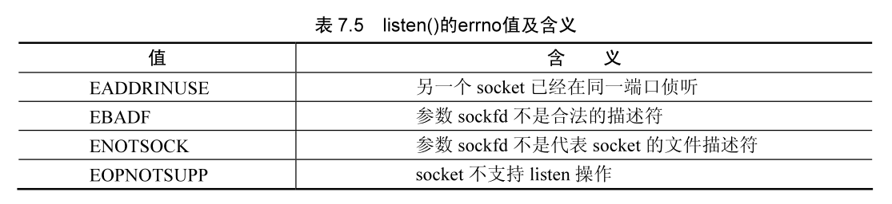

## 套接字编程基础知识

### 套接字地址结构

进行套接字编程需要指定套接字的地址作为参数，不同的协议族有不同的地址结构定义方式。这些地址结构通常以 sockaddr_ 开头，**每一个协议族有一个唯一的后缀**，例如对于以太网，其结构名称为 sockaddr_in。

#### 通用套接字数据结构

通用的套接字地址类型的定义如下，它可以在不同协议族之间进行强制转换。

```cpp
struct sockaddr {        /*套接字地址结构*/
  sa_family_t sa_family; /*协议族*/
  char sa_data[14];      /*协议族数据*/
}
```

上述结构中协议族成员变量 sa_family 的类型为 sa_family_t，其实这个类型是 unsigned short 类型，因此成员变量 sa_famliy 的长度为 16 个字节。

```cpp
typedef unsigned short sa_family_t;
```

#### 实际使用的套接字数据结构

在网络程序设计中所使用的函数中几乎所有的套接字函数都用这个结构作为参数，例如 bind() 函数的原型为：

## 二级

### 三级

```cpp
int bind(
    int sockfd,                     /*套接字文件描述符*/
    const struct sockaddr *my_addr, /*套接字地址结构*/
    socklen_t addrlen               /*套接字地址结构的长度*/
);
```

但是使用结构 struct sockaddr 不方便进行设置，在以太网中，一般均采用结构 struct sockaddr_in 进行设置，这个结构的定义如下：

```cpp
struct sockaddr_in {       /*以太网套接字地址结构*/
  u8 sin_len;              /*结构 struct sockaddr_in的长度,16*/
  u8 sin_family;           /*通常为AFINET*/
  u16 sin_port;            /*16位的端口号,网络字节序 2*/
  struct in_addr sin_addr; /*IP地址32位 4*/
  char sin_zero[8];        /*未用*/
};
```

结构 struct sockaddr_in 的成员变量 in_addr 用于表示 IP 地址，这个结构的定义如下：

```cpp
struct in_addr { /*IP地址结构*/
  u32s addr;     /*32位IP地址,网络字节序*/
};
```

#### 结构 sockaddr 和结构 sockaddr_in 的关系

结构 struct sockaddr 和结构 struct sockaddr_in 是一个同样大小的结构，其对应关系参见图 7.1。


struct sockaddr_in 中的成员含义如下：

- sin_len：无符号字符类型，表示结构 struct sockaddr_in 的长度，为 16。

- sin_family：无符号字符类型，通常设置为与 socket 函数的 domain 一致，例如 AF INET。

- sin_port：无符号 short 类型，表示端口号，网络字节序。

- sin_addr : struct in_addr 类型，其成员 saddr 为无符号 32 位数，每 8 位表示 IP 地址的一个段，网络字节序。

- sin_zero[8]：char 类型，保留。

由于结构 struct sockaddr 和结构 struct sockaddr_in 的大小是完全一致的，所以进行地址结构设置时，通常的方法是利用结构 struct sockaddr_in 进行设置，然后强制转换为结构 struct sockaddr 类型。因为这两个结构大小是完全一致的，所以进行这样的转换不会有什么副作用。

### 用户层和内核层交互过程

套接字参数中有部分参数是需要用户传入的，这些参数用来与 Linux 内核进行通信，例如指向地址结构的指针。通常是采用内存复制的方法进行。例如 bind 函数需要传入地址结构 struct sockaddr *my_addr 和 my_addr 指向参数的长度。

1. 向内核传入数据的交互过程

向内核传入数据的函数有 send、bind 等，从内核得到数据的函数有 accept、recv 等。传入的过程如图 7.2 所示，bind 函数向内核中传入的参数有套接字地址结构和结构的长度两个与地址结构有关的参数。


参数 addlen 表示地址结构的长度，参数 my_addr 是指向地址结构的指针。调用函数 bind 的时候，地址结构通过内存复制的方式将其中的内容复制到内核，地址结构的长度通过传值的方式传入内核，内核按照用户传入的地址结构长度来复制套接字地址结构的内容。

2. 内核传出数据的交互过程

从内核向用户空间传递参数的过程则相反。传出的过程如图 7.3 所示，通过地址结构的长度和套接字地址结构指针来进行地址结构参数的传出操作。通常是两个参数完成传出操作的功能，一个是表示地址结构长度的参数，一个是表示套接字地址结构地址的指针。

传出过程与传入过程中的参数不同的是，表示地址结构长度的参数在传入过程中是传值，而在传出过程中是通过传值完成的。内核按照用户传入的地址结构长度进行套接字地址结构数据的复制，将内核中的地址结构数据复制到用户传入的地址结构指针中。


## TCP 网络编程流程

TCP 网络编程是目前比较通用的方式，例如 HTTP 协议、FTP 协议等很多广泛应用的协议均基于 TCP 协议。TCP 编程主要为 C/S 模式，即服务器 S、客户端 C 模式。

TCP 网络编程的流程包含服务器和客户端两种模式，这两种模式之间的程序设计流程存在很大的差别。

### TCP 网络编程架构

TCP 网络编程有两种模式，一种是服务器模式，另一种是客户端模式。服务器模式创建一个服务程序，等待客户端用户的连接，接收到用户的连接请求后，根据用户的请求进行处理；客户端模式则根据目的服务器的地址和端口进行连接，向服务器发送请求并对服务器的响应进行数据处理。

1. 服务器端的程序设计模式

如图 7.4 所示为 TCP 连接的服务器模式的程序设计流程。流程主要分为套接字初始化 socket()，套接字与端口的绑定 bind()，设置服务器的侦听连接 listen()，接受客户端连接 accep()，接收和发送数据 read()、write() 并进行数据处理及处理完毕的套接字关闭 close()。

- 套接字初始化过程中，根据用户对套接字的需求来确定套接字的选项。这个过程中的函数为 socket，它按照用户定义的网络类型、协议类型和具体的协议标号等参数来定义。系统根据用户的需求生成一个套接字文件描述符供用户使用。

- 套接字与端口的绑定过程中，将套接字与一个地址结构进行绑定。绑定之后，在进行网络程序设计的时候，套接字所代表的 IP 地址和端口地址及协议类型等参数按照绑定值进行操作。

- 由于一个服务器需要满足多个客户端的连接请求，而服务器在某个时间仅能处理有限个数的客户端连接请求，所以服务器需要设置服务端排队队列的长度。服务器侦听连接会设置这个参数，限制客户端中等待服务器处理连接请求的队列长度。

- 在客户端发送连接请求之后，服务器需要接收客户端的连接，然后才能进行其他的处理。

- 在服务器接收客户端请求之后，可以从套接字文件描述符中读取数据或者向文件描述符发送数据。接收数据后服务器按照定义的规则对数据进行处理，并将结果发送给客户端。

- 当服务器处理完数据，要结束与客户端的通信过程的时候，需要关闭套接字连接。

2. 客户端的程序设计模式

图 7.5 为客户端模式，主要分为套接字初始化 socket()，连接服务器 connect()，读写网络数据 read、write 并进行数据处理和最后的套接字关闭 close 过程。


客户端程序设计模式流程与服务器端的处理模式流程类似，二者的不同之处是客户端在套接字初始化之后可以不进行地址绑定，而是直接连接服务器端。

客户端连接服务器的处理过程中，客户端根据用户设置的服务器地址、端口等参数与特定的服务器程序进行通信。

3. 客户端与服务器的交互过程

客户端与服务器在连接、读写数据、关闭过程中有交互过程。

- 客户端的连接过程，对服务器端是接收过程，在这个过程中客户端与服务器进行三次握手，建立 TCP 连接。建立 TCP 连接之后，客户端与服务器之间可以进行数据的交互。

- 客户端与服务器之间的数据交互是相对的过程，客户端的读数据过程对应了服务器端的写数据过程，客户端的写数据过程对应服务器的读数据过程。口在服务器和客户端之间的数据交互完毕之后，关闭套接字连接。

### 创建网络插口函数 socket()

网络程序设计中的套接字系统调用 socket 函数用来获得文件描述符。

1. socket() 函数介绍

socket 函数的原型如下，这个函数建立一个协议族为 domain、协议类型为 type、协议编号为 protocol 的套接字文件描述符。如果函数调用成功，会返回一个表示这个套接字的文件描述符，失败的时候返回 -1。

```cpp
#include <sys/socket.h>
#include <sys/types.h>
int socket(int domain, int type, int protocol);
```

函数 socket 的参数 domain 用于设置网络通信的域，函数 socket() 根据这个参数选择通信协议的族。通信协议族在文件 sys/socket.h 中定义，包含表 7.1 所示的值，以太网中应该 PF_INET 这个域。在程序设计的时候会发现有的代码使用了 AF_INET 这个值，在头文件中 AF_INET 和 PF_INET 的值是一致的。


函数 socket 的参数 type 用于设置套接字通信的类型，表 7.2 所示为 type 格式定义值及含义。主要有 SOCK_STREAM（流式套接字）、SOCK_DGRAM（数据包套接字）等。


并不是所有的协议族都实现了这些协议类型，例如，AF_INET 协议族就没有实现 SOCK_SEQPACKET 协议类型。

函数 socket() 的第 3 个参数 protocol 用于指定某个协议的特定类型，即 type 类型中的某个类型。通常某个协议中只有一种特定类型，这样 protocol 参数仅能**设置为 0** ；但是有些协议有多种特定的类型，就需要设置这个参数来选择特定的类型。

- 类型为 SOCK_STREAM 的套接字表示一个双向的字节流，与管道类似。流式的套接字在进行数据收发之前必须已经连接，连接使用 connect() 函数进行。一旦连接，可以使用 read 或者 write() 函数进行数据的传输。流式通信方式保证数据不会丢失或者重复接收，当数据在一段时间内仍然没有接收完毕，可以将这个连接认为已经死掉。

- SOCK_DGRAM 和 SOCK_RAW 这两种套接字可以使用函数 sendto 来发送数据，使用 recvfrom() 函数接收数据，recvfrom 接收来自指定 IP 地址的发送方的数据。

- SOCK_PACKET 是一种专用的数据包，它直接从设备驱动接收数据。

函数 socket 并不总是执行成功，有可能会出现错误，错误的产生有多种原因，可以通过 errno 获得，具体值和含义在表 7.3 中列出。通常情况下造成函数 socket() 失败的原因是输入的参数错误造成的，例如某个协议不存在等，这时需要详细检查函数的输入参数。由于函数的调用不一定成功，在进行程序设计的时候，一定要检查返回值。


使用 socket 函数的时候需要设置上述 3 个参数，例如将 socket() 函数的第 1 个参数 domain 设置为 AF_INET，第 2 个参数设置为 SOCK_STREAM，第 3 个参数设置为 0，建立一个流式套接字。

```cpp
int sock=socket(AF_INET,SOCK_STREAM,0);
```

2. 应用层函数 socket() 和内核函数之间的关系用户设置套接字的参数后，函数要能够起作用，需要与内核空间的相关系统调用交互。

应用层的 socket 函数是和内核层的系统调用相对应的，如图 7.6 所示。


图中用户调用函数 sock = socket(AF_INET,SOCK_STREAM,0)，这个函数会调用系统调用函数 sys_socket(AF_INET,SOCK_STREAM,0) 在文件 net/socket.c 中。系统调用 sys socket 分为两部分，一部分生成内核 socket 结构 注意与应用层的 socket 函数是不同的，另一部分与文件描述符绑定，将绑定的文件描述符值传给应用层。内核 sock 结构如下在文件 linux/net.h 中：

```cpp
struct socket {
  socket_state state;                /*socket 状态(例如SS CONNECTED等)*/
  unsigned long flags;               /*socket 标志(SOCK ASYNC NOSPACE等)*/
  const struct proto_ops *ops;       /*协议特定的socket操作*/
  struct fasync_struct *fasync_list; /*异步唤醒列表*/
  struct file *file;                 /*文件指针*/
  struct sock *sk;                   /*内部网络协议结构*/
  wait_queue_head_t wait;            /*多用户时的等待队列*/
  short type;                        /*socket类型(SOCK STREAM等)*/
};
```

内核函数 sock_create 根据用户的 domain 指定的协议族，创建一个内核 socket 结构绑定到当前的进程上，其中的 type 与用户空间用户的设置值是相同的。

sock_map_fd 函数将 socket 结构与文件描述符列表中的某个文件描述符绑定，之后的操作可以查找文件描述符列表来对应内核socket结构。

### 绑定一个地址端口对 bind()

在建立套接字文件描述符成功后，需要对套接字进行地址和端口的绑定，才能进行数据的接收和发送操作。

1. bind() 函数介绍

bind 函数将长度为 addlen 的 struct sockadd 类型的参数 my_addr 与 sockfd 绑定在一起，将 sockfd 绑定到某个端口上，如果使用 connect() 函数则没有绑定的必要。绑定的函数原型如下：

```cpp
#include <sys/socket.h>
#include <sys/types.h>
int bind(int sockfd, const struct sockaddr *my_addr, socklen t addrlen);
```

bind() 函数有 3 个参数。第 1 个参数 sockfd 是用 socket 函数创建的文件描述符。

第 2 个参数 my_addr 是指向一个结构为 sockaddr 参数的指针，sockaddr 中包含了地址、端口和 IP 地址的信息。在进行地址绑定的时候，需要先将地址结构中的 IP 地址、端口、类型等结构 struct sockaddr 中的域进行设置后才能进行绑定，这样进行绑定后才能将套接字文件描述符与地址等结合在一起。

第 3 个参数 addrlen 是 my addr 结构的长度，可以设置成 sizeof(struct sockaddr)。使用 sizeof(struct sockaddr) 来设置 addlen 是一个良好的习惯，虽然一般情况下使用 AF_INET 来设置套接字的类型和其对应的结构，但是不同类型的套接字有不同的地址描述结构，如果对地址长度进行了强制的指定，可能会造成不可预料的结果。

bind() 函数的返回值为 0 时表示绑定成功，-1 表示绑定失败，errno 的错误值如表 7.4 所示。


下面的代码初始化一个 AF_UNIX 族中的 SOCKSTREAM 类型的套接字，先使用结构 struct sockaddr_un 初始化 my_addr，然后进行绑定，结构 struct sockaddr_un 的定义如下：

```cpp
struct sockaddr_un {
  sa_family_t sun_family;       /*协议族,应该设置为AFUNIX*/
  char sun_path[UNIX_PATH_MAX]; /*路径名,UNIXPATHMAX的值为108*/
)
```

2. bind() 函数的例子

下面是使用 bind 函数进行程序设计的一个实例代码，先建立一个 UNIX 族的流类型套接字，然后将套接字地址和套接字文件描述符进行绑定。

```cpp
#include <memory.h>
#include <stdio.h>
#include <stdlib.h>
#include <sys/socket.h>
#include <unistd.h>

#define MY_SOCK_PATH "/path"

#define UNIX_PATH_MAX 108

struct sockaddr_un {
  sa_family_t sun_family;       /*协议族,应该设置为 AF_UNIX*/
  char sun_path[UNIX_PATH_MAX]; /*路径名,UNIX_PATH_MAX 的值为 108*/
};

int main(int argc, char *argv[]) {
  int sfd;
  struct sockaddr_un addr; /*AF_UNIX 对应的结构*/

  sfd = socket(AF_UNIX, SOCK_STREAM, 0);

  /*初始化一个 AF_UNIX 族的流类型 socket*/
  if (sfd == -1) { /*检查是否正常初始化 socket*/
    perror("socket");
    exit(EXIT_FAILURE);
  }

  memset(&addr, 0, sizeof(struct sockaddr_un)); /*将变量 addr 置 0*/

  addr.sun_family = AF_UNIX;             /*协议族为 AF_UNIX*/
  strncpy(addr.sun_path, MY_SOCK_PATH, sizeof(addr.sun_path) - 1); /*复制路径到地址结构*/

  if (bind(sfd, (struct sockaddr *) &addr, sizeof(struct sockaddr_un)) == -1) { /*判断是否绑定成功*/
    perror("bind");
    exit(EXIT_FAILURE);
  }

  /*数据接收发送及处理过程*/

  close(sfd); /*关闭套接字文件描述符*/
}
```

- 第 05 行将协议族参数设置为 AF_UNIX 建立 UNIX 族套接字，使用函数 socket 进行建立。

- 第 10 行初始化地址结构，将 UNIX 地址结构设置为 0，这是进行程序设计时常用的初始化方法。

- 第 11 行将地址结构的参数 sun famliy 设置为 AFUNIX。

- 第 12 行复制地址结构的路径。

- 第 14 行将套接字文件描述符与 UNIX 地址结构绑定在一起。

- 第 15 行判断是否绑定成功。

- 第 19 行进行数据的接收、发送和数据的处理过程。

Linux 的 GCC 编译器有一个特点，一个结构的最后一个成员为数组时，这个结构可以通过最后一个成员进行扩展，可以在程序运行时第一次调用此变量的时候动态生成结构的大小，例如上面的代码，并不会因为 struct sockaddr_un 比 struct sockaddr 大而溢出。

另一个例子是使用结构 struct sockaddr_in 绑定一个 AFINET 族的流协议，先将结构 struct sockaddr_in 的 sin_famliy 设置为 AFINET，然后设置端口，接着设置一个 IP 地址，最后进行绑定。实例代码如下：

```cpp
#include <arpa/inet.h>
#include <netinet/in.h>
#include <stdio.h>
#include <stdlib.h>
#include <strings.h>
#include <sys/socket.h>
#include <unistd.h>

#define MYPORT 3490 /*端口地址*/

int main(int argc, char *argv[]) {
  int sockfd;                 /*套接字文件描述符变量*/
  struct sockaddr_in my_addr; /*以太网套接字地址结构*/

  sockfd = socket(AF_INET, SOCK_STREAM, 0); /*初始化 socket*/

  if (sockfd == -1) { /*检查是否正常初始化socket*/
    perror("socket");
    exit(EXIT_FAILURE);
  }

  my_addr.sin_family = AF_INET;                         /*地址结构的协议族*/
  my_addr.sin_port = htons(MYPORT);                     /*地址结构的端口地址,网络字节序*/
  my_addr.sin_addr.s_addr = inet_addr("192.168.4.171"); /*IP,将字符串的IP地址转化为网络字节序*/

  bzero(&(my_addr.sin_zero), 8); /*将my_addr.sin_zero 置为0*/

  if (bind(sockfd, (struct sockaddr *) &my_addr, sizeof(struct sockaddr)) == -1) { /*判断是否绑定成功*/
    perror("bind");
    exit(EXIT_FAILURE);
  }

  close(sockfd); /*关闭套接字文件描述符*/
}
```

- 第 01 行定义地址结构中需要绑定地址的端口值。

- 第 05 行和第 06 行初始化套接字文件描述符和以太网地址结构的变量。

- 第 08 行建立一个 AFINET 类型的流式套接字。

- 第 09 ~ 12 行如果套接字初始化失败时候的处理措施。

- 第 13 行设置地址结构的协议族为 AFINET。

- 第 14 行设置地址结构的端口地址为 MYPORT，由于 MYPORT 为主机字节序，使用函数 htons() 进行字节序转换。

- 第 15 行设置地址结构的 IP 地址，使用函数 inet_addr 将字符串 192.168.1.150 转换为二进制网络字节序的 IP 地址值。

- 第 16 行将地址结构的 sin zero 域设置为 0。

- 第 17 行将地址结构与套接字文件描述符进行绑定。

- 第 22 行接收数据、发送数据和进行数据处理的过程。

- 第 23 行在数据处理过程结束后，关闭套接字。

3. 应用层 bind() 函数和内核函数之间的关系函数

bind 是应用层函数，要使函数生效，需要将相关的参数传递给内核并进行处理。

应用层的 bind0 函数与内核层之间的函数过程如图 7.7 所示，图中是一个 AF_INET 族函数进行绑定的调用过程。


应用层的函数` bind(sockfd,(struct sockaddr * ) & my_addr,sizeof(struct sockaddr))` 调用系统函数过程 `sys_bind(sockfd,(struct sockaddr * ) & my_addr,sizeof(struct sockaddr)`)。sys_bind() 函数首先调用函数 `sockfd_lookup_light` 来获得文件描述符 sockfd 对应的内核 struct sock 结构变量，然后调用函数 move_addr_to_kernel 将应用层的参数 my_addr 复制进内核，放到 address 变量中。

内核的 sock 结构是在 socket 函数时根据协议生成的，它绑定了不同协议族的 bind 函数的实现方法，在 AF_INET 族中的实现函数为 inet_bind()，即会调用 AF_INET 族的 bind() 函数进行绑定处理。

### 监听本地端口 listen

在 7.2.1 节中简单介绍了服务器模式的方式，服务器模式中有 listen 和 accept 两个函数，而客户端则不需要这两个函数。函数 listen 用来初始化服务器可连接队列，服务器处理客户端连接请求的时候是顺序处理的，同一时间仅能处理一个客户端连接。当多个客户端的连接请求同时到来的时候，服务器并不是同时处理，而是将不能处理的客户端连接请求放到等待队列中，这个队列的长度由 listen 函数来定义。

1. listen() 函数介绍

listen 函数的原型如下，其中的 backlog 表示等待队列的长度。

```cpp
#include<sys/socket.h>
int listen(int sockfd,int backlog);
```

当 listen 函数成功运行时，返回值为 0 ；当运行失败时，它的返回值为 -1，并且设置 errno 值，错误代码的含义如表 7.5 所示。



在接受一个连接之前，需要用 listen 函数来侦听端口，listen() 函数中参数 backlog 的参数表示在 accept() 函数处理之前在等待队列中的客户端的长度，如果超过这个长度，客户端会返回一个 ECONNREFUSED 错误。

listen() 函数仅对类型为 SOCKSTREAM 或者 SOCKSEQPACKET 的协议有效，例如，如果对一个 SOCKDGRAM 的协议使用 listen()，将会出现错误 errno 应该为值 EOPNOTSUPP，表示此 socket 不支持 listen 操作。大多数系统的设置为 20，可以将其设置修改为 5 或者 10，根据系统可承受负载或者应用程序的需求来确定。

2. listen() 函数的例子

下面是一个 listen 函数的实例代码，在成功进行 socket 初始化和 bind 端口之后，设置 listen() 队列的长度为 5。

```cpp
#include <arpa/inet.h>
#include <netinet/in.h>
#include <stdio.h>
#include <stdlib.h>
#include <strings.h>
#include <sys/socket.h>
#include <unistd.h>

#define MYPORT 3490 /*端口地址*/

int main(int argc, char *argv[]) {
  int sockfd;                 /*套接字文件描述符变量*/
  struct sockaddr_in my_addr; /*以太网套接字地址结构*/

  sockfd = socket(AF_INET, SOCK_STREAM, 0); /*初始化 socket*/

  if (sockfd == -1) { /*检查是否正常初始化socket*/
    perror("socket");
    exit(EXIT_FAILURE);
  }

  my_addr.sin_family = AF_INET;                         /*地址结构的协议族*/
  my_addr.sin_port = htons(MYPORT);                     /*地址结构的端口地址,网络字节序*/
  my_addr.sin_addr.s_addr = inet_addr("192.168.4.171"); /*IP,将字符串的IP地址转化为网络字节序*/

  bzero(&(my_addr.sin_zero), 8); /*将my_addr.sin_zero 置为0*/

  if (bind(sockfd, (struct sockaddr *) &my_addr, sizeof(struct sockaddr)) == -1) { /*判断是否绑定成功*/
    perror("bind");
    exit(EXIT_FAILURE);
  }

  /*进行侦听队列长度的绑定*/
  if (listen(sockfd, 5) == -1) { /*判断是否listen成功*/
    perror("listen");            /*打印错误信息*/
    exit(EXIT_FAILURE);          /*退出程序*/
  }

  close(sockfd); /*关闭套接字文件描述符*/
}
```

3. 应用层 listen() 函数和内核函数之间的关系

应用层 listen() 和内核层 listen() 的关系如图 7.8 所示，应用层的 listen 函数对应于系统调用 sys_listen 函数。sys_listen() 函数首先调用 `sockfd_lookup_light` 函数获得 sockfd 对应的内核结构 struct socket，查看用户的 backlog 设置值是否过大，如果过大则设置为系统默认最大设置。然后调用抽象的 listen 函数，这里指的是 AF_INET 的 listen() 函数 inet_listen()。

inet_listen 函数首先判断是否合法的协议族和协议类型，然后更新 socket 的状态值为 TCPLISTEN，然后为客户端的等待队列申请空间并设定侦听端口。

```shell

```

### 接受一个网络请求 accept()

当一个客户端的连接请求到达服务器主机侦听的端口时，此时客户端的连接会在队列中等待，直到使用服务器处理接收请求。

函数 accept 成功执行后，会返回一个新的套接口文件描述符来表示客户端的连接，客户端连接的信息可以通过这个新描述符来获得。因此当服务器成功处理客户端的请求连接过 accept 返回的新套接字文件描述符来进行的，而不是通过建立套接字时的文件描述符，这是在程序设计的时候需要注意的地方。如果 accept 函数发生错误，accept 会返回 -1。

通过 errno 可以得到错误值，含义在表 7.6 中进行介绍。


2. accept() 函数的例子

下面是一个简单地使用 accept 函数的例子。这个例子先建立一个流式套接字，然后对套接字进行地址绑定，当绑定成功后，初始化侦听队列的长度，然后等待客户端的连接请求。

```cpp
#include <netinet/in.h>
#include <stdio.h>
#include <stdlib.h>
#include <strings.h>
#include <sys/socket.h>
#include <unistd.h>

#define MYPORT 3490 /*端口地址*/

int main(int argc, char *argv[]) {
  int sockfd, client_fd; /*sockfd为侦听的 socket,client_fd为连接方的socket值*/

  struct sockaddr_in my_addr;     /*本地地址信息*/
  struct sockaddr_in client_addr; /*客户端连接的地址信息*/

  socklen_t addr_length; /*int类型变量,用于保存网络地址长度量*/

  sockfd = socket(AF_INET, SOCK_STREAM, 0); /*初始化一个IPv4族的流式连接*/

  if (sockfd == -1) {   /*检查是否正常初始化socket*/
    perror("socket");   /*打印错误信息*/
    exit(EXIT_FAILURE); /*退出程序*/
  }

  my_addr.sin_family = AF_INET;         /*协议族为IPv4,主机字节序*/
  my_addr.sin_port = htons(MYPORT);     /*端口,短整形,网络字节序*/
  my_addr.sin_addr.s_addr = INADDR_ANY; /*自动IP地址获得*/

  bzero(&(my_addr.sin_zero), 8); /*置0*/

  /*绑定端口地址*/
  if (bind(sockfd, (struct sockaddr *) &my_addr, sizeof(struct sockaddr)) == -1) { /*判断是否绑定成功*/
    perror("bind");                                                                /*打印错误信息*/
    exit(EXIT_FAILURE);                                                            /*退出程序*/
  }

  /*设置侦听队列长度为BACKLOG=10*/
  int BACKLOG = 10;
  if (listen(sockfd, BACKLOG) == -1) { /*判断是否listen成功*/
    perror("listen");                  /*打印错误信息*/
    exit(EXIT_FAILURE);                /*退出程序*/
  }

  addr_length = sizeof(struct sockaddr_in); /*地址长度*/
  client_fd = accept(sockfd, (struct sockaddr *) &client_addr, &addr_length);

  /*等待客户端连接,地址在client addr中*/
  if (client_fd == -1) { /*accept出错*/
    perror("accept");    /*打印错误信息*/
    exit(EXIT_FAILURE);  /*退出程序*/
  }

  /*处理客户端连接过程*/
  close(client_fd); /*关闭客户端连接*/

  /*其他过程*/

  close(sockfd); /*关闭服务器端连接*/
}
```

3. 应用层 accept() 函数和内核函数之间的关系

应用层的 accept() 和内核层的 accept() 的关系参见图 7.9。


应用层的 accept 函数对应内核层的 sys_accept 系统调用函数。函数 sys_accept 查找文件描述符对应的内核 socket 结构、申请一个用于保存客户端连接的新的内核 socket 结构、执行内核接受函数、获得客户端的地址信息、将连接的客户端地址信息复制到应用层的用户、返回连接客户端 socket 对应的文件描述符。

sys_accept 调用函数 sockfd_lookup_light 查找到文件描述符对应的内核 socket 结构后，会申请一块内存用于保存连接成功的客户端的状态。socket 结构的一些参数，例如类型 type、操作方式 ops 等会继承服务器原来的值，例如如果原来服务器的类型为 AF_INET 则，其操作模式仍然是 af_inet.c 文件中的各个函数。然后会查找文件描述符表，获得一个新结构对应的文件描述符。

accept() 函数的实际调用根据不同的协议族是不同的，即函数指针 sock->ops->accept 要有 socket() 初始化时的协议族而确定。当为 AF_INET 时，此函数指针对应于 af_inet.c 文件中的 inet_accept 函数。

当客户端连接成功后，内核准备连接的客户端的相关信息，包含客户端的 IP 地址、客户端的端口等信息，协议族的值继承原服务器的值。在成功获得信息之后会调用 move_addr_to_user 函数将信息复制到应用层空间，具体的地址由用户传入的参数来确定。

### 连接目标网络服务器 connect()

客户端在建立套接字之后，不需要进行地址绑定，就可以直接连接服务器。连接服务器的函数为 connect()，此函数连接指定参数的服务器，例如 IP 地址、端口等。

1. connect() 函数介绍

connect 函数的原型如下，其中的参数 sockfd 是建立套接字时返回的套接字文件描述符，它是由系统调用 socket 返回的。参数 serv_addr，是一个指向数据结构 sockaddr 的指针，其中包括客户端需要连接的服务器的目的端口和 IP 地址以及协议类型。参数 addrlen 表示第二个参数内容的大小，可以使用 sizeof(struct sockaddr) 而获得，与 bind 不同，这个参数是一个整型的变量而不是指针。

```cpp
#include<sys/types.h>
#include<sys/socket.h>
int connect(int sockfd,struct sockaddr*,int addrlen);
```

connect 函数的返回值在成功时为 0，当发生错误的时候返回 -1，可以查看 errno 获得错误的原因。错误值及含义在表 7.7 中列出。


2. connect() 函数的例子

下面是 connect 函数的使用实例代码，与服务器的代码类似，先建立一个套接字文件描述符，当成功建立描述符后，将需要连接的服务器 IP 地址和端口填充到一个地址结构中，connect() 函数连接到地址结构所指定的服务器上。

```cpp
#include <netinet/in.h>
#include <stdio.h>
#include <stdlib.h>
#include <strings.h>
#include <sys/socket.h>
#include <unistd.h>

#define DEST_IP "220.181.38.148" /*服务器的IP地址*/
#define DEST_PORT 80           /*服务器端口*/

int main(int argc, char *argv[]) {
  int ret = 0;
  int sockfd;                /*sockfd为连接的 socket*/
  struct sockaddr_in server; /*服务器地址的信息*/

  /*初始化一个IPv4族的流式连接*/
  sockfd = socket(AF_INET, SOCK_STREAM, 0);
  if (sockfd == -1) { /*检查是否正常初始化 socket*/
    perror("socket");
    exit(EXIT_FAILURE);
  }

  server.sin_family = AF_INET;             /*协议族为IPv4,主机字节序*/
  server.sin_port = htons(DEST_PORT);      /*端口,短整形,网络字节序*/
  server.sin_addr.s_addr = htonl(DEST_IP); /*服务器的IP地址*/

  bzero(&(server.sin_zero), 8); /*保留字段置0*/
  ret = connect(sockfd, (struct sockaddr *) &server, sizeof(struct sockaddr));

  /*接收或者发送数据*/

  close(sockfd);
}
```

3. 应用层 connect() 函数和内核函数之间的关系

应用层 connect 函数和内核层的 connect 关系如图 7.10 所示。内核层的 connect 比较简单，主要进行不同的协议映射的时候要根据协议的类型进行选择，例如数据报和流式数据的 connect() 函数不同，流式的回调函数为 inet_stream_connect，数据报的回调函数为 inet_dgram_connect()。


### 写入数据函数 write()

如图 7.5 所示，当服务器端在接收到一个客户端的连接后，可以通过套接字描述符进行数据的写入操作。对套接字进行写入的形式和过程与普通文件的操作方式一致，内核会根据文件描述符的值来查找所对应的属性，当为套接字的时候，会调用相对应的内核函数。下面是一个向套接字文件描述符中写入数据的例子，将缓冲区 data 的数据全部写入套接字文件描述符 s 中，返回值为成功写入的数据长度。

```cpp
int size; 
char data[1024]; 
size=write(s,data,1024);
```

### 读取数据函数 read()

与写入数据类似，使用 read() 函数可以从套接字描述符中读取数据。当然在读取数据之前，必须建立套接字并连接。读取数据的方式如下所示，从套接字描述符 s 中读取 1024 个字节，放入缓冲区 data 中，size 变量的值为成功读取的数据大小。

```cpp
int size;
char data[1024];
size=read(s,data,1024);
```

### 关闭套接字函数 close()

关闭 socket 连接可以使用 close 函数实现，函数的作用是关闭已经打开的 socket 连接，内核会释放相关的资源，关闭套接字之后就不能再使用这个套接字文件描述符进行读写操作了。函数原型在第 3 章中已经介绍过。

函数 shutdown 可以使用更多方式来关闭连接，允许单方向切断通信或者切断双方的通信。函数原型如下，第一个参数 s 是切断通信的套接口文件描述符，第二个参数 how 表示切断的方式。

```cpp
#include <sys/socket.h>
int shutdown(int s,int how);
```

函数 shutdown 用于关闭双向连接的一部分，具体的关闭行为方式通过参数的 how 设置来实现。可以为如下值：

- SHUTRD：值为 0，表示切断读，之后不能使用此文件描述符进行读操作。

- SHUT_WR：值为 1，表示切断写，之后不能使用此文件描述符进行写操作。

- SHUT_RDWR：值为 2，表示切断读写，之后不能使用此文件描述符进行读写操作，与 close() 函数功能相同。

函数 shutdown 如果调用成功则返回 0，如果失败则返回 -1，通过 errno 可以获得错误的具体信息，错误值含义参见表 7.8。


## 服务器 / 客户端的简单例子

src\docs\Linux网络编程\CH07\tcp
