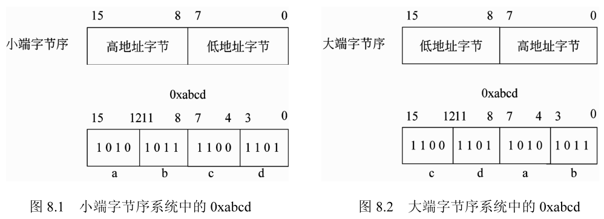
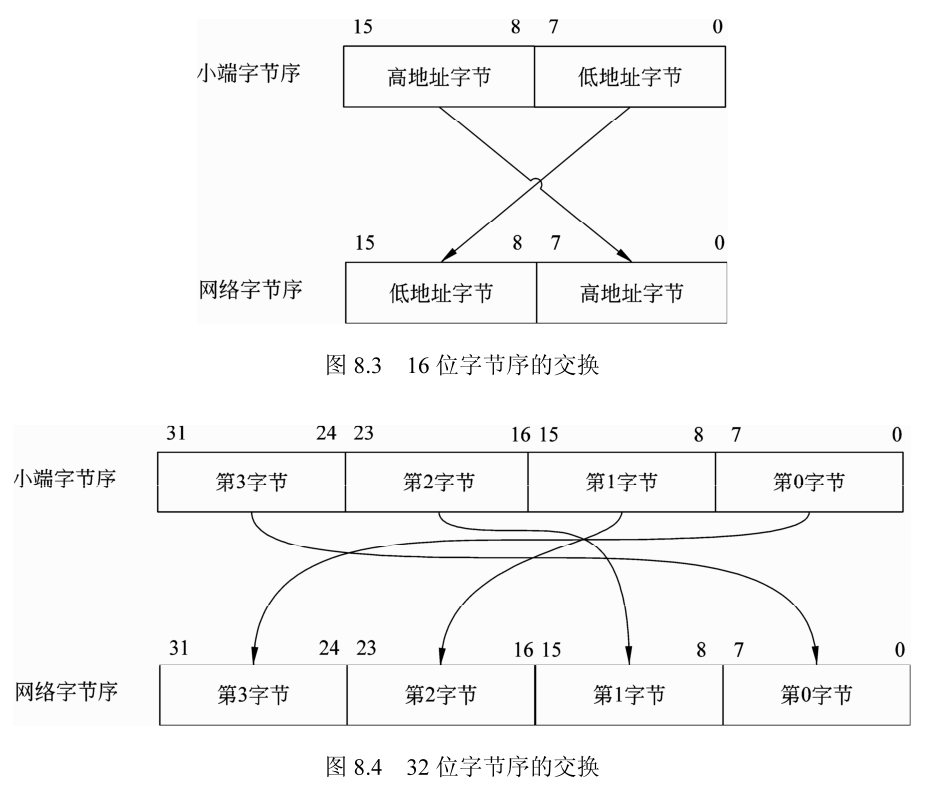
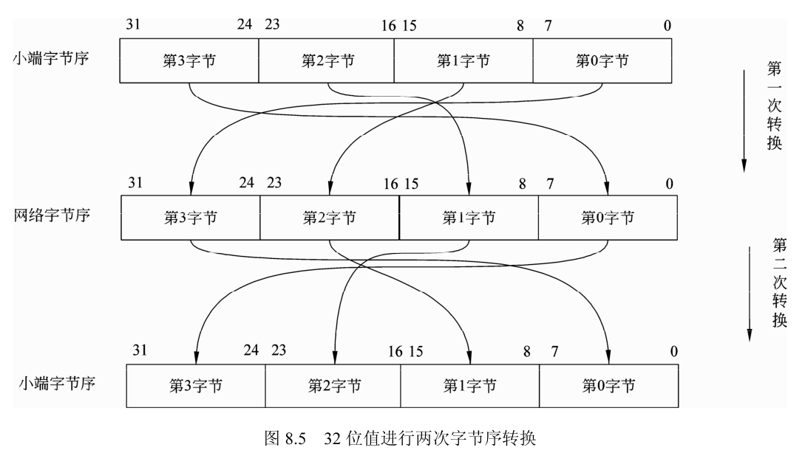
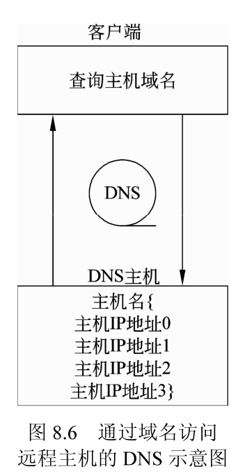
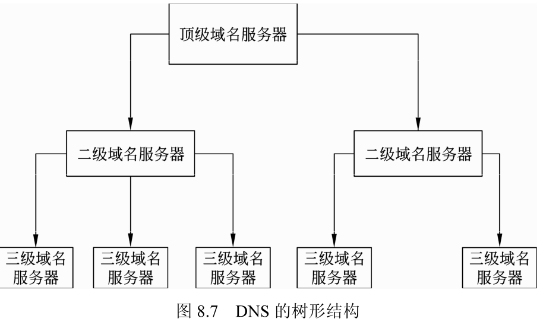
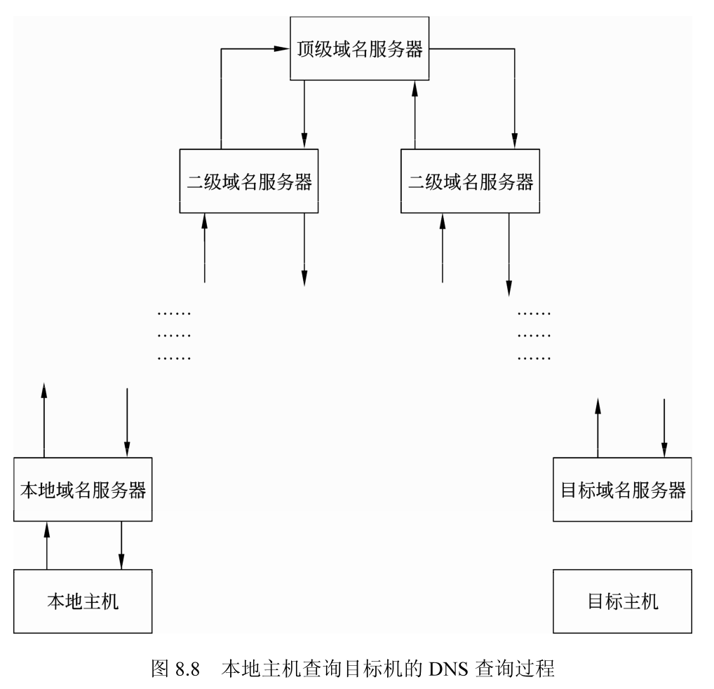

## 字节序

字节序是由于不同的主处理器和操作系统，对大于一个字节的变量在内存中的存放顺序不同而产生的，例如 2 个字节的 short int 和 4 个字节的 int 类型变量都有字节序的问题。

字节序通常有大端字节序和小端字节序两种分类方法。

### 大端字节序和小端字节序

字节序是由于 CPU 和 OS 对多字节变量的内存存储顺序不同而产生的。

1. 字节序介绍

例如一个 16 位的整数，它由两个字节构成，在有的系统上会将高字节放在内存的低地址上，而有的系统上则将高字节放在内存的高地址上，所以存在字节序的问题。大于一个字节的变量类型的表示方法有两种：

- 小端字节序 LitleEndian，LE：在表示变量的内存地址的起始地址存放低字节，高字节顺序存放；

- 大端字节序 BigEndian，BE：在表示变量的内存地址的起始地址存放高字节，低字节顺序存放。

例如变量的值为 0xabcd，在大端字节序和小端字节序的系统中二者的存放顺序是不同的，在小端字节序系统中的存放顺序如图 8.1 所示，假设存放值 0xabcd 的内存地址的起始地址为0，则 0xab 在地址 `15 ~ 8` 的地址上，而 0xcd 在地址 `7 ~ 0` 的位置上。在大端字节序系统中的存放顺序如图 8.2 所示，假设存放值 0xabcd 的内存地址起始地址为 0，则 0xab 在地址 `7 ~ 0` 的地址上，而 0xcd 在地址 `15 ~ 8` 的位置上。



2. 字节序的例子

下面的一段代码用于检查按照图 8.1 和图 8.2 所示变量在内存中的表示方法，确定系统中的字节序为大端字节序还是小端字节序。

1）字节序结构。程序先建立一个联合类型 to，用于测试字节序，成员 value 是 short 类型变量，可以通过成员 byte 来访问 value 变量的高字节和低字节。

2）变量声明。声明一个 to 类型的变量 typeordr，将值 0xabcd 赋给成员变量 value。由于在类型 to 中，value 和 byte 成员共享同一块内存，所以可以通过 byte 的不同成员来访问 value 的高字节和低字节。

3）小端字节序判断。小端字节序的检查通过判断 typeorder 变量的 byte 成员高字节和低字节的值来进行：低字节的值为 0xcd，高字节的值为 0xab。

4 大端字节序判断。大端字节序的检查同样通过判断 typeorder 变量的 byte 成员高字节和低字节的值来进行：低字节的值为 0xab，高字节的值为 0xcd。

```cpp
#include <stdio.h>

/*联合类型的变量类型,用于测试字节序;
成员 value 的高低端字节可以由成员 type 按字节访问*/
typedef union {
  unsigned short int value; /*短整型变量 2 字节*/
  unsigned char byte[2];    /*字符类型  2 字节*/
} to;

int main() {
  to typeorder;             /*一个to类型变量*/
  typeorder.value = 0xabcd; /*将typeorder变量赋值为0xabcd*/

  /*小端字节序检查*/
  if (typeorder.byte[0] == 0xcd && typeorder.byte[1] == 0xab) {
    /*低字节在前*/
    printf("Low endian byte order"
           "byte[0]:0x%x,byte[1]:0x%x\n",
           typeorder.byte[0], typeorder.byte[1]);
    return 0;
  }

  /*大端字节序检查*/
  if (typeorder.byte[0] == 0xab && typeorder.byte[1] == 0xcd) {
    /*高字节在前*/
    printf("High endian byte order"
           "byte[0]:0x%x,byte[1]:0x%x\n",
           typeorder.byte[0], typeorder.byte[1]);
    return 0;
  }

  return 0;
}
```

### 字节序转换函数

由于主机的千差万别，主机的字节序不能做到统一，但是对于网络上传输的变量，它们的值必须有一个统一的表示方法。网络字节序是指多字节变量在网络传输时的表示方法，网络字节序采用高端字节序的表示方法。这样小端字节序的系统通过网络传输变量的时候需要进行字节序的转换，大端字节序的变量则不需要进行转换。

1. 字节序转换函数介绍

为了程序的设计方便，让用户的程序与平台无关，Linux 操作系统提供了如下函数进行字节序的转换：

```cpp
#include <arpa/inet.h>
uint32t htonl(uint32t hostlong);/*主机字节序到网络字节序的长整型转换*/
uint16t htons(uint16t hostshort);/*主机字节序到网络字节序的短整型转换*/
uint32t ntohl(uint32t netlong);/*网络字节序到主机字节序的长整型转换*/
uint16t ntohs(uint16t netshort);/*网络字节序到主机字节序的短整型转换*/
```

- 函数传入的变量为需要转换的变量，返回值为转换后的数值。

- 函数的命名规则为“字节序”“to”“字节序”“变量类型”。在上述函数中，h 表示 host，即主机字节序； n 表示 network，即网络网络字节序； 1 表示 long 型变量，s 表示 short 型变量。函数 htonl0 的含义为“主机字节序”转换为“网络字节序”，操作的变量为“long 型变量”。其他几个函数含义类似。

- 两个对 short 类型进行转换的函数为 htons 和 ntohs()，两个对 long 类型变量进行转换的函数为 htonl() 和 ntohl。

用户在进行程序设计的时候，需要调用字节序转换函数将主机的字节序转换为网络字节序，至于是否交换字节的顺序，则由字节序转换函数的实现来保证。也就是说对于用户来说这种转换是透明的。只要将需要在网络上传输的变量调用一遍此类的转换函数进行一次转换即可，不用考虑目标系统的主机字节序方式。

2. 字节序转换的方法

以上函数的作用对字节进行的交换，在大端字节序系统上，上述的字节序转换函数的实际实现，可能是空的，即不进行字节序的转换；而对于小端字节序系统，需要将字节在变量中的顺序进行交换，例如 16b 的变量交换高低两个字节的位置，32b 的变量将 0、1、2、3 位置的字节按照 0 和 3、1 和 4 字节进行交换的方法。例如在一个小端主机字节序系统上，进行 16 位数值交换的方法如图 8.3 所示，进行 32 位变量的交换方法如图 8.4 所示。



图 8.3 中表示的是一个 16b 的变量的字节序交换方法。在小端字节序主机系统中，进行转换时，将高地址的字节和低地址的字节进行交换；图 8.4 中表示的是一个 32b 的变量进行字节序交换的方法，在小端字节序主机系统中，进行字节序交换时，第 0 个字节的值与第 3 个字节的值进行交换，第 1 个字节的值与第 2 个字节的值进行交换。

字节序交换的作用是生成一个网络字节序的变量，其字节的顺序与主机类型和操作系统无关。进行网络字节序转换的时候，只要转换一次就可以了，不要进行多次的转换。如果进行多次字节序的转换，最后生成的网络字节序的值可能是错误的。例如，对于主机为小端字节序的系统，进行两次字节序转换的过程如图 8.5 所示，经过两次转换，最终的值与最初的主机字节序相同。



### 一个字节序转换的例子

下面的例子是对 16 位数值和 32 位数值进行字节序转换，每种类型的数值进行两次转换，最后打印结果。

1. 16 位字节序转换结构

先定义用于 16 位字节序转换的结构 to16，这个结构是一个联合类型，通过 value 来赋值，通过 byte 数组来进行字节序转换。

```cpp
#include <stdio.h>
/*联合类型的变量类型,用于测试字节序
成员value的高低端字节可以由成员type按字节访问
16位字节序转换的结构*/
typedef union {
  unsigned short int value; /*16位short 类型变量value*/
  unsigned char byte[2];    /*char类型数组,共16位*/
} to16;
```

2. 32 位字节序转换结构

用于 32 位字节序转换的结构名称为 to32，与 to16 相似，它也有两个成员变量：value 和 byte。成员变量 value 是一个 unsigned long int 类型的变量，32 位长；成员变量 byte 是一个 char 类型的数组，数组的长度为 4，也是 32 位长。32 位字节序的转换可以通过 to32 的 value 成员变量来赋值，通过 byte 来进行字节序的转换。

```cpp
/*32位字节序转换的结构*/
typedef union{
unsigned long int value;/*32位unsigned long类型变量*/
unsigned char byte[4];/*char类型数组,共32位*/
}to32;
```

3. 变量值打印函数showvalue()

showvalue) 函数用于打印变量值, 打印的方式是从变量存储空间的第一个字节开始, 按照字节进行打印.showvalue() 函数有两个输入参数, 一个是变量的地址指针 begin, 一个是表示字长的标志 flag. 参数 flag 的值为 BITS16 的时候打印 16 位变量的值, 参数 flag 为 BITS32 的时候打印 32 位变量的值。

```cpp
#include <stdio.h>

#define BITS16 16 /*常量,16*/
#define BITS32 32 /*常量,32*/

/*按照字节打印,begin为字节开始,
*flag为BITS16表示16位,
*flag为BITS32表示32位,*/

void showvalue(const unsigned char *begin, int flag) {
  int num = 0, i = 0;

  if (flag == BITS16) {    /*一个16b的变量*/
    num = 2;
  } else if (flag == BITS32) {    /*一个32b的变量*/
    num = 4;
  }

  for (i = 0; i < num; i++) { /*显示每个字节的值*/
    printf("%x", *(begin + i));
  }

  printf("\n");
}
```

4. 主函数 main() 主函数 main 中，先定义用于 16 位字节序变量转换的变量 v16orig、v16 turnl、v16turn2，其中 v16orig 是 16 位变量的原始值，v16turn1 是 16 位变量进行第一次字节序转换后的结果，v16turn2 是 16 位变量进行第二次字节序转换后的结果，即对变量 v16_turnl 进行一次字节序转换。同时定义了用于 32 位字节序变量转换的变量 v32 orig、v32_turn1、v32turn2，其中 v32_orig 是 32 位变量的原始值，v32turnl 是 32 位变量进行第一次字节序转换后的结果，v32turn2 是 32 位变量进行第二次字节序转换后的结果，即对变量 v32turn1 进行一次字节序转换。

```cpp
to16 v16_orig, v16_turnl, v16_turn2;/*一个to16类型变量*/
to32 v32_orig, v32_turnl, v32_turn2;/*一个to32类型变量*/
```

5. 16 位值 0xabcd 的二次转换

给 16 位变量赋初始值 0xabcd，然后进行第一次字节序转换，并将结果赋给 v16_turnl ；进行第二次字节序转换的方式是对 v16turn1 进行一次字节序转换。

```cpp
v16 orig.value=0xabcd;/*赋值为0xabcd*/
v16 turnl.value=htons(v16 orig.value);/*第一次转换*/
v16 turn2.value=htons(v16 turn1.value);/*第二次转换*/
```

6. 32 位值 0x12345678 的二次转换

给 32 位变量赋初始值 0x12345678，然后进行第一次字节序转换，并将结果赋给 v32turn1 ；进行第二次字节序转换的方式是对 v32turnl 进行一次字节序转换。

```cpp
V32 orig.value=0x12345678;/*赋值为0x12345678*/
v32 turnl.value=htonl(v32 orig.value);/*第一次转换*/
v32 turn2.value=htonl(v32 turnl.value);/*第二次转换*/
```

7. 结果打印

最后将 16 位变量进行两次字节序转换的结果和 32 位变量进行两次字节序转换的结果打印出来。

```cpp
/*打印结果*/
printf("16 host to network byte order change:\n");printf("\torig:\t");showvalue(v16 orig.byte,BITS16);
/*16位数值的原始值*/
printf("\tl times:");showvalue(v16 turnl.byte,BITS16);
/*16位数值的第一次转换后的值*/
printf("\t2 times:");showvalue(v16 turn2.byte,BITS16);
/*16位数值的第二次转换后的值*/
printf("32 host to network byte order change:\n");printf("\torig:\t");showvalue(v32 orig.byte,BITS32);
/*32位数值的原始值*/
printf("\tl times:");showvalue(v32 turnl.byte,BITS32);
/*32位数值的第一次转换后的值*/
printf("\t2 times:");showvalue(v32 turn2.byte,BITS32);
/*32位数值的第二次转换后的值*/
return 0;
```

8. 编译运行程序

将上述的代码保存到 `src/docs/Linux网络编程/CH08/turn_order.c` 文件中，进行编译后运行。


## 字符串 IP 地址和二进制 IP 地址的转换

人们可以理解的 IP 地址表达方式是类似 127.0.0.1 这样的字符串；而计算机理解的则是像 0x01111111000000000000000000000001 (127.0.0.1) 这样表达的 IP 地址方式。在网络程序的设计中，经常需要进行字符串表达方式的 IP 地址和二进制的 IP 地址之间的转换，本节对此类函数进行介绍。

略。今后涉及这部分知识再学习。

## IP 地址与域名之间的相互转换

在实际的使用中，经常有只知道主机的域名而不知道主机名对应的 IP 地址的情况，而 socket 的 API 均为基于 IP 地址，所以如何进行主机域名和 IP 地址之间的转换是十分必要的。本节对 DNS 的原理和相关的域名转换函数进行介绍。

### DNS 原理

DNS (Domain Name System) 是“域名系统”的英文缩写，域名系统是一种树形结构，按照区域组成层次性的结构，表示计算机名称和 IP 地址的对应情况。DNS 用于 TCP/IP 的网络，用比较形象化的友好命名来代替枯燥的 IP 地址，方便用户记忆。DNS 的功能就是在主机的名称和 IP 地址之间担任翻译的作用。



1. DNS 查询过程

一个查询 DNS 地址过程的示意图如图 8.6 所示。

实际应用中，经常有进行 DNS 转换的过程，例如当使用 Web 浏览器时，在地址栏输入域名，浏览器就可以自动打开远程主机上的内容，这里就有 DNS 的主机在起作用。本地主机将用户输入的域名通过 DNS 主机翻译成对应的 IP 地址，然后通过 IP 地址访问目标主机。

由于程序仅能识别 IP 地址，而 IP 地址又不容易被记忆，所以为了方便人类记忆而又方便程序访问，出现了 DNS 系统。

2. DNS 的拓扑结构

DNS 系统按照树形的结构构造，如图 8.7 所示，顶级域名服务器下分为多个二级域名服务器，二级域名服务器下又分为多个下级的域名服务器，每个域名服务器都下辖了一些主机。



如果一个主机需要查询一个域名的IP地址，需要向本地的域名服务器查询。当本地域名服务器不能查到时，就向上一级的域名服务器查询；当二级域名服务器不能查询到域名对应的主机信息，会向顶级域名服务器查询；如果顶级域名服务器不能识别该域名，则会返回错误。过程如图8.8所示。



### 获取主机信息的函数

gethostbyname() 函数和 gethostbyaddr() 函数都可以获得主机的信息。gethostbyname 函数通过主机的名称获得主机的信息，gethostbyaddr 函数通过 IP 地址获得主机的信息。

1. gethostbyname() 函数

gethostbyname 函数的原型如下，它根据主机名获取主机的信息，例如 www.sina.com.cn，使用 gethostbyname("www.sina.com.cn") 可以获得主机的信息。这个函数的参数 name 是要查询的主机名，通常是 DNS 的域名。

```cpp
#include <netdb.h>
extern int h_errno;
struct hostent *gethostbyname(const char *name);
```

gethostbyname 函数的返回值是一个指向结构 struct hostent 类型变量的指针，当为 NULL 时，表示发生错误，错误类型可以通过 errno 获得，错误的类型及含义如下：

```shell

```

#### 四级

```cpp

```

```shell

```

```cpp

```

```shell

```


## 二级

### 三级

```cpp

```

```shell

```

#### 四级

```cpp

```

```shell

```

```cpp

```

```shell

```


## 二级

### 三级

```cpp

```

```shell

```

#### 四级

```cpp

```

```shell

```

```cpp

```

```shell

```


