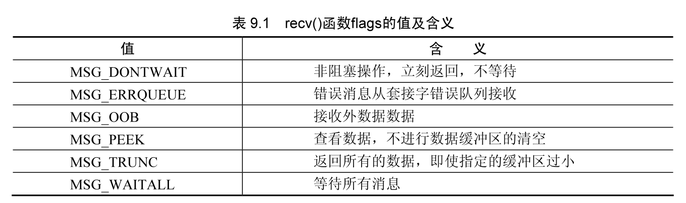
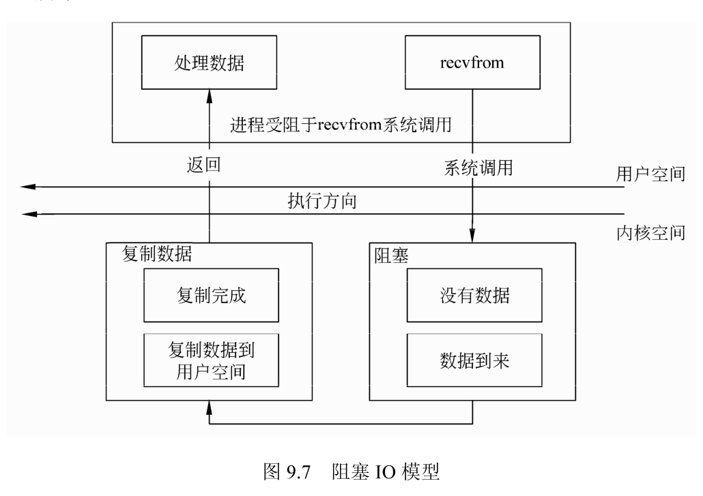
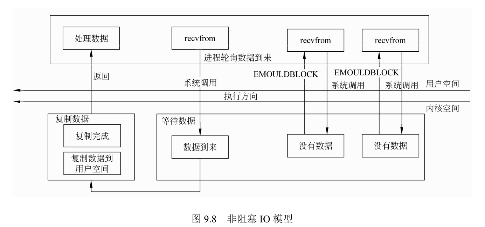
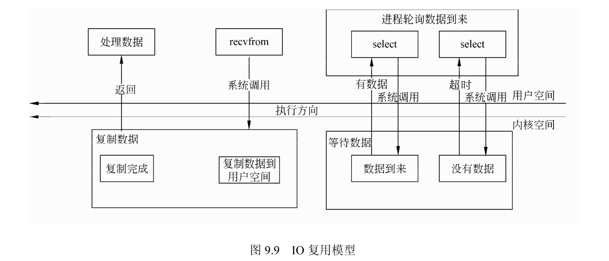
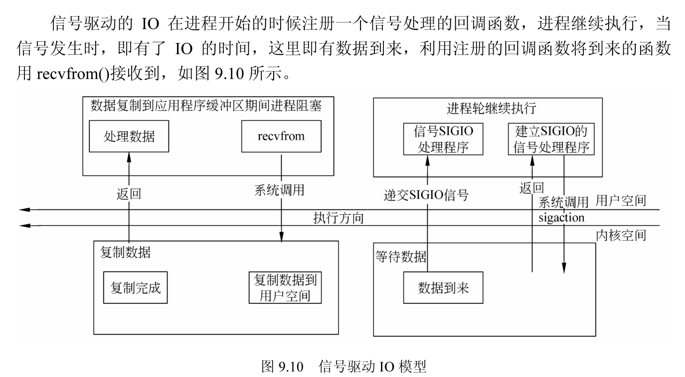
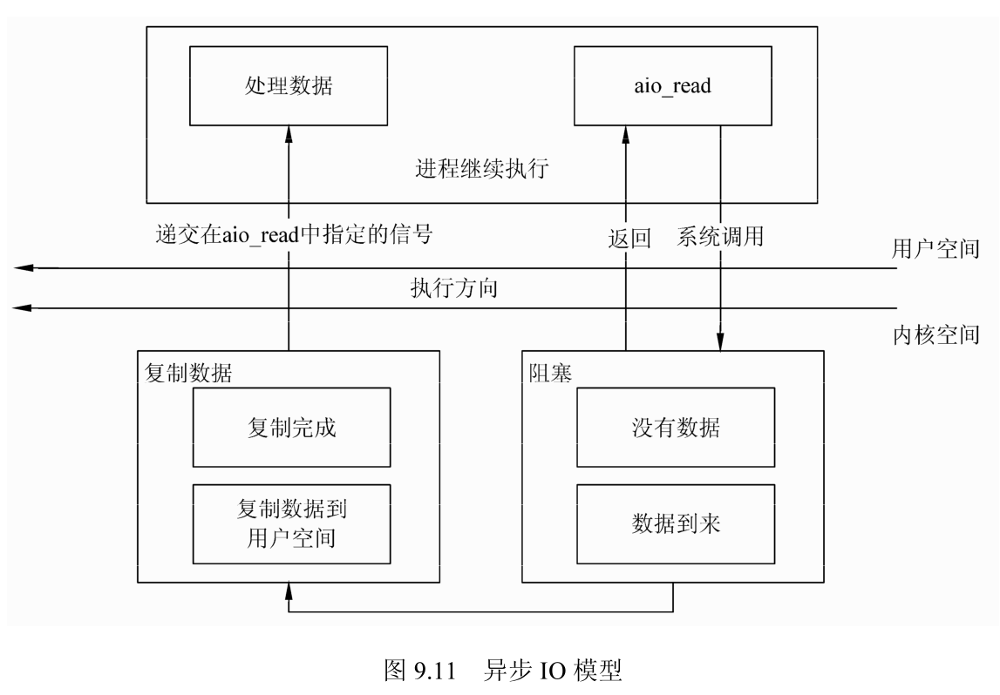
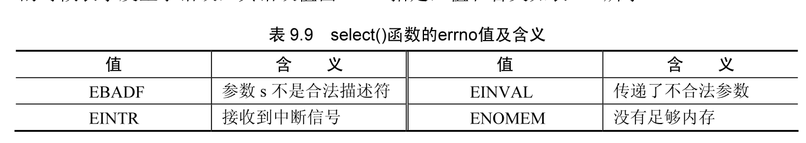

网络数据能够正常地到达用户并被用户接收是进行网络数据传输的基本目的。网络数据的接收和发送有多种方案，例如直接接收和发送数据、通过向量接收和发送、通过消息接收和发送等。

## IO 函数

Linux 操作系统中的 IO 函数主要有 read、write()、recv、send()、recvmsg、sendmsg、readv、writev。本节对上述的主要函数进行介绍，其中 read 和 write 函数在前面已经介绍过。

### 使用recv() 函数接收数据

recv 函数用于接收数据，函数原型如下。

```cpp
#include <sys/socket.h>
#include <sys/types.h>
ssize_t recv(int s, void *buf, size_t len, int flags);
```

recv 函数从套接字 s 中接收数据放到缓冲区 buf 中，buf 的长度为 len，操作的方式由 flags 指定。第 1 个参数 s 是套接口文件描述符，它是由系统调用 socket 返回的。第 2 个参数 buf 是一个指针，指向接收网络数据的缓冲区。第 3 个参数 len 表示接收缓冲区的大小，以字节为单位。

recv 函数的参数 flags 用于设置接收数据的方式，可选择的值及含义在表 9.1 中列出 flags 的值可以是表中值的按位或生成的复合值。例如，经常使用的 MSG_DONTWAIT 进行接收数据的时候，不进行等待，即使没有数据也立刻返回，即此时的套接字是非阻塞操作。



表 9.1 中的值具体含义如下：

- MSGDONTWAIT：这个标志将单个 IO 操作设为非阻塞方式，而不需要在套接字上打开非阻塞标志，执行 IO 操作，然后关闭非阻塞标志。

- MSG ERRQUEUE：该错误的传输依赖于所使用的协议。口 MSGOOB：这个标志可以接收带外数据，而不是接收一般数据。

- MSGPEEK：这个标志用于查看可读的数据，在 recv 函数执行后，内核不会将这些数据丢弃。

- MSG TRUNC：在接收数据后，如果用户的缓冲区大小不足以完全复制缓冲区中的数据，则将数据截断，仅靠复制用户缓冲区大小的数据。其他的数据会被丢弃。

- MSGWAITALL：这个标志告诉内核在没有读到请求的字节数之前不使读操作返回。如果系统支持这个标志，可以去掉 readn() 函数而用下面的代替：

```cpp
#define readn(fd, ptr, n) recv(fd, ptr, n, MSG_WAITALL)
```

即使设置了 MSGWAITALL，如果发生以下情况：a 捕获一个信号，b 连接终止，c 在套接字上发生错误，这个函数返回的字节数仍然会比请求的少。当指定 WAITALL 标志时，函数会复制与用户指定的长度相等的数据。如果内核中的当前数据不能满足要求，会一直等待直到数据足够的时候才返回。

函数 recv 的返回值是成功接收到的字节数，当返回值为 -1 时错误发生，可以查看 errno 获取错误码，参见表 9.2。当另一方使用正常方式关闭连接的时候返回值为 0，例如调用 close 函数关闭连接。

recv 函数通常用于 TCP 类型的套接字，UDP 使用 recvfrom() 函数接收数据，当然在数据报套接字绑定地址和端口后，也可以使用 recv 函数接收数据。

recv 函数从内核的接收缓冲区中复制数据到用户指定的缓冲区，当内核中的数据比指定的缓冲区小时，一般情况下没有采用 MSGWAITALL 标志会复制缓冲区中的所有数据到用户缓冲区，并返回数据的长度。当内核接收缓冲区中的数据比用户指定的多时，会将用户指定长度 len 的接收缓冲区中的数据复制到用户指定地址，其余的数据需要下次调用接收函数的时候再复制，内核在复制用户指定的数据之后，会销毁已经复制完毕的数据，并进行调整。

### 使用 send() 函数发送数据

send() 函数用于发送数据，函数原型如下。

```cpp
#include <sys/socket.h>
#include <sys/types.h>
ssize_t send(int s, const void*buf, size_t len, int flags);
```

send 函数将缓冲区 buf 中大小为 len 的数据，通过套接字文件描述符按照 flags 指定的方式发送出去。其中的参数含义与 recv 中的含义一致，它的返回值是成功发送的字节数。由于用户缓冲区 buf 中的数据在通过 send() 函数进行发送的时候，并不一定能够全部发送出去，所以要检查 send() 函数的返回值，按照与计划发送的字节长度 len 是否相等来判断如何进行下一步操作。

当 send 函数的返回值小于 len 的时候，表明缓冲区中仍然有部分数据没有成功发送，这时需要重新发送剩余部分的数据。通常的剩余数据发送方法是对原来 buf 中的数据位置进行偏移，偏移的大小为已发送成功的字节数。

函数 send() 只能用于套接字处于连接状态的描述符，之前必须用 connect 函数或者其他函数进行连接。对于 send 函数和 write 函数之间的差别是表示发送方式的 flag，当 flag 为 0 时，send() 函数和 write() 函数完全一致。而且 send(s,buf,len,flags) 与 sendto(s,buf,len,flags,NULL,0) 是等价的。

略。函数介绍，用到再学。

## IO 模型

IO 的方式有阻塞 IO、非阻塞 IO 模型、IO 复用、信号驱动、异步 IO 等，本节中以 UDP 为例介绍 IO 的几种模型。

### 阻塞 IO 模型

阻塞 I0 是最通用的 IO 类型，使用这种模型进行数据接收的时候，在数据没有到之前程序会一直等待。例如对于函数 recvfrom()，内核会一直阻塞该请求直到有数据到来才返回，如图 9.7 所示。



### 非阻塞 I0 模型

当把套接字设置成非阻塞的 IO，则对每次请求，内核都不会阻塞，会立即返回；当没有数据的时候，会返回一个错误。例如对 recvfrom 函数，前几次都没有数据返回，直到最后内核才向用户层的空间复制数据，如图 9.8 所示。



### IO 复用

使用 IO 复用模型可以**在等待的时候加入超时的时间**，当超时时间没有到达的时候与阻塞的情况一致，而当超时时间到达仍然没有数据接收到，系统会返回，不再等待。select 函数按照一定的超时时间轮询，直到需要等待的套接字有数据到来，利用 recvfrom() 函数，将数据复制到应用层，如图 9.9 所示。



### 信号驱动 IO 模型

信号驱动的 IO 在进程开始的时候注册一个信号处理的回调函数，进程继续执行，当信号发生时，即有了 IO 的时间，这里即有数据到来，利用注册的回调函数将到来的函数用 recvfrom 接收到，如图 9.10 所示。



### 异步 IO 模型

异步 IO 与前面的信号驱动 IO 相似，其区别在于信号驱动 IO 当数据到来的时候，使用信号通知注册的信号处理函数，而异步 IO 则在数据复制完成的时候才发送信号通知注册的信号处理函数，如图 9.11 所示。



## select 函数和 pselect() 函数

函数 select() 和 pselect 用于 IO 复用，它们监视多个文件描述符的集合，判断是否有符合条件的时间发生。

### select() 函数

函数 select 与之前的 recv() 和 send 直接操作文件描述符不同。使用 select 函数可以先对需要操作的文件描述符进行查询，查看是否目标文件描述符可以进行读、写或者错误操作，然后当文件描述符满足操作的条件的时候才进行真正的 IO 操作。

1. 函数 select() 简介

函数 select() 的原型如下：

```cpp
#include <sys/select.h>
#include <sys/time.h>
#include <sys/types.h>
#include <unistd.h>
int select(int nfds, fd_set *readfds, fd_set *writefds, fd_set *exceptfds, struct timeval *timeout);
```

函数 select 的参数含义为：

- nfds：一个整型的变量，它比所有文件描述符集合中的文件描述符的最大值大 1。使用 select 的时候必须计算最大值的文件描述的值，将值通过 nfds 传入。

- readfds：这个文件描述符集合监视文件集中的任何文件是否有数据可读，当 select 函数返回的时候，readfds 将清除其中不可读的文件描述符，只留下可读的文件描述符，即可以被 recv、read 等进行读数据的操作。

- writefds：这个文件描述符集合监视文件集中的任何文件是否有数据可写，当 select() 函数返回的时候，writefds 将清除其中的不可写的文件描述符，只留下可写的文件描述符，即可以被 send()、write 函数等进行写数据的操作。

- exceptfds：这个文件集将监视文件集中的任何文件是否发生错误，其实，它可用于其他的用途。例如，监视带外数据 OOB，带外数据使用 MSGOOB 标志发送到套接字上。当 select() 函数返回的时候，readfds 将清除其中的其他文件描述符，只留下可读 OOB 数据。

- timeout：设置在 select 所监视的文件集合中的事件没有发生时，最长的等待时间，当超过此时间时，函数会返回。当超时时间为 NULL 时，表示阻塞操作，会一直等待，直到某个监视的文件集中的某个文件描述符符合返回条件。当 timeout 的值为 0 时，select 会立即返回。

- sigmask：信号。

函数 select() 返回值为 0、-1 或者一个大于 1 的整数值：当监视的文件集中有文件描述符符合要求，即读文件描述符集中的文件可读、写文件描述符中的文件可写或者错误文件描述符中的文件发生错误时，返回值为大于 0 的正值；当超时的时候返回 0：当返回值为 -1 的时候表示发生了错误，其错误值由 errno 指定，值和含义如表 9.9 所示。



函数 select 和函数 pselect() 允许程序监视多个文件描述符，当一个或者多个监视的文件描述准备就绪，可以进行 IO 操作的时候返回。函数监视一个文件描述符的对应操作是否可以进行，例如对监视读文件集的对文件描述符可操作。

函数可以同时监视 3 类文件描述符。将监视在 readfds 文件描述符集合中的文件是否可读，即判断对此文件描述符进行读操作是否被阻塞；函数监视 writefds 文件描述符集合中的文件是否可写，即判断是否对此文件描述符进行写操作是否阻塞；另外，函数还监视文件描述符集合 exceptfds 中的文件描述符是否发生意外。当函数退出的时候，上述的集合发生了改变。

当不需要监视某种文件集时，可以将对应的文件集设置为空 NULL。如果所有的文件集和均为 NULL，则表示等待一段时间。

参数 timeout 的类型是如下的结构：

```cpp
struct timeval {
    time_t tv_sec;// 秒
    long tv_usec;// 微秒
}
```

有 4 个宏可以操作文件描述符的集合。

- FD ZEROO：清理文件描述符集合。

- FD SETO：向某个文件描述符集合中加入文件描述符。

- FD CLRO：从某个文件描述符的集合中取出某个文件描述符。

- FD ISSETO：测试某个文件描述符是否某个集合中的一元。

文件描述符的集合存在最大的限制，其最大值为FD SETSIZE，当超出最大值时，将发生不能确定的事情。

2. select() 函数的例子

一个简单的使用 select() 函数监视标准输入是否有数据处理的程序如下。函数 select()

监视标准输入是否有数据输入，所设置的超时时间为 5s。如果 select 函数出错，则打印出错信息；如果标准输入有数据输入，则打印输入信息；如果等待超时，则打印超时信息。

### 三级

```cpp
#include <stdio.h>
#include <sys/select.h>
#include <unistd.h>

int main() {
  fd_set rd;         /*读文件集和*/
  struct timeval tv; /*时间间隔*/
  int err;           /*错误值*/

  /*监视标准输入是否可以读数据*/

  FD_ZERO(&rd);
  FD_SET(0, &rd);// 添加标准输入

  /*设置5s的等待超时*/
  tv.tv_sec = 5;
  tv.tv_usec = 0;

  err = select(1, &rd, NULL, NULL, &tv);

  if (err == -1) {
    perror("select");
  } else if (err) { /*标准输入有数据输入，可读*/
    printf("data is available.\n");
  } else {
    printf("no data available within 5 seconds.\n");
  }

  return 0;
}
```

### pselect() 函数

函数 select 是用一种超时轮循的方式来查看文件的读写错误可操作性。在 Linux 下，还有一个相似的函数 pselect。

1. pselect() 函数简介

pselect() 函数的原型如下：

```cpp
#include <sys/select.h>
#include <sys/time.h>
#include <sys/types.h>
#include <unistd.h>
int pselect(int nfds, fd_set *readfds, fd_set *writefds, fd_set *exceptfds, const struct timespec *timeout, const sigset_t *sigmask);
```

pselect() 函数的含义基本与 select 函数一致, 除了如下几点:

- 超时的时间结构是一个纳秒级的结构, 原型如下。不过在 Linux 平台下内核调度的精度为 10 毫秒级, 所以即使设置了纳秒级的分辨率, 也达不到设置的精度。

```cpp
struct timeval {
    time_t tv_sec;// 秒
    long tv_nsec;// 纳秒
}
```

- **增加了进入 pselect() 函数时替换掉的信号处理方式, 当 sigmask 为 NULL 的时候, 与 select 的方式一致**。

- select 函数在执行之后可能会改变 timeout 的值, 修改为还有多少时间剩余, 而 pselect() 函数不会修改该值。

与 select() 函数相比，pselect() 函数的代码如下:

```cpp
ready pselect(nfds,&readfds,&writefds,&exceptfds, timeout,&sigmask);
```

相当于如下的 select 函数，在进入 select() 函数之前先手动将信号的掩码改变，并保存之前的掩码值； select() 函数执行后，再恢复为之前的信号掩码值。

```cpp
sigset_t origmask;
sigprocmask(SIG_SETMASK, &sigmask, &origmask);
ready = select(nfds, &readfds, &writefds, &exceptfds, timeout);
sigprocmask(SIG_SETMASK, &origmask, NULL);
```

1. pselect() 函数的例子

下面是一个使用 pselect() 的简单例子。在例子中先清空信号，然后将 SIGCHLD 信号加入到要处理的信号集合中。设置 pselect() 监视的信号时，在挂载用户信号的同时将系统原来的信号保存下来，方便程序退出的时候恢复原来的设置。

```cpp
#include <signal.h>
#include <sys/select.h>

int child_events = 0;

/*信号处理函数*/
void child_sig_handler(int x) {
  child_events++;                     /*调用次数+1*/
  signal(SIGCHLD, child_sig_handler); /*重新设定信号回调函数*/
}

int main(int argc, char **argv) {
  /*设定的信号掩码sigmask和原始的信号掩码orig sigmask*/
  sigset_t sigmask, orig_sigmask;
  sigemptyset(&sigmask);        /*清空信号*/
  sigaddset(&sigmask, SIGCHLD); /*将SIGCHLD信号加入sigmask*/

  /*设定信号SIG BLOCK的掩码sigmask,并将原始的掩码保存到orig sigmask中*/
  sigprocmask(SIG_BLOCK, &sigmask, &orig_sigmask);

  /*挂接对信号SIGCHLD的处理函数child sig handler()*/
  signal(SIGCHLD, child_sig_handler);

  for (;;) {                                   /*主循环*/
    for (; child_events > 0; child_events--) { /*判断是否退出*/
      /*处理动作*/
    }

    /*pselect I0复用*/
    r = pselect(nfds, &rd, &wr, &er, 0, &orig_sigmask);
    /*主程序*/
  }
}
```

## poll 函数和 ppoll 函数

除了使用 select 进行文件描述符的监视，还有一组函数也可以完成相似的功能，即函数 poll 和函数 ppoll.

略。

## 非阻塞编程

前面介绍的 IO 程序设计，基本上都是基于阻塞方式的。阻塞方式的读写，在文件没有数据的时候，函数不会返回，而一直等待直到有数据到来。本节介绍文件的非阻塞方式程序设计。

### 非阻塞方式程序设计介绍

非阻塞方式的操作与阻塞方式的操作最大的不同点是函数的调用立刻返回，不管数据是否成功读取或者成功写入。使用 fentl() 将套接字文件描述符按照如下的代码进行设置后，可以进行非阻塞的编程：

```cpp
fcntl(s,F_SETFL,O_NONBLOCK);
```

其中的 s 是套接字文件描述符，使用 F_SETFL 命令将套接字 s 设置为非阻塞方式后，再进行读写操作就可以马上返回了。

### 非阻塞程序设计的例子

函数 accept0 可以使用非阻塞的方式轮询等待客户端的到来，在之前要设置 NON BLOCK 方式。下面的代码使用了轮询的方式使用 accept 和 recv() 函数，当客户端发送 HELLO 字符串时，发送 OK 响应给客户端并关闭客户端；当客户端发送 SHUTDOWN 字符串给服务器时，服务器发送 BYE 的客户端并关闭客户端，然后退出程序。

`src\docs\Linux网络编程\CH09\non_block.c`

程序不一定可用，理解即可。

使用轮询的方式进行查询十分浪费CPU等资源，不是十分必要，最好不采用此种方法进行程序设计。
