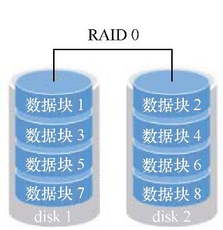
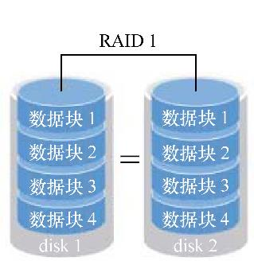
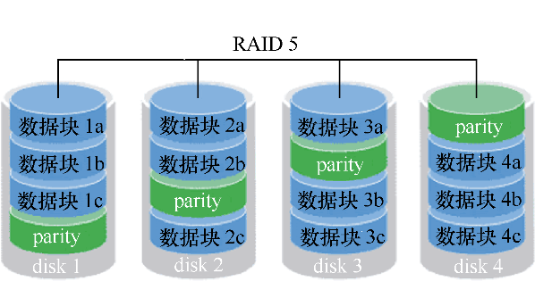
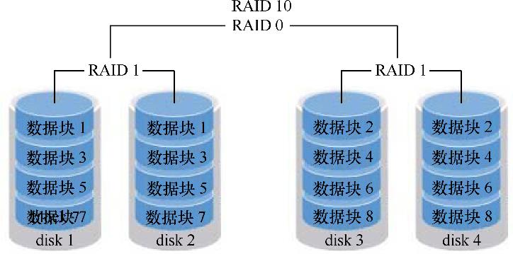

# RAID 磁盘阵列技术

## RAID（独立冗余磁盘阵列）

RAID 技术通过把多个硬盘设备组合成一个容量更大、安全性更好的磁盘阵列，并把数据切割成多个区段后分别存放在各个不同的物理硬盘设备上，然后利用分散读写技术来提升磁盘阵列整体的性能，同时把多个重要数据的副本同步到不同的物理硬盘设备上，从而起到了非常好的数据冗余备份效果。

目前已有的 RAID 磁盘阵列的方案至少有十几种。

### RAID 0

RAID 0 技术把多块物理硬盘设备（至少两块）通过硬件或软件的方式串联在一起，组成一个大的卷组，并将数据依次写入到各个物理硬盘中。这样一来，在最理想的状态下，硬盘设备的读写性能会提升数倍，但是若任意一块硬盘发生故障将导致整个系统的数据都受到破坏。

通俗来说，RAID 0 技术能够有效地提升硬盘数据的吞吐速度，但是不具备数据备份和错误修复能力。数据被分别写入到不同的硬盘设备中，即 disk1 和 disk2 硬盘设备会分别保存数据资料，最终实现提升读取、写入速度的效果。



### RAID 1

尽管 RAID 0 技术提升了硬盘设备的读写速度，但是它是将数据依次写入到各个物理硬盘中，也就是说，它的数据是分开存放的，其中任何一块硬盘发生故障都会损坏整个系统的数据。因此，如果生产环境对硬盘设备的读写速度没有要求，而是希望增加数据的安全性时，就需要用到 RAID 1 技术了。



RAID 1 技术把两块以上的硬盘设备进行绑定，在写入数据时，是将数据同时写入到多块硬盘设备上（可以将其视为数据的镜像或备
份）。当其中某一块硬盘发生故障后，一般会立即自动以热交换的方式来恢复数据的正常使用。

RAID 1 技术虽然十分注重数据的安全性，但是因为是在多块硬盘设备中写入了相同的数据，因此硬盘设备的利用率得以下降，从理论上来说，图 7-2 所示的硬盘空间的真实可用率只有 50%，由三块硬盘设备组成的 RAID 1 磁盘阵列的可用率只有 33%左右，以此类推。而且，由于需要把数据同时写入到两块以上的硬盘设备，这无疑也在一定程度上增大了系统计算功能的负载。

### RAID 5

RAID5 技术是把硬盘设备的数据奇偶校验信息保存到其他硬盘设备中。RAID 5 磁盘阵列组中数据的奇偶校验信息并不是单独保存到某一块硬盘设备中，而是存储到除自身以外的其他每一块硬盘设备上，这样的好处是其中任何一设备损坏后不至于出现致命缺陷；图中 parity 部分存放的就是数据的奇偶校验信息，换句话说，就是 RAID 5 技术实际上没有备份硬盘中的真实数据信息，而是当硬盘设备出现问题后通过奇偶校验信息来尝试重建损坏的数据。RAID 这样的技术特性“妥协”地兼顾了硬盘设备的读写速度、数据安全性与存储成本问题。



### RAID 10

RAID 10 技术是 RAID 1+RAID 0 技术的一个“组合体”。RAID 10 技术需要至少 4 块硬盘来组建，其中先分别两两制作成 RAID 1 磁盘阵列，以保证数据的安全性；然后再对两个 RAID 1 磁盘阵列实施 RAID 0 技术，进一步提高硬盘设备的读写速度。这样从理论上来讲，只要坏的不是同一组中的所有硬盘，那么最多可以损坏 50%的硬盘设备而不丢失数据。由于 RAID 10 技术继承了 RAID 0 的高读写速度和 RAID 1 的数据安全性，在不考虑成本的情况下 RAID 10 的性能都超过了 RAID 5，因此当前成为广泛使用的一种存储技术。



### 部署磁盘阵列

首先，需要在虚拟机中添加 4 块硬盘设备来制作一个 RAID 10 磁盘阵列。

详细介绍见[mdadm](mdadm.md) 命令。

### 损坏磁盘阵列及修复

在确认有一块物理硬盘设备出现损坏而不能继续正常使用后，应该使用 mdadm 命令将其移除，然后查看 RAID 磁盘阵列的状态，可以发现状态已经改变。

```bash
$ mdadm /dev/md0 -f /dev/sdb
mdadm: set /dev/sdb faulty in /dev/md0

$ mdadm -D /dev/md0
/dev/md0:
        Version : 1.2
  Creation Time : Sun Jan 19 02:38:03 2020
     Raid Level : raid10
     Array Size : 41909248 (39.97 GiB 42.92 GB)
  Used Dev Size : 20954624 (19.98 GiB 21.46 GB)
   Raid Devices : 4
  Total Devices : 4
    Persistence : Superblock is persistent

    Update Time : Sun Jan 19 03:06:10 2020
          State : clean, degraded
 Active Devices : 3
Working Devices : 3
 Failed Devices : 1
  Spare Devices : 0

         Layout : near=2
     Chunk Size : 512K

           Name : redhat:0  (local to host redhat)
           UUID : 3e16a2ff:0c39ed76:5ea9fa4a:5aaa0322
         Events : 21

    Number   Major   Minor   RaidDevice State
       0       0        0        0      removed
       1       8       32        1      active sync   /dev/sdc
       2       8       48        2      active sync   /dev/sdd
       3       8       64        3      active sync   /dev/sde

       0       8       16        -      faulty   /dev/sdb
```

在 RAID 10 级别的磁盘阵列中，当 RAID 1 磁盘阵列中存在一个故障盘时并不影响 RAID 10 磁盘阵列的使用。当购买了新的硬盘设备后再使用 mdadm 命令来予以替换即可，在此期间我们可以在 /raid 目录中正常地创建或删除文件。由于我们是在虚拟机中模拟硬盘，所以先重启系统，然后再把新的硬盘添加到 RAID 磁盘阵列中。

```bash
$ umount /raid
$ reboot
$ mdadm /dev/md0 -a /dev/sdb
mdadm: added /dev/sdb

$ mdadm -D /dev/md0
/dev/md0:
        Version : 1.2
  Creation Time : Sun Jan 19 02:38:03 2020
     Raid Level : raid10
     Array Size : 41909248 (39.97 GiB 42.92 GB)
  Used Dev Size : 20954624 (19.98 GiB 21.46 GB)
   Raid Devices : 4
  Total Devices : 4
    Persistence : Superblock is persistent

    Update Time : Sun Jan 19 03:10:23 2020
          State : clean, degraded, recovering
 Active Devices : 3
Working Devices : 4
 Failed Devices : 0
  Spare Devices : 1

         Layout : near=2
     Chunk Size : 512K

 Rebuild Status : 13% complete

           Name : redhat:0  (local to host redhat)
           UUID : 3e16a2ff:0c39ed76:5ea9fa4a:5aaa0322
         Events : 31

    Number   Major   Minor   RaidDevice State
       4       8       16        0      spare rebuilding   /dev/sdb
       1       8       32        1      active sync   /dev/sdc
       2       8       48        2      active sync   /dev/sdd
       3       8       64        3      active sync   /dev/sde
```

### 磁盘阵列+备份盘

RAID 10 磁盘阵列中最多允许 50%的硬盘设备发生故障，但是存在这样一种极端情况，即同一 RAID 1 磁盘阵列中的硬盘设备若全部损坏，也会导致数据丢失。换句话说，在 RAID 10 磁盘阵列中，如果 RAID 1 中的某一块硬盘出现了故障，而我们正在前往修复的路上，恰巧该 RAID1 磁盘阵列中的另一块硬盘设备也出现故障，那么数据就被彻底丢失了。

我们可以使用 RAID 备份盘技术来预防这类事故。该技术的核心理念就是准备一块足够大的硬盘，这块硬盘平时处于闲置状态，一旦 RAID 磁盘阵列中有硬盘出现故障后则会马上自动顶替上去。

部署 RAID 5 磁盘阵列时，至少需要用到 3 块硬盘，还需要再加一块备份硬盘，所以总计需要在虚拟机中模拟 4 块硬盘设备。

```bash
$ ls /dev/sd?
/dev/sda  /dev/sdb  /dev/sdc  /dev/sdd  /dev/sde

$ mdadm -Cv /dev/md0 -n 3 -l 5 -x 1 /dev/sdb /dev/sdc /dev/sdd /dev/sde
mdadm: layout defaults to left-symmetric
mdadm: layout defaults to left-symmetric
mdadm: chunk size defaults to 512K
mdadm: size set to 20954624K
mdadm: Defaulting to version 1.2 metadata
mdadm: array /dev/md0 started.
```

- 参数 `-n 3` 代表创建这个 RAID 5 磁盘阵列所需的硬盘数
- 参数 `-l 5` 代表 RAID 的级别
- 参数 `-x 1` 则代表有一块备份盘

```bash
$ mdadm -D /dev/md0
/dev/md0:
        Version : 1.2
  Creation Time : Sun Jan 19 05:03:04 2020
     Raid Level : raid5
     Array Size : 41909248 (39.97 GiB 42.92 GB)
  Used Dev Size : 20954624 (19.98 GiB 21.46 GB)
   Raid Devices : 3
  Total Devices : 4
    Persistence : Superblock is persistent

    Update Time : Sun Jan 19 05:04:50 2020
          State : clean
 Active Devices : 3
Working Devices : 4
 Failed Devices : 0
  Spare Devices : 1

         Layout : left-symmetric
     Chunk Size : 512K

           Name : redhat:0  (local to host redhat)
           UUID : 6a9deb55:fa223f50:79ebe730:738154fa
         Events : 20

    Number   Major   Minor   RaidDevice State
       0       8       16        0      active sync   /dev/sdb
       1       8       32        1      active sync   /dev/sdc
       4       8       48        2      active sync   /dev/sdd

       3       8       64        -      spare   /dev/sde
```

将部署好的 RAID 5 磁盘阵列格式化为 ext4 文件格式，然后挂载到目录上，之后就可以使用了。

```bash
$ mkfs.ext4 /dev/md0
mke2fs 1.42.9 (28-Dec-2013)
Filesystem label=
OS type: Linux
Block size=4096 (log=2)
Fragment size=4096 (log=2)
Stride=128 blocks, Stripe width=256 blocks
2621440 inodes, 10477312 blocks
523865 blocks (5.00%) reserved for the super user
First data block=0
Maximum filesystem blocks=2157969408
320 block groups
32768 blocks per group, 32768 fragments per group
8192 inodes per group
Superblock backups stored on blocks:
	32768, 98304, 163840, 229376, 294912, 819200, 884736, 1605632, 2654208,
	4096000, 7962624

Allocating group tables: done
Writing inode tables: done
Creating journal (32768 blocks): done
Writing superblocks and filesystem accounting information: done
```

设置为永久性：

```bash
$ echo "/dev/md0 /RAID ext4 defaults 0 0" >> /etc/fstab
```

```bash
$ echo "/dev/md0 /RAID ext4 defaults 0 0" >> /etc/fstab
$ mkdir /raid
$ mount /dev/md0 /raid
```

再次把硬盘设备 `/dev/sdb` 移出磁盘阵列，然后迅速查看 `/dev/md0` 磁盘阵列的状态，就会发现备份盘已经被自动顶替上去并开始了数据同步。

```bash
$ mdadm /dev/md0 -f /dev/sdb
mdadm: set /dev/sdb faulty in /dev/md0

$ mdadm -D /dev/md0
/dev/md0:
        Version : 1.2
  Creation Time : Sun Jan 19 05:03:04 2020
     Raid Level : raid5
     Array Size : 41909248 (39.97 GiB 42.92 GB)
  Used Dev Size : 20954624 (19.98 GiB 21.46 GB)
   Raid Devices : 3
  Total Devices : 4
    Persistence : Superblock is persistent

    Update Time : Sun Jan 19 05:11:00 2020
          State : active, degraded, recovering
 Active Devices : 2
Working Devices : 3
 Failed Devices : 1
  Spare Devices : 1

         Layout : left-symmetric
     Chunk Size : 512K

 Rebuild Status : 0% complete

           Name : redhat:0  (local to host redhat)
           UUID : 6a9deb55:fa223f50:79ebe730:738154fa
         Events : 75

    Number   Major   Minor   RaidDevice State
       3       8       64        0      spare rebuilding   /dev/sde
       1       8       32        1      active sync   /dev/sdc
       4       8       48        2      active sync   /dev/sdd

       0       8       16        -      faulty   /dev/sdb
```
