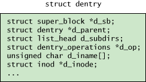

# 虚拟文件系统（Virtual File System）

Linux 虚拟文件系统为上层应用程序提供了一组标准接口，用于对不同的文件系统执行文件 I/O。这组接口在一个或多个底层设备上支持多个并发文件系统。另外，这些文件系统可以不是静态的，可以根据储存设备而变化。

## 分层抽象

VFS 提供抽象层，从而将 POSIX API 与特定文件系统如何实现该行为的细节分离开来。VFS 提供一个由底层文件系统（它们必须为各种 POSIX API 函数实现行为）继承的通用文件模型。而另外一个在 VFS 范围之外的深层抽象隐藏了底层物理设备。除了从底层文件系统抽象文件操作的细节之外，VFS 还将底层块设备绑定到可用的文件系统。

## VFS 的内部结构

### 对象关系

在顶层是打开的 `file` 对象，它由进程的文件描述符列表引用。`file` 对象引用 `dentry` 对象，后者引用 `inode`。`inode` 和 `dentry` 对象都引用底层的 `super_block` 对象。可能有多个文件对象引用同一个 `dentry`（当两个用户共享同一个文件时）。图中，一个 `dentry` 对象还引用另一个 `dentry` 对象，比如目录引用文件，而文件反过来引用特定文件的 `inode`。

### 超块（superblock）

超块（superblock）是关于文件系统的**高级元数据的容器**。超块是存在于磁盘上（实际上位于磁盘的多个位置上，以提供冗余）的结构。它是处理磁盘上的文件系统的基础，因为它定义文件系统的管理参数（例如，块的总数、空闲块和根索引节点）。

在磁盘上，超块向内核提供关于磁盘上的文件系统的结构的信息。在内存中，超块为管理活动的（已挂载）文件系统提供必要的信息和状态。因为 Linux 支持同时挂载多个并发文件系统，所以在一个列表中维护每个 super_block 结构。

- **file_system_type** 结构维护文件系统的名称（比如 ext4）以及各种锁和函数，以获取和删除 super_block。file_system_type 对象由常见的 register_file system 和 unregister_file system 函数管理。
- **super_operations** 结构为读写节点和高级操作（比如重新挂载）定义大量函数。根目录条目（dentry）对象也缓存在这里，因为它是文件系统所在的块设备。
- **s_io**, **s_more_io**, **s_files** 列出特定文件系统的所有打开文件的列表。
- **s_inodes** 列出所有节点的列表。
- **s_dirty** 列出所有脏节点的列表。

### 索引节点（inode）

Linux 通过一个称为 inode（index node 的缩写）的对象管理文件系统中的所有对象。**一个 inode 可以引用一个文件、目录或另一个对象的符号链接**。因为文件用于表示其他类型的对象（比如设备或内存），所以也使用 inode 来表示它们。

这里所指的 inode 是 VFS 层 inode（常驻 inode）。每个文件系统也包含一个位于磁盘上的 inode，并且提供关于特定文件系统的特定对象的细节。

VFS inode 使用 slab 分配器进行分配。inode 由描述 inode、inode 内容和可能在 inode 上发生的各种操作的数据和操作组成。

图中简单展示了一个 VFS inode，该 inode 包含许多列表，其中一个列表指向引用该 inode 的 dentry。这里还包含对象级别的元数据，包括熟悉的操作时间（创建时间、访问时间和修改时间）和所有者和权限数据（组 ID、用户 ID 和权限）。inode 引用它所允许的文件操作，大部分这些操作直接映射到系统调用接口（例如，open、read、write 和 flush）。inode 还引用特定于 inode 的操作（create、lookup、link 和 mkdir 等等）。最后，对于由地址空间对象表示的对象的数据，有一个管理结构。地址空间对象 是为 inode 管理页缓存中的各种页的对象。地址空间对象用于为文件管理页，也用于将文件部分映射到独立的进程地址空间。地址空间对象有自己的操作集（writepage、readpage 和 releasepage 等等）。

### 目录条目（dentry）

文件系统的层次结构由 VFS 中的另一个称为 dentry 的对象管理。文件系统有一个根 dentry（在超块中引用），这是唯一没有父对象的 dentry。所有其他 dentry 都有父对象，并且一部分 dentry 有子对象。例如，如果打开一个由 /home/user/name 组成的文件，那么将创建 4 个 dentry 对象：一个针对根 /、一个针对根目录 home 的条目、一个针对 user 目录的 name 条目，以及一个针对 user 目录的 name 条目。通过这种方式，dentry 简洁地映射到现在使用的文件系统。它由许多元素组成，这些元素在文件系统和物理数据中跟踪条目之间的关系（比如文件名）。

图中展示了 dentry 对象的简化图示。dentry 引用 super_block，super_block 定义包含该对象的特定文件系统实例。接下来是该对象的父 dentry（父目录），其后是包含在一个列表中的子 dentry（如果该对象刚好是一个目录的话）。然后，为 dentry 定义操作（比如 hash、compare、delete 和 release 等等）。接着定义对象的名称，在这里名称保存在 dentry 中而不是 inode 中。最后，提供一个到 VFS inode 的引用。

dentry 对象仅存在文件系统内存中，而不能储存在磁盘上。仅永久储存文件系统 inode，dentry 对象的目的是改善性能。

### 文件对象

在 Linux 系统中打开的每个文件都都存在一个 file 对象。这个对象为特定用户提供打开的实例的信息。

图中提供了文件对象的简化视图。在图中可以看到，path 结构提供到 dentry 和 vfsmount 的引用。为每个文件定义了一组文件操作，常见的文件操作包括 open、close、read、write 和 flush 等。接着定义一组标志和权限（包括组和所有者）。最后，为特定文件实例定义状态数据，比如文件的当前偏移量。

## VFS 架构

VFS 的内部架构由一个调度层（提供文件系统抽象）和许多缓存（用于改善文件系统操作的性能）组成。

在 VFS 中动态管理的两个主要对象是 dentry 和 inode 对象。缓存这两个对象，以改善访问底层文件系统的性能。当打开一个文件时，dentry 缓存将被表示目录级别（目录级别表示路径）的条目填充。此外，还为该对象创建一个表示文件的 inode。使用散列表创建 dentry 缓存，并且根据对象名分配缓存。dentry 缓存的条目从 dentry_cache slab 分配器分配，并且在缓存存在压力时使用最近不使用（least-recently-used，LRU）算法删除条目。

为了实现更快的查找速度，inode 缓存被实现为两个列表和一个散列表。第一个列表定义当前使用的 inode；第二个列表定义未使用的 inode。正在使用的 inode 还储存在散列表中。从 inode_cache slab 分配器分配单个 inode 缓存对象。在现在的实现中，dentry 缓存支配着 inode 缓存。如果存在一个 dentry 对象，那么 inode 缓存中也将存在一个 inode 对象。查找是在 dentry 缓存中执行的，这将导致 inode 缓存中出现一个对象。
