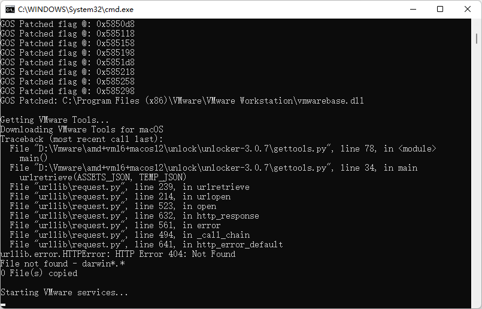

首先下载最新版的 VMware 并安装，然后需要 Unlocker 补丁来让 VMware 支持安装 macOS 系统。

把 Unlocker 解压出来，然后右键管理员身份运行 "win-install.cmd" 文件等待解锁。

运行输出提示有步骤出错，但似乎也没关系。

运行 VMware 虚拟机 - 创建新的虚拟机 - 自定义 - 选择 Workstation 16.x ，接着下一步，选择 "稍后安装操作系统" 。

接着选择Apple Mac OS X，版本 macOS 11，继续下一步。

输入你的虚拟机名称和虚拟机保存位置，根据你的情况来设置路径就行了，接着下一步。

硬件设置根据你的电脑情况来调整，建议处理器最少 2 个 2 核，内存最好是能设置到 8 G 或以上。网络默认 NAT 就可以，控制器选择推荐的 LSI Logic 模式，磁盘同样选择推荐的 SATA 模式。然后创建新的虚拟磁盘，设置磁盘容量，继续下一步，设置保存磁盘文件位置，完成硬件设置。

点击编辑虚拟机 - CD/DVD设置 - 选择你下载的 macOS 镜像文件，确定后启动虚拟机开始安装。
