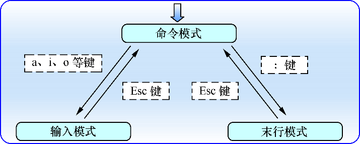

## 概述

Vim 编辑器中一共有三种模式——命令模式、末行模式和编辑模式，每种模式分别又支持多种不同的命令快捷键。

- 命令模式：控制光标移动，可对文本进行复制、粘贴、删除和查找等工作。
- 输入模式：正常的文本录入。
- 末行模式：保存或退出文档，以及设置编辑环境。

### Vim 编辑器模式的切换方法

在每次运行 Vim 编辑器时，默认进入命令模式，此时需要先切换到输入模式后再进行文档编写工作，而每次在编写完文档后需要先返回命令模式，然后再进入末行模式，执行文档的保存或退出操作。在 Vim 中，无法直接从输入模式切换到末行模式。

- a - 是在光标后面一位切换到输入模式
- i - 是在光标当前位置切换到输入模式
- o - 是在光标的下面再创建一个空行切换到输入模式

## Vim 中常用的命令

| 命令 | 作用 |
| ---- | -------- |
| dd | 删除（剪切）光标所在整行 |
| 5dd | 删除（剪切）从光标处开始的 5 行 |
| yy | 复制光标所在整行 |
| 5yy | 复制从光标处开始的 5 行 n 显示搜索命令定位到的下一个字符串 |
| N | 显示搜索命令定位到的上一个字符串 |
| u | 撤销上一步的操作 |
| p | 将之前删除（dd）或复制（yy）过的数据粘贴到光标后面 |

### 末行模式中可用的命令

| 命令 | 作用 |
| -------- | -------- |
| :w | 保存 |
| :q | 退出 |
| :q ! | 强制退出（放弃对文档的修改内容） |
| :wq ! | 强制保存退出 |
| :set nu | 显示行号 |
| :set nonu | 不显示行号 |
| : 命令 | 执行该命令 |
| : 整数 | 跳转到该行 |
| :s/one/two | 将当前光标所在行的第一个 one 替换成 two |
| :s/one/two/g | 将当前光标所在行的所有 one 替换成 two |
| :%s/one/two/g | 将全文中的所有 one 替换成 two |
| ?字符串 | 在文本中从下至上搜索该字符串 |
| / 字符串 | 在文本中从上至下搜索该字符串 |

末行模式主要用于保存或退出文件，以及设置 Vim 编辑器的工作环境，还可以让用户执行外部的 Linux 命令或跳转到所编写文档的特定行数。要想切换到末行模式，在命令模式中输入一个冒号就可以了。
